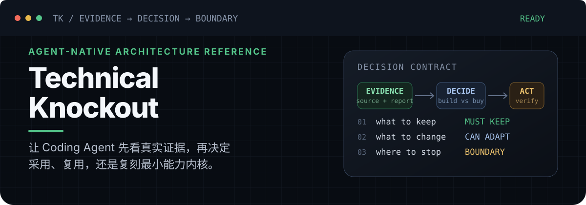
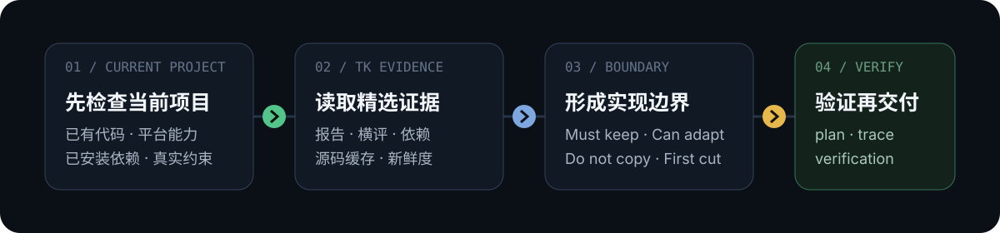
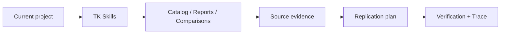

<p align="center">
  
</p>

<p align="center">
  <a href="https://www.npmjs.com/package/@jarl_okbe/tk"></a>
  <a href="./LICENSE"></a>
  
</p>

<p align="center">
  <a href="#为什么用-tk">为什么用 TK</a> ·
  <a href="#真实证据">真实证据</a> ·
  <a href="#三步开始">三步开始</a> ·
  <a href="#project-index">项目索引</a> ·
  <a href="./docs/install-agent-adapters.md">安装指南</a>
</p>

Technical Knockout（TK）不是又一个项目推荐清单。它把**真实源码、五层技术分析、同类横评和依赖证据**整理成 Coding Agent 可直接使用的研究系统，让 Agent 在写代码前先回答：该不该做、已有能力能否复用、最小架构内核是什么、第一刀做到哪里。

> **目标不是复制参考项目，而是提取经得起验证的能力边界。**

## 为什么用 TK

| 普通项目调研 | Technical Knockout |
|---|---|
| 从 README、Star 和功能清单判断 | Clone / pull 本地源码，引用真实文件与符号 |
| 给出“推荐 / 不推荐” | 区分个人 PoC、小团队采用与企业生产化风险 |
| 描述技术栈和目录 | 拆解架构内核、状态模型、控制面 / 数据面与失败模型 |
| 把参考项目当模板 | 明确 Must keep / Can adapt / Do not copy |
| 调研结束于一篇文章 | 输出 Agent 可执行的 plan、verification 和 trace |

<p align="center">
  
</p>

## 真实证据

这里不是产品路线图，而是仓库当前已经落盘的内容：

| 证据面 | 当前内容 | 从哪里开始 |
|---|---:|---|
| 深度报告 | 37 份正式报告 | [`reports/`](./reports/) |
| 同类横评 | 9 个决策主题 | [`comparisons/`](./comparisons/) |
| Agent Skills | 5 个共享工作流 | [`packages/tk/skills/`](./packages/tk/skills/) |
| 支持宿主 | Codex · Claude Code · OpenCode · Hermes | [`docs/install-agent-adapters.md`](./docs/install-agent-adapters.md) |
| 机器合同 | catalog · plan · verification · trace | [`docs/tk-replication-runtime.md`](./docs/tk-replication-runtime.md) |

### 精选入口

| 主题 | 先看报告 | 再看横评 |
|---|---|---|
| Coding Agent runtime | [cc-haha](./reports/cc-haha.md) · [Grok Build](./reports/grok-build.md) · [OpenCode](./reports/opencode.md) · [jcode](./reports/jcode.md) | [Coding Agents](./comparisons/coding-agents.md) |
| Agent workflow / Skills | [superpowers](./reports/superpowers.md) · [compound-engineering-plugin](./reports/compound-engineering-plugin.md) · [Trellis](./reports/Trellis.md) | [AI Coding Workflow](./comparisons/ai-coding-workflow.md) |
| Agent 平台与控制面 | [QM](./reports/qm.md) · [Orca](./reports/orca.md) · [Buzz](./reports/buzz.md) · [openhuman](./reports/openhuman.md) | [Agent Platforms](./comparisons/agent-platforms.md) · [Control Planes](./comparisons/coding-agent-control-planes.md) |
| Agent 长期记忆 | [Memmy Agent](./reports/memmy-agent.md) | [Agent Memory Infrastructure](./comparisons/agent-memory-infrastructure.md) |
| Code Intelligence / RAG | [CodeGraph](./reports/codegraph.md) · [RAGFlow](./reports/ragflow.md) · [LightRAG](./reports/LightRAG.md) | [Code Intelligence](./comparisons/code-intelligence.md) · [Enterprise RAG](./comparisons/enterprise-knowledge-base-rag.md) |
| AI 视频 / 媒体自动化 | [Pireel](./reports/pireel.md) · [OpenMontage](./reports/OpenMontage.md) · [Pixelle-Video](./reports/Pixelle-Video.md) | [AI Media / Content Automation](./comparisons/ai-media-content-automation.md) |

## 三步开始

### 1. 为你的 Agent 安装 TK

> npm 当前公开版本可能落后于仓库主线；如安装命令尚未包含某个宿主，请从仓库源码运行对应 CLI，或等待下一次 npm 发布。

只运行你当前宿主对应的一组命令：

```bash
# Codex
npx @jarl_okbe/tk codex install
npx @jarl_okbe/tk codex status

# Claude Code
npx @jarl_okbe/tk claude install
npx @jarl_okbe/tk claude status

# OpenCode
npx @jarl_okbe/tk opencode install
npx @jarl_okbe/tk opencode status

# Hermes Agent
npx @jarl_okbe/tk hermes install
npx @jarl_okbe/tk hermes status
```

安装或刷新后请重启宿主或新建会话。Claude Code 也可在当前会话执行 `/reload-plugins` 来重新加载插件并重连 MCP。完整生命周期命令：

```bash
npx @jarl_okbe/tk claude refresh
npx @jarl_okbe/tk claude remove
```

### 2. 直接描述技术决策

无需点名 TK：

```text
我们要给 agent 增加互联网读取能力。先检查当前项目，再调研已有开源方案和依赖，判断该复用、引入还是自己做。
```

Agent 应先检查当前项目，再查询 TK 已收录的报告、横评、依赖与源码证据。如果 TK 没有相关覆盖，应明确报告边界，而不是自行把未经选品的项目混入结论。

### 3. 需要确定性结果时使用 CLI

```bash
# 人类可读的能力复刻 brief
npx @jarl_okbe/tk replicate "agent internet capability layer" --from agent-reach

# 机器可读的 plan / verification / trace
npx @jarl_okbe/tk plan "agent internet capability layer" --from agent-reach --json
npx @jarl_okbe/tk verify "agent internet capability layer" --from agent-reach --json
npx @jarl_okbe/tk run list --json
```

完整用户路径见 [`docs/install-agent-adapters.md`](./docs/install-agent-adapters.md)，完整结果示例见 [`docs/value-proof.md`](./docs/value-proof.md)。

## TK 如何工作



| 层 | 职责 |
|---|---|
| Reports / Comparisons | 给人阅读的研究、判断和底层架构分析 |
| Catalog / Lock / Runs | 给 Agent 与工具读取的机器事实和运行 artifacts |
| Skills | 规定什么时候查 TK、如何做选型和能力复刻 |
| CLI | 执行 plan、verify、doctor、source sync 等确定性操作 |
| MCP | 向 Agent 暴露 read-mostly 的结构化上下文 |
| Host adapters | 用宿主原生机制接入 Codex、Claude Code、OpenCode 和 Hermes |

TK 的产品边界是一个 host-neutral npm package 加薄宿主适配器，不是只服务某一个 Agent。架构详情见 [`docs/tk-agent-plugin-architecture.md`](./docs/tk-agent-plugin-architecture.md)。

<details>
<summary><strong>维护者命令与报告治理</strong></summary>

```bash
npm install
npm run verify
npx @jarl_okbe/tk doctor
npx @jarl_okbe/tk catalog validate
npx @jarl_okbe/tk source status --json
npx @jarl_okbe/tk report audit
npx @jarl_okbe/tk report lint --write
```

每份正式报告必须覆盖定位与画像、架构解剖、质量成熟度、社区生态和选型决策，并单独回答最小架构内核、核心抽象、执行链路、状态模型、契约边界、失败与降级以及可复刻设计不变量。完整方法见 [`METHODOLOGY.md`](./METHODOLOGY.md)，报告 contract 见 [`docs/tk-report-structure-contract-v1.md`](./docs/tk-report-structure-contract-v1.md)。

</details>

## Project Index
### AI Coding / Agent Workflow

| Project | What it is | Adopt? | Architecture value | Date |
|---|---|---|---|---|
| [cc-haha](./reports/cc-haha.md) | 从 Claude Code 泄露快照演化出的全栈 Coding Agent runtime：CLI/Desktop、多 provider、JSONL session、MCP/LSP、Swarm、H5/IM 与 Computer Use | 不推荐生产/商业采用；仅建议隔离研究，clean-room 学架构 | ⭐⭐⭐⭐⭐ | 2026-07-30 |
| [Grok Build](./reports/grok-build.md) | xAI 开放的完整 Coding Agent harness：ACP 内核、ChatState/Sampler actors、持久 session、并发 tool dispatch、subagents/worktrees 与 OS sandbox；公开仓为不接受外部贡献的单向同步镜像 | 源码学习强烈推荐 / 个人隔离试用 / 团队长期押注暂缓 | ⭐⭐⭐⭐⭐ | 2026-07-19 |
| [jcode](./reports/jcode.md) | Rust terminal Coding Agent runtime：server-owned live session + Swarm + Graph Memory，当前已演进到 v0.37.0 并持续产品化 | 推荐个人隔离试用 / 团队生产化前观望 | ⭐⭐⭐⭐⭐ | 2026-07-08 |
| [Pi（原 pi-mono）](./reports/pi-mono.md) | Terminal agent harness：coding agent CLI + runtime core + unified AI substrate | 推荐采用（个人主力试用 / 内部 SDK 底座） | ⭐⭐⭐⭐⭐ | 2026-07-07 |
| [OpenCode](./reports/opencode.md) | 开源 AI coding-agent runtime：durable session + event/projection + tool settlement + 多入口产品面 | 推荐采用（个人/高级开发者）/ 团队生产化前隔离 PoC | ⭐⭐⭐⭐⭐ | 2026-07-08 |
| [superpowers](./reports/superpowers.md) | 跨平台 Agentic 技能操作系统：把先设计、再计划、TDD、工作树隔离、子代理审查和完成前验证编码成可分发 Skills，并通过宿主 hooks / adapters 注入开发纪律 | 推荐采用（个人/小团队）/ 团队生产化前试点 | ⭐⭐⭐⭐⭐ | 2026-07-08 |
| [ponytail](./reports/ponytail.md) | 跨宿主极简编码纪律插件：以 skills / hooks / AGENTS.md / plugin adapters 把“少写代码但不减安全”的 lazy senior dev ladder 注入 Claude Code、Codex、OpenCode、Hermes 等 agent harness | 推荐采用（个人/小团队）/ 团队标准化前隔离试点 | ⭐⭐⭐⭐⭐ | 2026-07-08 |
| [Trellis](./reports/Trellis.md) | 项目层 AI coding engineering framework：把 spec、task、workspace memory、四阶段工作流、跨平台 agent 配置和事件溯源 channel runtime 落到仓库与本地状态中 | 推荐采用（团队/高频 AI coding 项目的项目记忆与任务底座）/ 商业生产化前评估 AGPL 与流程迁移成本 | ⭐⭐⭐⭐⭐ | 2026-07-07 |
| [compound-engineering-plugin](./reports/compound-engineering-plugin.md) | root-native 团队型 AI coding workflow 插件：29-skill CE loop，多宿主 native/plugin manifests + adapter 分发，brainstorm → plan → work → simplify → review → compound 复利闭环；repo 已到 3.19.0 而公开 npm 包仍停 3.8.3 | 推荐采用（团队多 specialist 审查与复利沉淀）/ 企业生产化前隔离试点 | ⭐⭐⭐⭐⭐ | 2026-07-08 |
| [ECC](./reports/ECC.md) | 跨 Claude Code / Codex / Cursor / OpenCode 的 workflow 操作系统；主包版本面已收敛到 2.0.0，资产库与安装治理继续膨胀 | 推荐采用（profile/skill/hooks）/ 观望（ECC2） | ⭐⭐⭐⭐⭐ | 2026-07-08 |
| [vibecode-pro-max-kit](./reports/vibecode-pro-max-kit.md) | 面向 Claude Code / Codex 的 7 阶段 spec-first workflow kit | 有条件采用（Claude 主路径）/ Codex 暂观望 | ⭐⭐⭐⭐⭐ | 2026-07-07 |
| [loop-engineering](./reports/loop-engineering.md) | Loop engineering toolkit：pattern registry + starters + audit / cost / sync / context / worktree / MCP utilities，把 recurring AI coding 任务变成可审计、可控预算、可逐级放权的工程回路 | 推荐采用（个人/小团队 loop 试点）/ 团队生产化前受控推广 | ⭐⭐⭐⭐⭐ | 2026-07-08 |
| [agency-agents](./reports/agency-agents.md) | 跨宿主 AI 专家角色库：243 个 Markdown agent、17 个 division、14 个工具安装目标、转换/安装脚本和 Hermes lazy-router plugin | 推荐采用（个人/小团队按需专家池）/ 团队生产化前 fork、筛选、审查 | ⭐⭐⭐⭐ | 2026-07-08 |
| [last30days-skill](./reports/last30days-skill.md) | 跨 Reddit、X、YouTube、HN、Polymarket、GitHub、Web 的实时社会信号研究 Skill；当前 release / tag / source 已对齐到 v3.11.1，clean-ish 默认可用源更完整 | 推荐采用（个人/小团队）/ 企业生产化前观望 | ⭐⭐⭐⭐⭐ | 2026-07-08 |
| [Agent Reach](./reports/agent-reach.md) | Agent Internet Capability Layer：给 AI Agent 装“互联网读取与搜索能力”的本地能力层；为多渠道选择、安装、体检和路由当下最可用的上游工具 | 推荐采用（个人/小团队）/ 企业生产化前观望 | ⭐⭐⭐⭐⭐ | 2026-07-08 |

### Code Intelligence / RAG / Knowledge

| Project | What it is | Adopt? | Architecture value | Date |
|---|---|---|---|---|
| [CodeGraph](./reports/codegraph.md) | MIT 本地代码图谱 + MCP Server，用 SQLite/FTS5 和 tree-sitter/WASM 降低 Agent 探索成本 | 推荐采用（个人/小团队/内部受控 PoC）/ 企业标准化前观望 | ⭐⭐⭐⭐⭐ | 2026-07-07 |
| [Understand-Anything](./reports/Understand-Anything.md) | Agent-native 代码 / 文档 / 知识库理解工作流包：graph 生成 + dashboard/chat/diff/onboard + hook 增量更新 | 推荐试用（个人/小团队）/ 企业标准化前受控 PoC | ⭐⭐⭐⭐⭐ | 2026-07-07 |
| [AIHub](./reports/AIHub.md) | Chrome 扩展采集多平台 AI 对话，本地构建 AI 对话知识资产库；方向成立，但仓库当前基本停在 2026-05-30 的早期原型态 | 观望（个人 PoC 可试） | ⭐⭐⭐⭐ | 2026-07-08 |
| [RAGFlow](./reports/ragflow.md) | DeepDoc + 模板化 chunking + 混合检索 + 引用溯源的企业级 RAG 平台；当前远端主线已到 2026-07-08，`nightly` 为 mutable tag | 推荐采用（企业 SOP/复杂文档 RAG） | ⭐⭐⭐⭐⭐ | 2026-07-08 |
| [LightRAG](./reports/LightRAG.md) | 四存储层可插拔、实体关系抽取、多模式 GraphRAG 检索内核；当前 latest release 仍是 `v1.5.4`，源码版本已到 `1.5.5` | 推荐采用（图谱增强检索 PoC/内核） | ⭐⭐⭐⭐⭐ | 2026-07-08 |
| [Tolaria](./reports/tolaria.md) | Tauri + React + Rust 的 local-first / Git-first Markdown 知识库桌面应用；stable 已到 `v2026-07-01`，alpha 流滚到 `alpha-v2026.7.7-alpha.0003` | 推荐采用（个人/开发者/小团队 PoC）/ 企业生产化前观望 | ⭐⭐⭐⭐⭐ | 2026-07-08 |

### Agent Platform / Desktop / Design

| Project | What it is | Adopt? | Architecture value | Date |
|---|---|---|---|---|
| [QM](./reports/qm.md) | Slack/Web-first 的共享组织 Agent control plane：audience-aware scope、Postgres run/session、per-scope agent computer、Pi/OpenCode/Codex/Claude harness、credentials/approval/deployment layer | 固定版本、隔离 cloud/Slack PoC；生产主干暂缓 | ⭐⭐⭐⭐⭐ | 2026-08-03 |
| [Memmy Agent](./reports/memmy-agent.md) | MIT 个人 AI Agent + 本地共享记忆中枢：跨 Agent 历史接管、L1/L2/L3/Skill 自演化、桌面/CLI/API/渠道共用同一 Memory 状态机 | 固定版本隔离试用 / 架构学习推荐；整仓生产采用暂缓 | ⭐⭐⭐⭐⭐ | 2026-07-31 |
| [Buzz](./reports/buzz.md) | Nostr 签名事件驱动的人类 + Agent 协作平台：频道/线程/DM、ACP Agent pool、Git/PR、workflow、审计、桌面/移动/CLI 共用一个事件数据面 | 推荐隔离试点与架构学习 / 生产协作主干暂观望 | ⭐⭐⭐⭐⭐ | 2026-07-24 |
| [Orca](./reports/orca.md) | Electron + daemon + Web/mobile 的异构 Coding Agent 控制面：daemon-owned PTY、Git worktree、JSON CLI、稳定 terminal handle 与 task/dispatch/gate orchestration | 个人/小团队固定版本后隔离 PoC / 高权限生产仓与团队远程接入暂缓 | ⭐⭐⭐⭐⭐ | 2026-07-21 |
| [DESIGN.md](./reports/design.md.md) | Google Labs / Stitch 开源的 agent-readable 设计系统文件格式：YAML tokens + Markdown prose + CLI lint/diff/export，让 coding agent 稳定复用视觉身份 | 推荐采用（个人/小团队）/ 企业作为 AI 设计上下文层试点 | ⭐⭐⭐⭐⭐ | 2026-07-08 |
| [UI-TARS-desktop](./reports/UI-TARS-desktop.md) | ByteDance Multimodal AI Agent Stack：UI-TARS Desktop + GUIAgent SDK + Operator/browser/remote runtime | 生产采用观望 / 推荐 GUI Agent PoC 与架构学习 | ⭐⭐⭐⭐⭐ | 2026-07-07 |
| [openhuman](./reports/openhuman.md) | Rust/Tauri 本地优先 personal AI OS：Memory Tree + tools + workflow runtime + 多 Agent 编排 | 观望（隔离试用 / 架构学习 / 外围维护） | ⭐⭐⭐⭐⭐ | 2026-07-07 |
| [openagent](./reports/openagent.md) | Go + React 自托管个人 AI 助手平台；最新已到 v2.83.1，平台面继续高频迭代，但本轮本地 `go test` 被环境缺少 Go 阻断 | 观望（个人/小团队 PoC 可试） | ⭐⭐⭐⭐⭐ | 2026-07-08 |
| [CyberVerse](./reports/CyberVerse.md) | Go + Python + Vue 的实时 digital-human Agent 平台：WebRTC / PersonaAgent / RAG / FlashHead / LiveAct / 云端数字人 | 观望（PoC/学习推荐；生产前先做安全收口） | ⭐⭐⭐⭐⭐ | 2026-07-08 |
| [open-design](./reports/open-design.md) | 带 Cloud / desktop / MCP / plugin substrate 的 agent-native 设计平台 | 推荐研究与 PoC；生产采用前先当平台底座评估 | ⭐⭐⭐⭐⭐ | 2026-07-08 |

### AI Media / Content Automation

| Project | What it is | Adopt? | Architecture value | Date |
|---|---|---|---|---|
| [Pireel](./reports/pireel.md) | Agent-native browser NLE：结构化 composition、edited/source 双时钟、MCP browser bridge、截帧验证与 Chromium 客户端 WYSIWYG 导出 | 观望；推荐隔离 PoC 与架构学习，生产采用前先处理 hosted backend、HTML 信任边界与 AGPL | ⭐⭐⭐⭐⭐ | 2026-07-30 |
| [OpenMontage](./reports/OpenMontage.md) | 宿主 Coding Agent 驱动的视频生产 harness：YAML pipeline + Markdown skills + Tool Registry/Selector + schema artifact/checkpoint + 人工 gate + FFmpeg/Remotion/HyperFrames | 观望（隔离 PoC / 架构学习推荐；生产直接采用不建议） | ⭐⭐⭐⭐⭐ | 2026-07-15 |
| [Pixelle-Video](./reports/Pixelle-Video.md) | AI Media / Content Automation 短视频生成流水线：把 LLM 文案、TTS、图像/视频生成、HTML 模板渲染和 FFmpeg 合成串成可配置的本地/云端创作工具 | 观望（可信本地环境 PoC / 架构学习推荐；公网生产不建议直接采用） | ⭐⭐⭐⭐⭐ | 2026-07-11 |

### Tools / Infrastructure / Distribution

| Project | What it is | Adopt? | Architecture value | Date |
|---|---|---|---|---|
| [macshot](./reports/macshot.md) | 原生 macOS 截图与录屏工作台：截图、标注、录屏、OCR/翻译、自动脱敏、上传与历史重编一体化 | 推荐采用（macOS 个人/团队内部工具） / 闭源集成观望 | ⭐⭐⭐⭐⭐ | 2026-07-07 |
| [1Shell](./reports/1Shell.md) | AgentRun 驱动的 WebSSH + 多 VPS 运维中枢 + Remote MCP Server，当前已演进到 Task/Panel/AI gateway 一体化控制面 | 观望（个人/小团队 PoC 可试） | ⭐⭐⭐⭐⭐ | 2026-07-08 |
| [CLI-Anything](./reports/CLI-Anything.md) | Agent-native CLI 方法论、CLI-Hub 注册表与 Matrix 多工具工作流层；当前已进入 v0.4.0，并开始出现 package-manager/analytics 治理问题 | 观望（生产）/ 推荐学习与受控 PoC | ⭐⭐⭐⭐⭐ | 2026-07-08 |

## 新鲜度与边界

TK 报告是基于分析当日源码、文档、Issue/PR、Release 和社区状态形成的快照。Star、Fork、Issue、API、许可证和项目成熟度都可能随时间变化。

做生产选型前，请结合报告日期重新核验项目当前状态。TK 是独立分析项目；除非特别说明，TK 与被分析项目没有官方隶属、背书或赞助关系。

## License

- 报告、横评和文字分析：Creative Commons Attribution 4.0 International（CC BY 4.0）。
- 模板、脚本、示例代码和 spike：MIT License。

详情见 [`LICENSE`](./LICENSE)。
