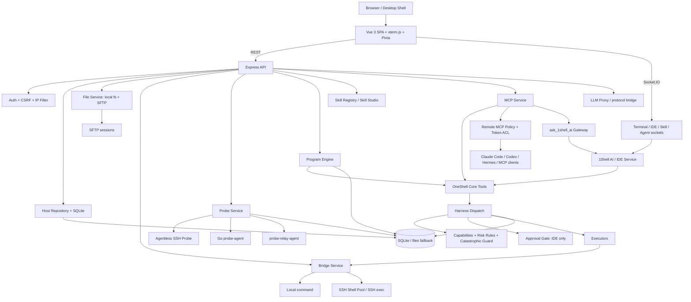

# 1Shell 全量分析报告

> 一句话定位：1Shell 是一个本地优先的 WebSSH + 多 VPS 运维中枢 + Remote MCP Server，把主机、终端、文件、脚本、探针、审计、Program/Skill 和 1Shell AI 网关组织成“人和 Agent 共用”的服务器运维控制面。

## 基本信息

| 项目 | 值 |
|------|----|
| 仓库 | `weidu12123/1Shell` |
| URL | `https://github.com/weidu12123/1Shell` |
| Star | 67（2026-06-10 GitHub API 快照） |
| Fork | 11（2026-06-10 GitHub API 快照） |
| Watchers | 67（2026-06-10 GitHub API 快照） |
| 许可证 | MIT |
| 主要语言 | JavaScript；GitHub languages：JS 1.14MB、Vue 0.73MB、TypeScript 0.26MB、Go 0.06MB |
| GitHub 创建时间 | 2026-04-05 |
| 本地公开源码首次提交 | 2026-05-31 / `350500c` / `1Shell 4.0 — clean public source release` |
| 最近提交 | 2026-06-09 UTC / `d186d6b` / `fix: repair direct probe agent install` |
| 默认分支 | `codex-contrib-refresh`（另有 `main` 分支，当前 open PR 从 main 指向默认分支） |
| 最新 Git tag / Release | `v4.1.0`；GitHub Release 发布于 2026-06-06，桌面资产更新到 2026-06-08 |
| Open Issue / PR | repo API `open_issues_count=1`，实际为 open PR #3；纯 open issue = 0（2026-06-10） |
| 贡献者 | GitHub contributors API 当前 1 人；本地 shortlog 显示 `weidu12123` 102 commits |
| 仓库体量 | 304 tracked files；pygount 299 files / 44,540 code LOC；GitNexus 索引 9,314 nodes / 17,502 edges / 300 flows |
| 验证结果 | `npm test`、`frontend build`、`go test ./...`、本地 `/api/health` smoke 均通过（详见“质量与成熟度”） |
| 分析日期 | 2026-06-10 |

---

## 第一层：定位与画像

### 一句话定位

1Shell 不是单纯 WebSSH，也不是一个极简 SSH MCP Server；它更像“面向个人开发者 / 小团队的 AI-native VPS 运维工作台”：人通过浏览器管理多台服务器，外部 Agent 通过 MCP 把这些服务器当作可观测、可执行、可审计的运维对象。

### 类比法

- 类似 **Cockpit / WebSSH / 轻量运维面板**，但它把 AI Agent、MCP、脚本库、Program、Skill 和安全 Harness 纳入同一运维闭环。
- 类似 **ssh-mcp 的加强版**，但 ssh-mcp 主要提供“远程执行命令”这一层，1Shell 则提供主机仓库、Web UI、SFTP、探针、审计、AI 网关和自动化资产。
- 类似 **OpenAgent / OpenHuman 这类 agent workbench** 的运维特化分支，但它的核心领域不是通用聊天/RAG/memory，而是服务器操作面。

### 分类

`Remote Ops / MCP Infrastructure`

这个分类强调三点：

1. Remote Ops：远程服务器管理、WebSSH、SFTP、监控、诊断、脚本、审计。
2. MCP Infrastructure：把运维能力暴露给 Claude Code / Codex / Hermes 等 MCP Client。
3. Agent Safety Layer：AI 执行真实命令前需要确定性边界、审批、审计和回溯。

---

## 场景一：是否值得采用

### 解决的问题

1Shell 解决的是“AI Agent 已经会写代码和调用工具，但真实服务器运维能力仍散落在 SSH、面板、脚本、监控、日志、文件管理和人肉审批里”的问题。

它试图把这些能力收进一个控制台：

- 主机仓库：记录本机、远程 SSH 主机、角色、标签、排序、归档与连接信息。
- WebSSH / SFTP：浏览器里直接开终端、文件管理、上传下载、预览编辑。
- 探针系统：Agentless SSH 探针、Go probe-agent、relay-agent、时序样本、流量、告警和诊断。
- 脚本库 / Program / Skill：把运维动作沉淀成可复用资产。
- 1Shell AI：平台内置运维 Agent，可调用工具、读取页面上下文、创作 Program/Skill。
- MCP Server：把多主机运维能力暴露给外部 Agent；远程 MCP 默认收敛成少量基础工具 + `ask_1shell_ai` 网关。
- Harness：AI 操作真实世界前经过确定性 guard、capability、审批、脱敏和 trace。

### 核心能力与边界

**能做什么：**

- 管理多台 VPS / 本机：SSH terminal、持久 shell pool、SFTP 文件管理、host repository。
- 作为 MCP Server：支持 SSE 和 Streamable HTTP；本地走 Bridge Token，远程走 Remote MCP Token。
- 外部 Agent 直接可见的标准 MCP profile 收敛为 8 个工具：`list_hosts`、`host_exec`、`list_remote_dir`、`read_remote_file`、`write_remote_file`、`upload_file`、`download_file`、`ask_1shell_ai`。
- 复杂能力通过 `ask_1shell_ai` 委托给 1Shell AI，避免外部 Agent 的 tool context 被 20+ 细碎运维工具污染。
- 对命令执行做 Harness 管控：灾难命令拦截、风险规则、人审 gate、read-only capability、secret redaction、harness trace。
- 监控层支持 Agentless、Go probe-agent、relay-agent；Go 采集器读取 `/proc`、`ss`、`systemctl`、`journalctl`、`ufw/firewalld/getenforce` 等形成 `systemHealth`。
- 桌面/服务端分发：Node 服务端、Vue SPA、Docker、Windows/macOS/Linux 桌面包和 release assets。

**不能或不应高估的部分：**

- 不是成熟企业级堡垒机。账号权限、细粒度 RBAC、多租户、审计合规、工单流、SSO 等企业运维基建不完整。
- 不是通用监控系统。探针和告警能覆盖个人/小团队 VPS，但不能替代 Prometheus/Grafana/Uptime Kuma/Zabbix 这类成熟监控栈。
- 不是通用 agent platform。它的优势在服务器运维域；RAG、企业知识库、多用户 agent workspace 不是主战场。
- Remote MCP 能力很强，生产暴露到公网前必须认真配置 HTTPS、Host/Origin 白名单、Remote Token ACL、IP Filter 和反向代理。
- 安全叙事强，但实现上存在边界漂移：命令执行已经统一走 Harness；远程文件写/上传/下载更多依赖 Remote Token ACL、IDE safe mode 与 audit，并未全部走 `harness.dispatch` 的 risk/capability/trace 管道。

### 集成成本

- **最快 demo**：README 提供 Linux 一键安装、Docker Compose、源码运行三条路径。
- **运行依赖**：Node.js >= 18、npm；前端 Vue/Vite 构建；probe-agent 需要 Go 构建；AI 能力需要 OpenAI-compatible API 或对应 Provider。
- **Docker 部署**：`docker compose up -d` 可启动，但 `docker-compose.yml` 挂载了宿主 docker socket、常见 Web 服务目录、AI CLI 配置目录，适合个人机/受信环境，不适合不加审计地直接放进多人生产环境。
- **源码构建验证**：本次在 Node v22.22.2、npm 10.9.7、Go 1.26.3 下完成依赖安装、后端测试、前端 build、Go test 和本地健康检查。
- **学习曲线**：如果只是用 UI 管主机，中等；如果要二开核心，需要理解 Express 路由、Socket.IO、SSH pool、FileService、ProbeService、MCP service、Remote ACL、Harness、Program Engine、Skill/IDE AI loop 和桌面打包。


### 依赖 / SDK 选型证据

> 全量 direct dependencies 由 `tk catalog build` 从本地源码 manifest 写入 catalog；本表只解释影响 build-vs-buy 的关键库 / SDK。

| Dependency | Type | Used for | Problem solved | Evidence | Reuse signal | Caution |
|------------|------|----------|----------------|----------|--------------|---------|
| _待补关键依赖_ | | | | | | |

### 风险评估

| 风险项 | 评估 | 说明 |
|--------|------|------|
| 许可证合规 | 低 | MIT，二开和内部分发友好。 |
| Bus factor | 高 | contributors API 当前 1 人；commit 全部集中在 `weidu12123`。 |
| 供应商锁定 | 中 | 运维能力本身是 SSH/MCP/SQLite/Node，锁定不高；但 Program/Skill/1Shell AI 网关与 1Shell 的数据模型强耦合。 |
| 维护趋势 | 活跃但早期 | 2026-05-31 公开源码释放后，6 月仍高频提交和 release；但项目非常新，尚未形成外部贡献节奏。 |
| 安全攻击面 | 高 | 真实服务器命令、SFTP、docker socket、AI CLI、MCP、远程 HTTPS、Token ACL、文件写入、脚本执行都在同一平台内。 |
| 默认配置 | 中-高 | `.env.example` 已要求改密码；但 `env.js` 在未配置时仍默认 `admin/admin` 并只输出 warning，用户绕过安装脚本直接跑会有暴露风险。 |
| 实现一致性 | 中 | 安全文档宣称“AI 读写文件也必经 Harness”，但源码里文件写/上传/下载未全部进入 Harness；命令执行路径更完整。 |
| 测试覆盖 | 中-低 | CI 能跑，但测试主体只有风险规则、文件服务 dotfile、Go fileops；与 44k LOC 和大量安全边界相比覆盖偏薄。 |
| 分支治理 | 中 | 默认分支为 `codex-contrib-refresh`，`main` 反向开 PR 到默认分支；对外贡献者会困惑。 |

### 结论

**观望；个人/小团队 PoC 可试，架构学习推荐，生产核心运维面暂不建议直接押。**

更具体地说：

- 如果目标是“我自己有几台 VPS，想给 Hermes / Claude Code / Codex 一个可审计的服务器操作入口”，值得部署 PoC。
- 如果目标是“给内部 Agent 做一个 remote ops MCP gateway”，1Shell 的工具面收敛 + AI 网关 + Harness 方向很值得借鉴，但建议先 fork / harden，而不是直接公网裸用。
- 如果目标是“替代公司堡垒机 / 生产运维平台”，当前不建议。需要补 RBAC、多用户审计、测试覆盖、安全审计、默认配置 hardening 和 release/branch 治理。
- 如果目标是“学习 AI Agent 怎么安全触达真实服务器”，非常值得读源码。

---

## 场景二：技术架构学习

### 核心架构图



### 关键设计决策与 trade-off

| 决策 | 选择 | 获得 | 代价 |
|------|------|------|------|
| 产品形态 | Node/Express 单体 + Vue SPA + Go probe-agent | 部署和理解成本低，前后端闭环快 | 单体服务面很宽，安全与测试压力集中。 |
| 外部 MCP 工具面 | 8 个基础工具 + `ask_1shell_ai` 网关 | 减少外部 Agent tool context 污染，复杂能力由内部 Agent 编排 | 外部 Agent 对内部能力透明度降低，需要信任 1Shell AI 的总结与执行。 |
| 安全边界 | Harness 执行层 guard，而不是 prompt 约束 | prompt injection 不容易绕过命令红线；可审计、可解释 | 需要所有高风险工具都真正接入 Harness，否则文档与实现会漂移。 |
| Program 模型 | `exec` / `ai` / `render` 三类步骤 | 固定命令和 AI 判断可以混排，适合运维流程沉淀 | AI step 可控性取决于 capability、prompt、Provider 稳定性和验证策略。 |
| 探针设计 | Agentless SSH + Go agent + Relay agent | 快速接入、长期监控、内网中继三种模式都覆盖 | 监控域变复杂，采集准确性、权限、跨 distro 兼容需要更多测试。 |
| 数据层 | SQLite + JSON 文件 fallback / registry | 个人自托管简单可靠，备份迁移容易 | 多用户并发、远程队列、审计不可篡改性不够企业化。 |
| 桌面分发 | Electron + bundled Node runtime + release assets | Windows/macOS/Linux 用户可免部署体验 | 原生模块、Node runtime、桌面 CI 资产体积和兼容性复杂。 |

### 值得学习的模式

1. **MCP surface minimization：少而硬的外部工具面**
   - `docs/mcp-ai-gateway-optimization.md` 明确把外部 MCP profile 收敛到主机列表、命令、文件和 AI 网关。
   - 这比把 29 个工具全暴露给外部 Agent 更符合“Agent 可控上下文”的设计原则。

2. **AI gateway as capability router**
   - `ask_1shell_ai` 的 contract 不是直接开放所有复杂工具，而是让外部 Agent 给出 `task/mode/hostId/requireConfirmation`。
   - 内部 1Shell AI 再根据上下文调用脚本、探针、诊断、Program、审计等能力。

3. **Deterministic Harness over prompt safety**
   - `harness/dispatch.js` 的 6 步管道很清晰：trace → guard → approval → execute → redact → endTrace。
   - `risk-rules.js` 用 strict/standard/trusted 三档决定 block / approval / warn。
   - `capabilities.js` 的 `read_only` 能力是可迁移的最小授权模板。

4. **Program = frozen AI goals, not only shell scripts**
   - Program 的 `ai` step 把“人对智能体的一句话目标”冻结下来，而不是只固化一串命令。
   - 对证书申请、反代配置、巡检、部署这类现场依赖强的任务很有启发。

5. **Audit logs + Harness traces 双轨回溯**
   - `audit_logs` 回答“执行了什么”；`harness_traces` 回答“为什么允许/拦截/需要审批”。
   - 对 AI 运维系统来说，这比普通命令历史更有解释力。

6. **Agentless → Agent → Relay 的探针渐进式接入**
   - 快速场景不装 agent，用 SSH 采集；长期监控部署 Go agent；内网/不可直连场景再上 relay。
   - 这是个人 VPS 管理工具很实用的能力分层。

### 反模式 / 踩坑点

- **安全文档与实现边界有漂移**：命令执行路径确实统一进 Harness；但 `write_remote_file` / `upload_file` / `download_file` 等文件能力在 core tools 中直接调用 FileService，主要靠 safe mode / Remote Token ACL / audit 管控，不是全量 `harness.dispatch`。
- **默认凭据仍有危险口**：`env.js` 默认 `APP_LOGIN_USERNAME=admin`、`APP_LOGIN_PASSWORD=admin`；虽然启动 warning 和 `.env.example` 都提示修改，但生产默认更理想的做法是无密码拒绝启动或生成一次性初始口令。
- **测试覆盖不足以支撑安全叙事**：风险规则测试 10 条、文件服务 dotfile 测试、Go fileops 测试都通过，但还缺 MCP ACL、Remote HTTPS/Host/Origin、Harness trace、Program AI capability、SFTP、auth/CSRF、proxy SSRF 等关键路径测试。
- **Docker compose 权限很重**：挂载 `/var/run/docker.sock`、AI CLI 配置、Web 服务和证书路径，个人机方便，团队/生产环境需要拆 profile 和 least privilege。
- **后端主要是 CommonJS JS**：比 TypeScript 后端更快写，但很多 schema / input / service boundary 靠运行时判断；安全产品长期会受益于更强类型边界。
- **分支与 release 流程有新项目痕迹**：默认分支不是 `main`，open PR 为 owner 自己的 docs 小改，commit message 有重复修复；对外协作治理还没成熟。

### 可借鉴的具体技术点

- `src/services/remote-mcp.service.js`：Remote MCP enabled/HTTPS/Host/Origin/Token/ACL 的状态模型。
- `src/mcp/mcp.service.js`：SSE + Streamable HTTP 双协议 MCP 实现，并在 `tools/list` 与 `tools/call` 两处过滤工具。
- `src/tools/oneshell-core.tools.js`：统一工具定义表，区分 `targets: ['mcp']` / `['ide']`，并实现 `ask_1shell_ai`。
- `src/harness/*`：guard、risk rules、capabilities、dispatch、trace 的边界层拆分。
- `src/programs/engine.js`：Program run lifecycle、AI step 回调、incremental result preservation、harness integration。
- `src/services/file.service.js`：local fs + SFTP、连接池、并行分块下载、dotfile 处理。
- `agent/internal/collector/system_health.go`：Go probe-agent 的系统健康采集范式。

---

## 架构解剖

### 目录结构

```text
1Shell/
├── server.js                    # 服务入口：装配 app、db、repo、service、MCP、Harness、routes、sockets、scheduler
├── src/
│   ├── app/                     # Express app/server 初始化
│   ├── config/                  # 环境变量、端口、默认凭据、Token、探针配置
│   ├── database/                # SQLite + migrations（audit_logs、probe、program、harness_traces 等）
│   ├── middleware/              # error/auth/ip/security middleware
│   ├── routes/                  # REST API、MCP、remote MCP、proxy、probe、program、file、skill 等路由
│   ├── services/                # Host/File/Bridge/Probe/RemoteMCP/Auth/Audit/Secret/MCP registry 等业务服务
│   ├── tools/                   # OneShell core tools：MCP/IDE 共享工具定义与 handler
│   ├── harness/                 # AI 执行边界：capabilities/risk-rules/guard/dispatch/executors/trace
│   ├── ide/                     # 1Shell AI 对话循环、tool calling、safe mode、gateway ask
│   ├── mcp/                     # MCP JSON-RPC/SSE/Streamable HTTP 服务
│   ├── programs/                # Program registry、schema、engine、state service
│   ├── skills/                  # 1Shell Skill registry、runner、Claude Code Skill 转换/托管
│   ├── agents/                  # Claude Code / OpenCode / Codex 等 CLI Agent PTY 面板
│   └── sockets/                 # Terminal / Agent / Skill / IDE Socket.IO handlers
├── frontend/                    # Vue 3 + Vite + TS + Tailwind + Pinia + xterm.js 前端
├── agent/                       # Go probe-agent / relay-agent
├── data/skills/                 # 内置 Program/Skill 模板与样例 skill
├── desktop/                     # Electron main/preload
├── docs/                        # 设计文档，含 MCP AI Gateway 优化
├── .github/workflows/           # CI、macOS release、desktop release
├── Dockerfile / docker-compose.yml
└── install.sh
```

### 技术栈

| 层级 | 技术 |
|------|------|
| 前端 | Vue 3、Vite、TypeScript、Tailwind CSS、Pinia、Vue Router、xterm.js、Socket.IO client、Three/Globe 可视化 |
| 后端 | Node.js、Express、Socket.IO、CommonJS JavaScript |
| 数据 | SQLite / better-sqlite3、JSON registry files、WAL mode、版本化 migrations |
| SSH / Shell | `ssh2`、`node-pty`、持久 SSH shell pool、本机 child_process |
| MCP | 自实现 JSON-RPC 2.0 + SSE + Streamable HTTP；Remote Token ACL |
| AI | OpenAI-compatible chat completions、Anthropic protocol proxy、Claude Code/OpenCode/Codex PTY 面板 |
| 安全 | Auth session、CSRF、IP Filter、Bridge Token、Remote MCP Token、AES-256-GCM、Harness risk rules |
| 探针 | Agentless SSH、Go probe-agent、probe-relay-agent、node-cron 聚合 |
| 自动化 | Script library、Program Engine、Skill Registry/Runner |
| 分发 | Docker、docker-compose、Electron/electron-builder、GitHub Actions release assets |

### 模块依赖关系

```text
server.js
  ├─ createDatabase + repositories
  ├─ createAuthService / HostService / AuditService / BridgeService
  ├─ createHarness
  │    ├─ createGuard
  │    ├─ createExecutors
  │    └─ createTrace
  ├─ createProbeService / Agent / Relay / Traffic / Alert / Diag
  ├─ createProgramEngine
  ├─ createIdeTools + createIdeService
  ├─ createMcpService + createRemoteMcpService
  └─ routes + socket handlers + schedulers

External MCP Client
  → /mcp/sse or POST /mcp/sse
  → remote policy / token validation
  → mcpService.tools/list + tools/call
  → OneShell Core Tools
  → Harness for command execution
  → Bridge/File/Probe/Program/IDE services
```

### 扩展机制

- **MCP registry**：登记远程/本地 MCP Server，支持本地部署、autoStart、exposeToIde。
- **OneShell Core Tools**：一个工具定义表决定工具是否暴露给 MCP / IDE，并统一 handler。
- **Skill Registry**：Markdown skill 包指导 1Shell AI 完成某类任务；支持 1Shell Skill 与 Claude Code Skill 托管/转换。
- **Program Engine**：YAML/JSON 程序定义，支持 manual/cron trigger、exec/ai/render step、input schema。
- **Agent PTY provider registry**：Claude Code / OpenCode / Codex 在 Web 控制台内作为 PTY agent 运行。
- **Remote MCP Token ACL**：按 token 限定 tool / host / script / path。
- **Harness capability**：`read_only` / `exec_command` 词表已具备扩展位，可继续引入 `write_file`、`network_admin`、`package_install` 等更细粒度能力。

---

## 质量与成熟度

### 代码质量

| 维度 | 评估 |
|------|------|
| 模块划分 | 中上。服务、路由、MCP、Harness、Program、Probe、IDE 分层清晰；`server.js` 是依赖装配中心。 |
| 类型系统 | 中。前端 TypeScript，Go agent 类型强；后端核心是 CommonJS JS，靠 runtime validation 和约定。 |
| 错误处理 | 中上。关键路径有 try/catch、审计、abort、timeout；Program AI 有中断后保留增量结果的设计。 |
| 安全工程 | 方向好。Harness、Token ACL、CSRF、IP Filter、AES-GCM、secret redaction 都有真实实现；但文件写路径未全量纳入 Harness。 |
| 代码风格 | 中。命名和注释较清晰，中文注释密集；部分长文件较大，如 `ide.service.js` 1175 行、`oneshell-core.tools.js` 1238 行、`proxy.routes.js` 1163 行。 |

### 测试

本次实际执行：

```text
node -v → v22.22.2
npm -v  → 10.9.7
go version → go1.26.3 linux/amd64

npm ci --include=dev --include=optional --no-audit --fund=false        ✅
npm --prefix frontend ci --include=dev --include=optional --no-audit  ✅
npm test                                                             ✅
  risk-rules: 10 checks passed
  file-service: dot file checks passed
npm --prefix frontend run build                                      ✅
  vite build: 464 modules transformed; built in 15.01s
  warning: index chunk 770.72 kB > 500 kB
(cd agent && go test ./...)                                           ✅
  internal/fileops ok; other Go packages no test files
local smoke: PORT=3399 node server.js + GET /api/health               ✅
  {"status":"ok","model":"gpt-4o",...}
```

测试结论：

- CI 和本地验证链路能跑通，这是加分项。
- 现有测试覆盖的点偏窄：风险规则、dotfile 文件服务、Go fileops。
- 还缺关键安全/协议测试：Remote MCP Token ACL、`tools/list` + `tools/call` 隐藏工具强约束、Host/Origin/HTTPS、Bridge Token、本地/远程曝光识别、Program `read_only` capability、Harness trace、auth/CSRF、proxy access control、SFTP 文件写入等。

### CI/CD

`.github/workflows/ci.yml`：

- push 到 `main/dev`、PR 到 `main` 触发。
- Node 18/20 matrix。
- `npm ci`、`npm test`、frontend build。
- Go 1.22.x 测 probe-agent。
- `main` 分支额外 docker build + container health check。

Release workflows：

- `build-desktop-release.yml` 覆盖 Windows/Linux/macOS x64/arm64 desktop package，下载 bundled Node runtime，构建 probe-agent binaries，上传 release assets。
- `build-macos-release.yml` 有 offline package smoke test：启动 server 并检查 `/api/health`。

质量信号：CI 不是空壳，release workflow 也考虑了 native modules 和 smoke test。主要不足是应用级集成测试少。

### 文档质量

- README 完整，覆盖定位、核心能力、MCP 接入、架构、技术栈、安全设计、项目结构、部署路径。
- `SECURITY.md` 非常详细，逐段解释 auth、CSRF、IP Filter、凭据加密、Harness、audit/traces。
- `HARNESS_DESIGN.md` 把边界层设计解释得简洁清楚。
- `docs/mcp-ai-gateway-optimization.md` 明确记录“外部工具面收敛”的设计动机与安全要求。
- docs site `https://docs.1shell.pro` 可访问（2026-06-10 curl 验证 200）。

不足：文档有“安全理想态”表述，部分与当前实现细节不完全一致；贡献指南、开发者 API、测试策略、威胁模型边界还可继续补。

### Issue / PR 健康度

- 纯 open issue = 0。
- open PR #3：`docs: add usage guide link to README`，owner 自己发起。
- closed PR #1 / #2 都在 2026-05-23 当天合并，围绕 desktop packaging 和 revert broken desktop release changes。
- 外部生态搜索几乎没有真实用户 issue / fork activity；项目还处在作者主导早期。

结论：当前不能用 issue 低数量判断“成熟稳定”，更像“刚公开、尚未经历外部用户冲击”。

---

## 社区与生态

### 社区评价

GitHub search 结果：

- `repo:weidu12123/1Shell is:issue sort:reactions-+1-desc` 返回 0 个 issue。
- `"1Shell" "weidu12123"` 主要命中仓库自身 PR。
- repo search `1Shell` 只有少量 0-star 同名仓库 / fork，未见明显衍生生态。

评价：

- 热度：67 stars / 11 forks，对 2026-04 创建、2026-05 公开 release 的项目来说有一定早期关注，但还不是社区验证后的产品。
- 认可点：README 和 release body 的叙事非常清楚，聚焦 AI Agent 运维入口、安全边界和 MCP 工具面收敛。
- 真实痛点：还没有外部 issue 足够暴露；要靠源码与测试判断风险。

### 衍生项目 / 插件生态

暂无可确认的衍生项目或插件生态。仓库自身内置 Skill/Program/MCP registry，是生态能力的“种子”，但外部生态还未形成。

### 竞品对比

| 项目 | Stars（2026-06-10） | 层级 | 与 1Shell 的关系 |
|------|---------------------|------|------------------|
| `tufantunc/ssh-mcp` | 492 | 极简 Remote SSH MCP Server | 直接邻近：更轻、更窄，只解决 MCP remote exec。 |
| `cockpit-project/cockpit` | 14,263 | 成熟 Web server admin console | 平台级参照：服务器管理更成熟，但不是 Agent/MCP-first。 |
| `huashengdun/webssh` | 5,110 | WebSSH client | 功能子集参照：只覆盖 Web SSH，不覆盖 AI/MCP/探针/Program。 |
| `louislam/uptime-kuma` | 87,839 | 自托管监控 | 监控参照：监控成熟度强，但不做 AI 运维执行。 |
| `modelcontextprotocol/servers` | 87,000 | MCP server catalog | 生态参照：标准 MCP Server 集合，1Shell 属于其中 remote ops 类潜在成员。 |
| `mcp-use/mcp-use` | 10,083 | MCP app/server framework | MCP 应用开发参照，不是运维控制台。 |

---

## 关键代码走读

### 1. `server.js` — 依赖装配与控制面入口

- 路径：`server.js`
- 职责：创建数据库、repositories、核心 services、Harness、Program Engine、IDE Service、MCP Service，挂载 REST/MCP 路由和 Socket.IO handlers。
- 实现要点：
  - 先加载 `.env`，再 `ensureBridgeToken`，避免 `.env` 中的 `BRIDGE_TOKEN` 被旧 token 覆盖。
  - IP Filter 在 auth/bridge/mcp/proxy 等业务路由之前挂载。
  - `/mcp` 路由不走 Web session，而走 Bridge Token / Remote MCP Token。
  - Program Engine 和 probe schedulers 在服务启动时一起进入长驻状态。
- 学习价值：典型 Node 单体“composition root”；所有核心依赖关系都能在一个文件中看清。

### 2. `src/mcp/mcp.service.js` + `src/services/remote-mcp.service.js` — MCP 协议与远程准入

- 路径：`src/mcp/mcp.service.js`、`src/routes/mcp.routes.js`、`src/services/remote-mcp.service.js`
- 职责：实现 MCP initialize/ping/tools/list/tools/call，支持 SSE 和 Streamable HTTP；远程访问根据 enabled、HTTPS、Host、Origin、Token、tool/host/script/path ACL 限制。
- 实现要点：
  - `tools/list` 通过 `remoteMcpService.filterTools()` 过滤对外可见工具。
  - `tools/call` 再次通过 `isToolAllowed()` 拦截隐藏工具，避免客户端绕过 list 直接 call。
  - Remote token 只保存 hash + prefix，返回 publicToken 不泄漏明文。
  - Remote policy 中 `allowedTools` 先取全局与 token 交集，再带入 session context。
- 学习价值：这是“协议入口不能只靠 UI 隐藏”的好样本。

### 3. `src/tools/oneshell-core.tools.js` — 能力总线与 AI 网关

- 路径：`src/tools/oneshell-core.tools.js`
- 职责：声明并处理 MCP/IDE 共用工具，区分暴露目标，封装 host exec、文件、脚本、MCP registry、Program、Probe、Audit、`ask_1shell_ai`。
- 实现要点：
  - `MCP_STANDARD_TOOL_NAMES` 明确标准外部 MCP 工具面。
  - `TOOL_DEFS` 每个工具有 `targets`，同一份定义生成 MCP schema 和 IDE tool schema。
  - `handleExec()` 会走 Harness dispatch；IDE 可请求 approval，MCP/Program 无人审。
  - `handleAskOneShellAi()` 把外部 request 转成内部 `[MCP_GATEWAY_REQUEST]` 指令，并带上 toolPolicy 限制。
- 学习价值：把工具注册、协议暴露和业务 handler 统一起来，便于维护多入口一致性。

### 4. `src/harness/*` — AI 操作真实世界的确定性边界

- 路径：`src/harness/index.js`、`dispatch.js`、`guard.js`、`risk-rules.js`、`capabilities.js`、`executors.js`、`trace.js`
- 职责：对 AI 发起的命令执行做准入、风险、人审、执行、脱敏和 trace。
- 实现要点：
  - `dispatch()` 捕获 guard 自身异常并 fail-closed。
  - `guard.check()` 组合 capability、灾难命令、风险规则。
  - `risk-rules.js` 用 strict/standard/trusted 映射 critical/high/medium 到 block/approval/warn。
  - `capabilities.js` 的 `read_only` 命令白名单会拒绝 `rm`、`chmod`、`apt`、`npm`、`git` 等写/变更类命令。
  - `executors.js` 支持 `agentPrivilegeIsolation`，在 Linux 上用 `runuser -u oneshell-agent -- bash -lc ...` 降权执行。
- 学习价值：比 prompt safety 更可靠，是 Agent 运维系统最值得借鉴的一层。

### 5. `src/programs/engine.js` — 运维流程自动化

- 路径：`src/programs/engine.js`
- 职责：调度 cron/manual Program，执行 `render`、`exec`、`ai` step，记录 run 状态和前端事件。
- 实现要点：
  - 同一 Program + host 有 running lock，避免并发踩踏。
  - `ai` step 在 Provider 中断时可以保留增量报告，减少长任务损失。
  - AI step 的 `executeCommand` 回调走 Harness，支持 step-level capabilities。
  - 普通 deterministic `execStep()` 当前直接走 `bridgeService.execOnHost()`，这是效率/兼容选择，但没有完整 Harness trace。
- 学习价值：把“固定命令”和“AI 判断步骤”编排到一个 Program 是很好的运维自动化模式。

### 6. `agent/internal/collector/system_health.go` — Go probe-agent 系统健康采集

- 路径：`agent/internal/collector/system_health.go`
- 职责：采集监听端口、TCP 连接数、僵尸进程、失败 systemd 服务、最近错误日志、防火墙状态和 SELinux 状态。
- 实现要点：
  - 用 `/proc` 读取 zombie count。
  - 用 `ss`、`systemctl`、`journalctl`、`firewall-cmd`、`ufw`、`getenforce` 做 1.5s timeout 的轻量采样。
  - 输出前做简单 sanitize，避免管道分隔符污染上报格式。
- 学习价值：适合个人 VPS health check 的最小 Go 采集器参考。

---

## 评分

| 维度 | 评分(1-5) | 说明 |
|------|----------|------|
| 功能覆盖度 | 4 | WebSSH、SFTP、主机仓库、探针、MCP、AI 网关、Program/Skill、审计都覆盖；企业 RBAC/堡垒机/成熟监控不足。 |
| 代码质量 | 3 | 分层清晰、能跑、注释足；但后端 JS 长文件较多，类型边界弱，安全实现存在部分路径漂移。 |
| 文档质量 | 4 | README/SECURITY/HARNESS/DOCS 说明完整，docs site 可访问；但文档与实现需继续对齐。 |
| 社区活跃度 | 2 | 作者高频维护，但项目很新、单作者、外部 issue/PR 生态未形成。 |
| 架构设计 | 4 | MCP 工具面收敛、AI gateway、Harness、Program/Skill、Probe 分层都很有价值；实现一致性还需打磨。 |
| 学习价值 | 5 | 对 AI-native 运维控制面、安全边界、Remote MCP、Program 自动化都很值得拆。 |
| 可借鉴度 | 4 | Harness、Remote Token ACL、ask gateway、Program AI steps、Agentless/Agent/Relay 探针都可迁移；整个平台直接复用需谨慎。 |

**总分：26 / 35**

---

## 总结

### 一句话评价

1Shell 是一个方向很对、架构学习价值很高的 AI-native 运维控制台：它把“服务器是 Agent 可操作对象”这件事从简单 SSH MCP 提升到 Web 控制台、探针、审计、安全边界和自动化资产层，但当前仍是单作者早期项目，生产采用前必须 harden。

### 谁应该用

- 有多台 VPS 的个人开发者，想把 WebSSH、文件、探针、脚本和 AI 运维合到一个控制台。
- 想给 Hermes / Claude Code / Codex 提供 Remote MCP 运维能力的人。
- 正在设计 Agent 运维平台、安全 Harness、MCP gateway、自动化 Program 的开发者。
- 想学习“AI 如何安全触达真实服务器”的架构研究者。

### 谁不应该直接用

- 需要企业堡垒机、RBAC、多租户、合规审计、工单审批的团队。
- 不愿意处理公网 HTTPS、Token ACL、IP Filter、docker socket 权限和默认凭据 hardening 的用户。
- 需要成熟监控告警平台而不是 AI 运维入口的团队。

### 下一步

1. 如果要试用：先只在内网 / Tailscale / 本机跑，不要直接公网暴露 Remote MCP。
2. 必须改：`APP_LOGIN_USERNAME`、`APP_LOGIN_PASSWORD`、`APP_SECRET`、`BRIDGE_TOKEN`；远程 MCP 必须 HTTPS + Host whitelist + Token ACL。
3. 如果要二开：优先补安全测试，并把文件写/上传/下载能力也纳入 Harness 或明确从安全文档中降级表述。
4. 如果要借鉴到 Distill/Hermes：重点抄三件事——MCP 工具面收敛、`ask_*_ai` 网关、Harness trace + audit 双轨。
