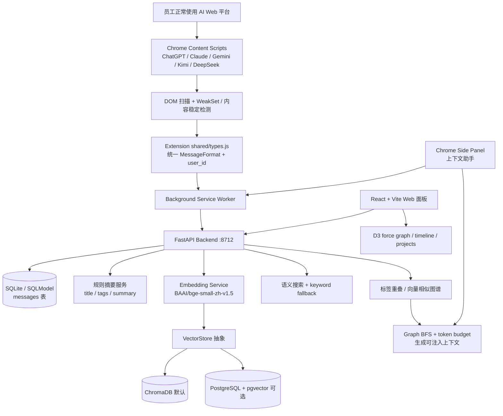

# AIHub / AI Memory Hub

> 一句话定位：用 Chrome 扩展自动采集 ChatGPT / Claude / Gemini / Kimi / DeepSeek 对话，并用本地 FastAPI + SQLite + ChromaDB / BGE 构建“企业 AI 对话知识资产库”的早期 MVP。

## 基本信息

| 项目 | 值 |
|------|----|
| 仓库 | `Vincent-chao-lang/AIHub` |
| URL | `https://github.com/Vincent-chao-lang/AIHub` |
| Star | 9（2026-07-08 GitHub API 快照） |
| Fork | 1（2026-07-08 GitHub API 快照） |
| GitHub 许可证元数据 | 未识别（README badge 写 MIT，但仓库根目录仍无 LICENSE 文件） |
| 主要语言 | Python（GitHub 元数据）；实际为 Python + TypeScript/React + Chrome Extension JS |
| 首次提交 | 2026-05-27（`08f1a06`） |
| 最近代码提交 | 2026-05-30（`745f074`，`Stop tracking docs/ directory`） |
| 默认分支 / 当前 tip | `main` / `745f074`（截至 2026-07-08 未见后续代码提交） |
| 最新 Release | 无 GitHub Release；本地 tag `v0.0.1` |
| 贡献者数 | 1（`Qiupengchao`，17 commits） |
| 代码规模 | 清洗运行时产物后约 68 tracked files / 3,953 code LOC；仓库仍额外跟踪 `backend/.models`(93MB)、`.chromadb`、`aihub.db` |
| 仓库活跃度 | GitHub `updated_at` 2026-06-28，但 `pushed_at` 仍停在 2026-05-30；像短期冻结的早期原型 |
| 分析日期 | 2026-07-08 |

---

## 场景一：是否值得采用

### 解决的问题

AIHub 想解决的是“员工与 AI 的高质量对话无法沉淀”的组织知识问题：员工每天在 ChatGPT、Claude、DeepSeek 等平台上完成架构讨论、故障排查、方案对比、内容创作，但这些对话通常留在个人账号里，不进入企业知识库；员工离职或换项目后，推演过程、上下文和决策链不可检索。

它的产品思路是：

1. Chrome 扩展静默监听多个 AI Web 平台的对话 DOM。
2. 消息上传到本地/团队 FastAPI 后端。
3. 结构化落 SQLite，语义向量落 ChromaDB 或 pgvector。
4. 用时间线、搜索、相关对话、项目聚类、知识图谱、上下文注入来复用历史对话。

这不是“企业知识管理平台”的完成品，更像一个把“AI 对话记忆”方向跑通的本地优先原型。

### 核心能力与边界

**能做什么：**

- 自动采集 5 个 AI 平台：ChatGPT、Claude、Gemini、Kimi、DeepSeek。
- 保存统一消息格式：`platform / conversation_id / role / content / timestamp / user_id`。
- 提供 FastAPI API：上传消息、timeline、conversation detail、search、context、related、projects、graph、stats。
- 本地 embedding：`BAAI/bge-small-zh-v1.5` + ChromaDB；可选 PostgreSQL + pgvector。
- 无外部 LLM 摘要：用规则、停用词、技术词加权生成 title / tags / summary。
- Web 面板：React + Vite 时间线、搜索、对话详情、项目聚合、上下文助手、D3 力导向图谱。
- Chrome side panel：输入当前话题，一键生成可复制到 AI 平台的历史上下文。

**不能稳定保证什么：**

- 不能直接作为企业生产级 AI 审计系统。当前没有认证、授权、审计日志、权限隔离、租户边界和敏感信息治理。
- 不能保证采集稳定。DOM 监听依赖各 AI 平台页面结构，平台 UI 一改就可能失效。
- 不能保证数据质量。后端用 UUID 新建消息，幂等去重主要在扩展前端内存里完成，刷新/重启/DOM 变化后有重复写入风险。
- 不能保证规模。`/graph`、`/projects`、`/context` 多处按对话两两比较，复杂度接近 O(N²)；小数据可用，大团队历史库会卡。
- 不能保证安装即安全。扩展 host permissions 过宽，后端 CORS 全开，README 的生产部署只给了 Basic Auth 示例，不是完整安全方案。

**与竞品差异：**

- 相比 **mem0ai/mem0-chrome-extension / OpenMemory**：AIHub 更强调企业知识资产、timeline/graph/dashboard；mem0 生态成熟度、品牌与 memory API 路线更强。
- 相比 **ArcRift**：ArcRift 明确把浏览器聊天同步到 IDE agent / MCP server；AIHub 更像 Web 面板 + 上下文复制助手，IDE/Agent 原生集成还没有成型。
- 相比 **personal-ai-memory**：personal-ai-memory 走 100% in-browser / IndexedDB / WASM Hybrid RAG；AIHub 走本地后端 + Python embedding 服务，部署更重但后端可扩展空间更大。
- 相比 **传统知识库 / Notion / Confluence / Dify Knowledge**：AIHub 的采集对象更精准，是 AI 对话过程；但权限、治理、协作和搜索成熟度都远远不足。

### 集成成本

- **个人本地 PoC**：低到中。`./start.sh` 会自动尝试 `pip install -r backend/requirements.txt` 与前端 `npm install`，首次启动成本明显高于普通前端小工具。
- **团队部署**：中到高。需要配置服务地址、每个员工装扩展和填写 `user_id`；如果从 `127.0.0.1` 变成局域网/公网服务，认证、权限、TLS、审计与保留策略都得重做。
- **依赖链**：后端 FastAPI、SQLModel、ChromaDB、sentence-transformers、tiktoken；前端 React 19、Vite、D3 force；浏览器扩展 Manifest V3。
- **本轮验证边界**：按静态源码/GitHub 元信息复核，未重跑安装、构建或 smoke test。当前结论仅基于仓库代码、README/USAGE、Git 历史与 GitHub API。 
- **从零到 demo**：README 目标是 5 分钟；但从脚本与依赖看，真实首跑更可能是 10–30 分钟，瓶颈在 Python wheels、HuggingFace 模型下载与前端依赖安装。


### 依赖 / SDK 选型证据

> 全量 direct dependencies 由 `tk catalog build` 从本地源码 manifest 写入 catalog；本表只解释影响 build-vs-buy 的关键库 / SDK。

| Dependency | Type | Used for | Problem solved | Evidence | Reuse signal | Caution |
|------------|------|----------|----------------|----------|--------------|---------|
| `fastapi` + `uvicorn` | Backend framework | 本地 ingestion API、timeline/search/context 路由 | 用最小 Web API 把浏览器采集层和记忆层解耦 | `backend/main.py`, `backend/api/routes.py` | 适合这类 local-first / team LAN 小系统快速起盘 | 当前 CORS `allow_origins=["*"]`，安全边界远没收紧 |
| `sqlmodel` | ORM / schema | `Message` 持久化、响应模型 | 用统一 Python 类型承接消息行存储与 API schema | `backend/models/message.py`, `backend/db/database.py` | 适合 MVP 先把行存储和 API 契约绑在一起 | 事务边界简单，幂等/唯一约束仍弱 |
| `chromadb` | Vector store | 默认本地语义检索 | 零配置落地对话 embedding，支撑 search / related / context | `backend/db/chroma_client.py`, `backend/db/chroma_store.py` | local-first PoC 很合适 | 现在把 `.chromadb` 直接跟踪进仓库，卫生差 |
| `sentence-transformers` + `BAAI/bge-small-zh-v1.5` | Embedding stack | 中文语义索引 | 避免依赖外部 embedding API，保持本地优先 | `backend/services/embedding.py`, `backend/requirements.txt` | 对中文团队内知识库是合理默认 | 首次下载与模型体积提高安装门槛 |
| `tiktoken` | Token estimator | context builder 预算控制 | 让图谱扩展后的上下文能在 token budget 内裁剪输出 | `backend/services/context.py` | 这是可直接复用到记忆/代码库产品的好点 | 仍只做估算，不保证各模型 tokenizer 严格一致 |
| `react` + `vite` + `d3-force` | Frontend stack | timeline / graph / context Web 面板 | 快速搭出可视化与检索 UI | `frontend/package.json`, `frontend/src/pages/*` | 前端控制面轻量、可快速重写 | 仓库未见 CI / test，UI 回归全靠人工 |
| Chrome Manifest V3 | Browser extension runtime | 多平台 content script、background、side panel | 把采集点放在用户现有 AI Web 工作流旁边 | `extension/manifest.json`, `extension/content/*.js` | side panel + content-script 组合很值得借鉴 | `host_permissions` 同时给了 `http://*/*`、`https://*/*`，权限过宽 |

### 风险评估

| 风险项 | 评估 | 说明 |
|--------|------|------|
| 许可证合规 | ⚠️ 中 | README badge 写 MIT，但 GitHub API license 仍为 null，仓库根目录仍无 LICENSE；生产采用前必须补许可证。 |
| Bus factor | ⚠️ 高 | 单作者、17 commits、无外部贡献者。 |
| 供应商锁定 | ✅/⚠️ 低到中 | 不锁定 LLM provider；但强依赖各 AI Web 平台 DOM 结构，属于前端采集层锁定。 |
| 维护趋势 | ❌ 早期停滞 | 仓库创建于 2026-05-27，代码 tip 停在 2026-05-30；截至 2026-07-08 无后续代码提交、无 issue/PR 互动。 |
| 安全历史 | ⚠️ 未建立 | 无 security policy、无认证、无权限模型、无 CI security gate；不能把“本地优先”误读为“安全完成”。 |
| 数据治理 | ❌ 高风险 | 当前会记录完整 AI 对话；企业场景必须先做敏感信息过滤、员工告知/授权、保留周期、删除/导出机制。 |
| 供应链/仓库卫生 | ❌ 高风险 | 仓库仍跟踪 `backend/.models`(93MB)、`backend/.chromadb`、`backend/aihub.db`，与开源仓库最佳实践冲突。 |
| 文档一致性 | ⚠️ 中 | README/USAGE 仍链接 `docs/STORAGE.md`，但 docs 目录已停止跟踪；Dockerfile/compose 只是文档示例，不是实际文件。 |

### 结论

**观望。个人 PoC 可以试；企业生产不建议直接采用。**

理由：方向依然对，尤其“自动捕获 AI 对话 → 本地语义索引 → 上下文注入”的闭环很值得关注；但截至 2026-07-08，这个仓库的代码面基本仍停在 2026-05-30 的早期状态。安全边界、许可证、仓库卫生、CI、测试、幂等、权限、规模化与文档一致性都还没到企业级。

如果只是在个人电脑上试“AI 对话记忆”概念，可以跑起来体验；如果想作为公司“AI 知识资产平台”，现在更适合把它当参考原型，或者作为自己重写同类系统时的产品草图，而不是标准件。

---

## 场景二：技术架构学习

### 底层技术架构

#### 最小架构内核

`Browser Capture Adapters + Local Ingestion API + Dual Store (SQLite row store + vector store) + Context Builder + Side Panel Re-entry`

它能成立，不靠复杂 Agent orchestration，而是靠一个非常直接的闭环：
1. 在浏览器侧把 AI 对话采进统一消息格式；
2. 先落行存储，再做语义索引；
3. 用检索 + 图谱扩展生成可复用上下文；
4. 再把上下文通过 side panel / Web 面板送回用户当前 AI 工作流。

#### 核心抽象

| 抽象 | 职责 | 关键实现 | 为什么重要 |
|------|------|----------|------------|
| Capture Adapter | 监听各 AI 平台 DOM，抽取 role/content/conversation_id | `extension/content/*.js` | 决定系统能否低摩擦接入用户现有 AI 使用现场 |
| Canonical Message | 统一消息 schema：`platform / conversation_id / role / content / timestamp / user_id` | `extension/shared/types.js`, `models/message.py` | 没有统一消息对象，就无法做跨平台索引与复用 |
| Ingestion API | 接收消息、写库、触发 embedding/summary | `backend/api/routes.py:create_message` | 把“采集层”与“记忆层”切开 |
| Dual Store | SQLite 管行数据，Chroma/pgvector 管语义召回 | `db/database.py`, `db/chroma_store.py`, `db/pgvector_store.py` | 行存储与向量存储分离，后续才能替换检索后端 |
| Summary Service | 生成 title/tags/summary | `services/summarizer.py` | 给 timeline / projects / graph 提供可读语义层 |
| Context Builder | 向量召回 + 图谱 BFS + token budget 输出上下文 | `services/context.py` | 这是“记忆能回流到下一次提问”的关键桥梁 |
| Re-entry Surface | side panel / Web UI 输出可复制上下文 | `extension/sidepanel/*`, `frontend/src/pages/*` | 决定知识复用是否真正嵌回用户工作流 |

#### 控制面 / 数据面

- **控制面**：`backend/.env`、`VECTOR_STORE`、Chrome options 里的 API URL / `user_id`、route handler 的检索与摘要策略、manifest 的平台接入声明。
- **数据面**：DOM 对话文本 → 统一消息 payload → SQLite `messages` → embedding → Chroma/pgvector → search/related/context/graph → side panel / Web 面板。
- 这个分离是 AIHub 最值得学的地方：控制面很薄，数据面闭环很直接，哪怕未来把后端重写成 Go / Rust / Node，主干也不用变。

#### 关键执行链路

1. **采集链路**：content script 扫描 DOM → `shared/types.js` 组装 payload → POST `/messages` → SQLite 落库 → 后台 embedding / 摘要。
2. **检索链路**：用户在 Web 面板或 side panel 输入 query → `/search` 先走向量召回 → 不命中时回退 keyword search。
3. **上下文回流链路**：query → `/context` 找种子对话 → 图谱 BFS 扩展关联讨论 → 按 token budget 裁剪 → 输出给用户复制回当前 AI 对话。

#### 状态模型

- **持久状态**：`backend/aihub.db`（行存储）、`backend/.chromadb`（向量索引）、`backend/.models`（embedding 模型缓存）。
- **运行时状态**：content script 的 WeakSet、background worker 状态、FastAPI 进程内 `_store` 单例。
- **外部状态**：各 AI Web 平台的 DOM 结构、浏览器扩展权限、用户本地环境变量与依赖安装状态。
- 这里的关键问题也很明显：持久状态和运行时状态没有 repair / reindex / migration path，所以一旦向量层失败，只能靠人工处理。

#### 契约边界

- **浏览器→后端契约**：`MessageCreate` / `MessageResponse` 等 schema，决定跨平台采集后的最小公共字段。
- **后端内部契约**：`VectorStore` 四方法接口 `add/search/find_related/count`。
- **用户侧契约**：side panel 不是自动代填 prompt，而是输出可复制上下文；这是一个非常保守、但安全边界更清晰的产品选择。

#### 失败与降级模型

- DOM selector 失效 → 采集直接失灵，没有平台级 fallback。
- embedding / vector add 失败 → message 仍保存在 SQLite，只是语义能力静默退化。
- `/search` 向量检索空结果 → 回退关键词搜索。
- 图谱过大 / token 超限 → `context.py` 通过 budget 裁剪，但没有更高级的分层摘要。
- 这是一个典型 **fail-soft on retrieval, fail-open on ingestion consistency** 的 MVP：可用性优先，但一致性和可修复性不足。

#### 可复刻设计不变量

1. 采集层必须薄，尽量只做抽取与转发，不承担知识逻辑。
2. 统一消息 schema 必须先于任何平台特化逻辑。
3. 行存储与向量存储必须分开，不能只存 embedding。
4. context builder 必须独立成服务，而不是散落在 UI 或 route handler 里。
5. “把记忆送回用户当前工作流”的 re-entry surface 必须存在，否则记忆库只会变成冷数据。
6. local-first 默认值对这类 AI 对话资产系统是对的，但 local-first 不等于安全完成。

### 核心架构图



### 关键设计决策与 trade-off

| 决策 | 选择 | 放弃了什么 | 为什么 |
|------|------|-----------|--------|
| 采集入口 | 浏览器扩展被动监听 AI 平台 DOM | 放弃 API 官方导出与稳定协议 | 最贴近日常使用，低摩擦；但 DOM 脆弱。 |
| 数据边界 | 本地 FastAPI + SQLite/ChromaDB | 放弃纯浏览器 IndexedDB 的轻部署 | Python 后端方便接 embedding、pgvector、团队部署。 |
| 摘要方式 | 本地规则 + TF/关键词加权 | 放弃 LLM 语义摘要质量 | 零外部 API 成本、隐私友好；但摘要质量有限。 |
| 搜索方式 | 向量优先，失败回退关键词 | 放弃严格 BM25/混合检索排序 | MVP 简单；但检索可解释性和排序质量还弱。 |
| 图谱构建 | 标签重叠 + 向量相似边 | 放弃实体抽取/事件链/项目结构化 schema | 实现快、可视化直接；但“知识图谱”语义较浅。 |
| 上下文注入 | side panel / Web 面板生成文本让用户复制 | 放弃自动注入目标 AI 输入框 | 安全、简单、跨平台；但工作流仍要手动。 |
| 扩展性 | `VectorStore` 抽象支持 ChromaDB / pgvector | 其他模块仍硬编码较多 | 向量层有抽象意识，是后续扩展的好起点。 |

### 值得学习的模式

1. **采集层与记忆层解耦**：Chrome extension 只负责采集和转发，后端统一建模、检索、聚合。
2. **本地优先的知识闭环**：不依赖外部 LLM，也不需要用户注册账号；这对敏感对话归档是正确起点。
3. **VectorStore 接口先行**：`services/vector_store.py` 用抽象类隔离 ChromaDB 与 pgvector，虽然简单，但方向正确。
4. **Context builder 独立成服务**：`services/context.py` 单独负责 token 估算、图谱 BFS、文本格式化，避免和 API/前端绑死。
5. **Side panel 作为轻量工作流入口**：不是强行替换 ChatGPT/Claude UI，而是在旁边生成可复制上下文，用户摩擦低。
6. **多平台 content script 模板化**：ChatGPT、Claude、Gemini、Kimi、DeepSeek 监听器结构相似，后续可以抽成平台 adapter。

### 反模式 / 踩坑点

- **企业安全叙事领先于实现**：README 强调企业审计与知识资产，但代码里没有 auth、RBAC、审计日志、脱敏、删除权、保留策略。
- **仓库把运行数据和模型缓存提交进去了**：`backend/.models`、`.chromadb`、`aihub.db` 已被跟踪，这是开源项目早期最该先清理的问题。
- **文档漂移明显**：README/USAGE 多处引用 docs/STORAGE.md，但 docs 目录被停止跟踪；Docker 部署也只有示例片段。
- **图谱算法在规模上会炸**：多处双重循环比较 conversation pairs，团队规模稍大后会成为性能瓶颈。
- **采集幂等边界太弱**：content script 用 WeakSet 和 content hash 避免一次页面会话内重复，但后端无唯一约束，长期会积累重复消息。
- **扩展权限过宽**：manifest 同时声明 `http://*/*`、`https://*/*` host permissions，和“只采集指定 AI 平台”的最小权限原则不一致。
- **锁文件不干净**：`npm ci` 失败，说明项目还没建立可重复构建纪律。

### 可借鉴的具体技术点

- 用 side panel 做“记忆检索 + prompt context copy”，比单独开 Web app 更贴近 AI 使用现场。
- 后端 `/context` 先向量召回种子，再在标签/语义图上 BFS 扩展，再按 token budget 输出上下文，这个思路可迁移到个人知识库/代码库记忆。
- 对 assistant 流式输出做“连续两次内容相同才保存”的简易稳定检测，虽然粗糙但解决了流式重复采集的第一层问题。
- `user_id` 作为扩展设置注入 payload，是团队共享版本最小可行的身份标记。
- `VectorStore` 插拔 ChromaDB / pgvector 的抽象，可以作为后续改 Milvus/Qdrant/SQLite-vec 的入口。

---

## 架构解剖

### 目录结构

```text
AIHub/
├── README.md                  # 产品定位 + 快速开始 + API 简表
├── USAGE.md                   # 部署/使用指南，含 Docker/Nginx 示例
├── start.sh                   # 一键启动 FastAPI + Vite
├── backend/
│   ├── main.py                # FastAPI app、CORS、lifespan/init_db、.env loader
│   ├── api/routes.py          # 主要 API：messages/timeline/search/context/projects/graph/stats
│   ├── models/message.py      # SQLModel Message 与响应模型
│   ├── db/
│   │   ├── database.py        # SQLModel engine/session，SQLite/Postgres URL
│   │   ├── chroma_client.py   # ChromaDB persistent client + query/add
│   │   ├── chroma_store.py    # VectorStore 的 Chroma 实现
│   │   └── pgvector_store.py  # VectorStore 的 pgvector 实现
│   └── services/
│       ├── embedding.py       # BGE-small-zh-v1.5 懒加载 embedding
│       ├── summarizer.py      # 本地规则摘要/标签
│       ├── search.py          # keyword fallback
│       ├── vector_store.py    # 向量存储抽象与工厂
│       └── context.py         # 图谱驱动上下文生成
├── extension/
│   ├── manifest.json          # Manifest V3 扩展声明
│   ├── shared/types.js        # MessageFormat、API 地址、user_id、sendToAPI
│   ├── background/index.js    # service worker，API 代理/sidePanel/健康检查
│   ├── content/*.js           # 5 个 AI 平台 DOM 监听器
│   ├── sidepanel/             # 侧边栏上下文助手
│   └── options/               # 后端地址和 user_id 设置
├── frontend/
│   ├── package.json           # React/Vite/TS/D3 依赖
│   └── src/
│       ├── api/client.ts      # API client
│       ├── pages/             # Home / Conversation / Projects / Context / Graph
│       └── components/        # Layout / SearchBar / TimelineCard
└── landing/                   # 单页营销站
```

### 技术栈

- **后端运行时 / 框架**：Python 3.10+、FastAPI、Uvicorn、SQLModel、Pydantic。
- **存储**：SQLite 默认；PostgreSQL 可选；ChromaDB 默认向量库；pgvector 可选。
- **Embedding**：sentence-transformers + `BAAI/bge-small-zh-v1.5`，384 维。
- **前端**：React 19、TypeScript、Vite、React Router、D3 force。
- **浏览器扩展**：Chrome Manifest V3、content scripts、service worker、sidePanel API、chrome.storage。
- **构建 / 验证**：前端 `npm run build`；后端无测试脚本；无 CI。
- **测试**：仓库自有测试文件 0。
- **CI/CD**：无 `.github/workflows`、无 release workflow。

### 模块依赖关系

```text
content/*.js
  -> shared/types.js sendToAPI()
  -> POST /messages

background/index.js
  -> GET_API_URL / GET_CONTEXT message proxy
  -> POST /context, GET /stats

backend/main.py
  -> init_db()
  -> include api.routes

api/routes.py
  -> db.database.get_session
  -> models.message.*
  -> services.vector_store.get_vector_store()
  -> services.summarizer.generate_summary()
  -> services.context.build_context_with_graph()
  -> services.search.keyword_search()

services.vector_store
  -> db.chroma_store.ChromaStore OR db.pgvector_store.PgVectorStore
  -> services.embedding.embed_texts/embed_query

frontend/src/api/client.ts
  -> FastAPI endpoints
  -> pages Home/Conversation/Projects/Context/Graph
```

### 扩展机制

- `backend/.env`：`DATABASE_URL`、`VECTOR_STORE`、`CHROMA_PATH`。
- `VectorStore` 抽象：支持 `chromadb` 与 `pgvector` 两种后端。
- Chrome options：用户可设置 API base URL 与 `userId`。
- 新 AI 平台接入方式：新增 content script + manifest matches + 复用 `sendToAPI`。
- 图谱与聚类逻辑目前是硬编码规则，没有插件化。

---

## 质量与成熟度

### 代码质量

- **类型系统**：后端用 SQLModel/Pydantic 模型，前端用 TypeScript；但扩展为原生 JS，无类型校验；role/platform 等字段未用 Enum 限制。
- **错误处理**：多数后台任务捕获异常并记录日志，不阻断主流程；但 API 返回错误形态不统一，很多失败会静默降级。
- **代码风格一致性**：目录分层清晰，MVP 可读性不错；但 `backend/api/routes.py` 单文件 705 行，聚合、图谱、上下文逻辑混在 route handler 内，后续应拆 service/repository。
- **性能意识**：有 embedding 懒加载和 token budget；但 graph/projects/context 的 O(N²) 两两比较是明显短板。
- **数据一致性**：Message 与 vector index 分两套存储，后台 embedding 失败不会回滚 message，也没有 reindex / repair 命令。

### 测试

- 测试框架：无。
- 覆盖率：不可查。
- 测试类型：无单元测试、无 API 集成测试、无扩展 E2E、无采集 fixture。
- 本轮验证方式：静态源码复核。当前仓库可见 `frontend/package.json` 只暴露 `dev/build/lint/preview`，后端也没有 `pytest`/`unittest` 入口；因此结论是“项目没有正式测试体系”，而不是“测试曾经跑过”。

### CI/CD

- 流水线配置：无 `.github/workflows`。
- 发布流程：无 GitHub Release；只有本地 tag `v0.0.1`。
- 构建可重复性：未知偏弱。README/USAGE 声称有 Docker / 局域网 / HTTPS 部署路径，但仓库未提供可直接复用的 CI/CD 或镜像构建物。

### 文档质量

- **优点**：README 产品叙事清楚，USAGE 写了本地、局域网、Docker、Nginx、备份、FAQ，适合展示项目愿景。
- **问题**：文档有明显超前与漂移。
  - README 写 MIT badge，但无 LICENSE 文件。
  - README/USAGE 引用 `docs/STORAGE.md`，但 docs 目录未跟踪。
  - README 写 `docker-compose up`，仓库无实际 Dockerfile/docker-compose 文件，只有 USAGE 示例。
  - README 强调企业审计与合规，但实现没有权限/审计/脱敏。

### Issue / PR 健康度

- Open issues：0（2026-07-08 GitHub API）。
- Open PRs：0（2026-07-08 GitHub API）。
- Releases：0；仅见本地 tag `v0.0.1`。
- Contributors：1。
- 判断：这已经不是“太新所以没数据”的问题，而是“早期原型短暂停住后，没有形成后续社区互动”的状态。

---

## 社区与生态

### 社区评价

GitHub 当前约 9 stars / 1 fork / 0 issue / 0 PR；相比旧报告时确实多了一点围观，但代码 tip 仍停在 2026-05-30，所以这更像“方向有人注意到”，而不是“已经形成真实使用反馈”。

### 衍生项目 / 插件生态

AIHub 自身没有插件生态。它的可扩展点主要是新增 AI 平台 content script、替换向量存储、未来接入更多知识库/Agent。

### 竞品对比

**直接竞品 / 同层项目：**

- `mem0ai/mem0-chrome-extension`：OpenMemory Chrome Extension，ChatGPT/Claude/Perplexity/Grok 长期记忆，675 stars，MIT。
- `Eshaan-Nair/ArcRift`：Chrome extension + native MCP server，把浏览器对话同步给 Cursor / Claude Code / Windsurf，76 stars，MIT。
- `marswangyang/personal-ai-memory`：local-first Chrome extension，IndexedDB/WASM Hybrid RAG，ChatGPT/Gemini/Claude/Grok/Perplexity，46 stars，Apache-2.0。
- `Vedant020000/letta-chrome-extension`：Letta memory SDK + 多 AI 平台扩展，14 stars，Apache-2.0。

**邻近替代：**

- mem0 / OpenMemory server、Letta、Dify Knowledge、AnythingLLM、OpenWebUI knowledge：更成熟，但不一定被动捕获各 AI Web 平台对话。
- Notion / Confluence / 飞书知识库：适合企业知识管理，但无法自动保存 AI 对话推演过程。

**架构邻居：**

- local-first RAG desktop / browser memory 工具。
- 个人知识图谱 / conversation archive / MCP memory server。
- 企业 AI 审计与 DLP 系统。

### 横评结论

当前 TK 仓库里还没有同分类项目的完整报告，暂不创建正式横评。仅从公开元数据看，AIHub 的产品方向与 ArcRift / personal-ai-memory 更接近；如果后续要做“AI 对话记忆工具”横评，建议至少纳入：AIHub、ArcRift、personal-ai-memory、mem0 Chrome Extension、Letta Chrome Extension。

---

## 关键代码走读

### 1. 消息接收与后台索引：`backend/api/routes.py:create_message`

- 路径：`backend/api/routes.py:87-114`
- 职责：接收扩展上传消息，写入 SQLite，然后后台执行 embedding 和自动摘要。
- 实现要点：
  - 每条消息生成 `uuid.uuid4().hex`，不使用扩展侧生成的 hash，因此后端天然不幂等。
  - `session.commit()` 后再 `background_tasks.add_task(_embed_and_index, message)`，message 写入与向量索引不是事务一致。
  - `_auto_summarize` 每次消息写入都会重新取整个 conversation 并写 title/tags/summary，缺少 debounce 和“只在助手回复完成后摘要”的状态机。

### 2. 向量存储抽象：`backend/services/vector_store.py`

- 路径：`backend/services/vector_store.py`
- 职责：定义 `add/search/find_related/count` 四方法接口，并按 `VECTOR_STORE` 返回 ChromaDB 或 pgvector 实现。
- 实现要点：
  - 抽象边界简洁，适合继续接 Qdrant/Milvus/SQLite-vec。
  - 当前全局 `_store` 单例只在首次调用时按环境变量初始化；运行中切换 env 不会生效。
  - 如果后端多进程部署，每个 worker 都会各自加载 embedding 模型，要注意内存。

### 3. ChromaDB 客户端：`backend/db/chroma_client.py`

- 路径：`backend/db/chroma_client.py`
- 职责：持久化 ChromaDB collection，添加消息 embedding，执行语义搜索和相关对话检索。
- 实现要点：
  - 使用 `PersistentClient`，默认目录 `backend/.chromadb`。
  - `search_similar` 用 BGE query embedding，score = `1 - cosine distance`。
  - `find_related_conversations` 先多取 `top_k * 5`，再按 conversation_id 去重。
  - 添加失败只 log，不返回错误给 API；这对 MVP 友好，但生产需要 reindex 队列。

### 4. 图谱上下文生成：`backend/services/context.py:build_context_with_graph`

- 路径：`backend/services/context.py:34-170`
- 职责：接收向量召回的种子对话，在图谱边上 BFS，按 token budget 输出可注入上下文。
- 实现要点：
  - 只使用 `similar` / `vector_similar` 边，不使用 tag node；graph 是 conversation-to-conversation 的简化图。
  - score 随 hop 以 `decay * edge_weight` 衰减。
  - 直接命中对话预算 400 token，图谱发现对话预算 250 token。
  - 这个模块是项目里最值得复用的“架构点”，但上游 graph edge 的质量决定最终上下文质量。

### 5. Chrome 采集层：`extension/content/chatgpt.js` 与同类脚本

- 路径：`extension/content/*.js`
- 职责：定期扫描 DOM，识别 role、conversation_id 和文本，调用 `sendToAPI`。
- 实现要点：
  - user 消息直接发送；assistant 消息等待连续两轮内容稳定，减少流式重复。
  - 使用 WeakSet 记已发送元素；刷新页面后状态丢失。
  - 每个平台都写了多策略 selector，但这些 selector 仍然非常依赖平台前端结构。

### 6. Web 图谱：`frontend/src/pages/Graph.tsx`

- 路径：`frontend/src/pages/Graph.tsx`
- 职责：调用 `/graph`，用 D3 force simulation 渲染 conversation/tag 节点和边。
- 实现要点：
  - 直接操作 SVG DOM，避免引入更重的图谱库。
  - 10 秒后 stop simulation，适合小图。
  - 对大图没有虚拟化、聚合、分层布局或 incremental rendering。

---

## 评分

| 维度 | 评分(1-5) | 说明 |
|------|----------|------|
| 功能覆盖度 | 3 | 采集、存储、检索、图谱、上下文注入闭环都已出现，但多数是 MVP 深度。 |
| 代码质量 | 2 | 分层清楚但测试/CI/幂等/安全/仓库卫生不足；routes 单文件过胖。 |
| 文档质量 | 3 | 产品叙事强，USAGE 详；但 LICENSE、docs、Docker、企业能力描述存在漂移。 |
| 社区活跃度 | 1 | 9 stars / 1 fork 只是轻度关注；0 issue / 0 PR / 1 contributor，且代码面基本停在 2026-05-30。 |
| 架构设计 | 3 | 扩展 + 后端 + 向量层 + Web 面板的主干合理；图谱和权限模型仍浅。 |
| 学习价值 | 4 | “AI 对话自动沉淀为可注入上下文”的产品/架构方向值得学。 |
| 可借鉴度 | 3 | side panel、VectorStore、graph context builder 可复用；生产化部分不能照搬。 |

---

## 总结

### 一句话评价

AIHub 是一个方向敏锐、闭环完整、但代码面几乎停在 2026-05-30 的“AI 对话知识资产化”原型：适合学习产品方向和快速 PoC，不适合直接进企业生产。

### 谁应该用

- 想验证“保存我的 ChatGPT/Claude 历史对话，未来提问前自动检索上下文”的个人用户。
- 想做 AI 记忆、团队知识沉淀、对话资产化产品的人，用它当可运行参考。
- 想研究 Chrome extension + local RAG + graph context builder 的开发者。

### 谁不应该直接用

- 需要企业级审计、权限、合规、脱敏、保留策略的团队。
- 要求稳定采集商业 AI 平台对话的组织。
- 不愿承担本地 Python embedding / ChromaDB / 模型下载维护成本的用户。

### 如果要继续维护，优先级建议

1. **先清仓库卫生**：从 git history 或至少当前树中移除 `.models`、`.chromadb`、`aihub.db`，补 `.gitignore` 与数据目录说明。
2. **补 LICENSE**：如果确实 MIT，就提交根目录 LICENSE。
3. **补最小安全边界**：API token、CORS 白名单、请求大小限制、敏感字段过滤、basic audit log。
4. **补幂等机制**：用 `platform + conversation_id + role + content_hash` 做唯一键或 upsert。
5. **拆 routes.py**：把 timeline/project/graph/context 聚合逻辑拆 service，并为纯函数补测试。
6. **修文档漂移**：补 docs/STORAGE.md 或移除链接；提交真实 Dockerfile/docker-compose。
7. **建立 CI**：后端 compile/import/API smoke test，前端 `npm ci && npm run build`，扩展 manifest lint。
8. **优化图谱构建**：从 O(N²) 标签全比较转为倒排索引/tag-to-conv，再增量维护 edges。
