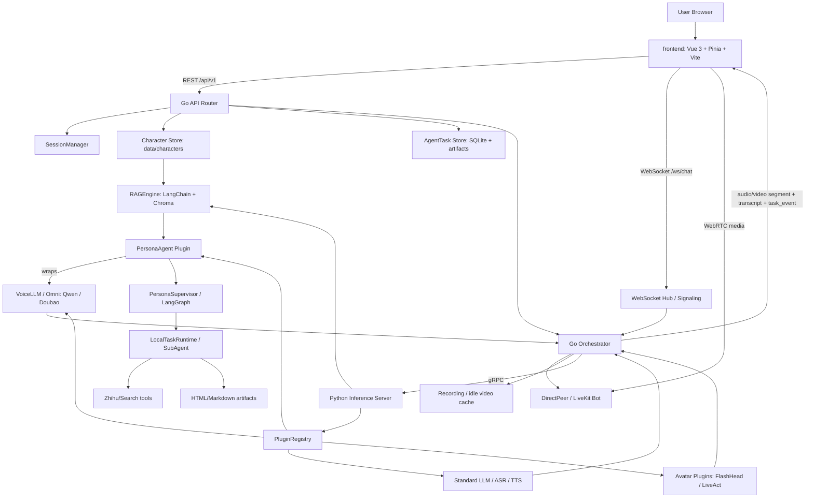

# CyberVerse

> 一句话定位：CyberVerse 是一个开源实时数字人 Agent framework，用 Go 编排 WebRTC / 会话 / 媒体与任务投影，用 Python gRPC 推理层承载 ASR、TTS、Omni、RAG、PersonaAgent、FlashHead / LiveAct 以及云端数字人 provider，用 Vue 前端提供角色、会话、设置、知识库和任务 UI；它更像“可自托管的 voice-first digital-human 平台雏形”，不是通用 workflow 平台，也不是单纯 avatar demo。

## 基本信息

| 项目 | 值 |
|------|----|
| 仓库 | `Lynpoint/CyberVerse`（legacy slug：`dsd2077/CyberVerse`） |
| URL | `https://github.com/Lynpoint/CyberVerse` |
| Star | 1,382（2026-07-08 GitHub API 快照） |
| Fork | 189（2026-07-08 GitHub API 快照） |
| Watchers | 9 subscribers / 1,382 watchers_count（2026-07-08） |
| 许可证 | GPL-3.0 |
| 主要语言 | Python（GitHub API）；实际是 Python + Go + Vue/TypeScript |
| GitHub 创建时间 | 2026-04-18 |
| canonical repo 信号 | GitHub repo API 已将旧 slug `dsd2077/CyberVerse` 解析到 `Lynpoint/CyberVerse`，说明项目发生了 org/branding 迁移 |
| 最近提交 | 2026-07-06 / `733cbd5` / `Update README files to reflect changes in digital human framework and interaction features` |
| 最新 Release | `v0.1.0`（GitHub latest release，2026-05-16 发布） |
| 贡献者 | GitHub contributors API 7（2026-07-08） |
| Issue / PR | repo API `open_issues_count=5` 含 PR；真实 open issue 4，open PR 1（2026-07-08） |
| 仓库体量 | 519 tracked files；Python 57,603 行、Go 37,291 行、Vue 11,526 行、TS 6,228 行、Proto 312 行（不含 Markdown） |
| 测试面 | 73 test-like files；其中 Go `*_test.go` 40 个、Python `tests/` 31 个；frontend 未见独立测试文件 |
| CI | `.github/workflows/` 仍为空 |
| 项目分类 | Realtime Voice/Video Agent Platform / Digital Human Agent Platform |
| 分析日期 | 2026-07-08 |

---

## 场景一：是否值得采用

### 解决的问题

CyberVerse 解决的是“我想搭一个能听、能说、能看，必要时还能以数字人形象实时视频通话的 AI Agent”的问题。它把原本需要多套系统拼接的链路收在一个仓库里：

- 前端角色/会话/设置/知识库 UI。
- Go API server：HTTP API、WebSocket signaling、WebRTC direct peer / LiveKit SFU、TURN、会话状态、角色存储、任务投影、录制。
- Python inference server：gRPC 服务 + 插件注册，承载 LLM、TTS、ASR、VoiceLLM/Omni、RAG、Avatar。
- PersonaAgent：在实时语音前台保持低延迟交互，把搜索/调研/报告类长任务转成后台 SubAgent task。
- Avatar backends：FlashHead 与 LiveAct，支持从单张参考图驱动实时/准实时说话视频。

类比法：它像“LiveKit Agents / TEN Framework 的实时语音 Agent 能力 + OpenAvatarChat / FlashHead / LiveAct 的数字人视频能力 + 一个轻量角色管理 Web UI”的组合，但当前项目更偏快速集成与可运行产品雏形，而不是成熟 SDK / 企业平台。

### 核心能力与边界

**能做什么：**

- 实时数字人视频交互：README 现已把“one photo → digital human”放到产品主叙事，支持本地 FlashHead / LiveAct，也支持 Baidu Xiling、Xunfei Digital Human 等云端数字人 provider。
- 实时语音 Agent：Qwen Omni、Doubao、OpenAI Realtime、Gemini、Grok 等 omni/provider 定义已经进入 `infra/config/omni_models/`；PersonaAgent 在前台保持低延迟对话。
- WebRTC 音视频：direct P2P 模式内置 TURN，也支持 LiveKit SFU 模式。
- 视觉输入：标准模式和支持的 omni session 可以接收摄像头/屏幕帧。
- 角色系统：角色 CRUD、头像图、多图随机/固定、voice type、personality/system prompt/welcome message。
- 角色记忆与知识库：会话历史落盘；知识文件上传、索引、Chroma 检索；PersonaAgent 可通过 `retrieve_character_knowledge` hidden tool 检索素材。
- 前台 PersonaAgent + 后台 SubAgent：前台语音不被长任务阻塞，任务事件和 artifact 推到聊天 UI。
- 可插拔推理栈：YAML `plugin_class` 动态导入插件；`InferenceServer` 对 LLM/TTS/ASR/omni/persona/voice_llm 全量初始化，对 avatar 只初始化默认项以节约 GPU。
- Provider 扩展面比旧版更宽：除 OpenAI/Qwen/Doubao 外，README 与 `infra/config/*_models/` 已纳入 LiteLLM、Gemini、Grok、Baidu/Xunfei 等配置入口。
- 部署形态：本地三进程开发（inference/server/frontend）、Docker Compose、AutoDL cloud image。
- 纯语音模式：`infra/config/cyberverse.yaml` 仍支持 `inference.avatar.enabled=false`，先跑 voice-only 再接视频链路。

**不能或不应高估的部分：**

- 不是成熟 SaaS / 企业多租户平台。权限、租户、审计、细粒度文档/角色 ACL 不是主线。
- 不是安全默认值收紧的产品。示例配置 `server.host=0.0.0.0`、`cors_origins=["*"]`，且 internal task API 只有在显式设置 `AGENT_INTERNAL_TOKEN` 时才鉴权；默认是 fail-open。
- 不是通用 agent workflow engine。后台任务仍主要围绕 PersonaAgent 的 research / report /知识检索场景，而不是通用 DAG 平台。
- 不是低成本一键部署产品。纯语音可相对轻量，但数字人视频需要 CUDA 12.8、PyTorch 2.8、模型权重、FFmpeg/libvpx、GPU，并且 LiveAct 仍是重模型路径。
- 不是完全 vendor-neutral。虽然 provider 矩阵扩大了，但 realtime/omni/persona 主路径仍围绕 Qwen / Doubao / OpenAI compatible 能力设计。
- 不是轻量代码库。仓库已扩到 519 tracked files，FlashHead/LiveAct 与云端 avatar/provider 的组合让维护面明显变大。
- 工程成熟度仍在早期。项目创建未满 3 个月，仍无 CI workflow；issue 主要集中在 GPU、分辨率、闪屏、部署和 provider 适配。

### 集成成本

- **最快可跑路径**：按 README，`make setup`、`make inference`、`make server`、`make frontend`；若只跑纯语音，把 `inference.avatar.enabled=false`。
- **基础依赖**：README 写 Node 18+、Go 1.25、Conda、Python 3.10+、FFmpeg、`libopus-dev` / `libopusfile-dev` / `libsoxr-dev`、pkg-config；但 `.nvmrc` 固定 Node 22，Makefile 也优先找 Node 22+。
- **Python 依赖**：base 很轻，但 `[all]` 会拉入 grpc、LangChain/Chroma、OpenAI、websockets、Whisper、LiteLLM、FlashHead、LiveAct、xformers、NCCL 等重依赖。
- **Go 依赖**：Pion WebRTC、LiveKit SDK/media-sdk、gRPC、modernc SQLite；构建 orchestrator/api 需要系统 `opus`、`opusfile`、`soxr` 的 pkg-config 包或 conda lib path。
- **GPU 部署**：README benchmark 已升级到 RTX 5090 / RTX PRO 6000 口径；FlashHead 1.3B 与 LiveAct 18B 都被写成可实时，但硬件门槛依然高。
- **从零到 demo 时间**：纯语音在依赖齐全和 API key 可用时可按小时级跑通；数字人视频更接近半天到数天，取决于 CUDA/模型权重/驱动/FFmpeg/网络。
- **二开学习曲线**：高。要同时理解 Vue UI、Go HTTP/WebRTC/session/orchestrator、Python gRPC/plugin/runtime、LLM/ASR/TTS/Avatar provider、RAG、SubAgent task runtime 与云端 avatar provider。

### 依赖 / SDK 选型证据

> 全量 direct dependencies 由 `tk catalog build` 从本地源码 manifest 写入 catalog；本表只解释影响 build-vs-buy 的关键库 / SDK。

| Dependency | Type | Used for | Problem solved | Evidence | Reuse signal | Caution |
|------------|------|----------|----------------|----------|--------------|---------|
| Pion WebRTC / ICE / TURN | Go SDK | Direct WebRTC、ICE、TURN、媒体收发 | 自建实时音视频链路，不依赖单一云 RTC | `server` 依赖 + `server/internal/direct/*` + `session/orchestrator` | 高：做 voice/video agent 时很值得复用这套抽象 | NAT / ICE / TURN / 公网 IP 是高频故障源 |
| LiveKit SDK / media-sdk | Go SDK | SFU 模式、token、房间与媒体桥接 | 为复杂网络/多人场景提供替代 direct P2P 的媒体平面 | `Makefile` 使用 `-tags livekit`；`server/internal/livekit/*` | 高：适合把 direct / SFU 做成双后端 | 仍引入 `opus/soxr` 系统依赖和部署复杂度 |
| grpcio / protobuf | Python + Go RPC | Go orchestrator ↔ Python inference service | 把媒体/会话控制面与模型生态分层 | `proto/*`、`inference/server.py`、`server/internal/inference/*` | 很高：这是本项目最核心的语言边界设计 | 生成代码、版本同步和 message size 都要治理 |
| LangChain + Chroma | Python libs | 角色级文档导入、切块、embedding、检索 | 为每个 character 提供本地 RAG 和记忆素材库 | `pyproject.toml` `rag` extra；`inference/rag/engine.py` | 中高：角色知识库场景可直接借鉴 | 生产规模、并发索引和 embedding 成本仍需验证 |
| LiteLLM | Python SDK / adapter | 统一接入 100+ LLM providers | 减少 provider-specific glue code，扩大模型选择面 | `pyproject.toml` `litellm` extra；`infra/config/llm_models/litellm.yaml`；README 明写 LiteLLM | 高：多 provider 平台很适合先用统一 adapter | 统一接口不等于统一 realtime / tool-call 能力 |
| diffusers / transformers / xformers / NCCL | Python ML stack | FlashHead / LiveAct 数字人视频推理 | 把实时 speaking avatar 放进同一平台 | `pyproject.toml` `flash_head` / `live_act` extras | 中：适合想做本地数字人视频的人 | 依赖重、GPU 硬件门槛高、上游模型/license 需逐项核实 |
| OpenAI SDK + websockets + provider model YAMLs | Python SDK + config pattern | Omni / realtime / TTS / ASR providers | 用统一配置发现多个 provider，而非把 provider 写死在业务代码里 | `infra/config/*_models/`、`inference/server.py`、`persona_agent.py` | 高：provider registry 设计值得学 | 真正可替换性仍受不同 provider 实时协议差异限制 |

### 风险评估

| 风险项 | 评估 | 说明 |
|--------|------|------|
| 许可证合规 | 中-高 | 仓库 GPL-3.0；直接商业闭源二开要谨慎。README 明写 FlashHead / LiveAct / Baidu Xiling / Xunfei 等外部能力，云端服务条款与上游模型/权重许可需逐项核实。 |
| Bus factor | 中-高 | GitHub contributors API 口径 7，但项目仍明显由核心作者驱动；仓库迁移到 `Lynpoint` 后仍需观察团队化维护是否稳定。 |
| 供应商锁定 | 中 | provider 面比 5 月更宽，但 realtime/persona 主链路仍围绕 Qwen / Doubao / OpenAI-compatible 能力；切换并非零成本。 |
| 部署复杂度 | 高 | WebRTC/TURN/LiveKit + gRPC + GPU avatar + FFmpeg + 多模型 key + 云端数字人 provider，组合故障面大。 |
| 维护趋势 | 活跃但早期 | 2026-04-18 创建，最新提交到 2026-07-06；主干持续活跃，但 latest release 仍停在 `v0.1.0`。 |
| 安全攻击面 | 高 | 示例配置 `0.0.0.0` + `cors_origins=["*"]`；文件上传/RAG、WebSocket、WebRTC、TURN、内部 task/artifact API、外部搜索/云端 avatar/provider 都在攻击面上；`AGENT_INTERNAL_TOKEN` 未设置时 internal endpoints 默认放行。 |
| 运行稳定性 | 中 | 当前 open issue 仍集中在 LiveAct 分辨率/H800 运行/说话起止闪屏等真实运行问题。 |
| CI/CD | 高风险 | 仓库仍无 `.github/workflows`；只有本地 `make test` / build 约定。对跨 Python/Go/Vue/GPU 项目来说，这是明显短板。 |
| 文档漂移 | 中 | README 已重写为 digital-human 框架叙事，但 clone 命令、badge、DeepWiki 链接仍引用旧 slug `dsd2077/CyberVerse`；Node 18 vs Node 22、Doubao 新旧 auth 与 Docker/env 口径也有漂移。 |

### 结论

**观望；推荐做 PoC / 架构学习，不建议直接作为生产底座。**

更具体地说：

- 如果你要做“实时语音 + 数字人视频 + 角色人格/记忆”的原型，CyberVerse 比 5 月版本更值得试：repo 已从单纯本地 FlashHead/LiveAct 扩到云端数字人、LiteLLM、多 provider omni 配置和更完整的 digital-human 叙事。
- 如果你只要稳定语音 Agent SDK，优先看 LiveKit Agents / TEN Framework 这类更成熟的实时语音框架。
- 如果你只要数字人口型/视频生成，优先直接评估 FlashHead / LiveAct / OpenAvatarChat 等更聚焦的项目。
- 如果你要企业生产部署，建议先做隔离 PoC：先跑纯语音 profile，再收紧 `cors_origins`、显式设置 `AGENT_INTERNAL_TOKEN`、固定 Node/DOUBAO env 口径、补 CI 和回归，再考虑上线。

---

## 场景二：技术架构学习

### 核心架构图



### 关键设计决策与 trade-off

| 决策 | 选择 | 获得 | 代价 |
|------|------|------|------|
| 多进程分层 | Go server + Python inference + Vue frontend | Go 管 HTTP/WebRTC/状态，Python 管模型生态，前端独立迭代 | 本地开发至少三进程；gRPC/proto/配置同步成本高 |
| 实时媒体主控 | Go Orchestrator 统一管理 session、WebRTC、avatar、recording | 状态集中，打断/恢复/录制/回放可以统一处理 | `orchestrator.go` 超大，接近 4k 行，维护压力高 |
| 推理扩展 | YAML `plugin_class` 动态导入插件 | 新 provider/backends 可配置接入，无硬编码 import | 类型边界靠运行时，错误多在启动时暴露 |
| Avatar 默认只初始化一个 | LLM/ASR/TTS/omni 全初始化，Avatar default-only | 避免一次性加载多个 GPU 大模型 | 切换 avatar backend 需要重启/重配，不是热切换 |
| Voice-first PersonaAgent | `persona` 不是模型，而是包一层 Qwen/Doubao omni provider | 前台实时语音和后台任务可以统一在 VoiceLLM stream 内处理 | 强依赖 provider 的 native tool call 质量；调试复杂 |
| 后台任务 | PersonaAgent 本地 Supervisor/SubAgent Runtime + Go TaskService 投影 | 语音 ACK 快，长任务异步，UI 可恢复 task events | Python runtime 当前内存态，Go 侧需要“投影/补写”，一致性复杂 |
| RAG | 每角色本地 Chroma collection + LangChain loader/splitter | 角色知识库天然本地隔离，适合数字人资料 | 重知识库规模、并发索引、embedding provider 切换仍需验证 |
| WebRTC 部署 | Direct P2P + embedded TURN，另支持 LiveKit SFU | 本地/远程/复杂 NAT 场景都能覆盖 | ICE/public IP/TURN/security group 是主要部署痛点 |
| 视频同步 | Go 侧 voice AV sync buffer + segment flush + turn seq | 能处理打断、延迟、录制和音画同步 | 实现复杂度很高，测试必须跟上 |

### 值得学习的模式

1. **实时链路分层：Go 控媒体，Python 控模型**
   - Go 负责 WebRTC、TURN、LiveKit、session state、录制和 API；Python 负责 LLM/ASR/TTS/Avatar/RAG。
   - 对“AI + 实时媒体”项目很实用：媒体侧对稳定性、并发、网络更敏感；模型侧对 Python 生态依赖更重。

2. **`plugin_class` 配置驱动的能力注册**
   - `InferenceServer._register_plugins()` 从 YAML 读取 dotted path，`PluginRegistry` 动态导入并初始化。
   - 适合做可插拔模型后端：ASR/TTS/LLM/Omni/Avatar 都能用同一套 lifecycle。

3. **Avatar heavy backend default-only 初始化**
   - 代码明确区分轻量 provider 全初始化与 avatar 只加载默认后端，避免多 GPU 大模型同启。
   - 这是多模型平台常见的资源治理模式。

4. **VoiceLLM 输入统一抽象**
   - 文档与代码把 audio/text/image/tool_result/response_instructions 都收成统一事件流，Go/Python/gRPC/Omni 插件可复用一条路径。
   - 对实时多模态 Agent 特别关键，避免“语音一条链、文本一条链、图像一条链”导致人格和上下文割裂。

5. **turn_seq / pipeline_seq 抗并发陈旧输出**
   - Session 中 `PipelineSeq`、`TurnSeq`、`IsCurrentPipeline()`、`IsCurrentTurn()` 防止旧 goroutine 或被打断回复污染新 turn。
   - 这是 realtime agent 必学点：只靠 cancel context 不够，输出侧还要有 epoch/sequence guard。

6. **PersonaAgent 的“前台 ACK + 后台任务”模式**
   - 用户发长任务请求时，模型先说一句短确认；任务后台跑，事件和 artifact 继续推 UI；完成后再注入结果让数字人总结。
   - 非常适合语音产品：不要让用户在实时对话里等 30 秒无反馈。

7. **角色级 RAG 与历史注入**
   - 每个 character 有自己的目录、会话历史、knowledge/chroma；启动语音会话时 hydrate 最近 dialog context，PersonaAgent 回答前可检索角色素材。
   - 对“人格/陪伴/数字复刻”类产品比普通全局知识库更合适。

### 反模式 / 踩坑点

- **Orchestrator 过大**：`server/internal/orchestrator/orchestrator.go` 约 4k 行，混合 WebRTC signaling、RAG、avatar idle cache、voice pipeline、recording、task projection、prompt 构造。短期快，长期需要拆分为 session pipeline / media / avatar / task / prompt 子模块。
- **无 CI workflow**：跨 Python/Go/Vue/GPU 的项目只靠本地 pre-commit `make test` 不够，社区贡献和回归稳定性会受影响。
- **文档和配置口径漂移**：README 写 Node 18+，`.nvmrc` 与 Makefile 要 Node 22；`.env.example` 用 `DOUBAO_ACCESS_TOKEN`，Docker Compose 对 inference 却要求 `DOUBAO_API_KEY`；`docs/README.md` 有作者本机绝对路径。
- **Docker Compose 可能不是当前主路径**：Compose 里的 env/key 命名与 README/配置不完全一致，且 GPU / model weights / LiveKit / Redis / nginx 一起上，对新用户不如本地三进程路径可控。
- **内部 API 暴露面需要收紧**：`/api/v1/internal/tasks/...`、knowledge search、artifact 等对生产部署应加内部 token / network policy；当前代码更像本地自托管信任边界。
- **模型 vendor 与协议耦合**：PersonaAgent prompt 和 tool call 主要按 Qwen realtime 能力设计；切到其他 omni provider 可能不只是换 adapter。
- **vendored model code 升级成本**：FlashHead / LiveAct 模型实现被纳入仓库，能快速集成，但上游更新、许可证核对、安全扫描、包体治理都会变重。

### 可借鉴的具体技术点

- `server/internal/orchestrator/session.go` 的 pipeline/turn sequence guard，可迁移到任何 streaming agent。
- `inference/server.py` 的轻/重 plugin 初始化策略：轻量 provider eager init，GPU avatar default-only。
- `inference/plugins/voice_llm/persona_agent.py` 的 hidden tools + deferred response + task event merge 思路。
- `inference/rag/engine.py` 的角色目录内 Chroma persist 与 hash embedding fallback，用于离线测试很实用。
- `server/internal/api/router.go` 的 API 面分层：sessions、tasks、characters、knowledge、settings、launch config 都是实时 agent 产品常见实体。
- `frontend/src/composables/useChat.ts` 的 task timeline/artifact UI 状态模型：把 task event 从普通消息里独立建模。

---

## 架构解剖

### 目录结构

```text
CyberVerse/
├── frontend/                 # Vue 3 + TypeScript + Vite Web UI；角色、会话、设置、任务、知识库
│   └── src/
│       ├── services/api.ts   # REST API client
│       ├── composables/      # useChat、WebSocket/WebRTC/任务事件状态
│       ├── pages/            # 页面层：Session、Character、Settings、LaunchConfig 等
│       └── stores/           # Pinia stores
├── server/                   # Go API server + WebRTC/media/session/task/character core
│   ├── cmd/cyberverse-server/main.go
│   └── internal/
│       ├── api/              # HTTP routes/handlers：sessions、characters、knowledge、settings、tasks
│       ├── orchestrator/     # 核心实时编排：pipeline、turn、avatar、recording、RAG、task event
│       ├── direct/           # Direct WebRTC peer + embedded TURN
│       ├── livekit/          # LiveKit room/bot/token
│       ├── inference/        # Go gRPC client interfaces
│       ├── character/        # 角色文件存储、头像、会话历史
│       ├── agenttask/        # SQLite task/event/artifact store
│       ├── rag/              # Go side source records/store
│       ├── recording/        # per-turn MP4/WAV/transcript
│       └── ws/               # WebSocket hub/signaling
├── inference/                # Python gRPC inference server + plugins
│   ├── server.py             # 注册 gRPC services、插件发现/初始化
│   ├── core/                 # config、types、PluginRegistry
│   ├── services/             # Avatar/LLM/RAG/TTS/ASR/VoiceLLM gRPC services
│   ├── plugins/              # asr/tts/llm/voice_llm/avatar/persona plugins
│   └── rag/engine.py         # LangChain + Chroma per-character RAG
├── models/                   # vendored/wrapped FlashHead 与 SoulX-LiveAct model code
├── proto/                    # asr/avatar/common/llm/rag/tts/voice_llm protobuf
├── infra/                    # Dockerfiles、docker-compose、nginx、example config/env
├── docs/zh-CN/               # feature / operations docs
├── tests/                    # Python unit + GPU integration tests
└── scripts/                  # proto generation、connectivity、startup helpers
```

### 技术栈

- **Frontend**：Vue 3.5、TypeScript 5.9、Vite 8、Pinia、Vue Router、vue-i18n、Tailwind 4、LiveKit client。
- **Backend / Core**：Go 1.25、net/http ServeMux、Pion WebRTC/ICE/TURN、LiveKit SDK/media-sdk、gRPC/protobuf、modernc SQLite、gorilla/websocket。
- **Inference**：Python 3.10+、grpcio、pydantic、PyYAML、OpenAI SDK、websockets、LangChain/LangGraph/Chroma、Whisper、PyTorch/diffusers/transformers/xformers。
- **Avatar**：FlashHead 1.3B、SoulX-LiveAct 18B、wav2vec2、FFmpeg/libvpx、CUDA 12.8。
- **Build / Dev**：Makefile、npm、pip editable install、proto generation shell script、Docker Compose。
- **Testing**：pytest/pytest-asyncio、Go `go test`、少量 integration test（FlashHead real video，需 GPU/weights）。
- **CI/CD**：未发现 `.github/workflows`；只有 `.githooks/pre-commit` 执行 `make test`。

### 模块依赖关系

1. **Frontend → Go API/WS/WebRTC**
   - `frontend/src/services/api.ts` 调 `/api/v1/*`。
   - `useChat.ts` 管 WebSocket 消息、task event、artifact、turn_seq、防重、fallback HTTP。
   - Direct mode 走 WebRTC signaling；LiveKit mode 走 token/room。

2. **Go API → Orchestrator / Stores**
   - `api.NewRouter()` 注册 sessions、characters、knowledge、settings、tasks、internal callbacks。
   - `handleCreateSession()` 创建 session、hydrate dialog context、触发 idle video cache、返回 visual input config。
   - Character store 存角色、图片、会话历史、knowledge source 元信息。
   - AgentTask store 用 SQLite 保存 task/event/artifact 投影。

3. **Orchestrator → Python inference**
   - Go 侧 `InferenceService` 通过 gRPC 调 LLM/TTS/ASR/VoiceLLM/Avatar/RAG。
   - Standard mode：LLM → sentence detection → TTS → Avatar。
   - Omni/persona mode：VoiceLLM stream → assistant audio/transcript → Avatar video。
   - Avatar 可关闭，纯语音时只发布 audio stream。

4. **Python inference → Plugins**
   - `InferenceServer` 根据 `cyberverse_config.yaml` 注册 `plugin_class`。
   - LLM/TTS/ASR/Omni/Persona/VoiceLLM lightweight plugins 可多实例初始化。
   - Avatar plugin default-only 初始化，避免加载多个 GPU 大模型。

5. **PersonaAgent → SubAgent/RAG**
   - PersonaAgent 包装 Qwen/Doubao omni provider，注入 hidden tools。
   - `retrieve_character_knowledge` 走 RAGEngine 检索角色 Chroma。
   - `create_task` 走 PersonaSupervisor / LocalTaskRuntime，任务事件再被 Go 侧投影到 SQLite/UI。

### 扩展机制

- **推理插件**：配置文件中的 dotted path，例如 `inference.plugins.avatar.flash_head_plugin.FlashHeadAvatarPlugin`。
- **Provider 默认选择**：`inference.llm.default`、`inference.tts.default`、`inference.asr.default`、`inference.omni.default`、`inference.avatar.default`。
- **Persona wrapper**：`inference.persona.persona.model_provider` 指向底层 omni provider。
- **RAG 参数**：`pipeline.rag.top_k/min_score/max_context_chars/chunk_chars/chunk_overlap_chars`。
- **Avatar runtime**：`world_size`、`cuda_visible_devices`、`compile_model`、`compile_vae`、FlashHead/LiveAct root + infer_params。
- **WebRTC 模式**：`pipeline.streaming_mode=direct/livekit`，Direct 模式可配 TURN/ICE public IP。
- **前端 i18n**：项目规范要求 user-facing text 考虑中英双语；前端已接 `vue-i18n`。

---

## 质量与成熟度

### 代码质量

- **类型系统**：
  - Go 侧类型明确，session/task/config/API response 结构化，protobuf 边界清晰。
  - Python 使用 dataclass/type hints/Pydantic-ish 类型定义，但 plugin 动态导入与 LangChain runtime 仍是运行时错误居多。
  - Frontend TS 类型覆盖 API response、task state、chat message 等核心 UI 状态。

- **错误处理**：
  - Go 侧对 session max、invalid JSON、RAG unavailable、avatar warning、pipeline cancel、turn stale output 有较多保护。
  - Python inference 对 plugin import/init 失败记录 warning/exception，Avatar 初始化包含分布式环境校验。
  - 但部署配置漂移导致的错误（Node/DOUBAO env/系统 opus/soxr）仍主要靠用户排查。

- **代码风格一致性**：
  - 结构清楚，README/feature docs 与测试命名能看出作者有工程纪律。
  - 主要问题是 `orchestrator.go` 和 avatar plugin 文件过大，复杂度集中。
  - 模型代码 vendored 后会带来风格/质量混杂，GitNexus 索引也出现多个 scope extraction failed（不阻塞，但说明解析/代码规模复杂）。

### 测试

- **Python tests**：`tests/unit` 覆盖 config、registry、RAG engine、Qwen/Doubao/OpenAI/LiteLLM plugins、Whisper、PersonaAgent、gRPC services、FlashHead/LiveAct plugin、audio rechunker、avatar warmup 等，共 31 个 `tests/` 文件。
- **Go tests**：server 内有 40 个 `*_test.go`，覆盖 session、orchestrator prompt/visual/audio-only/voice recording/idle video、Baidu/Xunfei avatar、api handlers、knowledge、tasks、character store、livekit token/vp8、ws hub 等。
- **Integration**：`tests/integration/test_flash_head_generates_real_video.py` 仍需要 GPU、weights 和重依赖。
- **Frontend**：`frontend/package.json` 只有 `dev/build/preview` 脚本，当前未见独立前端测试文件。

### CI/CD

- **流水线配置**：仍未发现 `.github/workflows`。
- **本地 gate**：Makefile 提供 `test-py`、`test-go`、`test-integration`、`build-go`、`frontend-build`，但这还是开发约定，不是自动化 CI。
- **发布流程**：GitHub latest release 仍停在 `v0.1.0`；主干继续更新，但未见自动 release workflow。

结论：测试布局比 5 月更完整，特别是 Go server/orchestrator/api 面；但 CI 仍为空，对这种多语言 + WebRTC + GPU 项目来说仍是成熟度短板。

### 文档质量

- **README**：很完整，已经从“实时音视频数字人”升级为更明确的 digital-human framework 叙事，包含 cloud image、纯语音模式、角色记忆/RAG、LiteLLM、多 provider、云端 avatar、benchmark、远程访问/ICE notes。
- **多语言**：README 有英/中/日/韩版本；前端接 `vue-i18n`。
- **Feature / ops docs**：`docs/zh-CN/` 与 `docs/assets/` 仍能支撑产品叙事与部署说明。
- **问题**：
  - README badge、DeepWiki 链接和 clone 命令仍引用旧 slug `dsd2077/CyberVerse`，与 canonical repo `Lynpoint/CyberVerse` 漂移。
  - README 写 Node 18+，`.nvmrc` 与 Makefile 却都偏向 Node 22。
  - `infra/config/env` 同时保留 `DOUBAO_API_KEY` 与 `DOUBAO_ACCESS_TOKEN` 两套 auth 口径；Docker Compose 又强依赖 `DOUBAO_API_KEY`。

### Issue / PR 健康度

- **真实 open issues 4（2026-07-08）**：
  - #26 `有点疑惑 liveact 官方双卡H100是怎么跑到 416*720 分辨率的`
  - #25 `H800 运行错误`
  - #24 `开始说话和结束的时候屏幕总是会闪一下`
  - #20 `Feature Request: 集成 FunASR 语音识别`
- **Open PR 1**：#16 `feat(memory): add Hindsight conversation memory`。
- **Closed / recent activity**：近期 closed issues 里有 SenseVoice/FunASR 相关请求和集成反馈，说明作者仍在持续推进 provider / ASR 面。
- **响应节奏**：项目仍活跃，但 issue 样本量不大，且主要是运行/硬件/集成问题，不足以说明“生产稳定”。
- **社区质量**：安装和运行门槛依旧高；不过问题已从 5 月的“能不能跑起来”扩展到“更高分辨率、更快 ASR、更多 provider”，说明用户开始进入第二层需求。

---

## 社区与生态

### 社区评价

CyberVerse 现在已经不是“刚冒出来的酷 demo”，而是一个热度继续上升、叙事更完整、但仍明显处于早期的平台：

- **正面信号**：从 2026-05-20 的 626 stars 增长到 2026-07-08 的 1,382 stars；README 重写为更清晰的 digital-human framework 叙事；provider/云端 avatar 面明显扩展。
- **真实痛点**：GPU/分辨率/闪屏/H800/LiveAct 仍是高频问题，说明真正的瓶颈不在“有没有功能”，而在“复杂媒体+模型链路能否稳定跑”。
- **热度 vs adoption**：热度很强，尤其是“one photo”与数字人陪伴想象力；但真正的生产采用证据仍不足，PoC/研究信号远强于企业落地信号。
- **治理信号**：仓库 canonical 身份已迁移到 `Lynpoint/CyberVerse`，但文档和 badge 还没完全收口，说明项目仍在快速演化与品牌迁移过程中。

### 衍生项目 / 插件生态

- 目前未看到成熟的第三方 plugin marketplace，但插件/模型定义面已经显著扩大。
- 它依赖/整合的生态很强：Qwen/DashScope、Doubao/Volcengine、OpenAI、Gemini、Grok、LiteLLM、LangChain/Chroma、LiveKit/Pion、FlashHead/LiveAct、Baidu Xiling、Xunfei、Whisper。
- 插件机制在代码中已经具备，但对第三方开发者而言，还缺正式的“如何写一个新 ASR/TTS/Avatar/Omni plugin”开发文档与 contract test 模板。

### 竞品对比

按项目真实边界拆三层：

#### 直接竞品：实时语音/视频 Agent 平台

| 项目 | 定位 | 关键差异 |
|------|------|----------|
| TEN Framework | Conversational voice AI agents framework；10k+ stars | 更偏框架/SDK，生态和工程化更成熟；不主打一键数字人视频。 |
| LiveKit Agents | Realtime voice/video agent framework；10k+ stars | WebRTC/实时媒体底座更成熟，适合生产 voice agent；数字人 avatar 需要另拼。 |
| OpenAvatarChat | 数字人对话/Avatar Chat；3k+ stars | 更偏 avatar chat demo/框架；CyberVerse 更强调 PersonaAgent、RAG、任务和角色管理。 |

#### 邻近替代：拆分组合方案

- **LiveKit Agents + 自选 ASR/TTS/LLM + Avatar service**：生产可控性更高，但要自己拼角色/记忆/UI/任务。
- **TEN Framework + FlashHead/LiveAct**：语音 agent 框架能力更强，avatar 需要集成。
- **OpenAvatarChat / MuseTalk / SadTalker / HeyGen 类产品**：更偏数字人演示/生成，不一定覆盖实时 Agent workflow。

#### 架构邻居 / 参照物

- **OpenHuman / OpenAgent**：学习 agent platform 如何管理 tools/memory/RAG/UI/任务，但它们不主打实时 WebRTC 数字人。
- **UI-TARS-desktop**：学习 multimodal/GUI agent runtime，不是直接竞品。
- **FlashHead / SoulX-LiveAct**：是 CyberVerse 的 avatar backend 上游，适合单独学习实时视频生成技术。

**结论**：

- 最强直接竞品：LiveKit Agents / TEN Framework（如果目标是稳定实时 voice agent 框架）。
- 最现实替代路径：LiveKit Agents + avatar backend 自己集成。
- 最值得借鉴的架构邻居：CyberVerse 自身的 Go/Python 分层 + turn sequence guard；avatar 模型则直接读 FlashHead/LiveAct。

---

## 关键代码走读

### 1. `InferenceServer`：配置驱动的插件注册与 gRPC 服务面

- 路径：`inference/server.py`
- 职责：加载 YAML、创建 `PluginRegistry`、注册 Avatar/LLM/RAG/TTS/ASR/VoiceLLM gRPC services、按类别初始化插件。
- 实现要点：
  - `_PLUGIN_CATEGORIES = ("avatar", "llm", "tts", "asr", "omni", "persona", "voice_llm")`。
  - `_register_plugins()` 遍历配置中的 `plugin_class`，动态导入并注册。
  - `_initialize_configured_plugins()` 对 LLM/TTS/ASR/omni/persona/voice_llm 初始化全部配置项，对 avatar 只初始化默认项。
  - `world_size/rank` 支持 torchrun 多进程；非 rank0 不绑定 gRPC，只作为分布式 worker。

### 2. `PluginRegistry`：最小插件生命周期

- 路径：`inference/core/registry.py`
- 职责：维护 plugin class 与 plugin instance，提供 register/initialize/get/shutdown。
- 实现要点：
  - `import_plugin_class()` 校验 dotted path 指向 `CyberVersePlugin` 子类。
  - `get_by_category()` 和 `get_all_by_category()` 通过 `category.name` 前缀查找插件。
  - 设计很轻，优点是可读；缺点是缺 plugin metadata/version/capability contract。

### 3. `PersonaAgentPlugin`：实时前台与后台任务的桥

- 路径：`inference/plugins/voice_llm/persona_agent.py`
- 职责：包装底层 omni provider，注入 hidden tools，处理 task/RAG，并把 task event 和模型输出合并进同一 VoiceLLM stream。
- 实现要点：
  - `PERSONA_TOOL_DEFINITIONS` 当前包含 `create_task`、`get_task_status`、`cancel_task`、`retrieve_character_knowledge`。
  - `initialize()` 根据 `model_provider` 再实例化真实 omni plugin，并初始化 `LocalTaskRuntime` + `PersonaSupervisor` + `RAGEngine`。
  - `converse_stream()` 把 user transcript、tool calls、RAG instructions、task events 和 assistant audio/transcript 合并成一个 VoiceLLM stream。
  - 设计重点不是“模型自己慢慢思考”，而是“前台先保持对话流畅，后台异步跑长任务，再把结果回投到当前角色会话”。

### 4. `QwenOmniRealtimePlugin`：多模态实时 provider adapter

- 路径：`inference/plugins/voice_llm/qwen_omni_realtime.py`
- 职责：连接 DashScope Qwen Omni realtime WebSocket，处理 session.update、audio/text/image/tool_result、deferred response、interrupt。
- 实现要点：
  - `converse_stream()` 同时起 sender/receiver task，通过 queue 输出 `VoiceLLMOutputEvent`。
  - 图片输入有 `_MAX_IMAGE_BYTES`，并且“audio append 后再 flush image”，避免 provider 端顺序错误。
  - `interrupt()` 发 `response.cancel` 和 `input_audio_buffer.clear`，支撑语音打断。
  - 这类 adapter 是项目能否多 provider 的关键，未来应为 Doubao/OpenAI realtime 等提供同等 contract tests。

### 5. `RAGEngine`：角色级本地知识库

- 路径：`inference/rag/engine.py`
- 职责：按 character_dir 管理 knowledge/chroma，加载 txt/md/json/pdf/docx，切块、embedding、检索。
- 实现要点：
  - `HashEmbeddings` 提供 deterministic fallback，方便测试/离线开发。
  - `OpenAIEmbeddings` 同时兼容 OpenAI 与 Qwen DashScope OpenAI-compatible endpoint。
  - `RAGSearchRequest` 有 top_k/max_context_chars/min_score，检索结果按字符预算裁剪。
  - per-character collection 名称经 `_safe_collection_name()` 处理，避免 Chroma 命名问题。

### 6. `Orchestrator` / `Session`：实时媒体编排与并发防护

- 路径：`server/internal/orchestrator/orchestrator.go`、`server/internal/orchestrator/session.go`
- 职责：创建 DirectPeer/LiveKit Bot、处理 signaling/visual frame/text input、启动 standard 或 omni pipeline、连接 Avatar、录制、保存会话、广播状态。
- 实现要点：
  - `SetupSession()` 在 direct mode 创建 `direct.NewDirectPeer()`，livekit mode 创建 Bot，并启动 AV pipeline。
  - `Session.MarkPipelineRunning()` / `MarkPipelineFinished(seq)` 避免旧 pipeline 收尾误伤新 pipeline。
  - `Session.MarkTurnStarted()` / `IsCurrentTurn()` 保护打断后的旧输出。
  - `runStandardPipeline()` 是 LLM→TTS→Avatar；voice pipeline 则处理 VoiceLLM output、avatar worker、AV sync、recording、stale turn。

### 7. `Router` 与 API surface：产品实体边界

- 路径：`server/internal/api/router.go`、`server/internal/api/tasks.go`
- 职责：定义产品 API 面和内部任务投影边界。
- 实现要点：
  - Sessions：创建/删除/消息/任务。
  - Characters：CRUD、voice test、avatar image、knowledge upload/reindex/delete、idle videos、conversation history。
  - Settings/LaunchConfig：从 UI 修改 API key、provider endpoint、avatar model 参数。
  - Cloud avatar / provider 端点已经进入路由层：Baidu Xiling figure、Xunfei avatar/stream。
  - `authorizeInternalTaskRequest()` 只有在设置 `AGENT_INTERNAL_TOKEN` 时才强制鉴权；否则 internal task endpoints 默认放行，这既是灵活性，也是生产 hardening 必修项。

---

## 评分

| 维度 | 评分(1-5) | 说明 |
|------|----------|------|
| 功能覆盖度 | 4.5 | 实时语音、WebRTC、角色、RAG、PersonaAgent、后台任务、FlashHead/LiveAct、Baidu/Xunfei 云端数字人都已进入同一产品面；但生产认证/多租户/插件生态/CI 未成熟。 |
| 代码质量 | 3.5 | 分层清楚、测试不少、关键并发 guard 和任务投影设计好；但 orchestrator/avatar/plugin/runtime 复杂度仍集中，安全默认值偏松。 |
| 文档质量 | 4.0 | README 与部署说明明显进化，benchmark/ICE notes/纯语音路径有价值；但 repo slug、Node 版本、Doubao auth 口径仍漂移。 |
| 社区活跃度 | 3.5 | stars 两个月内从 626 增至 1,382，主干仍活跃；但项目太新、贡献者仍集中，生产 adoption 证据不足。 |
| 架构设计 | 4.5 | Go/Python/Vue 分层、plugin registry、PersonaAgent 前后台分离、turn/pipeline seq、防 stale output、角色级 RAG 都值得学。 |
| 学习价值 | 5.0 | 对实时多模态 Agent、数字人链路、WebRTC + LLM + Avatar + task projection 编排非常有学习价值。 |
| 可借鉴度 | 4.0 | 语音任务分流、sequence guard、provider registry、task event UI、角色级知识库都可借鉴；完整采用成本仍高。 |

---

## 总结

### 一句话评价

CyberVerse 已经从“酷炫数字人 demo”进化成一个更完整的实时 digital-human Agent 平台雏形：最值得学的是 Go/Python 分层、PersonaAgent 前后台拆分和 turn/pipeline 并发防护，最需要谨慎的是安全默认值、部署复杂度、GPL/上游模型许可、CI 缺失与早期稳定性。

### 谁应该用

- 想做实时语音/视频数字人 Agent 原型的人。
- 想研究 WebRTC + LLM/Omni + Avatar + RAG + 任务系统如何组合的人。
- 有 GPU 资源，愿意折腾 FlashHead/LiveAct，或想比较本地 avatar 与云端数字人 provider 的人。
- 想找一个“数字人陪伴 / 角色复刻 / 语音助手”开源基座做 PoC 的个人或小团队。

### 谁不应该直接用

- 要马上上生产、要求稳定 SLA / 多租户 / 权限隔离 / 合规审计的团队。
- 只想要轻量 voice agent SDK 的人；LiveKit Agents / TEN Framework 可能更合适。
- 只想要头像生成模型的人；直接读 FlashHead / LiveAct 更聚焦。
- 不愿处理 CUDA、FFmpeg、WebRTC/ICE、模型权重、多 provider API key 和安全 hardening 的用户。

### 下一步

1. **做纯语音 profile PoC**：先 `inference.avatar.enabled=false` 跑通 Qwen/Doubao/OpenAI-compatible voice + WebRTC + session history，不碰 GPU avatar。
2. **先补安全默认值**：收紧 `cors_origins`，显式设置 `AGENT_INTERNAL_TOKEN`，不要直接把示例配置裸暴露到公网。
3. **单独压测 WebRTC/ICE**：本地、内网、公网、SSH tunnel、cloud security group 各跑一次，记录失败日志。
4. **再接 Avatar**：先 FlashHead Lite 或云端 avatar provider，确认音画同步、idle cache、打断恢复。
5. **补工程 gate**：CI 至少跑 Python config/registry/RAG tests、Go config/API no-livekit tests、frontend build、config lint。
6. **如果要二开**：优先拆 `orchestrator.go`，把 voice pipeline、avatar idle cache、task projection、prompt/RAG 分模块，避免复杂度继续集中。
