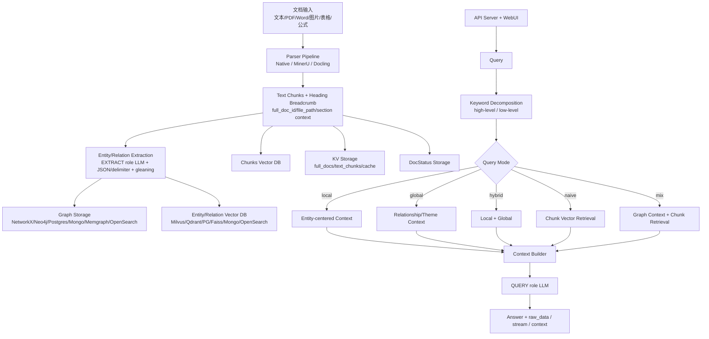

# LightRAG

> 一句话定位：轻量但工程化程度很高的 GraphRAG 框架，用四类可插拔存储、实体关系抽取、多模式图谱检索、向量混合和多模态文档 pipeline，把传统 chunk RAG 升级为适合复杂企业知识库的图谱增强检索内核。

## 基本信息

| 项目 | 值 |
|------|----|
| 仓库 | `HKUDS/LightRAG` |
| URL | `https://github.com/HKUDS/LightRAG` |
| Star | 36,397（2026-06-10 观测；GitHub API 后续触发 rate limit，采用本轮首次采集值） |
| Fork | 5,140（2026-06-10 观测） |
| GitHub 许可证元数据 | MIT |
| 主要语言 | Python + TypeScript/TSX |
| 首次提交 | 2024-10-07（`25df09a8`） |
| 最近提交 | 2026-06-10（`f7878016`，`chore(config): remove postgres vector setting`） |
| 最新 Release / Tag | 本地最新 tag `v1.5.1` |
| 贡献者数 | 约 304（`git shortlog -sn HEAD` 口径） |
| 代码规模 | pygount 口径约 639 文件 / 123,809 code LOC；Python 98,733、TSX 9,286、Bash 5,644、JSON 5,159 |
| GitNexus 索引 | 未单独跑完；RAGFlow 索引超时后，本轮改用本地源码直读 |
| 分析日期 | 2026-06-11 |

---

## 场景一：是否值得采用

### 解决的问题

LightRAG 解决的是传统 RAG 在复杂企业知识库里的三个核心缺陷：

1. chunk 之间关系丢失。
2. 跨文档、跨章节问题难以回答。
3. 增量更新和图谱化索引成本高。

README 将其定位为 “A Lightweight, Graph-Based RAG Framework”，面向法律、医疗、金融等复杂文档领域。它明确对标 Microsoft GraphRAG，但选择不依赖低效的 community reports 或复杂 multi-hop reasoning，而是用双层结构同时管理 knowledge graph 和 vector embeddings，以降低索引和查询成本。

从源码看，它已经不是早期论文 demo：有 API server、WebUI、Docker/K8s、多存储后端、文档 parser pipeline、workspace 隔离、pipeline 状态、测试体系和 Ollama-compatible API。

### 核心能力与边界

**能做什么：**

- 从文档中抽取实体、关系、chunk、标题上下文，并构建知识图谱。
- 支持 `local / global / hybrid / naive / mix` 五种查询模式。
- `local` 适合实体/事实精确问答，`global` 适合主题/关系/跨文档总结，`mix` 同时融合图谱和向量 chunk。
- 支持四类核心存储：KV、Graph、Vector、DocStatus。
- 支持 NetworkX、Neo4j、Postgres、Mongo、Memgraph、OpenSearch、Milvus、Qdrant、Faiss、Redis 等后端。
- 支持 MinerU、Docling、Native parser，多模态文档解析和图片/公式/表格上下文。
- 支持 REST API、stream query、`/query/data` 结构化检索数据、WebUI 图谱浏览、Ollama-compatible API。
- 支持 workspace 隔离、pipeline cancellation、LLM cache、角色化 LLM 配置。

**不能稳定保证什么：**

- 不能保证弱模型下的图谱质量。LightRAG 的实体/关系抽取依赖 EXTRACT 角色 LLM，README 也强调它比传统 RAG 对 LLM 能力要求更高。
- 不能替代完整企业知识库产品。它有 WebUI/API，但不是 RAGFlow/Dify 那类 dataset/product/workflow 平台。
- 不能天然解决企业权限治理。存储和 workspace 隔离强，但企业级用户/部门/文档 ACL、审计、SSO、数据生命周期仍需外接。
- 不能保证所有后端组合都被 CI 覆盖。存储矩阵很大，CI 主要是 offline tests。
- 不能把“轻量”理解成“简单”。核心文件 `lightrag/lightrag.py` 和 `lightrag/operate.py` 都很大，算法路径和配置面复杂。

**与竞品差异：**

- 相比 **RAGFlow**：LightRAG 更像图谱增强检索内核，存储后端更可插拔，GraphRAG 更原生；但企业产品化、UI 管理、权限/数据集/工作流完整度弱于 RAGFlow。
- 相比 **Microsoft GraphRAG**：LightRAG 更轻，更强调增量更新和低成本查询，不走重 community report 路线。
- 相比 **LlamaIndex / Haystack**：LightRAG 更聚焦 GraphRAG，不是通用 RAG/Agent pipeline 框架。
- 相比 **Mem0 / Graphiti**：LightRAG 更偏文档知识库图谱检索；Graphiti 更偏实时 temporal knowledge graph / Agent memory。

### 集成成本

- **个人/技术团队 PoC**：中。pip/Docker 可以试，但要配置 LLM、embedding、reranker、parser、存储。
- **企业私有化**：中到高。若只用默认 JSON/NetworkX/NanoVectorDB，简单；若要 Postgres/OpenSearch/Milvus/Qdrant/Neo4j/MinerU/Docling/VLM，全链路复杂度上升。
- **依赖链**：Python 主体 + FastAPI/Gunicorn + 多后端 client + parser 生态 + React/Vite/Bun WebUI。
- **部署复杂度**：比 RAGFlow 轻，但比普通 Python RAG library 重。仓库有 Docker Compose、Dockerfile lite/postgres、K8s deploy、offline deployment、多站点部署文档。
- **从零到 demo**：轻量文本 demo 可小时级；复杂 SOP + MinerU/Docling + 本地模型 + 企业后端通常需要数天调优。


### 依赖 / SDK 选型证据

> 全量 direct dependencies 由 `tk catalog build` 从本地源码 manifest 写入 catalog；本表只解释影响 build-vs-buy 的关键库 / SDK。

| Dependency | Type | Used for | Problem solved | Evidence | Reuse signal | Caution |
|------------|------|----------|----------------|----------|--------------|---------|
| _待补关键依赖_ | | | | | | |

### 风险评估

| 风险项 | 评估 | 说明 |
|--------|------|------|
| 许可证合规 | ✅ 低 | MIT，企业二开友好。 |
| Bus factor | ⚠️ 中 | 贡献者约 304，但 top contributor 占比高；项目仍年轻。 |
| 供应商锁定 | ✅ 低到中 | 存储后端高度可插拔，代码开源；但一旦依赖其图谱数据结构，迁移仍有成本。 |
| 维护趋势 | ✅ 活跃 | 2026-06-10 仍有提交，tag 到 v1.5.1。 |
| 安全历史 | ⚠️ 需专项审计 | 文件解析、API server、多后端凭据、WebUI、Ollama-compatible API 都需要生产安全审查。 |
| 抽取质量 | ⚠️ 中高 | 实体关系质量依赖 LLM/VLM；弱模型、中文专业术语、噪声文档会影响图谱。 |
| CI 覆盖 | ⚠️ 中 | 测试广，但 CI 主线偏 offline，不能代表所有后端/parser/provider 组合。 |
| 企业权限 | ⚠️ 中高 | workspace 隔离不等于企业 ACL，需要接入 IAM/SSO/文档权限过滤。 |

### 结论

**推荐采用为“图谱增强检索内核 / 企业复杂知识库 PoC”，不建议单独作为完整企业知识库产品。**

理由：LightRAG 的技术前沿性和可插拔性很强，尤其适合 SOP、法务、医疗、金融、投研、设备手册等结构复杂、术语稳定、跨章节关系多的知识库。但它不是完整企业知识库平台，生产采用必须外接权限、评测、观测、数据同步、知识库管理和运维体系。

---

## 场景二：技术架构学习

### 核心架构图



### 关键设计决策与 trade-off

| 决策 | 选择 | 放弃了什么 | 为什么 |
|------|------|-----------|--------|
| GraphRAG 路线 | 实体/关系抽取 + 图/向量双层检索 | 纯 chunk RAG 的简单性 | 解决跨章节、跨文档、关系型问题。 |
| 查询模式 | local/global/hybrid/naive/mix 显式模式 | 单一路由的低认知成本 | 不同问题需要不同上下文构造策略。 |
| 存储架构 | KV/Graph/Vector/DocStatus 四层可插拔 | 单数据库部署的简单性 | 企业已有基础设施差异很大。 |
| 抽取策略 | EXTRACT 角色 LLM + JSON/文本模式 + gleaning | 规则抽取的稳定低成本 | 非结构化文档关系复杂，需要 LLM 语义抽取。 |
| 文档上下文 | heading breadcrumb 注入抽取 prompt | prompt 更短 | SOP/规程类文档必须保留章节层级。 |
| API 能力 | `/query/data` 可返回结构化检索结果 | 只输出最终答案的简单性 | 企业调试、评测、可观测需要 raw retrieval data。 |
| 多模态 | MinerU/Docling/Native 多引擎 | 单 parser 的确定性 | 企业文档格式复杂，必须兼容多解析路径。 |

### 值得学习的模式

1. **retrieval mode 显式化**：不要把“该局部查还是全局查”全藏在 prompt 里，LightRAG 把 local/global/hybrid/naive/mix 做成结构化模式。
2. **四存储层解耦**：KV、Graph、Vector、DocStatus 分离，让企业按已有基础设施组合。
3. **heading breadcrumb 进入抽取**：SOP/制度/法律文档最怕丢章节语境，这个设计非常值得吸收。
4. **query data 与 answer 分离**：`aquery_data()` 和 `/query/data` 允许只拿检索上下文，对评测和调参非常重要。
5. **角色化 LLM**：extract/query/VLM/rerank 等角色分开配置，便于用不同模型平衡成本和质量。
6. **增量图谱更新优先**：相比重建式 GraphRAG，更适合动态企业知识库。

### 反模式 / 踩坑点

- **核心文件过大**：`lightrag/lightrag.py` 约 4k+ 行，`operate.py` 约 5.9k 行，后续维护和二开理解成本不低。
- **“light” 容易误导**：默认路径轻，但生产路径涉及 LLM、embedding、rerank、parser、graph/vector/docstatus 多后端。
- **抽取质量是系统上限**：实体关系抽错，GraphRAG 后面再精巧也会放大错误。
- **CI 不等于生产矩阵验证**：offline tests 广度不错，但无法证明所有存储和 parser 组合稳定。
- **产品层短板**：权限、租户、知识库运营、业务工作流、评测闭环都要外部补。

### 可借鉴的具体技术点

- 对 SOP：chunk 必须带 heading path、file path、section context、order index。
- 对企业复杂问答：把 query 分成 high-level/low-level keywords，再构建不同上下文。
- 对评测：把最终答案和 raw retrieval context 分离存档。
- 对多后端：定义 storage registry 和 required methods，而不是把存储写死。
- 对模型成本：把 extract/query/rerank/VLM 角色分离配置。

---

## 架构解剖

### 目录结构

```text
LightRAG/
├── lightrag/              # Python 核心库
│   ├── lightrag.py        # LightRAG dataclass 编排器，存储、pipeline、query 入口
│   ├── operate.py         # 实体/关系抽取、query context 构造、GraphRAG 查询主逻辑
│   ├── kg/                # KV/Graph/Vector/DocStatus 多后端存储实现
│   ├── api/               # FastAPI server、query/graph/document/ollama routes
│   ├── parser/            # Native / MinerU / Docling / DOCX 等解析 pipeline
│   └── *_mixin.py         # pipeline、role LLM、storage migration 等 mixin
├── lightrag_webui/        # React/Vite WebUI，图谱可视化
├── tests/                 # parser/pipeline/kg/api/llm/workspace 等测试
├── docs/                  # API server、部署、模型配置、文件处理 pipeline 等文档
├── examples/              # 使用示例
├── k8s-deploy/            # K8s 部署
├── docker-compose*.yml    # Docker Compose 部署
└── pyproject.toml         # Python 包与 API server entry points
```

### 技术栈

- **运行时 / 框架**：Python 3.10+、FastAPI、Gunicorn、React 19、Vite、Bun。
- **图谱存储**：NetworkX、Neo4j、Postgres、Mongo、Memgraph、OpenSearch。
- **向量存储**：NanoVectorDB、Milvus、Postgres、Faiss、Qdrant、Mongo、OpenSearch。
- **KV/DocStatus**：JSON、Redis、Postgres、Mongo、OpenSearch。
- **文档解析**：Native、MinerU、Docling、DOCX parser，多模态图片/表格/公式。
- **API**：REST query、stream query、query data、graph route、document route、Ollama-compatible API。
- **测试**：pytest；parser、pipeline、workspace、kg、api、llm 等测试。
- **CI/CD**：`.github/workflows/tests.yml` offline unit tests；Docker publish、PyPI publish、linting、stale 等 workflow。

### 模块依赖关系

```text
LightRAG dataclass
    ↓ 初始化
Storage registry: KV / Graph / Vector / DocStatus
    ↓ ingestion
Pipeline mixin -> parser routing -> chunks -> extract_entities()
    ↓
Graph storage + vector storage + KV/doc status
    ↓ query
get_keywords_from_query() -> _build_query_context()
    ↓
local/global/hybrid/naive/mix context
    ↓
QUERY role LLM -> answer/context/raw_data
    ↓
FastAPI / WebUI / Ollama API
```

### 扩展机制

- Storage registry：`lightrag/kg/__init__.py` 定义 storage type、implementation、required methods。
- Parser routing：`lightrag/parser/routing.py` 和 parser CLI 支持不同解析引擎。
- Query mode：`local/global/hybrid/naive/mix`。
- LLM role：extract/query/VLM/rerank 分开配置。
- API route：query、graph、document、Ollama compatibility。
- Workspace：通过 `WORKSPACE` 做数据隔离。

---

## 质量与成熟度

### 代码质量

- **类型系统**：Python dataclass + 类型标注较多，存储接口通过 registry 校验 required methods。
- **错误处理**：pipeline 有 cancellation、status、locks；存储 finalize 做逐项异常隔离。
- **代码风格一致性**：整体工程化强，但核心文件过大，长期维护需要继续拆分。

### 测试

- **测试框架**：pytest。
- **测试类型**：parser、pipeline、workspace isolation、kg storage、api、llm provider、setup、sidecar。
- **覆盖亮点**：DOCX golden tests、MinerU/Docling sidecar tests、workspace isolation tests、pipeline cancellation tests。
- **覆盖风险**：CI 主要 offline marker，真实数据库、外部 parser、模型 provider、WebUI 生产组合需手动验证。

### CI/CD

- `.github/workflows/tests.yml`：offline unit tests。
- 其他 workflow：Docker build/publish、PyPI publish、linting、stale。
- 风险：CI 使用 Python 3.14 矩阵，项目声明 `>=3.10`；快速演进下依赖兼容性需要盯。

### 文档质量

- README 很长且信息密集，清楚解释 LightRAG、query mode、parser、模型选择、rerank、并发配置。
- docs 包含 API server、Docker、offline deployment、multi-site deployment、role-specific LLM、file processing pipeline。
- 对企业权限/审计/评测闭环的产品级文档不足。

### Issue / PR 健康度

- GitHub API 初次采集成功但后续 rate limit，本报告未能可靠拆分 open issues / open PR。
- 本地提交和 tag 显示维护活跃，最新提交为分析当天。
- 项目从 2024-10 起快速增长，需警惕版本升级和 breaking change。

---

## 社区与生态

### 社区评价

LightRAG 的热度来自两个方向：

1. GraphRAG 被认为是普通向量 RAG 的升级方向。
2. 它比 Microsoft GraphRAG 更轻，更容易集成和增量更新。

从 stars、forks、贡献者、提交密度看，LightRAG 已经不是单篇论文 demo，而是快速产品化中的开源基础设施。

### 衍生项目 / 插件生态

- API Server / WebUI。
- Docker / K8s / offline deployment。
- 多存储后端生态：Neo4j、Postgres、Milvus、Qdrant、OpenSearch 等。
- MinerU / Docling / Native parser pipeline。
- Ollama-compatible API，便于接入本地模型生态。

### 竞品对比

- **RAGFlow**：企业产品化更完整；LightRAG 技术内核更前沿。
- **Microsoft GraphRAG**：理论/系统化强；LightRAG 更轻、更适合增量和工程吸收。
- **Graphiti**：实时 temporal graph / Agent memory；LightRAG 更偏文档知识库。
- **Haystack / LlamaIndex**：通用 RAG 框架；LightRAG 专注 GraphRAG。
- **Mem0**：Agent memory；LightRAG 是文档图谱检索。

---

## 关键代码走读

### 1. LightRAG 编排器

- 路径：`lightrag/lightrag.py`
- 关键位置：`class LightRAG(_RoleLLMMixin, _StorageMigrationMixin, _PipelineMixin)` 约 line 160。
- 职责：全局配置、存储后端、query 参数、pipeline、LLM roles、workspace 的主入口。
- 实现要点：
  - dataclass 字段定义了 `kv_storage`、`vector_storage`、`graph_storage`、`doc_status_storage`。
  - 默认本地轻量后端：JsonKV、NanoVectorDB、NetworkX、JsonDocStatus。
  - 企业可切换到 Redis/Postgres/Mongo/OpenSearch/Neo4j/Milvus/Qdrant 等。

### 2. 存储注册表

- 路径：`lightrag/kg/__init__.py`
- 职责：定义 KV/Graph/Vector/DocStatus 各自可用后端及 required methods。
- 实现要点：
  - Graph：NetworkX、Neo4j、PG、Mongo、Memgraph、OpenSearch。
  - Vector：Nano、Milvus、PGVector、Faiss、Qdrant、Mongo、OpenSearch。
  - KV/DocStatus：JSON、Redis、PG、Mongo、OpenSearch。
  - 这个 registry 是 LightRAG 企业可插拔性的关键。

### 3. 存储初始化与 workspace

- 路径：`lightrag/lightrag.py`
- 关键位置：约 line 1160-1193。
- 职责：设置默认 workspace，初始化 pipeline status，并逐个初始化所有 storage。
- 实现要点：
  - 注释说明逐个初始化以避免 deadlock。
  - 包含 full_docs、text_chunks、entities、relations、vectors、graph、llm_response_cache、doc_status 等存储。

### 4. 实体关系抽取

- 路径：`lightrag/operate.py`
- 关键位置：`extract_entities()` 约 line 3297。
- 职责：把 chunk 转成实体和关系。
- 实现要点：
  - 使用 EXTRACT role LLM。
  - 支持 JSON structured output 和传统 delimiter 模式。
  - 支持 gleaning 补抽取。
  - 会移除内部多模态标记，但保留存储内容以便 citation。
  - 会把 heading breadcrumb 作为 section context 注入 prompt。

### 5. GraphRAG 查询

- 路径：`lightrag/operate.py`
- 关键位置：`kg_query()` 约 line 3800。
- 职责：把自然语言 query 转为 high-level/low-level keywords，构建图谱/向量上下文，调用 QUERY role LLM。
- 实现要点：
  - `get_keywords_from_query()` 提取关键词。
  - `_build_query_context()` 根据 query mode 构造上下文。
  - 支持 `only_need_context` / `only_need_prompt`。
  - query cache 会把 query mode、top_k、token budgets、rerank、LLM identity 等纳入 hash。

### 6. API Query Routes

- 路径：`lightrag/api/routers/query_routes.py`
- 职责：对外提供 query、stream query、query data 等接口。
- 实现要点：
  - 不是只返回最终 answer，也能返回结构化检索数据。
  - 对企业调试、评测、可观测很重要。

### 7. Parser Pipeline

- 路径：`lightrag/parser/*`
- 职责：统一文档解析，支持 Native / MinerU / Docling。
- 实现要点：
  - README 建议生产配置启用 MinerU 和 VLM image analysis。
  - 测试目录下有 parser/docx、parser/external/mineru、parser/external/docling 多组测试。

---

## SOP / 标准操作手册问答专项评估

### 适合度：4.0/5

LightRAG 适合 SOP 问答，但适合点与 RAGFlow 不同。

RAGFlow 适合“把 SOP 文档做成产品化问答知识库”；LightRAG 适合“让 SOP 的章节、步骤、角色、异常、设备、部件、风险点形成图谱关系”。

### 最推荐场景

- 设备维护手册里的部件、故障、步骤、异常处理关系。
- 医疗/法务/金融制度中的实体、条款、条件、例外规则。
- 多份 SOP 之间的冲突、重复、依赖、前置条件。
- 问题不只是“第几步怎么做”，而是“为什么这样做 / 哪些条件会改变流程 / 哪些文档都提到这个风险”。

### 不建议单独承担的场景

- 只需要问“某流程第 3 步是什么”的简单制度问答。
- 权限治理、审批流、文档运营、知识库后台需要完整产品的场景。
- 弱模型本地化且对实体关系抽取质量要求高的场景。

### 与 RAGFlow 的 SOP 分工

```text
RAGFlow：SOP 产品层
- 上传、解析、chunk、问答、引用、UI、知识库管理

LightRAG：SOP 图谱增强层
- 实体关系、跨章节检索、异常路径、术语/角色/设备/风险关联
```

---

## 评分

| 维度 | 评分(1-5) | 说明 |
|------|----------|------|
| 功能覆盖度 | 4.0 | GraphRAG、API、WebUI、parser、部署完整；但不是完整企业知识库产品。 |
| 代码质量 | 4.0 | 工程化强、测试面广；核心文件偏大。 |
| 文档质量 | 4.5 | README 和 docs 对 query mode、部署、模型配置、parser 说明充分。 |
| 社区活跃度 | 4.5 | stars/forks/贡献者/提交活跃，项目年轻但增长快。 |
| 架构设计 | 4.5 | 四存储层、显式 query mode、Graph+Vector 双轨设计优秀。 |
| 学习价值 | 5.0 | 学 GraphRAG 工程化和企业复杂知识检索非常值得。 |
| 可借鉴度 | 4.5 | heading context、query data、storage registry、role LLM 都可迁移。 |

---

## 总结

### 一句话评价

LightRAG 是当前最值得研究的开源 GraphRAG 工程样本之一：它不提供最完整的企业知识库产品外壳，但提供了企业知识库下一代检索内核该怎么做的高价值参考。

### 谁应该用

- 有技术团队，想自研企业知识库检索内核的人。
- 需要跨文档、跨章节、实体关系理解的知识库场景。
- 法务、金融、医疗、投研、设备手册、复杂 SOP 场景。
- 想把普通 RAG 升级为 GraphRAG 的团队。

### 谁不应该直接用

- 只想部署一个现成知识库产品的业务团队。
- 只有简单 FAQ / 小规模文档问答的人。
- 没有能力调 LLM 抽取质量、parser、存储后端的团队。
- 把权限、审计、工作流、知识运营都期待由一个开源项目直接解决的企业。

### 下一步

建议与 RAGFlow 做同数据集对比：

1. 用一组真实 SOP 文档测试 `naive / local / global / mix` 模式。
2. 重点看：步骤顺序、异常路径、前置条件、跨文档术语、引用上下文。
3. 验证弱模型与强模型下实体关系图质量差异。
4. 如果用于企业生产，优先外接 IAM/SSO、评测系统、Langfuse/Phoenix、文档同步服务。
