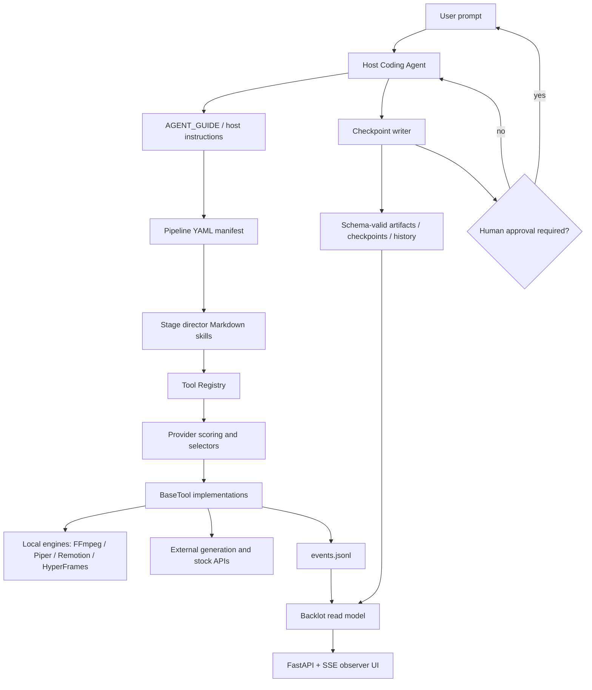

# OpenMontage 技术分析报告

> OpenMontage 是由宿主 Coding Agent 编排、以 manifest / skill / tool / artifact / checkpoint 驱动长链视频生产的仓库级 harness。  
> 分析对象：[calesthio/OpenMontage](https://github.com/calesthio/OpenMontage)  
> 分析基线：`f8d94632ea9bd0057da31904acca1cefecf005dd`  
> 分析日期：2026-07-15  
> 分析方式：源码、文档、Git 历史与 GitHub API 静态核验；未安装依赖、未执行构建、测试、服务或第三方 API 调用。

## 基本信息

OpenMontage 是一个由宿主 Coding Agent 充当编排器、以 manifest / skill / tool / artifact / checkpoint 驱动长链视频生产的仓库级 harness，而不是传统的一站式视频生成应用。

| 项目 | 信息 |
|---|---|
| 仓库 | `calesthio/OpenMontage` |
| 核心定位 | 由宿主 Coding Agent 编排的 AI 视频生产 harness / substrate |
| 主要语言 | Python；另有 React、TypeScript、Remotion、HTML/CSS/GSAP |
| 许可证 | AGPL-3.0；Remotion 另有独立商业许可证边界 |
| 创建时间 | 2026-03-29 |
| 最近提交 | 2026-07-12 |
| Stars / Forks / Watchers | 38,826 / 4,705 / 275 |
| Open Issues / Open PRs | 66 / 111（GitHub 仓库统计口径） |
| Closed Issues / Closed PRs | 40 / 116 |
| Tags / GitHub Releases | 0 / 0 |
| Git commit / 贡献者 | 291 commits；GitHub API 可见 28 位贡献者，主作者约占 72.2% |
| Python 规模 | 444 个 Python 文件，约 115,588 行；`tools/` 下静态识别 101 个 `BaseTool` 子类 |
| Pipeline | 13 个 manifest，其中 12 个用户生产 pipeline、1 个 framework smoke pipeline |
| 测试 | 62 个 `test_*.py` 模块；静态识别约 667 个测试函数 |

## 场景一：是否值得采用

### 解决的问题

OpenMontage 解决的不是“给用户一个网页，输入提示词后下载视频”，而是“如何让已经拥有终端和文件系统能力的 Coding Agent，按专业制片流程完成长链路视频生产”。

它把视频生产拆成四类可组合资产：

1. **Pipeline manifest**：YAML 声明阶段、产物、工具、质量门和人工审批。
2. **Agent skills**：Markdown 教宿主模型如何做研究、提案、脚本、分镜、资产生成、剪辑、合成与复盘。
3. **Python tools**：统一封装 TTS、图像、视频、素材检索、字幕、FFmpeg、Remotion、HyperFrames 和第三方生成 API。
4. **Filesystem state**：通过 schema-valid JSON artifact、checkpoint、decision log、event log 和媒体文件持久化进度。

最小架构内核是：

> **Coding Agent 作为控制面，YAML 与 Markdown 作为可执行规程，Python Tool Registry 作为能力面，JSON Schema 与 checkpoint 作为状态和治理面，FFmpeg / Remotion / HyperFrames 与生成 API 作为数据面。**

### 核心能力与边界

#### 它真正具备的能力

| 能力 | 实现 |
|---|---|
| 多类型视频 pipeline | explainer、animation、character animation、cinematic、documentary montage、talking head、screen demo、clip factory、localization 等 |
| Provider 抽象 | `BaseTool` + 自动发现 registry + TTS/image/video selector |
| Provider 选择 | 任务适配、质量、控制力、可靠性、成本、延迟、连续性多维评分 |
| 人工审批 | manifest 声明 gate；`write_checkpoint()` 在写入时阻止未批准的 `completed` |
| 可恢复生产 | 每阶段 checkpoint、`in_progress` 部分进度、历史版本归档、下一阶段推导 |
| 结构化产物 | research brief、proposal packet、script、scene plan、asset manifest、edit decisions、render report、final review 等 JSON Schema |
| 多渲染器 | FFmpeg、Remotion、HyperFrames；runtime 在提案阶段锁定，禁止静默替换 |
| 本地观察面 | Backlot：只读 FastAPI + SSE + filesystem watcher + 缩略图/媒体展示 |
| 质量治理 | reviewer skill、slideshow risk、variation checker、delivery promise、A/V 与 final review 契约 |
| 成本元数据 | 工具可估算并回传 `cost_usd`；有完整 `CostTracker` 类与预算模式 |

#### 它目前不是什么

- 不是独立桌面应用或 SaaS。
- 不是稳定的 Python 工作流引擎；仓库明确写着 **“There is no runtime Python orchestrator”**。
- 不是 MCP server，也不是 Claude Code plugin；两者仍分别停留在 issue #51 和 #28。
- 不是统一的跨宿主 Agent API；Claude Code、Codex、Cursor、Copilot 等能否正确执行，取决于各自是否读取仓库指令、是否有终端/文件权限、是否能保持长链上下文。
- 不是已发布的版本化产品；没有 tag、GitHub Release、容器镜像或稳定 package distribution。
- 不是“预算一定不会超”的强执行系统：`CostTracker` 当前只在自身模块和测试中出现，生产代码没有实例化和接线。issue #20 对此已有明确复现。

### Quick Start 的真实含义

README 的 Quick Start 是：

```bash
git clone https://github.com/calesthio/OpenMontage.git
cd OpenMontage
make setup
# 然后在仓库中打开 Coding Assistant，用自然语言下达视频任务
```

`make setup` 实际执行：

1. 创建 `.venv`。
2. 从未锁版本的 `requirements.txt` 安装 Python 依赖。
3. 在 `remotion-composer/` 执行 `npm install`。
4. 尝试额外安装 Piper TTS；失败只打印“skipping”。
5. 尝试通过 `npx --yes hyperframes` 拉取并诊断 HyperFrames；失败只打印警告。
6. 如果 `.env` 不存在，则复制 `.env.example`。

这意味着“setup完成”不等于“可成功完成一个视频”。它还依赖：

- 宿主 Coding Agent 能读取并遵守 `AGENT_GUIDE.md`；
- FFmpeg / ffprobe 在 PATH；
- Node.js 与 npm/npx；
- HyperFrames 路径要求 Node.js 22+，但 README prerequisites 仍写 Node.js 18+；
- Remotion 的 `node_modules` 安装成功；
- 本地 TTS 路径需要 Piper；
- 参考视频下载/分析还需要 yt-dlp、Deno、youtube-transcript-api、faster-whisper、PySceneDetect 等，其中多项不在 core `requirements.txt`；
- 云端生成路径需要相应 provider key、网络、余额和服务可用性。

Open issue #237 还记录了零 API Key 的 Piper + Remotion 路径在真实 E2E 中遇到三类独立阻断：本地 `file://` 解析、音频路径转换和 Piper 可用性误报。HEAD 已合入其中部分 URI 修复，但 issue 仍未关闭，相关修复 PR 仍在队列中。

### 依赖 / SDK 选型证据

| Dependency | Type | Used for | Problem solved | Evidence | Reuse signal | Caution |
|---|---|---|---|---|---|---|
| PyYAML / Pydantic / jsonschema | Python runtime | `lib/pipeline_loader.py`、`lib/config_model.py`、`lib/checkpoint.py` | manifest、配置和 artifact/checkpoint 校验 | `requirements.txt` 与直接 import | 强：控制面基础契约 | 仅下限约束，无 Python lockfile |
| requests | Python runtime | 多个 `tools/**` provider、下载与素材 adapter | Provider API、轮询任务、下载生成结果和远端素材 | `requirements.txt`；大量 `requests.get/post` | 强：provider 通用 I/O | 多处直接接受 URL，没有统一 SSRF / 私网地址拦截层 |
| FastAPI / Uvicorn / watchfiles | Python runtime | `backlot/server.py`、`backlot/__main__.py` | 本地只读 board、SSE 变更通知和目录监听 | `requirements.txt` 与直接 import | 中强：observer UI | 默认仅绑定 `127.0.0.1`，无认证；不应直接改成公网监听 |
| Pillow / NumPy | Python runtime | frame、thumbnail、image 与 analysis tools | 图像、帧、缩略图和媒体数值处理 | `requirements.txt` 与工具 import | 强：媒体基础能力 | CPU/内存压力随素材规模增长 |
| FFmpeg / ffprobe | 系统二进制 | `video_compose.py`、audio、analysis、Backlot thumbnail | 探测、拼接、编码、音频处理、缩略图 | `BaseTool.dependencies`、Makefile、CI apt install | 极强：本地媒体数据面 | 不由 Python manifest 固定版本；平台滤镜差异需E2E |
| Remotion 4.0.484 | npm runtime | `remotion-composer/`、`video_compose.py` | React 逐帧合成、字幕、图表和 atelier scene | `package.json` + `package-lock.json` | 强：主要程序化渲染器 | 独立许可证；个人和至多3人营利组织免费，超过范围需 Company License |
| HyperFrames | npm CLI/runtime | `hyperframes_compose.py`、character animation | HTML/CSS/GSAP 合成和 SVG rig 动画 | `_run_hf()` 调用 `npx --yes hyperframes` | 中强：并行渲染器 | Apache-2.0；版本未固定，本次查询 latest 为0.7.58；要求 Node 22+ |
| Piper / faster-whisper / yt-dlp / PySceneDetect | 可选本地依赖 | TTS、reference ingest、transcription、scene detection | 零Key语音和参考视频分析 | tool dependency / install instructions | 中强：本地替代路径 | 多项不在core requirements；Quick Start不保证就绪，issue #237仍开放 |
| FAL、OpenAI、xAI、Google、Kling、HeyGen、Runway 等 | 外部 API SDK / HTTP | image/video/TTS provider tools | 云端高质量生成、编辑、avatar和语音 | `.env.example`、provider classes、部分SDK manifest | 强：能力广度来源 | 价格、限流、地域、模型、响应和账单语义均为外部动态契约 |

根仓库使用 AGPL-3.0；如果修改后通过网络向用户提供软件能力，需要审视 AGPL 的网络使用条款。即使根仓库许可可接受，也不能忽略 Remotion 的独立许可。

### 风险评估

#### 工程与可靠性

- **宿主 Agent 是隐式 runtime**：阶段推进、EP_STATE、加载哪个 skill、何时调用哪个 Python 函数，大量依赖模型遵守文字协议。
- **缺少统一事务边界**：checkpoint 写入是原子的，但“provider已经收费、结果下载失败、checkpoint尚未完成”不是统一事务。
- **预算治理没有生产接线**：`CostTracker` 测试完整，但生产路径没有实例化；失败生成是否收费由 provider 决定，工具通常只在成功结果中回填估算成本。
- **Provider 偏好不是绝对锁**：`video_selector` 的 `preferred_provider` 只有在评分距离最高候选不超过 0.15 时才会被采用；如果审批后的路径仍调用 selector 且未限定 `allowed_providers`，存在选择漂移风险。
- **文档与源码高速漂移**：架构文档仍写 57+ tools，静态代码已超过 100 个 `BaseTool` 子类；README 的 Node 18+ 与 HyperFrames Node 22+ 不一致。
- **本地路径可用性未完全收口**：issue #237 是直接证据。

#### 安全与供应链

正向信号：

- 静态凭据扫描未发现真实密钥；命中均是 vendored skill 文档里的 `your-secret` / `your-key` 示例。
- `BaseTool.run_command()` 使用 argv 数组和 `shell=False`；未发现生产代码 `shell=True`、`os.system()` 或 `verify=False`。
- Backlot 默认仅监听 loopback。
- Backlot media/thumb 路由使用 `resolve()` + `relative_to()` 阻止目录穿越。
- checkpoint 使用 schema 校验和临时文件 + `os.replace()` 原子替换。

主要风险：

- `make setup` 会执行网络安装；Python 依赖无 lockfile，HyperFrames 是 mutable `npx --yes`。
- GitHub Actions 使用 `actions/checkout@v4`、`actions/setup-python@v5`，没有 SHA pin。
- 仓库把大量第三方技术知识作为 Markdown skill vendoring；Coding Agent 会把这些内容当指令读取，供应链边界包含“代码 + prompt + 文档”。
- 多个工具允许任意 URL 下载或让 yt-dlp 访问 1000+站点，没有统一的 scheme、域名、重定向、私网 IP 和体积限制策略。对本地单用户工具是中等风险，对受不可信输入驱动的服务化部署是高风险。
- 多个工具允许调用者指定 `output_dir` / `output_path`，全局 sandbox 依赖 agent 规程而非统一 runtime 强制。
- `.env` 在工具导入/registry发现时载入进进程；宿主 Coding Agent 同时拥有终端和仓库文件权限，provider credentials 的信任边界天然很宽。
- 参考素材下载、stock 素材与生成内容仍需自行处理版权、肖像、平台授权和数据出境。
- issue #200 报告了仿冒仓库与恶意 Windows release；canonical 项目本身没有 GitHub Release，用户应只从 `calesthio/OpenMontage` 获取源码。

#### 维护与治理

- 291 commits 和 116 个 closed PR 说明维护不是静止的。
- 但 111 个 open PR、66 个 open issue 是显著队列；66 个 open issue 中 40 个没有评论。
- Open PR 中既有底层修复、provider 接入，也混有生成内容、社媒脚本和营销素材，产品代码与内容生产工作区边界不够干净。
- GitHub API 贡献计数中，主作者占约 72.2%，前两位约 80.6%，仍有明显 bus factor。
- 38.8k Stars 在约 3.5 个月内增长极快，说明传播力强；但没有 tag/release，不能把热度等同于稳定采用。

### 结论

**采用结论：观望。**

适合：

- 个人创作者、AI 视频工程师或 Agent 工程师在隔离环境做 PoC；
- 已经熟悉 Claude Code / Codex 类终端 Agent，希望研究“Agent 作为编排器”的团队；
- 需要借鉴 provider selector、artifact schema、人工 gate、Backlot observer、双渲染器治理的项目；
- 能接受自己固定 commit、审计安装脚本、配置外部 provider，并承担媒体链路调试的人。

暂不适合：

- 希望下载安装后得到稳定 GUI 或 API 的非技术用户；
- 要求确定性、可回放、可审计成本和严格 SLA 的生产流水线；
- 需要多租户、远程输入、网络暴露、权限隔离或安全沙箱的服务；
- 依赖“完全零 API Key、本地一键成功”作为硬要求的团队；
- 不愿承担 AGPL、Remotion 许可证和第三方素材版权核验的商业场景。

如果试用，建议：固定到已审计 commit；使用 Node 22；独立 venv/容器；不要直接信任 `make setup` 成功提示；先跑 local fake/smoke；API key 使用低额度子账户；在生成资产前人工确认 provider、预算和 renderer；不要把 Backlot 或下载工具直接暴露给不可信网络输入。

## 场景二：技术架构学习

### 核心架构图



### 底层技术架构

#### 最小架构内核

不要复刻 100 个 provider wrapper，先复刻这七件事：

1. **Manifest**：声明阶段顺序、输入 artifact、输出 artifact、可用工具、review focus、success criteria 和 gate。
2. **Artifact schema**：每阶段输出不是散文，而是可验证 JSON。
3. **Tool contract**：统一 identity、dependencies、input/output schema、runtime、cost、side effects、fallback 和 result。
4. **Capability registry**：按能力而非具体供应商发现工具。
5. **Scored selector**：按任务适配与约束排名 provider，并记录选择原因和备选项。
6. **Checkpoint + history**：原子写入、部分进度、人工等待态、历史版本和 resume。
7. **Read-only observer**：UI从事件和状态文件投影，不反向成为业务真相源。

#### 核心抽象

| 抽象 | 主要文件 | 作用 |
|---|---|---|
| PipelineManifest | `pipeline_defs/*.yaml`、`lib/pipeline_loader.py` | 阶段图、工具边界、审批和成功条件 |
| StageSkill | `skills/pipelines/**` | 教宿主模型如何完成单阶段 |
| ExecutiveProducer | `skills/pipelines/*/executive-producer.md` | 模型层串行编排、跨阶段上下文和返工逻辑 |
| BaseTool / ToolResult | `tools/base_tool.py` | 执行、依赖、成本、资源、重试和结果契约 |
| ToolRegistry | `tools/tool_registry.py` | 自动发现、能力查询、provider catalog、fallback |
| ProviderScore | `lib/scoring.py` | 任务适配与 provider 排名解释 |
| SelectorTool | `tools/audio/tts_selector.py`、`tools/graphics/image_selector.py`、`tools/video/video_selector.py` | 将统一意图适配到具体 provider |
| Checkpoint | `lib/checkpoint.py` | artifact 校验、gate、原子写、历史和 resume |
| DecisionLog | `schemas/artifacts/decision_log.schema.json` | 记录选择、备选项、原因和用户可见性 |
| VideoCompose | `tools/video/video_compose.py` | FFmpeg / Remotion / HyperFrames runtime 路由与最终验证 |
| Backlot | `backlot/server.py`、`backlot/state.py` | 文件系统状态的只读观察投影 |

#### 控制面 / 数据面

#### 控制面

- 宿主 Coding Agent 的当前对话和推理状态；
- `AGENT_GUIDE.md`、`AGENTS.md`、`CLAUDE.md`、`CODEX.md` 等宿主入口；
- pipeline manifest 与 stage skill；
- registry 的 capability envelope 与 provider score；
- checkpoint policy、人工 gate、review skill、decision log；
- renderer / composition mode / provider 的审批决策。

#### 数据面

- Python tool 的网络请求与本地 subprocess；
- FFmpeg、ffprobe、Remotion Chromium、HyperFrames、Piper 和本地 GPU 模型；
- fal.ai、OpenAI、Google、Kling、Runway、HeyGen、stock provider 等外部系统；
- 下载的参考素材、生成资产、音轨、字幕、成片和缩略图。

两者的关键张力是：**控制面并不是仓库内的确定性程序，而是宿主模型对文字契约的执行。** Python 可以阻止一个不合规 checkpoint，却不能保证模型一定加载了正确 skill、一定做了全部 review、一定没有在写 checkpoint 之前调用收费 API。

#### 关键执行链路

#### 链路一：Quick Start 到 pipeline

```text
make setup
→ venv / pip / npm / npx / .env
→ 用户在仓库中打开 Coding Agent
→ Agent 自动读取宿主入口文件
→ AGENT_GUIDE 路由用户请求到 pipeline
→ 读取 manifest + executive producer skill
→ registry.discover() 做 capability preflight
→ 初始化 project marker / checkpoint
→ 逐阶段执行 skill、工具、review 与人工 gate
```

这里不存在 `openmontage run` 这样的统一命令；能否启动，首先取决于宿主 Agent 的上下文文件发现机制。

#### 链路二：Provider 选择与执行

```text
stage skill 形成统一 inputs + task_context
→ selector 查询 registry provider candidates
→ get_status 检查 cmd / env / Python module
→ rank_providers 计算多维分数
→ preferred_provider / allowed_providers / operation 过滤
→ 输入字段适配
→ concrete tool.execute()
→ ToolResult 返回 artifact、cost、duration、model
→ selector 写入 selected_provider、score、alternatives
```

优点是 provider 选择可解释、可扩展；缺点是 score 大量依赖工具作者声明的 `best_for`、`quality_score` 与启发式默认值，并不等价于线上质量 telemetry。

#### 链路三：Checkpoint 与人工审批

```text
Agent 完成 stage artifact
→ reviewer skill 做 schema / quality / playbook / cross-stage review
→ write_checkpoint(status=awaiting_human)
→ manifest gate 在 Python 写入层复核
→ Agent必须结束当前回合
→ 用户批准
→ write_checkpoint(status=completed, human_approved=True)
→ 原 checkpoint 归档到 history
→ get_next_stage() 推导后续阶段
```

这是项目最扎实的治理链。核心 gate 不只靠 prompt，`write_checkpoint()` 会阻止 manifest 要求审批但未提供 `human_approved=True` 的 completed 状态。

#### 链路四：合成与最终复盘

```text
proposal 锁定 renderer_family / render_runtime
→ scene plan + asset manifest
→ edit_decisions 携带 runtime 和 cut timeline
→ VideoCompose 检查 runtime 可用性
→ pre-compose delivery promise / asset / timeline validation
→ FFmpeg、Remotion 或 HyperFrames 渲染
→ ffprobe + visual/audio/subtitle spotcheck
→ render_report + final_review
→ compose checkpoint
```

仓库明确禁止渲染器静默替换。runtime 不可用时应返回 blocker，重新获得用户批准并写 decision log，而不是自动降级。

#### 链路五：Backlot 观察面

```text
BaseTool.execute 自动 wrapper
→ projects/<id>/events.jsonl 记录 start/finish/error
→ checkpoint / artifact / asset 文件变化
→ watchfiles 监听 project tree
→ Backlot state 投影
→ SSE 通知浏览器重新获取状态
```

Backlot server 注释明确“never writes to project directories”。这个“观察面不成为写模型”设计很值得复刻。

#### 状态模型

#### 持久状态

- `project.json`：项目身份和 pipeline type；
- `checkpoint_<stage>.json`：阶段状态与 canonical artifact；
- `history/`：被覆盖 checkpoint 的历史版本；
- `decision_log.json`：跨阶段决策；
- `events.jsonl`：工具活动；
- `assets/`、`renders/`、`snapshots/`：媒体产物；
- `cost_log.json`：设计上用于预算账本，但当前生产接线缺失。

#### 运行时状态

- 宿主模型上下文中的 EP_STATE；
- registry singleton 与加载后的 provider class；
- selector 候选和 score；
- subprocess、HTTP polling、外部任务 ID；
- Backlot SSE subscriber 与 summary cache。

#### 外部状态

- Provider 余额、计费、限流和异步生成任务；
- API 模型版本与默认行为；
- npm/PyPI 包版本；
- 下载源、第三方素材许可和可访问性；
- Coding Agent 自己的工具、权限、模型和上下文窗口。

#### 契约边界

#### 强制代码契约

- Pydantic config；
- manifest JSON Schema；
- artifact / checkpoint JSON Schema；
- `BaseTool.execute() -> ToolResult`；
- checkpoint gate；
- Backlot path traversal 检查；
- renderer runtime dispatch 与部分 pre-compose 检查。

#### Agent-facing 文字契约

- 先读哪些文件；
- 如何路由 pipeline；
- 如何维护 EP_STATE；
- 如何执行 reviewer；
- 什么时候必须停下等待人工审批；
- 如何调用 Python one-liner；
- 如何处理返工、budget、style anchor 和 delivery promise。

#### 缺失的统一外部契约

- 没有 MCP / REST pipeline API；
- 没有稳定 CLI run/resume schema；
- 没有任务数据库和正式 scheduler；
- 没有跨 Agent host 的 capability negotiation；
- 没有 provider webhook / retry / billing reconciliation 的统一事务协议。

#### 失败与降级模型

| 失败 | 当前处理 |
|---|---|
| Python / cmd / env 依赖缺失 | Tool `get_status()` 返回 unavailable；Agent 选择替代或提示安装 |
| Provider 请求失败 | 多数返回失败 `ToolResult`；部分 provider 自己轮询、重试或下载 |
| Artifact 不合 schema | checkpoint 写入失败 |
| 未经审批完成 gated stage | `CheckpointValidationError` 硬阻断 |
| Pipeline 名错误 | gate lookup 对未知 pipeline fail closed；部分 stage-order helper 会回退 canonical stages |
| Backlot 不可用 | non-fatal，pipeline 继续 |
| Piper / HyperFrames setup 失败 | setup 警告后继续，后续能力缺失 |
| 已审批 runtime 不可用 | 设计上返回 blocker，禁止静默换引擎 |
| 会话中断 | 从 filesystem checkpoint 恢复；前提是 Agent 已按协议及时写入部分进度 |
| 已收费但生成失败 | 目前缺少生产级统一成本 reconciliation，是已知缺口 |

#### 可复刻设计不变量

1. **Manifest 是阶段与 gate 的唯一事实源，skill 不能降低 gate。**
2. **每阶段产物必须是 schema-valid artifact，不把自然语言聊天当唯一状态。**
3. **收费/高风险动作之前先形成 proposal、provider、预算和 runtime 决策。**
4. **人工 gate 必须跨回合等待；“展示后继续”不等于批准。**
5. **写 checkpoint 时再次代码级校验 gate，不只依赖 prompt。**
6. **每个工具返回统一的 success、artifact、error、cost、duration、model。**
7. **Provider 选择必须记录得分、理由和备选项。**
8. **已批准的 renderer/provider 不能静默替换；替换必须重新审批并写 decision log。**
9. **观察 UI 只投影状态，不反向成为生产状态源。**
10. **长阶段持续写 `in_progress`，完整版本被覆盖前先归档历史。**
11. **最终交付不仅检查文件存在，还要 probe、抽帧、音频、字幕与承诺一致性。**
12. **外部生成失败与重试必须进入成本账本；OpenMontage 当前恰好缺这最后一环。**

### 关键设计决策与 trade-off

#### 架构上的优点

- 把创意流程中最难稳定的“阶段、产物、选择、审批、复盘”显式建模，而不是只拼 API。
- 让 Agent 处理判断，让 Python 处理校验和媒体执行，职责方向合理。
- artifact-first 使长视频流程比纯聊天链更可恢复。
- registry + selector 避免 pipeline 直接绑定单一 provider。
- Backlot 的 read-only projection 是低耦合的人机协作面。
- renderer runtime 锁定和 decision log 强调用户可见的生产承诺。

#### 架构上的代价

- Agent host、模型版本、上下文长度和指令发现机制都进入 runtime TCB。
- 同一 prompt 在不同 Coding Agent 上可能加载不同 skill、选择不同工具、生成不同 artifact。
- Markdown 规程数量巨大，检索、重复、漂移和 prompt supply-chain 成为核心维护成本。
- 完整 EP_STATE 主要存在模型上下文；checkpoint 持久化的是阶段结果，不是所有推理和待办。
- 没有中央 orchestrator 意味着预算、重试、超时、幂等、并发和 provider billing 难以统一。
- Agent 通过 Python one-liner 直接操作 library，接口可用但不如 MCP/CLI 稳定和可发现。

### 反模式 / 踩坑点

- **“库存在即治理已生效”**：`CostTracker` 是最明显例子；类和测试存在，但生产没有接线。
- **mutable install in Quick Start**：`npx --yes hyperframes` 每次可获得不同版本。
- **重复分发 skill tree**：`.agents/skills` 979 个文件，`.claude/skills` 427 个文件；426 个相对路径重合，其中 425 个完全相同，已经出现 1 个内容漂移。
- **God file**：`tools/video/video_compose.py` 超过 2,600 行，承担 routing、验证、FFmpeg、Remotion、Atelier、字幕和 final review 等多类职责。
- **文档数字快照**：工具数量、Node 版本、pipeline 清单与源码高速漂移。
- **工具可写任意路径/抓任意 URL**：适合可信本地 Agent，不适合直接服务化。
- **内容与框架共库**：open PR 中存在多条社媒内容/脚本 PR，代码维护信号被内容生产噪声稀释。

## 关键代码走读

1. `AGENT_GUIDE.md`：真正的用户请求路由器与 Agent contract。
2. `pipeline_defs/animated-explainer.yaml`：研究优先、proposal gate、阶段输入输出、renderer 与成本承诺。
3. `lib/pipeline_loader.py`：manifest 安全加载、schema 校验、stage/tool/gate 查询与 extension policy。
4. `tools/base_tool.py`：统一 tool contract、dependency check、Backlot event instrumentation 和 subprocess wrapper。
5. `tools/tool_registry.py`：包扫描、自动注册、capability/provider/support envelope。
6. `lib/scoring.py`：provider 与 production path 多维评分。
7. `tools/video/video_selector.py`：候选过滤、显式偏好阈值、输入适配、选择解释。
8. `lib/checkpoint.py`：artifact 校验、manifest gate、历史归档、原子写和 resume。
9. `tools/video/video_compose.py`：三渲染器路由、promise validation 和 final review。
10. `backlot/server.py`：loopback-only observer、SSE、媒体 path confinement 和缩略图缓存。

## 架构解剖

### 目录结构

```text
OpenMontage/
├── AGENT_GUIDE.md             # 宿主 Agent 总契约
├── pipeline_defs/             # 13 个 pipeline manifest
├── skills/                    # OpenMontage 自身流程/导演/reviewer规程
├── .agents/skills/            # 第三方技术知识和工具技能
├── .claude/skills/            # Claude 分发副本，存在重复与漂移风险
├── lib/                       # manifest、checkpoint、schema、评分、路径、事件
├── tools/                     # 100+ BaseTool 子类与 selector / provider
├── schemas/                   # pipeline、artifact、checkpoint、style契约
├── styles/                    # 视觉 playbook
├── remotion-composer/         # React + Remotion 渲染工程
├── backlot/                   # 只读制片观察板
├── projects/                  # 运行时项目、资产、checkpoint、render
├── tests/                     # contract、tool、backlot、QA、eval
└── Makefile                   # setup、test、lint、doctor、board入口
```

### 技术栈

| 层 | 技术 |
|---|---|
| Agent 控制面 | Claude Code、Codex、Cursor 等宿主 Coding Agent；Markdown skills |
| 契约与状态 | YAML、Pydantic、JSON Schema、filesystem checkpoints |
| 工具运行时 | Python 3.10+、requests、Pillow、NumPy |
| 本地媒体 | FFmpeg、ffprobe、Piper、faster-whisper、PySceneDetect |
| 程序化视频 | React、TypeScript、Remotion、HyperFrames、GSAP |
| 观察面 | FastAPI、Uvicorn、watchfiles、SSE |
| 云端能力 | FAL、OpenAI、Google、Kling、Runway、HeyGen、ElevenLabs 等 |

### 模块依赖关系

```text
host instructions
→ pipeline manifest + stage skills
→ tool registry + provider scoring
→ selector / concrete BaseTool
→ local engine or external API
→ artifact + checkpoint + events
→ Backlot read-only projection
```

`lib` 提供 schema、路径、评分、checkpoint 与事件基础设施；`tools` 依赖 `lib` 并执行真实副作用；`skills` 和 `pipeline_defs` 被宿主 Agent 读取；Backlot 只消费 `projects/` 的投影状态。

### 扩展机制

- 新 provider：新增 `BaseTool` 子类，registry 自动发现；selector 通过 capability 与 score 纳入候选。
- 新 pipeline：新增 YAML manifest、artifact 契约与 stage skills。
- 新视觉语言：新增 style playbook 或 atelier composition。
- 新 renderer：需要进入 `VideoCompose` runtime governance，而不是由 Agent 静默调用外部脚本。
- 当前没有稳定的外部 plugin API、MCP server 或独立 CLI orchestration contract；扩展仍以修改仓库源码和技能为主。

### 学习结论

**架构学习价值很高。**

最值得学的是：

- 把 Agent workflow 变成“manifest + artifact schema + tool contract + gate”；
- 把 provider 选择变成可解释 score，而不是硬编码首选；
- 把用户批准的 production promise 固化进后续 artifact；
- 用文件系统 checkpoint 建立跨会话恢复；
- 让观察 UI 做 projection，而不是侵入业务执行；
- 把“最终检查”建模为正式 artifact，而不是一句“看起来成功”。

最不该照搬的是：

- 把成本/重试/事务完全留给 Agent；
- 大规模复制宿主专用 skills；
- 使用 mutable latest 依赖；
- 把任意 URL 和任意输出路径能力直接暴露给非可信请求；
- 在没有版本发布和 E2E 基线的情况下把 README 的“works with any coding assistant”当成兼容性保证。

## 质量与成熟度

### 代码质量

优点：

- Python 类型注解、dataclass、Pydantic、JSON Schema 使用广泛。
- Tool contract 字段丰富，显式声明 runtime、resource、retry、side effect、fallback 和 verification。
- subprocess 大多使用 argv 数组并带 timeout。
- checkpoint 原子写、历史版本、schema 和 gate 的实现扎实。
- selector、Backlot 和 renderer 具备真实代码接线，不是纯文档设计。

不足：

- `video_compose.py` 体积过大，职责已超出单工具边界。
- `.env` 加载逻辑分散在 `lib/env_loader.py`、`BaseTool` 和 registry。
- `setup.py` 的依赖列表小于 `requirements.txt`，安装为 package 与 Quick Start 得到的能力不同。
- Python 依赖只有下限，没有 lockfile 或 upper bound。
- `quality_score`、`historical_success_rate` 等字段很多是作者声明或默认启发式，不是可验证 telemetry。
- Agent contract 与代码 contract 之间仍有明显落差，例如成本、显式 provider 偏好和部分质量门。

### 测试

仓库静态识别：

- 62 个 `test_*.py` 模块；
- 约 667 个测试函数；
- contract tests 是主体，覆盖 tool contract、schema、provider request shape、Backlot、checkpoint gate、成本类和 renderer；
- QA 目录包含媒体合成和 E2E 脚本，但很多路径依赖 FFmpeg、本地二进制、provider 或 fixture。

### CI/CD

唯一 GitHub Actions workflow：

```text
ubuntu-latest
→ Python 3.11
→ apt install ffmpeg
→ make install-dev
→ make lint
→ make test
```

成熟度缺口：

- 没有 Node/Remotion build job；
- 没有 Node 22 + HyperFrames CI matrix；
- 没有 Windows/macOS CI；
- 没有 GPU/local model CI；
- 没有 dependency audit、SBOM、secret scan、SAST 或 provenance；
- GitHub Actions 未固定 commit SHA；
- 没有 release pipeline、tag、changelog version gate 或发布 artifact；
- 本报告遵守静态分析边界，没有运行测试，因此不能把测试数量等同于当前 HEAD 全绿。

### 文档质量

文档覆盖异常丰富：README、中文 README、AGENT_GUIDE、PROJECT_CONTEXT、ARCHITECTURE、provider 文档、pipeline skill、reviewer、checkpoint protocol 和大量 vendored 技术知识。

优势是新 Agent 能从文字获得完整生产规程；劣势是文档本身已经成为 runtime，任何陈旧、重复或冲突都会改变行为。

可验证的漂移包括：

- README Node 18+ vs HyperFrames Node 22+；
- 架构文档 57+ tools vs 静态代码 101 个生产 `BaseTool` 子类；
- “400+ skills”更接近所有 Markdown/参考资料数量，实际 `.agents/skills` 下顶层技能入口约 81 个；
- `.agents` 与 `.claude` 维护重复副本并已出现内容差异；
- Quick Start 没有解释 setup 的“部分失败仍成功退出”语义。

### Issue / PR 健康度

正向：

- 三个半月内 291 commits；
- 最近仍持续合并 Azure STT、Kling、Remotion 路径和 Backlot 修复；
- 116 个 closed PR；
- 外部贡献者已经参与 provider、字幕、音频和路径修复；
- issue #202 对“所有AI视频长得一样”的自我批判推动了 atelier mode 和 distinctness review。

负向：

- 无任何 tag/release；
- 111 open PR，median age 约 13 天；最近 7 天新增约 37 个；
- 66 open issue，median age 约 21 天，40 个无评论；
- open PR 作者多达约 69 人，但审核吞吐跟不上输入；
- 主作者贡献占比高；
- 社区请求的 plugin / MCP / tutorial 仍未完成；
- 仿冒恶意 release 事件增加了正式签名发布与域名治理的紧迫性。

## 社区与生态

### 生态定位

OpenMontage 位于三个生态的交叉点：

1. **Coding Agent / skills**：Claude Code、Codex、Cursor 等作为控制面；
2. **AI media providers**：FAL、OpenAI、Google、Kling、Runway、HeyGen、ElevenLabs 等；
3. **programmatic video**：FFmpeg、Remotion、HyperFrames、GSAP 和本地生成模型。

它的真正壁垒不是某个生成模型，而是把这些能力放进一套可审查的制片规程。

### 竞品对比

#### 直接竞品

| 项目 | 更强处 | OpenMontage 更强处 |
|---|---|---|
| Pixelle-Video | 有明确 Web UI、任务系统、服务化流水线和更直接的“运行产品”形态 | pipeline/artifact/gate/skill/provider 治理更系统，适合 Agent-native 深度定制 |
| MoneyPrinterTurbo | 一键短视频门槛更低、用户路径更清晰 | 视频类型、provider、renderer、人工审核和架构扩展更宽 |
| NarratoAI | 成品工作流与内容自动化更直接 | 底层契约、可学习性、Agent 决策和跨 provider 控制更强 |

OpenMontage 与这些项目的产品目标相近，但部署形态不同：前三者更像“视频生成应用”，OpenMontage 更像“让 Coding Agent 成为制片人的仓库级 SDK”。

#### 邻近替代

| 项目 | 关系 |
|---|---|
| ShortGPT | 同样把视频生产拆成可编排步骤，但通常由代码工作流而非宿主 Coding Agent 控制 |
| ComfyUI | 节点图和模型执行更强，尤其适合本地视觉生成；但缺少研究、脚本、审批和成片治理 |
| Remotion | 是渲染引擎/程序化视频框架，不负责完整制片流程；OpenMontage 把它作为数据面之一 |
| HyperFrames | HTML/CSS/GSAP 视频 runtime，不是制片系统；OpenMontage 在其上叠加 pipeline、artifact 和 gate |
| 直接使用 Claude Code / Codex + 自建脚本 | 更轻、更自由；但缺少 canonical artifacts、provider contract、resume 和 review discipline |

### 衍生项目 / 插件生态

当前生态主要是仓库内 provider、renderer、pipeline 和 vendored agent skills，并没有独立的官方插件注册表。社区已经提出 Claude Code plugin（#28）和 STDIO MCP server（#51），但在分析基线仍未落地；因此“生态”更准确地说是能力适配层，而不是稳定的第三方插件市场。

### 社区判断

- **传播力：强。** Stars/Forks 在极短时间内达到高位。
- **贡献活跃：强。** provider 与 bugfix PR 密集。
- **治理成熟度：中低。** 队列、版本发布、内容/代码边界和正式分发尚未收口。
- **生态完整度：中。** provider 面广，但 MCP/plugin/package/container 等标准集成仍缺。
- **用户成功证据：中低。** issue #150 仍在请求从fresh checkout到成片的公开教程；零Key E2E仍有阻断issue。

## 评分

| 维度 | 评分 | 理由 |
|---|---:|---|
| 功能完整度 | 5/5 | pipeline、provider、renderer、artifact、review、Backlot覆盖极广 |
| 代码质量 | 4/5 | schema/tool/checkpoint扎实；God file、依赖与生产接线仍有技术债 |
| 文档质量 | 4/5 | 极丰富且可指导Agent，但已有版本、数量和宿主副本漂移 |
| 社区与维护 | 4/5 | 活跃和传播强；无release、队列巨大、bus factor仍高 |
| 架构设计 | 5/5 | Agent-first + artifact/gate/observer设计有鲜明原创价值 |
| 学习价值 | 5/5 | 适合学习Agent工作流治理、provider abstraction和媒体生产契约 |
| 复用价值 | 4/5 | 内核模式可复刻；整库采用受AGPL、Remotion、宿主Agent和供应链影响 |
| **总分** | **31/35** | **高学习价值，生产采用仍需工程化收口** |

## 总结

### 一句话评价

OpenMontage 是高学习价值的 Agent-native 视频生产 harness：artifact、gate、selector、decision log 和 Backlot 很值得复刻，但它还不是可以无条件投入生产的稳定视频平台。

> **让模型负责创意判断，让 manifest 定义流程，让 schema 固化产物，让 checkpoint 和人工 gate 约束行为，让具体 provider 和渲染器成为可替换数据面。**

### 谁应该用

- 研究 Agent workflow、媒体 provider abstraction 和人机审批契约的工程师；
- 能固定 commit、审计依赖、管理低额度 API key 的个人或小团队；
- 需要建立自有 AI 视频平台内核，并愿意只复刻核心模式而非整库照搬的团队。

### 谁不应该直接用

- 期待一键安装、稳定 GUI/API 和确定性成片的非技术用户；
- 要求严格 SLA、多租户隔离、准确账单、审计回放和安全沙箱的生产团队；
- 把零 API Key、本地路径和跨 Coding Agent 一致性当硬承诺的场景。

### 下一步

- 架构学习：优先读 `AGENT_GUIDE.md`、`pipeline_defs/animated-explainer.yaml`、`lib/checkpoint.py`、`lib/scoring.py` 和 `backlot/server.py`。
- 隔离 PoC：固定本报告基线 commit，使用 Node 22、独立 venv、低额度 provider key，先跑 smoke/fake 再生成付费资产。
- 生产采用：等待正式 release、预算账本接线、零Key E2E 闭环、MCP/CLI contract、依赖锁定和多平台 CI。
