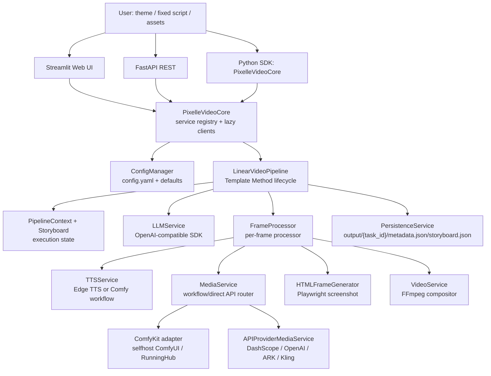

# Pixelle-Video

> 一句话定位：Pixelle-Video 是一个面向 AI Media / Content Automation 的短视频生成流水线，把 LLM 文案、TTS、图像/视频生成、HTML 模板渲染和 FFmpeg 合成串成可配置的本地/云端创作工具。

## 基本信息

| 项目 | 值 |
|------|----|
| 仓库 | `ATH-MaaS/Pixelle-Video`；README、badge、clone 示例仍指向 legacy `AIDC-AI/Pixelle-Video` |
| URL | `https://github.com/ATH-MaaS/Pixelle-Video` |
| 分类 | AI Media / Content Automation |
| Star | 25,104（观测日期：2026-07-11） |
| Fork | 3,612（观测日期：2026-07-11） |
| Watch / Subscriber | 96 subscribers（观测日期：2026-07-11） |
| Issue / PR | 130 open issues / 40 closed issues；15 open PRs / 39 closed PRs（观测日期：2026-07-11） |
| 许可证 | Apache-2.0 |
| 语言 | Python、HTML templates、Streamlit UI、FastAPI API |
| 创建时间 | 2025-11-07 |
| 最近提交 | `848b054e4fae40dabc62ec58e960b573e83793ac`，2026-06-14 |
| 最新 Release | `v0.1.15`，2026-01-27；HEAD 距离该 release 之后 55 commits |
| 版本信号 | `pyproject.toml` 为 `0.2.0`；FastAPI app 对外报告 `0.1.0` |
| 提交 / 贡献者 | 377 commits；GitHub contributors 首屏 18 人，top contributor 245 contributions / 约 65% |
| 源码规模 | 313 tracked files；115 Python files / 25,612 lines；零 tracked test files；唯一 CI 是 docs deployment |
| 分析日期 | 2026-07-11；静态代码分析，未安装、未运行、未构建、未测试 Pixelle-Video |

---

## 场景一：是否值得采用

### 解决的问题

Pixelle-Video 解决的是“从主题或素材到短视频成片”的自动化问题：用户输入一个主题、固定文案或一组素材，系统生成标题、旁白分段、画面提示词、TTS 音频、AI 图片/视频或素材画面，再用 HTML 模板和 FFmpeg 输出最终视频。它的目标用户更接近个人创作者、小团队运营、AI 视频工作流学习者，而不是已经有权限、审计、多人协作、任务队列、成本控制和素材治理要求的企业内容平台。

它不是一个只把用户转到云服务的 referral shell。源码里有真实 Python SDK、FastAPI、Streamlit、多种 pipeline、Pydantic schema、HTML/Playwright 渲染器、FFmpeg 合成器、历史记录和 Windows 打包器。但默认 `config.example.yaml` 把 image/video 的 `default_workflow` 指向 `runninghub/...`，RunningHub workflow JSON 里直接保存 `workflow_id`，所以开箱路径明显偏云端工作流。

### 核心能力与边界

- **能做什么：** 支持 Quick Create、固定脚本、批量主题、素材型视频、图生视频、数字人口播、动作迁移；支持本地 Edge TTS、ComfyUI TTS、selfhost ComfyUI、RunningHub、DashScope/OpenAI/ARK/Kling 等 direct provider API；支持 HTML 模板、模板自定义参数、BGM、历史记录、REST API、Python SDK、Streamlit Web UI 和 Windows portable package。
- **不能做什么：** 不能直接当作公网生产内容流水线；没有 API 鉴权、用户/租户模型、权限隔离、持久化队列、任务恢复、审计日志、成本预算、内容安全策略、素材版权治理、prompt/模型合同版本锁定、系统级重试编排和项目级测试/CI 保障。
- **与竞品差异：** 它比纯脚本工具更像“可配置能力路由器 + 视频流水线”；比 MoneyPrinterTurbo 这类更成熟的短视频自动化工具更偏 AI 生成媒体和 ComfyUI/RunningHub 工作流；比 ShortGPT 更产品化，但在工程成熟度、测试和生产化边界上仍然弱。

### 集成成本

- **依赖链：** 直接依赖覆盖 FastAPI/Uvicorn、Streamlit、OpenAI SDK、ComfyKit、DashScope、Playwright、FFmpeg/MoviePy、Edge-TTS、Pillow/Numpy、httpx/requests 等。实际运行还需要系统 `ffmpeg`、Playwright Chromium、字体、网络访问和多家 API key。
- **部署复杂度：** 本地 PoC 可用 `uv` 或 Windows 包较快起步；公网服务需要额外加反向代理、鉴权、CORS 限制、任务队列、secret 管理、输出文件隔离、监控和依赖锁定。
- **学习曲线：** 架构学习价值高，尤其是配置驱动的能力路由、TTS-first 时长控制、HTML 模板渲染和 FFmpeg 合成。但要稳定复现自托管 ComfyUI 工作流，需要理解 workflow JSON 的输入/输出契约。
- **从零到 demo：** 可信本地环境、使用 RunningHub 或 direct API 时可以较快做 PoC；纯 selfhost ComfyUI 则取决于模型、节点、工作流和 FFmpeg/Playwright 环境。

### 依赖 / SDK 选型证据

| Dependency | Type | Used for | Problem solved | Evidence | Reuse signal | Caution |
|------------|------|----------|----------------|----------|--------------|---------|
| `openai>=2.6.0` | SDK | LLM 文案、标题、结构化输出 | 避免自写 OpenAI-compatible HTTP 客户端 | `pixelle_video/services/llm_service.py` 的 `AsyncOpenAI`；`response_type` 走 Pydantic JSON 解析 | 项目需要兼容 OpenAI、Qwen、DeepSeek、Ollama 等 OpenAI-compatible provider | 错误处理较薄；API key 写入 `config.yaml`；结构化输出依赖 prompt JSON，不是强制 provider schema |
| `comfykit>=0.1.12` | SDK / workflow runtime | selfhost ComfyUI、RunningHub TTS/image/video/VLM workflow 执行 | 把 ComfyUI/RunningHub 差异收敛到 `kit.execute()` | `PixelleVideoCore._get_or_create_comfykit()`、`ComfyBaseService`、`MediaService`、`TTSService` | 需要在同一产品中复用 ComfyUI 与云端工作流时优先评估 | 默认配置和 issue 样本显示 RunningHub 依赖感强；workflow 输入/输出契约易漂移 |
| `fastapi>=0.115.0` | framework | HTTP REST API | 快速暴露 LLM/TTS/media/video/tasks/files/resources/frame endpoints | `api/app.py`、`api/routers/*.py`、`api/schemas/*.py` | 需要把创作能力包装为服务 API | 当前无 auth、默认 `0.0.0.0`、wildcard CORS、异常多返回原始 `str(e)` |
| `uvicorn[standard]>=0.32.0` | runtime | FastAPI server | ASGI 运行时 | `api/app.py` main block；Docker `command` | FastAPI 标准部署路径 | app 默认 host 公开绑定，不应直接公网暴露 |
| `streamlit>=1.40.0` | UI | Web UI、配置面板、pipeline tabs、历史页 | 快速构建创作工具界面 | `web/app.py`、`web/pages/1_🎬_Home.py`、`web/components/*.py` | 内部工具、PoC、单用户创作台 | Streamlit session state 不等于生产级用户/任务隔离 |
| `pydantic>=2.0.0` | schema / validation | API schema、config schema、structured LLM output、workflow info | 统一对象合同和校验 | `pixelle_video/config/schema.py`、`api/schemas/*.py`、`AssetBasedPipeline.VideoScript` | 需要减少 dict 漂移时应复用 | core model 同时存在 dataclass 与 Pydantic，合同层不完全统一 |
| `pyyaml>=6.0.0` | config parser | `config.yaml` load/save | 人可编辑配置 | `pixelle_video/config/loader.py` | 本地工具适合 YAML 配置 | 明文保存 LLM、RunningHub、Kling、ARK 等 secrets |
| `loguru>=0.7.0` | logging | pipeline/service/API 日志 | 简化日志接入 | 多数 `pixelle_video/services/*`、`api/routers/*` | PoC 和单进程工具可直接用 | 部分 debug/print 路径可能泄露 prompt、路径、provider 输入；ComfyKit config debug 会包含 key |
| `edge-tts==7.2.7` | TTS SDK | 本地免费 TTS | 不依赖 ComfyUI/RunningHub 生成旁白 | `TTSService._call_local_tts()` 调 `pixelle_video/utils/tts_util.py` | 低成本本地 TTS PoC | 外部 Microsoft 服务稳定性、速率限制和 401 重试仍是运行风险 |
| `certifi>=2025.10.5` | TLS CA bundle | Edge TTS SSL context | 避免禁用 TLS 验证 | `pixelle_video/utils/tts_util.py` | WebSocket/TLS 问题多时可复用 | Windows packaging 下载路径另行禁用了 TLS 验证，不能混为一谈 |
| `ffmpeg-python>=0.2.0` | media wrapper | concat、probe、overlay、audio/video merge、image-to-video | 避免直接拼接复杂 ffmpeg 命令 | `pixelle_video/services/video.py`、`FrameProcessor` duration probe | 视频合成核心能力值得复用 | 仍依赖系统 `ffmpeg`；错误多是运行期才暴露 |
| `moviepy==1.0.3` | media utility | Web 动作迁移读取上传视频时长 | 简化视频 duration 获取 | `web/pipelines/action_transfer.py` 的 `VideoFileClip` | 需要轻量读取视频元数据时可用 | 旧版 MoviePy；与 ffmpeg-python 功能有重叠 |
| `playwright>=1.58.0` | browser automation | HTML 模板渲染成 PNG frame/overlay | 让模板系统用真实浏览器 CSS 布局 | `pixelle_video/services/frame_html.py` | 需要高保真 HTML/CSS 转图时可复用 | 需要 Chromium install、字体、no-sandbox 参数；服务端资源占用较高 |
| `beautifulsoup4>=4.14.2` | parser | 解析模板 meta 中的 media size | 避免正则解析 HTML meta | `HTMLFrameGenerator._parse_media_size_from_meta()` | HTML 模板含结构化 metadata 时可复用 | 只解析少量 meta，不是完整模板 schema |
| `httpx>=0.28.1` | async HTTP client | 下载生成媒体、模型列表、Web direct API flows | async 场景网络调用 | `FrameProcessor._download_media()`、`utils/llm_util.py`、Web pipeline 下载 | FastAPI/async pipeline 中优先使用 | 与 `requests` 混用，重试/超时策略不一致 |
| `requests>=2.32.0` | HTTP client | DashScope/Kling/Seedance/image upload 等同步 provider client | 复用成熟同步 HTTP 客户端 | `pixelle_video/services/api_services/*` | provider SDK 或同步轮询适合时可用 | 在 async pipeline 中通过 `asyncio.to_thread` 包裹，资源治理弱 |
| `dashscope>=1.23.0` | provider SDK | DashScope 图像、视频、VLM | 直接接入通义万象/百炼能力 | `image_dashscope.py`、`video_dashscope.py`、`vlm_dashscope.py` | 阿里云模型为主的中国区视频生成场景 | SDK/模型能力与硬编码矩阵可能漂移 |
| `pyjwt>=2.10.0` | auth helper | Kling API JWT | 生成 Kling HMAC token | `pixelle_video/services/api_services/video_kling.py` | 需要服务端签发 provider JWT | Secret 明文配置；无密钥轮换策略 |
| `pillow>=10.0.0,<12` | image processing | 图像尺寸、压缩、拼接、Base64 编码 | provider API 输入预处理 | `image_processor.py`、`video_kling.py` | 多 provider 图像输入归一化 | 大图内存和异常路径需额外治理 |
| `numpy>=1.26.0` | numeric / image helper | 图像白边检测等像素处理 | 简化图像数组操作 | `image_processor.py` | 需要像素级预处理时可用 | 当前只少量使用，引入体积不小 |
| `python-multipart>=0.0.12` | HTTP upload parser | 预期支持 FastAPI multipart upload | 替代手写 multipart parsing | manifest direct dependency | 如果未来把 Streamlit upload 下沉到 REST API 可保留 | 静态检索未发现 `UploadFile`/`File(...)` API 使用；当前像未落地依赖 |
| `fastmcp>=2.0.0` | MCP framework | manifest 声明但源码未暴露 MCP server/tool | 理论上可建立 Agent-facing tool contract | `pyproject.toml`、`NOTICE`、`uv.lock`；源码检索无 `FastMCP` 使用 | 未来若要给 Agent 提供 MCP，可复用官方/成熟框架 | 当前没有 Agent-facing MCP/tool contract，不能把该依赖解读为已实现能力 |
| `uv.lock` | lockfile | 锁定已解析依赖版本 | 提供可复现安装线索 | repo 根目录 `uv.lock` | PoC 或 Docker 构建应优先使用 lock | `pyproject.toml` 直接依赖多为 lower-bound 无 ceiling；Dockerfile 从远端 shell installer 安装 uv 后运行 `uv pip install -e .`，未证明 locked install；Windows 路径也未证明锁定安装 |

### 风险评估

| 风险项 | 评估 | 说明 |
|--------|------|------|
| 许可证合规 | ✅ | Apache-2.0，适合学习和二次开发；仍需自行核查生成内容、模板素材、BGM、模型服务条款 |
| Bus factor | ⚠️ 中高 | top contributor 约 65%，项目发展较集中 |
| 供应商锁定 | ⚠️ 高 | 默认 image/video workflow 指向 RunningHub；direct API 矩阵也与具体 provider/model 强绑定 |
| 维护趋势 | ⚠️ 活跃但不稳定 | 创建时间短、stars 高、release 后仍有 55 commits；但版本号、文档和代码合同存在漂移 |
| 安全历史 | ⚠️ 未见系统治理 | 没有测试/安全 CI；API 默认公开绑定、无鉴权、wildcard CORS、文件服务 path traversal 风险 |
| 生产可靠性 | ❌ | in-memory TaskManager、无持久队列、无并发上限 enforce、无项目测试、泛化异常处理 |
| 供应链 / 打包 | ⚠️ | `packaging/windows/build.py` 下载 Python/FFmpeg 时禁用 TLS certificate verification，并直接解压下载归档；已检查路径中未见下载前 checksum gate。Dockerfile 的官方 uv installer 是 curl pipe，随后 editable install，不是锁文件强制安装。 |

### 结论

**观望；推荐个人/小团队在可信本地环境做隔离 PoC 与架构学习，不建议直接作为公网生产内容流水线。**

推荐个人/小团队在可信本地环境中做隔离 PoC 与架构学习；不建议直接作为公网生产内容流水线。它的代码资产是实质性的，尤其适合学习“能力路由 + 模板生命周期 + TTS-first 合成”的短视频系统结构。但默认配置强依赖 RunningHub，issue 样本集中在本地 ComfyUI 仍走云端、RunningHub key required、workflow contract failure、FFmpeg、黑屏等运行问题上；工程安全和可靠性也明显不到生产平台门槛。

---

## 场景二：技术架构学习

### 核心架构图



### 底层技术架构

#### 最小架构内核

脱掉 UI、README 和具体 provider 后，Pixelle-Video 的最小架构内核是：

`Capability Router + Template-Method Pipeline Lifecycle + Storyboard/PipelineContext State + Per-frame TTS-first Processor + Provider Adapters + HTML Renderer + FFmpeg Compositor + Filesystem Task Facts`

这个系统成立的关键不是“调用几个 AI 模型”，而是把视频生成拆成可替换的能力槽：文案、TTS、媒体生成、模板渲染、视频合成。每个槽由配置选择 selfhost、RunningHub 或 direct provider；每个 frame 先生成/读取旁白音频，再用音频时长约束视频片段，最后由 FFmpeg 串接成片。

#### 核心抽象

| 抽象 | 源码位置 | 职责 | 关键字段 / 方法 | 为什么重要 |
|------|----------|------|-----------------|------------|
| `PixelleVideoCore` | `pixelle_video/service.py` | 全局能力注册、配置读取、懒加载 ComfyKit、注册 pipelines | `initialize()`、`_get_or_create_comfykit()`、`pipelines`、`generate_video` | 控制面入口；决定所有能力如何被组合 |
| `ConfigManager` / `PixelleVideoConfig` | `pixelle_video/config/manager.py`、`schema.py` | YAML 配置、默认值、热更新、secret 存取 | `get_llm_config()`、`get_comfyui_config()`、`set_api_provider_config()`、`save()` | 配置是事实源之一；也是 provider 路由的核心 |
| `BasePipeline` / `LinearVideoPipeline` | `pixelle_video/pipelines/base.py`、`linear.py` | Pipeline contract 与 Template Method 生命周期 | `__call__()`、`setup_environment()`、`generate_content()`、`produce_assets()`、`finalize()` | 将短视频生成拆成稳定阶段，便于新增 pipeline |
| `PipelineContext` | `pixelle_video/pipelines/linear.py` | 单次执行的运行时上下文 | `input_text`、`params`、`task_id`、`narrations`、`image_prompts`、`storyboard`、`result` | 让 lifecycle 阶段共享状态，避免全局变量 |
| `Storyboard` / `StoryboardFrame` / `StoryboardConfig` | `pixelle_video/models/storyboard.py` | 视频结构、每帧资源、最终输出 metadata | `frames`、`narration`、`audio_path`、`media_type`、`image_path`、`video_path`、`video_segment_path`、`duration` | 数据面核心对象；每一帧如何生成和合成都落在这里 |
| `ProgressEvent` | `pixelle_video/models/progress.py` | Pipeline/UI/API 的进度事件 | `event_type`、`progress`、`frame_current`、`step`、`action` | 将长任务过程结构化给 Streamlit UI；REST async 未完整接入 |
| `FrameProcessor` | `pixelle_video/services/frame_processor.py` | 单帧 TTS、媒体生成、HTML 合成、视频片段生成 | `_step_generate_audio()`、`_step_generate_media()`、`_step_compose_frame()`、`_step_create_video_segment()` | 真正的数据面执行链；TTS duration 驱动视频 duration |
| `MediaService` | `pixelle_video/services/media.py` | image/video workflow 路由 | `__call__()`、`selected_workflow.startswith("api/")`、`_resolve_workflow()` | 统一 ComfyKit workflow 与 direct API provider |
| `ComfyBaseService` | `pixelle_video/services/comfy_base_service.py` | 扫描/解析 `workflows/{source}/*.json` | `_scan_workflows()`、`_parse_workflow_file()`、`_resolve_workflow()` | selfhost/RunningHub 的控制面适配层 |
| `APIProviderMediaService` | `pixelle_video/services/api_media.py` | direct provider model catalog 与参数映射 | `IMAGE_MODELS`、`VIDEO_MODELS`、`VIDEO_MODEL_CAPABILITIES`、`_video_duration()` | 把 provider/model 能力硬编码为可选工作流 |
| `HTMLFrameGenerator` | `pixelle_video/services/frame_html.py` | HTML 模板参数解析、Playwright 截图 | `parse_template_parameters()`、`get_media_size()`、`generate_frame()` | 把视觉模板从 Python 代码中抽离出来 |
| `VideoService` | `pixelle_video/services/video.py` | FFmpeg 合成、拼接、BGM、音画时长调整 | `create_video_from_image()`、`merge_audio_video()`、`overlay_image_on_video()`、`concat_videos()` | 成片质量和黑屏/音画不同步问题的核心 |
| `PersistenceService` | `pixelle_video/services/persistence.py` | 任务 metadata/storyboard/index 文件持久化 | `save_task_metadata()`、`save_storyboard()`、`.index.json` | Web history 的事实源；不是 REST async TaskManager |
| `TaskManager` | `api/tasks/manager.py` | REST async task lifecycle | `_tasks`、`_task_futures`、`execute_task()`、`update_progress()` | API job 状态只在内存里，重启丢失 |

#### 控制面 / 数据面

- **控制面：** `config.yaml` / `ConfigManager` 决定 LLM、ComfyUI、RunningHub、API providers、默认 workflow 和模板；`PixelleVideoCore` 注册服务与 pipelines；`ComfyBaseService` 扫描 `workflows/runninghub` 与 `workflows/selfhost`；`APIProviderMediaService` 用硬编码 model capability matrix 决定 direct API 可用能力；Streamlit components 决定用户选择哪类 workflow；FastAPI routers 和 Pydantic schemas 决定外部 REST 入口。
- **数据面：** `LLMService` 发起文案/结构化输出调用；`TTSService` 生成音频；`MediaService` / `APIProviderMediaService` / ComfyKit/provider clients 生成图片、视频或素材描述；`HTMLFrameGenerator` 渲染 overlay/frame；`VideoService` 用 FFmpeg 处理音视频；`PersistenceService` 写入 `output/{task_id}` 下的 metadata、storyboard 和媒体文件。

#### 关键执行链路

```text
Quick Create / StandardPipeline
  输入主题或固定脚本
  ↓ 控制流
  PixelleVideoCore.generate_video() 选择 "standard" pipeline
  ↓
  LinearVideoPipeline.__call__() 按 lifecycle 调度
  ↓
  StandardPipeline.generate_content() 用 LLM 生成 narrations 或 split fixed script
  ↓
  StandardPipeline.plan_visuals() 根据 frame_template 判断 static / image / video
  ↓ 数据流
  FrameProcessor 每帧先 TTS，读取 audio duration
  ↓
  MediaService 按 media_workflow 路由 selfhost / runninghub / api，并把 duration 传给视频模型
  ↓
  HTMLFrameGenerator 用模板渲染字幕/overlay
  ↓
  VideoService 生成 segment，StandardPipeline.post_production() concat + BGM
  ↓
  PersistenceService 保存 metadata/storyboard，返回 VideoGenerationResult
```

```text
direct / selfhost / runninghub 媒体路由
  media_workflow = "api/provider/model"
    → MediaService 转交 APIProviderMediaService
    → APIProviderMediaService 根据 provider/model capability 归一化 duration/resolution/ratio
    → ImageClient 或 VideoClient 路由 DashScope / OpenAI / Seedream / Kling / Seedance

  media_workflow = "runninghub/name.json"
    → ComfyBaseService 解析 workflow JSON 中的 workflow_id
    → PixelleVideoCore 懒加载 ComfyKit，kit.execute(workflow_id, params)

  media_workflow = "selfhost/name.json"
    → ComfyBaseService 解析本地 workflow 文件路径
    → ComfyKit 对本地 ComfyUI 执行 workflow
```

```text
AssetBasedPipeline
  用户上传图片/视频素材
  ↓
  setup_environment() 建 task dir，逐个素材做 image/video analysis
  ↓
  generate_content() 用 LLM structured output 生成 VideoScript，并让 LLM 直接分配 asset_path
  ↓
  initialize_storyboard() 一 scene 一 frame，frame.image_path 或 frame.video_path 指向素材
  ↓
  produce_assets() 对每个 scene 生成 TTS；必要时把多段旁白 FFmpeg concat
  ↓
  可选 API 图生视频动画化；否则 FrameProcessor 直接用素材 + template 合成
  ↓
  post_production() concat + BGM，保存 history
```

```text
REST async task flow
  POST /api/video/generate/async
  ↓
  TaskManager.create_task() 在内存 _tasks 生成 UUID task
  ↓
  TaskManager.execute_task() asyncio.create_task()
  ↓
  后台调用 pixelle_video.generate_video()
  ↓
  GET /api/tasks/{task_id} 查询内存 Task.status/result/error
  ↓
  进程重启或 TaskManager.stop() 后任务状态消失
```

#### 状态模型

| 状态类型 | 位置 | 谁读写 | 生命周期 / 一致性规则 |
|----------|------|--------|------------------------|
| 持久状态 | `config.yaml` | `ConfigManager`、Streamlit settings | provider key、base URL、default workflow 明文保存；是运行配置事实源 |
| 持久状态 | `output/{task_id}/metadata.json`、`storyboard.json`、`frames/*`、`final.mp4` | pipelines、`PersistenceService`、History UI | 生成事实源；任务目录隔离较清晰 |
| 持久状态 | `output/.index.json` | `PersistenceService._update_index_for_task()`、History UI | 历史列表索引，可由 task dirs rebuild |
| 持久状态 | `workflows/runninghub/*.json`、`workflows/selfhost/*.json` | 代码扫描，只读；用户可在 `data/workflows` 覆盖 | workflow contract 事实源；RunningHub wrapper 保存 workflow_id |
| 运行时状态 | `PipelineContext`、`Storyboard` in memory | Pipeline lifecycle 和 `FrameProcessor` | 单次任务内共享；失败后除已写文件外不可恢复 |
| 运行时状态 | `HTMLFrameGenerator._browser` | Playwright 渲染器 | 共享浏览器懒加载，跨 event loop 时重建 |
| 运行时状态 | `PixelleVideoCore._comfykit` | Core / services | ComfyKit 懒加载；config hash 变化时重建 |
| 运行时状态 | `TaskManager._tasks`、`_task_futures` | FastAPI async task routes | 只在进程内有效；重启丢失；`max_concurrent_tasks` 未 enforce |
| 外部状态 | LLM provider、RunningHub、ComfyUI、DashScope、OpenAI、ARK、Kling、Edge TTS | provider clients | 异步/同步外部调用；远端状态、额度、审核和模型能力不是本地事实源 |

#### 契约边界

- **内部契约：** `BasePipeline.__call__()` 约束 pipeline 输入输出；`LinearVideoPipeline` 固定 lifecycle；`StoryboardConfig` 把 TTS、media、template、duration 参数传给 frame；`MediaResult` 把 image/video 结果统一为 `media_type/url/duration`；`ProgressEvent` 约束 UI 进度。
- **外部 API / CLI / MCP 契约：** 有 FastAPI REST：`/api/llm/chat`、`/api/tts/synthesize`、`/api/image/generate`、`/api/content/*`、`/api/video/generate/sync`、`/api/video/generate/async`、`/api/tasks/*`、`/api/files/{path}`、`/api/resources/*`、`/api/frame/*`。没有项目自有 CLI。`pyproject.toml` 声明 `fastmcp>=2.0.0`，但源码检索未发现 `FastMCP` 或 MCP server/tool 注册，因此没有已实现的 MCP 契约。
- **Agent-facing Skill / Hook / prompt / schema 契约：** 没有 Agent-facing Skill、Hook、tool schema 或 prompt contract。面向 Agent 的可用契约仅能从 Python SDK / REST / workflow JSON / Pydantic schemas 推断，不能当作稳定 Agent 产品接口。

#### 失败与降级模型

| 失败类型 | 检测方式 | 系统行为 | 降级 / 修复动作 |
|----------|----------|----------|------------------|
| LLM 返回空或非 JSON | `LLMService` 长度检查、JSON parse exception | warning 或抛错，pipeline 失败 | 降低 temperature、换模型、增加 schema retry、记录原始响应 |
| selfhost workflow 不存在或输出 contract 不匹配 | `_resolve_workflow()`、result `images/videos/audios/texts` 检查 | 抛 `ValueError` 或 `Exception("No image/video/audio generated")` | 明确 workflow 输入/输出 schema，给自检工具 |
| RunningHub key 缺失或 workflow 仍走云端 | ComfyKit 执行失败、用户 issue 样本 | 运行期失败 | UI 默认按 source 隔离，配置页明确 RunningHub/selfhost 差异；避免默认 RunningHub |
| TTS 失败 | Edge TTS retry、ComfyKit result status | frame 失败，pipeline 中断 | local/comfyui 双通道 fallback；缓存已生成 audio |
| 视频时长不匹配/黑屏 | FFmpeg probe、`merge_audio_video()` duration diff | pad/trim/freeze 或抛 FFmpeg error | 保留 TTS-first duration；限制 provider duration；输出中间 segment 便于调试 |
| FFmpeg 不存在 | `VideoService.check_ffmpeg()` | 第一次 video 操作抛 RuntimeError | installer/doctor 检查；Docker/Windows 包内置 |
| Playwright/字体问题 | `HTMLFrameGenerator` launch/screenshot exception、fontconfig warning | frame rendering failed | 安装 Chromium 与 CJK fonts；预渲染模板 smoke |
| API async 进程重启 | `TaskManager` 内存状态消失 | `/api/tasks/{id}` 查不到旧任务 | 换 Redis/DB 队列；以 `output/{task_id}` 为恢复事实源 |
| 文件服务路径穿越 | 当前未可靠检测；`relative_to()` 未 `resolve()` | `output/../...` 这类路径可能绕过 prefix 检查 | 对 `abs_path.resolve()` 与 allowed root `resolve()` 做 ancestor check |

#### 可复刻设计不变量

1. 能力选择必须是显式 `source/key`：`runninghub/foo.json`、`selfhost/foo.json`、`api/provider/model` 不能混在一个无 namespace 的字符串里。
2. Pipeline 生命周期必须稳定，新增模式只重写阶段，不重写全局调度。
3. 每个视频任务必须有隔离目录，所有 frame 中间产物和最终 metadata 可追踪。
4. TTS 应先于视频长度决策，旁白音频时长是分镜 duration 的事实源。
5. HTML 模板要声明媒体尺寸和参数，生成模型尺寸不能散落在 UI 组件里。
6. Provider/model capability matrix 必须标注来源、验证状态和 adapter 能力，不能只列 model name。
7. Workflow 输入/输出 contract 要机器可检验；ComfyUI/RunningHub result 的 `images/videos/audios/texts` 不能靠猜。
8. 控制面配置不能直接等于安全配置；公网服务必须另加 auth、CORS、path sandbox、secret manager、queue 和 audit。

### 关键设计决策与 trade-off

| 决策 | 选择 | 放弃了什么 | 为什么 |
|------|------|-----------|--------|
| Pipeline 结构 | Template Method lifecycle | 完全自由的脚本式 workflow | 统一 Quick Create、asset-based、custom pipeline 的阶段和进度 |
| 媒体能力 | ComfyKit + direct provider API 双路由 | 单一 provider 简洁性 | 同时覆盖 selfhost、RunningHub 和云端模型 API |
| 时长控制 | TTS-first | 让视频模型自由决定时长 | 旁白短视频最核心的是音画同步 |
| 渲染方式 | HTML + Playwright screenshot | 纯 PIL/canvas 合成 | 模板表达力更强，非工程用户可改 HTML/CSS |
| 持久化 | filesystem task facts | DB/对象存储/队列 | 降低 PoC 成本，便于本地排错 |
| API jobs | in-memory TaskManager | 可恢复分布式队列 | 实现简单，但不适合生产 |
| Provider matrix | 硬编码能力表 | 动态 provider discovery | UI 可控，但会随模型合同漂移 |

### 值得学习的模式

- 配置驱动能力路由：把 ComfyUI、RunningHub、API provider 放到统一 workflow key 语义下。
- Template Method 视频流水线：`LinearVideoPipeline` 让视频生成阶段可复用、可覆盖。
- TTS-first duration：先生成旁白音频再决定视频时长，是短视频自动化的核心工程经验。
- HTML 模板参数 DSL：`{{param:type=default}}` 让视觉模板具备轻量配置能力。
- 中间产物可观测：`output/{task_id}/frames/01_audio.mp3`、`01_image.png`、`01_composed.png`、`01_segment.mp4` 对调试很友好。
- direct API model 能力矩阵：虽然硬编码有风险，但把 provider 差异显式化，比散落在 UI 和 client 里更可维护。

### 反模式 / 踩坑点

- 默认配置 image/video 指向 RunningHub，容易让“本地 ComfyUI”用户误以为已完全本地化。
- API server 没有 auth，却默认 `0.0.0.0` 和 wildcard CORS。
- `/api/files/{file_path}` 的路径校验没有 `resolve()`，`output/../` 形式存在穿越风险。
- `TaskManager.max_concurrent_tasks` 只声明未 enforce，API async 任务可无上限创建。
- `config.yaml` 明文保存所有 key，且 debug/print 路径可能泄露配置或模型输入。
- provider/model capability matrix 写在代码中，模型合同更新会导致 UI 可选项和真实 API 不一致。
- Windows builder 在下载 Python/FFmpeg 时禁用 TLS certificate verification，并直接解压归档；Dockerfile 用 official uv installer 的 curl pipe 和 `uv pip install -e .`，供应链可复现性不足。
- 大文件集中：`asset_based.py`、`video.py`、`style_config.py`、`digital_human.py` 等超过数百到千行，Web 与 core 参数管线有重复。
- 泛化 `except Exception` 较多，HTTP 层常直接返回 `str(e)`。
- 零项目测试和非验证型 CI，使重构与 provider 升级风险高。

### 可借鉴的具体技术点

- `FrameProcessor._step_generate_media()` 将 TTS duration 注入视频生成参数。
- `VideoService.merge_audio_video()` 对视频短于音频时做 freeze padding，对视频长于音频时做 trim。
- `HTMLFrameGenerator.parse_template_parameters()` 提供轻量模板参数发现。
- `ComfyBaseService._scan_workflows()` 支持 `data/workflows` 覆盖默认 workflow。
- `APIProviderMediaService._video_duration()` 对 provider/model duration 做 clamp/nearest allowed value。
- `PersistenceService` 用 metadata/storyboard/index 拆分历史记录，适合本地创作工具。

---

## 架构解剖

### 目录结构

```text
api/
  app.py                 FastAPI app、CORS、router registration、uvicorn entry
  routers/               LLM/TTS/image/content/video/tasks/files/resources/frame endpoints
  schemas/               Pydantic request/response schemas
  tasks/                 in-memory async TaskManager

pixelle_video/
  service.py             PixelleVideoCore service registry
  config/                YAML loader、Pydantic config schema、ConfigManager
  models/                Storyboard、ProgressEvent、MediaResult
  pipelines/             LinearVideoPipeline、StandardPipeline、AssetBasedPipeline、CustomPipeline
  services/              LLM/TTS/media/API adapters/HTML rendering/FFmpeg/persistence/history
  prompts/               LLM prompt builders
  utils/                 content generation、template/workflow/os/tts helpers

web/
  app.py                 Streamlit navigation
  pages/                 Home、History
  components/            settings、style config、output preview、content input
  pipelines/             Quick Create、asset-based、digital human、i2v、action transfer UI

templates/               HTML frame templates by size and type
workflows/
  runninghub/            wrapper JSON with source=runninghub and workflow_id
  selfhost/              local ComfyUI workflow JSON
bgm/                     default background music
docs/                    user docs；architecture page shallow/stale
packaging/windows/       Windows portable bundle builder
```

### 技术栈

- **运行时 / 框架：** Python >=3.11（`pyproject.toml`），FastAPI/Uvicorn，Streamlit，AsyncIO。
- **AI / 媒体：** OpenAI-compatible LLM SDK、ComfyKit、DashScope、OpenAI image、ARK Seedream/Seedance、Kling、Edge TTS、Playwright、FFmpeg、MoviePy。
- **配置 / 模板：** YAML + Pydantic config，HTML templates，workflow JSON。
- **构建 / 打包：** `uv.lock`、Dockerfile、docker-compose、Windows portable builder。
- **测试：** `pyproject.toml` 声明 dev 依赖 `pytest`/`pytest-asyncio`/`ruff`，但源码无 tracked test files。
- **CI/CD：** `.github/workflows/docs.yml` 仅部署文档，没有 lint/test/build workflow。

### 模块依赖关系

```text
FastAPI routers / Streamlit UI
  → api.dependencies / web.state.session
  → PixelleVideoCore
  → LLMService / TTSService / MediaService / APIProviderMediaService / FrameProcessor / PersistenceService
  → StandardPipeline / AssetBasedPipeline / CustomPipeline
  → Storyboard / ProgressEvent / MediaResult
  → HTMLFrameGenerator / VideoService
  → filesystem output + external providers
```

核心依赖方向基本正确：UI/API 不直接知道 FFmpeg 合成细节；pipeline 不直接知道 provider client 细节；provider client 也不应知道 pipeline。问题在于 Web UI 中的 i2v、digital human、action transfer 仍有不少直接 ComfyKit/provider 调用逻辑，尚未完全沉到 core pipeline 层。

### 扩展机制

- **Pipeline 扩展：** 继承 `BasePipeline` 或 `LinearVideoPipeline`，在 `PixelleVideoCore.pipelines` 注册。
- **模板扩展：** 新增 `templates/{WIDTHxHEIGHT}/{static|image|video}_*.html`，通过 meta 指定 media width/height，通过 `{{param:type=default}}` 暴露参数。
- **Workflow 扩展：** 新增 `workflows/selfhost/*.json` 或 `workflows/runninghub/*.json`；`data/workflows` 可覆盖默认资源。
- **Provider 扩展：** 修改 `APIProviderMediaService.IMAGE_MODELS`、`VIDEO_MODELS`、`VIDEO_MODEL_CAPABILITIES` 和对应 provider client。
- **BGM / custom resources：** `data/bgm`、`data/templates` 优先级高于内置资源。

---

## 质量与成熟度

### 代码质量

- **类型系统：** 有 Pydantic schema 和 dataclass model，但混用较多；Web UI、pipeline params、provider params 仍大量 dict 传递。
- **错误处理：** provider/client 层有部分 retry 和 duration 修复；但 API/服务层大量 `except Exception`，常把原始错误字符串返回给客户端。
- **代码风格一致性：** 核心抽象清楚，但大文件和重复参数管线明显。`pixelle_video/pipelines/asset_based.py`、`pixelle_video/services/video.py`、`web/components/style_config.py`、`web/pipelines/digital_human.py` 都承担过多职责。
- **安全性：** 生产级不足。FastAPI 无 auth；默认 `0.0.0.0`；wildcard CORS；`api/routers/files.py` path traversal 风险；配置明文 secret；Windows builder 下载禁用 TLS certificate verification 且直接解压归档，未见下载前 checksum gate。

### 测试

- **测试框架：** `pyproject.toml` dev 依赖声明 `pytest>=8.0.0`、`pytest-asyncio>=0.23.0`，但仓库无 tracked test files。
- **覆盖率：** 未见覆盖率配置或报告。
- **测试类型：** 未见单元、集成、E2E、provider contract、workflow contract、template rendering、FFmpeg smoke、API security tests。
- **本次本地验证：** 按用户要求静态分析，未安装、未运行、未构建、未测试 Pixelle-Video。

### CI/CD

- **流水线配置：** `.github/workflows/docs.yml` 是唯一 CI，职责是 docs deployment。
- **发布流程：** GitHub release 最新为 `v0.1.15`（2026-01-27），HEAD 已前进 55 commits；`pyproject.toml` 为 `0.2.0`，FastAPI app 仍报告 `0.1.0`，说明版本面没有统一。
- **构建验证：** Dockerfile 和 Windows builder 存在，但没有 CI 证明构建成功、锁文件安装一致或平台包可复现。Dockerfile 国际路径使用 `curl -LsSf https://astral.sh/uv/install.sh | sh`，随后 `uv pip install -e .`；Windows builder 对下载禁用 TLS 验证，最终只为产物 zip 生成 sha256，未在 inspected path 里证明下载前校验。

### 文档质量

- **API 文档：** FastAPI Swagger 自动生成；docs 中 `api-overview.md` 覆盖主要 video endpoints，但不覆盖 security boundary。
- **教程/指南：** README 和 docs 覆盖安装、配置、Quick Start、模板、workflows、troubleshooting、gallery，用户上手材料较丰富。
- **架构文档：** `docs/zh/development/architecture.md` 和英文版非常浅，只列 Web/Service/ComfyUI 三层，并写 Python 3.10+；与 `pyproject.toml` 的 Python >=3.11、direct API providers、PipelineContext、API router 等当前架构不匹配。
- **链接漂移：** README/badges/clone/release/docs 链接仍指向 legacy `AIDC-AI/Pixelle-Video`。

### Issue / PR 健康度

- **数量信号：** 2026-07-11 观测 130 open issues、40 closed issues、15 open PRs、39 closed PRs。对于创建于 2025-11-07 的项目，用户需求和问题反馈都很强。
- **痛点聚类：** issue 样本 #188、#66、#52、#67、#90、#200、#225、#226 反映的主要问题集中在本地 ComfyUI 仍路由云端/RunningHub key required、workflow contract failures、FFmpeg 环境、黑屏/合成失败等。closed #127 具有争议性，只能作为社区信任和沟通成本的辅助信号，不能据此推断维护者意图。
- **PR 风险：** open PR 数量不低，且当前无测试 CI，合并质量更依赖 maintainer 人工判断。

---

## 社区与生态

### 社区评价

Pixelle-Video 的 star/fork 增长和 issue 数显示它击中了 AI 短视频自动化需求；README 视频示例、Windows 包、中文文档、RunningHub 工作流降低了创作者门槛。社区痛点也很具体：很多用户不是在问“这个项目能不能做视频”，而是在卡“我以为是本地，但还要 RunningHub key”“workflow 输入输出不匹配”“FFmpeg 或黑屏”等工程化问题。这说明项目有真实使用，但默认路径、配置解释和本地化边界仍不清晰。

### 衍生项目 / 插件生态

当前可见的扩展主要是项目内生态：HTML templates、`workflows/selfhost`、`workflows/runninghub`、`data/*` override、Web pipeline tabs、Windows bundle。没有观察到成熟第三方插件市场、Agent tool ecosystem 或 MCP 工具体系。`fastmcp` 只是依赖声明，不构成生态事实。

### 竞品对比

| 项目 | 分层 | 产品边界 | 相对 Pixelle-Video 的判断 |
|------|------|----------|----------------------------|
| MoneyPrinterTurbo | 直接竞品 | 更广义的短视频自动化，通常覆盖素材、脚本、配音、剪辑、平台化能力 | 更像成熟的一般短视频自动化工具；Pixelle-Video 在 ComfyUI/RunningHub/AI 生成媒体路由上更突出 |
| ShortGPT | 架构邻居 / 框架祖先 | 以自动短视频生成框架、Editing Markup Language、TinyDB 等实验性结构为代表 | 对架构学习有参考价值；Pixelle-Video 更接近面向用户的产品化工具 |
| linyqh/NarratoAI | 邻近替代 / 部分直接竞品 | 侧重已有视频理解、解说、剪辑与内容重组；README 2026-07-02 显示当前活跃 v0.8.4 | 如果需求是“处理已有视频素材并改编解说”，NarratoAI 更贴近；Pixelle-Video 更偏生成式视频流水线 |
| ComfyUI | 架构基座 | 节点式 AI workflow 引擎，不是终端短视频产品 | Pixelle-Video 依赖其 workflow 生态，但 ComfyUI 不是同层 end-user 竞品 |

竞品指标按用户要求仅做定性分层，不给出非当前精确 star/release 数。

---

## 关键代码走读

### 1. `PixelleVideoCore`

- 路径：`pixelle_video/service.py`
- 职责：核心 service registry，初始化 LLM、TTS、media、direct API media、analysis、video、frame processor、persistence/history，并注册 `standard`、`custom`、`asset_based` pipelines。
- 实现要点：`_get_or_create_comfykit()` 根据 `comfyui_url`、`comfyui_api_key`、`runninghub_api_key`、`runninghub_instance_type` 生成 config hash，首次使用或配置变化时懒加载/重建 ComfyKit。这里的 `logger.debug(f"ComfyKit config: {current_config}")` 会把 key 放进 debug 日志，是需要修的安全点。

### 2. `LinearVideoPipeline` / `StandardPipeline`

- 路径：`pixelle_video/pipelines/linear.py`、`pixelle_video/pipelines/standard.py`
- 职责：将主题到视频的流程拆成 setup、content、title、visual planning、storyboard、asset production、post production、finalize。
- 实现要点：`StandardPipeline.plan_visuals()` 根据模板类型决定是否生成媒体；`produce_assets()` 对 RunningHub workflow 支持并发 semaphore；`post_production()` 调 `VideoService.concat_videos()`；`_persist_task_data()` 保存 metadata/storyboard。

### 3. `FrameProcessor`

- 路径：`pixelle_video/services/frame_processor.py`
- 职责：单帧数据面执行器，串起 TTS、媒体生成、HTML 合成、segment 生成。
- 实现要点：`_step_generate_audio()` 先生成音频并读取 `frame.duration`；`_step_generate_media()` 若是视频 workflow，会把 `duration` 传给 media service；`_step_create_video_segment()` 对 video media 先 overlay HTML 再 merge audio，对 image/static 则 `create_video_from_image()`。这就是“TTS duration drives video duration”的代码证据。

### 4. `MediaService` / `ComfyBaseService` / `APIProviderMediaService`

- 路径：`pixelle_video/services/media.py`、`comfy_base_service.py`、`api_media.py`
- 职责：把 `media_workflow` 解析为 selfhost/RunningHub/direct API 三类执行路径。
- 实现要点：`MediaService.__call__()` 检查 `selected_workflow.startswith("api/")`，转交 direct API；否则 `_resolve_workflow()` 查 `workflows/{source}`。`APIProviderMediaService` 用 `IMAGE_MODELS`、`VIDEO_MODELS`、`VIDEO_MODEL_CAPABILITIES` 构建 provider/model 选项，并归一化 duration/resolution/options。

### 5. `HTMLFrameGenerator`

- 路径：`pixelle_video/services/frame_html.py`
- 职责：加载 HTML 模板、解析 media size 与 custom parameters、用 Playwright 截图输出 PNG。
- 实现要点：`get_media_size()` 从 `<meta name="template:media-width">` / `template:media-height` 读取生成媒体尺寸；`parse_template_parameters()` 支持 `{{param:type=default}}`；`generate_frame()` 把本地图片转成 `file://` 并用 Chromium screenshot `omit_background=True` 输出 overlay。

### 6. `VideoService`

- 路径：`pixelle_video/services/video.py`
- 职责：FFmpeg 合成器，负责 concat、image+audio、overlay、merge audio/video、BGM。
- 实现要点：`create_video_from_image()` 用 audio duration 强制 `-t`；`merge_audio_video()` 根据 audio/video duration 差异 freeze pad 或 trim；`concat_videos()` 先 concat segments，再可选加 BGM。黑屏、FFmpeg、音画不同步问题最终大多会落到这一层。

### 7. FastAPI async task 和 file router

- 路径：`api/routers/video.py`、`api/tasks/manager.py`、`api/routers/files.py`
- 职责：REST 视频生成、任务查询、文件下载。
- 实现要点：`generate_video_async()` 创建 in-memory task 并 `asyncio.create_task()`；`TaskManager` 没有持久化，也没有 enforce `api_config.max_concurrent_tasks`。`files.py` 用 `Path.cwd() / full_path` 后直接 `relative_to(Path.cwd())`，未先 `resolve()`，`output/../` 这类路径可能通过 prefix 检查。

---

## 评分

| 维度 | 评分(1-5) | 说明 |
|------|----------|------|
| 功能覆盖度 | 5 | 短视频生成、素材视频、i2v、数字人、动作迁移、API/Web/SDK、模板、BGM、历史、Windows/Docker 都有 |
| 代码质量 | 3 | 抽象方向正确，但大文件、重复参数管线、泛化异常、无测试、安全边界弱 |
| 文档质量 | 3 | 用户文档多，但架构文档浅且 stale，README legacy org 链接未清理 |
| 社区活跃度 | 4 | 高 star/fork/issue，提交活跃；但集中贡献和 open issue/PR 压力明显 |
| 架构设计 | 4 | 能力路由、Template Method、TTS-first、模板渲染、文件事实源值得学习 |
| 学习价值 | 5 | 很适合作为 AI 视频流水线架构拆解样本 |
| 可借鉴度 | 4 | 可借鉴模式多，但不能照搬生产化安全/任务/配置模型 |

总分：**28 / 35**

---

## 总结

### 一句话评价

Pixelle-Video 是一个真实、有架构学习价值的 AI 短视频流水线项目，但目前更适合本地可信环境 PoC 和架构拆解，不适合直接公网生产。

### 谁应该用

- 想学习 AI 视频生成系统如何拆分 LLM、TTS、媒体生成、模板渲染和 FFmpeg 合成的工程师。
- 个人创作者或小团队，在本地隔离环境中愿意配置 RunningHub、ComfyUI 或 provider API key 做 PoC。
- 需要参考“HTML 模板 + TTS-first duration + workflow/provider router”架构的人。

### 谁不应该直接用

- 需要公网 API、多人协作、权限隔离、可恢复任务队列、审计日志、成本控制和稳定 SLA 的团队。
- 明确要求全本地推理、不能接受默认 RunningHub/cloud 路径或外部 TTS/provider 调用的场景。
- 需要可验证安全供应链、测试覆盖、CI gate 和稳定 release contract 的企业生产环境。

### 下一步

1. 本地隔离 PoC：锁定一个 workflow source，不混用 RunningHub/selfhost/API，记录完整输入输出。
2. 生产化前补硬门槛：auth、CORS allowlist、path resolve sandbox、secret manager、持久队列、并发限制、provider contract tests、FFmpeg/Playwright smoke tests。
3. 架构学习优先读：`pixelle_video/service.py`、`pipelines/linear.py`、`pipelines/standard.py`、`services/frame_processor.py`、`services/media.py`、`services/api_media.py`、`services/frame_html.py`、`services/video.py`。
