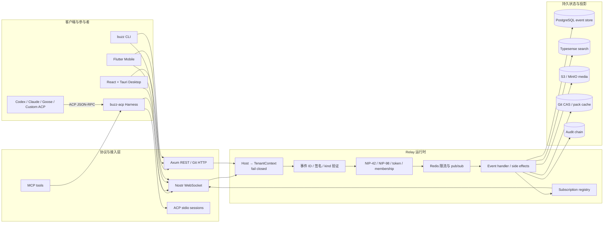

# Buzz 技术评估报告

> **一句话结论**：Buzz 不是给聊天产品外挂一个 Agent，而是把人、Agent、Git、工作流和审计统一成 Nostr 签名事件流；架构创新与工程完成度都很高，适合隔离试点和深度借鉴，但 2026-07 的 v0.4.x 仍处于跨平台 Agent runtime 与 onboarding 高频收敛期，不宜直接替换成熟生产协作主干。

## 基本信息

| 字段 | 内容 |
|---|---|
| 项目 | [block/buzz](https://github.com/block/buzz) |
| 定位 | “A hive mind communication platform”：人类与 AI Agent 共用的协作、代码与工作流平台 |
| 许可证 | Apache-2.0 |
| 主语言 | Rust；桌面端 React/TypeScript + Tauri；移动端 Flutter/Dart |
| 首次公开时间 | 2026-03-06 |
| 本次评估日期 | 2026-07-24 |
| 源码快照 | `76aeae703664a6a6741b82771df67c546886aafd` |
| 最新桌面 Release | `v0.4.24`（2026-07-23） |
| GitHub 快照 | 7,459 Stars、596 Forks、525 个 open issue/PR 总数 |
| 建议 | **推荐隔离试点 / 推荐架构学习；生产协作主干暂观望** |
| 架构价值 | ⭐⭐⭐⭐⭐ |

> 数据口径：GitHub REST API 与本地完整 Git 历史，采集时间为 2026-07-24。GitHub 的 `open_issues_count` 同时包含 issue 与 PR；拆分后约为 173 个 open issues、352 个 open PR。

---

## 场景一：是否值得采用

### 解决的问题

常见 Agent 产品的主语仍是个人：用户打开一个聊天框，让一个 Agent 调工具。Buzz 的主语换成了团队：

- 人与 Agent 都有可验证身份；
- 人和 Agent 在频道、线程、DM、项目、工作流里使用同一套事件语义；
- Agent 不是隐藏在后端的函数，而是可以被 mention、组队、观察、恢复和审计的成员；
- Git 仓库、PR、审批、工作流、媒体和消息都映射为事件或事件驱动的投影；
- 同一个 Agent harness 可以桥接 Goose、Codex、Claude Code 等 ACP runtime。

这使 Buzz 更接近“Agent-native Slack + Git forge + workflow runtime”，而不是单纯的聊天客户端。

### 核心能力与边界

Buzz 的能力边界不是单一 Agent runtime，而是一套完整协作平台：频道、线程、DM、Agent、团队、Git、PR、workflow、search、media、desktop、mobile 与 CLI 都在范围内。它可以替代多个分散工具的一部分，但代价是部署面、身份密钥、Agent 执行权限和跨平台兼容性都比普通聊天应用更复杂。

### 结论

**方向成立。** 当组织里同时存在人、多个 Coding Agent、共享项目和审批链时，继续把 Agent 当成 Slack bot 或 CI job，会丢失身份、上下文、状态和责任链。Buzz 的核心价值是提供一套共同的协作数据面。

### 风险评估

采用风险主要来自四点：v0.4.x 高速演进造成的接口与运行时漂移；Agent 子进程可接触真实开发环境；Nostr 私钥成为高价值身份资产；Relay 同时承载消息、Git、media、workflow、mesh 等宽攻击面。个人/小团队可以通过固定版本、独立系统用户、最小工具权限和测试仓隔离；企业生产化还必须补齐密钥生命周期、网络分区、媒体读取认证、审计与升级回滚。

### 依赖 / SDK 选型证据

> 全量直接依赖由 `tk catalog build` 从本地 manifest 写入 catalog；本表解释影响 build-vs-buy 的关键依赖。

| Dependency | Type | Used for | Problem solved | Evidence | Reuse signal | Caution |
|------------|------|----------|----------------|----------|--------------|---------|
| `nostr 0.44.x` | Protocol / identity | Event、pubkey、Schnorr 签名、NIP-42/NIP-98 | 让人和 Agent 共用可验证、可回放的身份与事件契约 | `Cargo.toml`、`crates/buzz-core/src/verification.rs`、`crates/buzz-auth/` | 需要开放身份和 event-sourced collaboration 时价值高 | 私钥生命周期和 NIP 互操作成为核心运维责任 |
| Axum | HTTP / WebSocket runtime | Relay、REST、Git、media、admin API | 在 Rust 服务内统一 WebSocket 与 HTTP 路由 | `crates/buzz-relay/src/router.rs`、`src/api/` | Rust 实时服务的成熟基础 | 单 relay 承担能力面宽，必须按 profile 收紧路由 |
| SQLx + PostgreSQL | Durable storage | Event、community、channel、workflow、Git metadata | 事务化持久化与关系投影 | `crates/buzz-db/src/`、`schema/`、`migrations/` | 事件事实源 + 查询投影组合可复用 | schema、分区、migration 和 tenant fence 要持续验证 |
| Redis | Coordination / admission | Pub/sub、连接控制、replay 防护、rate limit | 多 relay 实例实时广播与共享限流状态 | `crates/buzz-pubsub/src/`、`crates/buzz-auth/src/rate_limit.rs` | 多实例 relay 协调的合理选型 | fixed window 边界允许约 2× burst；Redis 故障策略需演练 |
| `agent-client-protocol 0.10.x` | Agent process protocol | ACP 子进程、session/prompt、model/capability | 用统一协议桥接 Goose、Codex、Claude 与自定义 Agent | `crates/buzz-acp/src/` | 多 Agent CLI 产品可复用 protocol seam | 上游 runtime 版本、安装、登录与跨平台 PATH 仍会漂移 |
| `rmcp 1.1.x` | MCP SDK | Agent MCP server 与开发工具 | 给 Agent 暴露文件、shell、todo、image 等结构化工具 | `crates/buzz-agent/src/mcp.rs`、`crates/buzz-dev-mcp/src/` | Agent tool surface 的标准化价值高 | MCP/tool 权限不能替代 OS sandbox 与最小凭据 |
| iroh / mesh runtime | Mesh / local inference | Relay tunnel、shared compute、可选本地 LLM | 跨 relay 连接与本地/共享推理 | `crates/buzz-relay/src/tunnel/`、`mesh_boot.rs`、release workflow | 对边缘 mesh 与 local-first AI 有参考价值 | native build、模型分发和多节点故障面显著增加 |
| Tauri + React + TypeScript | Desktop product | 多平台桌面 UI、sidecar、updater、keyring | 在 Web UI 体验下保留 native Agent/Git 能力 | `desktop/`、`desktop/src-tauri/` | 需要本地高权限 sidecar 的跨平台产品可评估 | 签名、更新、PATH、keyring 和平台差异测试成本高 |
| Flutter / Dart | Mobile client | 移动消息、invite、media、notification | 复用一套移动客户端覆盖 Android/iOS | `mobile/`、CI mobile job | 与 Rust relay 解耦的移动投影可复用 | desktop/mobile capability rollout 必须同步，媒体认证即受此约束 |

---

## 场景二：技术架构学习

### 核心架构图

### 底层技术架构

#### 最小架构内核

脱掉 UI、移动端和具体数据库后，Buzz 仍必须保留四件事：签名事件契约、tenant-aware relay、event store/subscription、ACP Agent lifecycle。失去任意一个，系统都会退化为普通聊天应用、普通 Nostr relay 或普通 Agent wrapper。

#### 核心抽象

- `Event`：不可变的身份签名事实；`kind` 决定语义。
- `TenantContext` / `CommunityId`：所有请求、存储和 Redis key 的隔离边界。
- `Subscription`：客户端看到哪些事件以及从哪里回放。
- `ChannelQueue`：同一协作上下文内的顺序保证。
- `AgentPool` / ACP session：长期 Agent 子进程、并发 slot、模型 session 与恢复状态。
- Git manifest / workflow / audit event：代码与自动化在事件数据面上的领域投影。

#### 控制面 / 数据面

控制面负责 host→community 解析、身份/成员权限、Agent runtime 配置、订阅过滤、rate-limit tier、workflow policy 与 Git protection；数据面负责事件验证/写入/广播、ACP prompt/response 流、Git pack/media/audio 传输和搜索投影。两者通过 `TenantContext`、event kind、ACP JSON-RPC 与数据库/Redis key 契约连接。

#### 关键执行链路

1. **事件写入**：WebSocket `EVENT` → tenant resolution → event ID/签名验证 → NIP-42/token/membership → rate limit → PostgreSQL → side effects/search/audit → Redis/subscription 广播。
2. **Agent mention**：mention event → subscription filter → channel queue → Agent pool slot → ACP `session/prompt` → tool/model stream → signed reply event。
3. **Git 协作**：Git HTTP / CLI → Nostr credential/signing → policy/manifest/CAS/pack cache → repo state 与 PR/review event → desktop/Agent 共同投影。

#### 状态模型

PostgreSQL event store 是持久事实源；Typesense、Git pack cache、media object 与客户端 store 是可重建投影；Redis 保存跨实例 pub/sub、replay/限流等运行时协调状态；ACP process/session、channel queue 与 typing/presence 是短生命周期状态；外部模型、Git 工作区和系统 keyring 属于外部状态，不能由 event store 单独重建。

#### 契约边界

外部契约包括 Nostr/NIP WebSocket、REST/Git HTTP、ACP stdio JSON-RPC、MCP、CLI 与 desktop deep link；内部契约包括 event kind/payload、`TenantContext`、DB schema、Redis key、Agent/team snapshot 与 release updater signature。兼容性治理应优先守住这些契约，而不是具体 UI 组件。

#### 失败与降级模型

未知 host 直接 fail closed；无效事件在持久化前拒绝；Redis/DB/搜索/media 等依赖失败分别影响 admission、事实写入或投影；relay 断线由客户端重连与 subscription 回放恢复；Agent stall/timeout 会暴露状态并 requeue/rotate/respawn；可选 mesh、audio、media 应允许按部署 profile 关闭，而不破坏核心消息与 Agent 链路。

#### 可复刻设计不变量

1. 任何副作用前先验证事件真实性和 tenant。
2. tenant id 必须进入类型、DB query、subscription 与基础设施 key。
3. 同一 channel 串行，不同 channel 并行。
4. Agent process、Agent session 与业务 identity 分开建模。
5. 事实与投影分离，搜索/cache/UI 都可从事件恢复。
6. 协议身份延伸到 Git/Agent 动作，避免第二套不可审计身份。
7. 失败要形成状态事件和可恢复入口，而不是只写日志。
8. 发布 artifact 必须绑定 source ref 并具备平台签名/更新签名。

### 2.1 架构窄腰：Nostr Event

源码主链在：

- `crates/buzz-core/src/verification.rs`：事件 ID 与 Schnorr 签名验证；
- `crates/buzz-relay/src/handlers/event.rs`：验证、认证、授权、持久化、side effect 和广播；
- `crates/buzz-core/src/kind.rs`：平台事件 kind 的注册表；
- `crates/buzz-relay/src/subscription.rs`：订阅状态与回放边界。

这里最值得学习的不是“Nostr”这个名字，而是**所有功能先被压缩为稳定事件契约，再从事件投影出 UI、搜索、通知、Git 和工作流状态**。这给了系统四个天然属性：

1. **可验证**：事件由身份私钥签名；
2. **可回放**：新客户端和新投影可以重放历史；
3. **可审计**：操作不是散落在多个 SaaS 的不可见副作用；
4. **可扩展**：新增功能主要增加 event kind 和处理器，不必重写基础协议。

### 2.2 多租户隔离：Host 先解析为 TenantContext，解析失败即拒绝

`crates/buzz-core/src/tenant.rs` 和 `crates/buzz-relay/src/tenant.rs` 把 community 变成显式 `TenantContext`。HTTP Host / WebSocket 入口必须先映射到 community，未知 host 不会回退到默认租户。

后续存储、Redis key、rate limit 和订阅都携带 community：

- `buzz:{community}:ratelimit:{pubkey}:{suffix}`；
- 同一 pubkey 在两个 community 消耗独立额度；
- IP 连接限流则刻意保持 operator-global，因为它发生在 tenant resolution 之前。

这是一个很好的多租户工程样本：**隔离键不是业务函数里临时拼出来，而是从入口一路进入类型和基础设施 key。**

### 2.3 Agent 主链：Mention → Queue → ACP Session → Event Reply

核心实现位于：

- `crates/buzz-acp/src/queue.rs`；
- `crates/buzz-acp/src/pool.rs`；
- `crates/buzz-acp/src/session.rs`；
- `crates/buzz-acp/src/handlers.rs`。

`buzz-acp` 订阅 mention / thread / DM 事件，把每个 channel 的任务串行化，再把不同 channel 分发给 Agent pool。每个 slot 持有一个 ACP 子进程和多个会话，支持：

- 多 Agent 并发；
- 同频道顺序处理；
- 重复事件 queue 或 drop；
- turn timeout；
- session proactive rotation；
- 进程崩溃和 session 失效后的恢复；
- context 回填、typing、presence 和 heartbeat；
- 自定义 Agent command / args，以及 Goose、Codex、Claude 等 runtime。

它解决了 Agent 产品常见但容易被忽略的运行时问题：**不是“能不能发 prompt”，而是同一 Agent 如何在长期在线、多频道并发、进程崩溃、超时与上下文膨胀下持续工作。**

### 2.4 Git 不是外链，而是协作数据面的组成部分

`crates/buzz-relay/src/api/git/` 实现 Git transport、manifest、CAS publish、hydrate、pack cache 和 policy；`git-credential-nostr` 与 `git-sign-nostr` 把 Nostr 身份延伸到 Git credential / signing。

这比“消息里贴 GitHub 链接”更深入：项目、分支、PR、review decision、diff comment 和保护规则都能进入同一协作界面。对 Agent 团队尤其重要，因为代码动作和讨论不再分裂成两个身份系统。

### 2.5 数据与运行时组成

| 层 | 主要技术 | 职责 | 源码证据 |
|---|---|---|---|
| 协议与身份 | `nostr 0.44.x` | 事件、pubkey、签名、NIP-42/NIP-98 | `Cargo.toml`、`buzz-core/verification.rs`、`buzz-auth/` |
| HTTP / WebSocket | Axum | Relay、REST、Git / media / admin API | `buzz-relay/src/router.rs`、`buzz-relay/src/api/` |
| 关系存储 | SQLx + PostgreSQL | 事件、community、channel、workflow、Git 元数据 | `buzz-db/src/`、`schema/`、`migrations/` |
| 实时协调 | Redis | pub/sub、连接控制、replay 防护、固定窗口限流 | `buzz-pubsub/src/`、`buzz-auth/rate_limit.rs` |
| Agent 协议 | `agent-client-protocol 0.10.x` | ACP 子进程、session/prompt、model/capability | `buzz-acp/src/` |
| Agent 工具 | `rmcp 1.1.x` | MCP server 与开发工具 | `buzz-agent/src/mcp.rs`、`buzz-dev-mcp/src/` |
| Mesh / audio | iroh / WebRTC 相关组件 | relay mesh、共享计算、huddle/audio | `buzz-relay/src/tunnel/`、`audio/`、`mesh_boot.rs` |
| 桌面产品 | Tauri + React + TypeScript | 多平台桌面协作界面和 sidecar 生命周期 | `desktop/`、`desktop/src-tauri/` |
| 移动端 | Flutter / Dart | 移动消息、加入 community、媒体与通知 | `mobile/` |

---

## 架构解剖

### 目录结构

- `crates/buzz-core`：事件、kind、tenant、验证等共享领域类型。
- `crates/buzz-relay`：WebSocket/HTTP 入口、事件处理、订阅、Git/media/admin API。
- `crates/buzz-auth` / `buzz-db` / `buzz-pubsub`：认证授权、持久化和跨实例协调。
- `crates/buzz-acp` / `buzz-agent` / `buzz-dev-mcp`：Agent process/session、harness 与工具面。
- `desktop/` / `mobile/`：Tauri/React 桌面端与 Flutter 移动端。
- `schema/` / `migrations/` / `docs/`：数据契约、迁移与系统说明。

### 技术栈

Rust/Axum 承担 relay 与 sidecar，Nostr 提供签名事件协议，PostgreSQL 保存事实，Redis 负责实时协调，Typesense/S3/Git CAS 形成查询和内容投影；ACP/MCP 连接 Agent 与工具；Tauri/React 和 Flutter 分别承载桌面与移动产品。

### 模块依赖关系

`buzz-core` 是低层领域契约；auth/db/pubsub 依赖 core；relay 组合这些基础设施并公开协议入口；ACP harness 作为独立进程订阅 relay、管理 Agent runtime，再把结果写回事件流；desktop/mobile/CLI 都消费相同 relay 契约。关键方向是单向的：客户端和 Agent runtime 不直接成为数据库事实源。

### 扩展机制

平台通过新增 event kind/payload、relay handler/side effect、subscription projection、ACP runtime command 与 MCP tool 扩展。扩展必须同时回答 tenant、authz、replay、audit、client compatibility 和 failure recovery，不能只增加 UI 开关。

#### 已落地的主能力

| 能力 | 评估 |
|---|---|
| 频道、线程、DM、reaction、presence、typing、通知 | 已有完整客户端与 relay event path |
| Agent mention 与多 Agent pool | `buzz-acp` 有独立 queue/pool/session 实现和测试 |
| Codex / Claude / Goose / 自定义 ACP | runtime command/args 可配置，桌面 onboarding 也在持续修补 |
| Agent / Team 定义与分享 | 支持持久 Agent、team、snapshot、PNG metadata sharing |
| Git repo / branch / PR / diff / review | 已进入 relay API、CLI 与桌面产品链路 |
| Workflow / approval / reminder | 有 event kind、DB、scheduler、MCP/CLI 与 E2E 资产 |
| Search / media / audio / mesh | Typesense、S3/MinIO、huddle/audio、relay mesh 均有实现 |
| 多租户 community | Host-derived tenant context，未知 host fail closed |
| 审计与 moderation | `buzz-audit`、moderation command/notice/authz 路径存在 |
| Desktop / Web / Mobile / CLI | 四个入口均在同一 monorepo |

#### 完成度判断

Buzz 已超过“概念仓库”或“UI demo”。它是一套正在真实发布的产品代码库，版本日志中大量修复集中于：

- Agent runtime 探测、安装、model discovery；
- Windows PATH、`.cmd` shim 与 Git Bash；
- relay reconnect 与 degraded network；
- Agent session timeout / stall / restart；
- 项目分支、PR review 与 Git 状态；
- key backup、identity restore 和 onboarding dead path；
- media metadata 与认证。

这既证明了真实使用，也暴露出当前成熟度：**核心能力已经存在，产品正在经历复杂系统从“能跑”到“耐用”的 bug-bash 阶段。**

---

## 质量与成熟度

### 代码质量

#### 规模与组织

本次快照包含：

- 26 个 workspace Rust crate；
- 1,809 个 Git commit；
- 50 位本地 Git history 可见作者；
- 35 个独立 Rust test/bench 文件，另有大量嵌入模块的 `#[cfg(test)]`；
- 426 个 TS/JS test/spec 文件；
- 50 个 Dart test 文件；
- 10 个 GitHub Actions workflow；
- `ARCHITECTURE.md`、`AGENTS.md`、`TESTING.md`、`CONTRIBUTING.md`、`SECURITY.md` 和 `RELEASING.md` 齐全。

按职责拆 crate 的边界总体清晰：core types、auth、DB、pubsub、relay、ACP、MCP、audit、workflow、CLI 和 test client 分离，没有把所有逻辑堆进单个 server crate。

### 测试

独立测试资产包括 35 个 Rust test/bench 文件、426 个 TS/JS test/spec 文件和 50 个 Dart test 文件；Rust crate 内还有大量 `#[cfg(test)]` 单元测试。覆盖面横跨签名/认证、tenant、relay、ACP queue/session、Git、desktop、mobile 与跨平台 smoke，但本次没有在本机启动依赖栈执行项目测试。

### CI/CD

`.github/workflows/ci.yml` 实际覆盖：

- Rust fmt、Clippy `-D warnings`、check、nextest；
- Postgres/Redis/MinIO 下的 backend integration；
- live relay E2E、NIP-42、invite claim、Nostr interop、persona、Git；
- React/TypeScript lint、build、desktop E2E；
- Flutter format、analyze、test、Android debug build；
- Linux musl x86_64 / aarch64 cross compile；
- Windows MSVC workspace、Tauri 与 Git Bash smoke；
- macOS Tauri build；
- `cargo-deny check` dependency policy。

CI 注释中保留了不少“为什么必须这样做”的运行时约束，例如 tenant seed 必须发生在 reminder scheduler 启动前、Windows 不得解析到 WSL 的 System32 bash。这类注释不是噪音，而是复杂系统的故障知识。

### 代码规范

`CONTRIBUTING.md` 明确规定：

- workspace crate 禁止 unsafe；
- production path 不使用 `unwrap()` / `expect()`；
- Rust 使用 `thiserror` / `anyhow`；
- structured tracing；
- 新行为配测试，bug fix 配 regression test。

静态扫描未发现 `TODO` / `FIXME` / `unimplemented!` 形式的显式占位符。`unwrap` / `expect` 的大部分命中位于测试、fixture 和可证明前置条件处；它们的绝对数量很大，但不能直接等价为 production panic 风险。

### 文档质量

仓库已经从 Sprout 迁移为 Buzz，但仍有残留：

- workspace `Cargo.toml` 的 repository 仍指向 `https://github.com/block/sprout`；
- CI、release secret fallback、环境变量和内部生态链接仍保留 `SPROUT_*` / `sprout-releases`；
- 个别架构叙述落后于代码，例如旧文档曾把 rate limiting 写成缺失项，而当前已有 Redis fixed-window 实现。

这些不是核心架构缺陷，但说明高速 rename / 产品重构仍在收尾。

### Issue / PR 健康度

173 个 open issues、352 个 open PR 与近 30 天约 822 个 merged PR 共同说明：维护吞吐和用户反馈都非常强，但审查 backlog 与主线变化率同样很高。采用方应固定 release，不应直接追 `main`。

---

### 安全评估

#### 已有的安全基础

| 控制 | 实现证据 | 评价 |
|---|---|---|
| 事件真实性 | ID 重算 + Schnorr 签名验证 | 强；身份与事件绑定在协议层 |
| WebSocket / HTTP auth | NIP-42、NIP-98、token、membership | 多层认证，不只依赖 session cookie |
| 多租户隔离 | Host → `TenantContext`，未知 host fail closed | 强；隔离进入类型、DB 与 Redis key |
| Replay 防护 | NIP-98 replay state / Redis | 对 signed HTTP 请求有专门处理 |
| Rate limit | Redis 固定窗口，按 human / Agent tier、tenant/pubkey/IP 区分 | 已有真实实现，但边界 burst 有已知上限 |
| Dependency policy | `cargo-deny check` | 有供应链 gate |
| CI action 固定 | GitHub Actions 使用 commit SHA | 降低 action tag 漂移风险 |
| Release source | tag-bound source SHA 验证 | 防止 workflow dispatch 构建错 ref |
| macOS release | OIDC codesign、notarize、signature verify | 桌面分发链成熟 |
| Tauri updater | updater archive 签名 | 自动更新不是裸下载执行 |
| 媒体处理 | GIF/image metadata 清理、并发与 per-key 限制 | changelog 显示持续做输入面加固 |

#### 主要风险

#### R1. Agent 子进程拥有真实开发环境权限

`buzz-acp` 和 `buzz-dev-mcp` 的价值来自让 Agent 执行 shell、读写文件、Git 和 MCP 工具。这也意味着风险不是普通聊天应用级别，而是开发机执行面级别。

- **影响**：高；错误配置或 prompt injection 可能触及源码、凭据、SSH/Git state。
- **当前缓解**：ACP/MCP 分层、独立 Agent identity、可观察 session、runtime 配置与审计事件。
- **采用要求**：隔离用户、最小目录授权、独立凭据、受控 MCP/tool list、生产仓 branch protection、日志脱敏。

#### R2. 固定窗口限流允许窗口边界约 2× burst

`buzz-auth/src/rate_limit.rs` 在源码注释中直接承认 fixed window 的边界效应。

- **影响**：中；对严格 per-second 防滥用不够。
- **建议**：公网高风险入口改用 token bucket / sliding window，或在反向代理再加一层平滑限流。

#### R3. 媒体读取认证仍以兼容性为由默认关闭

`.env.example` 说明 `BUZZ_REQUIRE_MEDIA_GET_AUTH=false` 应保持关闭，直到桌面、移动、CLI 全部部署 read auth。

- **影响**：中到高，取决于 media URL 可猜测性、对象生命周期和部署边界。
- **建议**：私有 community 上线前必须验证媒体读取策略；不要把本地开发默认值直接复制到公网生产。

#### R4. 身份私钥成为核心资产

Nostr 身份带来跨客户端签名与可验证性，也把私钥备份、恢复和本地 keyring 安全变成产品关键路径。Changelog 持续修复 key backup、identity restore 和 sign-out gate，说明团队已意识到这一点。

- **影响**：高；私钥泄漏等价于身份被接管。
- **建议**：生产部署需定义硬件/系统 keyring、备份、吊销/迁移、设备丢失和员工离职流程。

#### R5. 功能面过宽，组合攻击面大

Relay 同时承载 WebSocket、REST、Git HTTP、media、admin、invite、mesh、audio 和 Agent bridge。即使单模块质量高，组合面仍会快速增长。

- **建议**：生产 profile 应按用途关闭不用的路由和 sidecar；对 admin、media、Git 和 Agent execution 分别做网络边界与审计。

#### 本次安全验证边界

本次为**静态安全审计**：检查了认证、租户、事件验证、rate limit、CI、release 和配置证据，没有启动完整 Postgres/Redis/MinIO/Typesense/Tauri 栈，也没有进行渗透测试或动态依赖漏洞扫描。因此本文没有把“未发现”写成“无漏洞”。

---

## 社区与生态

### 6.1 指标

| 指标 | 2026-07-24 快照 | 解读 |
|---|---:|---|
| Stars | 7,459 | 四个多月获得高关注 |
| Forks | 596 | 不只是收藏，有明显二次探索 |
| Git authors | 50 | 不是单人仓库，但主要开发仍高度集中于 Block 团队 |
| Commits | 1,809 | 极高迭代密度 |
| Open issues | 约 173 | 用户反馈活跃 |
| Open PRs | 约 352 | 吞吐高，但 backlog 也很重 |
| 近 30 天 merged PR | 约 822 | 维护活跃度极高 |
| Tags | 137（含 desktop/mobile/RC） | 多产品、多发布通道 |
| 最新桌面版本 | v0.4.24 | 有持续可下载发布 |

### 6.2 Issue / PR 信号

GitHub 高反应与近期 issue 样本的主题主要集中在：

- Windows 上 ACP runtime 安装和 PATH/Git Bash；
- Agent harness onboarding 与登录发现；
- 自定义 ACP runtime；
- 多设备 / 多 community 下的 Agent 可见性；
- reconnect、timeout、stall 和 restart。

这些信号与 `CHANGELOG.md` 高度一致，说明维护者并非只堆新功能，而是在快速关闭真实使用中的运行时摩擦。

另一方面，352 个 open PR 对任何团队都是显著审查压力。822 个 30 日 merged PR 证明吞吐惊人，却也意味着主线变化速度极高：外部 adopter 需要固定版本，不能追 `main`。

### 衍生项目 / 插件生态

项目可见生态主要仍在主仓内：desktop、mobile、CLI、ACP harness、MCP server、Nostr Git credential/signing、Helm/server 与多种 runtime adapter 共仓演进。尚未建立足够证据证明存在成熟的第三方插件市场或大规模独立衍生项目，因此生态评分主要来自官方能力面和贡献活动，而不是外部扩展数量。

### 6.3 外部口碑边界

本次没有建立可靠的 Reddit / Hacker News / YouTube 独立讨论样本：公开搜索后端未配置，社交检索命令又被安全审批中止；因此**不把 GitHub 热度伪装成独立社区口碑**。当前可以确认的是 GitHub 内的高关注、高贡献和高 issue/PR 活动，不能确认更广泛市场中的长期用户留存或生产部署规模。

---

### 竞品对比

Buzz 不是纯 Agent framework，最合理的比较对象来自三组：团队通信、开放通信协议、Agent control plane。

| 项目 | 更强的地方 | 比 Buzz 弱的地方 | 适合谁 |
|---|---|---|---|
| Mattermost | 企业消息、权限、合规、集成生态与生产成熟度 | Agent 仍更像 bot/plugin；没有统一 Agent/Git/签名事件模型 | 需要成熟 self-hosted Slack 替代的企业 |
| Matrix / Element | 联邦协议、互操作、客户端与 homeserver 生态 | Agent workflow、ACP、Git/PR 与 team runtime 不是产品核心 | 重视开放通信和跨组织互联 |
| Slack / Teams | 组织采用、SaaS 运维、生态和管理能力 | 数据与 Agent execution 分裂在 app/bot/backend，身份和审计不统一 | 追求成熟企业协作而非自托管创新 |
| OpenHuman | personal AI OS、长期记忆、tools/flows 和个人本地运行时 | 不以多成员 community、签名事件通信和 Git forge 为中心 | 个人 AI OS / long-memory workspace |
| Orca | Coding Agent CLI 的 PTY、worktree、task/dispatch/gate 控制面更专注 | 不解决多人频道、community、移动端和开放事件协议 | 管理现有 Codex/Claude CLI 团队 |
| Buzz | 人 + Agent + Git + workflow 共享身份、事件和协作界面 | 年轻、宽、部署与运行时复杂，Agent onboarding 仍抖动 | 愿意试验 Agent-native 组织协作的团队 |

#### 真正差异化

Buzz 的护城河不是某个 UI，而是三层同时成立：

1. **协议层**：签名事件让人和 Agent 共享可验证身份；
2. **运行时层**：ACP queue/pool/session 让 Agent 成为长期在线成员；
3. **产品层**：消息、团队、Git、PR、workflow、mobile、desktop 同时围绕这套事件模型工作。

单独复制任一层都不难；把三层维持在同一个产品里很难。

---

### 采用路径

#### 推荐采用的场景

1. **内部 Agent 团队实验室**
   - 让多名开发者和多个 Codex/Claude/Goose Agent 在共享频道和项目里协作。

2. **Agent 可观测性与责任链 PoC**
   - 研究 Agent session、typing、presence、tool activity、handoff、thread context 和审计如何产品化。

3. **Nostr / event-sourced collaboration 架构研究**
   - 学习签名事件、tenant-aware key、投影、订阅与 fail-closed tenancy。

4. **Agent-native Git 协作原型**
   - 试验 Agent 对 branch、PR、review、diff comment 和 workflow 的原生参与。

#### 暂不推荐的场景

1. **立即替换 Slack / Teams / GitHub 的企业生产主干**；
2. **无法接受本地 Agent 子进程接触开发环境的组织**；
3. **没有能力维护 Postgres、Redis、Typesense、对象存储、relay、桌面分发与密钥生命周期的团队**；
4. **要求稳定 API、长期支持版本和低变化率的受监管环境**。

#### 最小试点路径

1. 固定 `v0.4.24` 或经过内部验证的 commit，不跟 `main`；
2. 独立 VM / 开发机用户运行，禁止挂载生产密钥；
3. 只启用一个 community、一个 Agent runtime、一个测试 repo；
4. 默认关闭不用的 media/audio/mesh/admin 能力；
5. 为 Agent 配最小文件目录、Git token 和 MCP/tool allowlist；
6. 验证私钥备份、设备丢失、Agent crash、relay restart 和离线重连；
7. 观察两周后再决定是否扩大到真实团队项目。

---

## 关键代码走读

### 事件写入与租户验证

`crates/buzz-relay/src/handlers/event.rs` 组织事件写入主链；`crates/buzz-core/src/verification.rs` 在副作用前重算 event ID 并校验 Schnorr 签名；`crates/buzz-relay/src/tenant.rs` 从 Host 解析 `TenantContext`，未知 host 返回错误而不是回退默认 community。`buzz-auth` 随后完成 NIP-42/token/membership 与 Redis rate limit，成功后才进入 DB、side effect 和广播。

### ACP 任务执行

`crates/buzz-acp/src/queue.rs` 按 channel 保序并决定 queue/drop；`pool.rs` 分配 Agent process slot；`session.rs` 管理 ACP session、turn timeout 和 proactive rotation；`handlers.rs` 把 mention/thread/DM 转成 prompt，并将 typing、presence、tool activity 和最终回复重新发布为协作事件。这条链把业务 identity、OS process 和 model session 明确分离。

### 可复刻设计不变量

1. **TenantContext 贯穿存储与基础设施 key**
   - 比在 DAO 层临时加 `tenant_id` 更可靠。

2. **按 channel 串行、跨 channel 并发的 Agent queue**
   - 既避免同一会话乱序，又不牺牲全局吞吐。

3. **ACP process pool + multi-session lifecycle**
   - 把长期 Agent runtime 的崩溃、轮换、超时与恢复单独抽象。

4. **事件真实性验证前置**
   - 先验证 ID/签名，再进入授权、持久化与副作用。

5. **Git 与协作身份统一**
   - `git-credential-nostr` / `git-sign-nostr` 展示了协议身份如何延伸到代码动作。

6. **发布源 ref 绑定 + updater 签名**
   - tag、source SHA、codesign/notarize、Tauri signature 形成闭环。

7. **CI 中记录失败知识**
   - 关键顺序和跨平台陷阱写进 workflow 注释与 smoke test，而不是只留在人的记忆里。

### 不建议直接照搬

1. 一次性承担消息、Git、Agent、audio、mesh、media、mobile 全部能力；
2. 把本地开发 `.env.example` 默认值直接搬到公网；
3. 在 v0.x 高速演进期让生产部署自动追随 latest；
4. 仅因为用了签名协议就忽略本地私钥和 Agent 执行权限风险。

---

## 评分

| 维度 | 评分 | 依据 |
|---|---:|---|
| 功能覆盖度 | 5/5 | 协作、Agent、Git、workflow、search、media、desktop/mobile/CLI 全链路 |
| 代码质量 | 5/5 | 职责化 crate、强 CI、禁止 unsafe、错误处理和 regression discipline |
| 文档质量 | 5/5 | 架构、测试、贡献、安全、发布和 Agent 指南齐全；有少量 rename 漂移 |
| 社区健康度 | 4/5 | 热度与吞吐极高；项目年轻、PR backlog 重、独立外部口碑样本不足 |
| 架构设计 | 5/5 | event narrow waist、tenant fail-closed、ACP lifecycle、Git identity 统一 |
| 学习价值 | 5/5 | Agent-native 组织协作与长期 runtime 的稀缺完整样本 |
| 可复用性 | 4/5 | 模式高度可借鉴，但整仓依赖面和产品耦合较重 |
| **综合** | **4.7/5** | **推荐隔离试点与架构学习，生产主干暂观望** |

---

## 总结

### 一句话评价

Buzz 是目前少数真正把 **Agent 当组织成员，而不是工具按钮** 来设计的开源系统。

它最强的地方不是 7,000+ Stars，也不是页面里能创建几个 Agent，而是底层逻辑一致：Nostr event 是事实，identity 是签名主体，community 是 tenant，Agent 是 ACP runtime，Git 和 workflow 是同一事件协作面的延伸。这套架构有明确的长期价值。

但 2026-07 的 Buzz 仍然年轻。四个月内 1,800+ commits、近 30 天 800+ merged PR 和连续的 Windows/onboarding/runtime 修复，说明它正在以极高速度寻找产品稳定边界。

### 谁应该用

- 研究 Agent-native 团队协作、签名事件、多租户 relay 或长期 ACP runtime 的平台团队；
- 能接受固定版本和隔离环境，愿意用真实项目做 PoC 的开发团队；
- 希望让人、Agent、Git、workflow 与审计进入同一协作数据面的早期采用者。

### 谁不应该直接用

- 本季度必须稳定替换 Slack/Teams/GitHub 的企业；
- 无法隔离 Agent 执行权限、管理身份私钥或运维多依赖服务的团队；
- 需要 LTS、稳定 API、成熟合规证明和低变化率的受监管组织。

### 下一步

对外部团队而言，正确动作不是“整仓接管并替换所有协作工具”，而是：

> **固定版本，在隔离环境里用一个真实项目验证“人 + 多 Agent + Git + 审计”的闭环；把 TenantContext、事件窄腰、ACP queue/pool 和签名发布链作为重点学习对象。**

如果试点目标是研究下一代 Agent-native 团队协作，Buzz 值得优先看；如果目标是本季度稳定替换成熟企业协作套件，它还需要更多时间。
