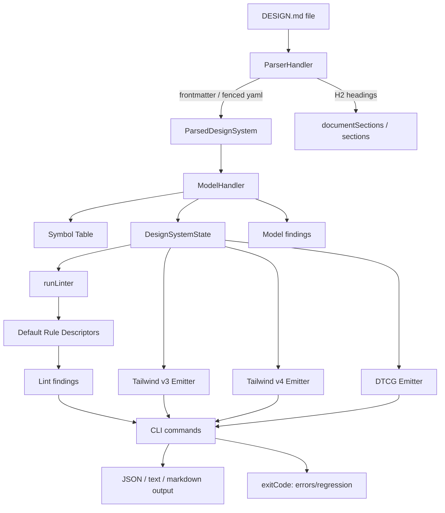

# DESIGN.md

> 一句话定位：Google Labs / Stitch 开源的 agent-readable 设计系统文件格式与 CLI：用 `YAML front matter` 承载机器可读 design tokens，用 Markdown prose 承载设计意图、审美约束和使用 rationale，让 coding agent 在不同会话、不同工具之间稳定复用同一套视觉身份。

## 基本信息

| 项目 | 值 |
|------|----|
| 仓库 | `google-labs-code/design.md` |
| URL | `https://github.com/google-labs-code/design.md` |
| Homepage | `https://stitch.withgoogle.com/docs/design-md/specification` |
| Star | 22,697（GitHub API，2026-06-28） |
| Fork | 1,811（GitHub API，2026-06-28） |
| Watcher | 118（GitHub API，2026-06-28） |
| 许可证 | Apache-2.0 |
| 主要语言 | TypeScript |
| 首次提交 | `2cdc1ef` / 2026-04-10：Initial commit |
| 最近提交 | `2a19f5d` / 2026-06-15：`feat: add token-like-ignored lint rule for silently dropped frontmatter keys (#105)` |
| 最新 Release | `0.3.0` / 2026-06-15 |
| npm 包 | `@google/design.md@0.3.0`（npm registry，2026-06-28） |
| Issue / PR 健康口径 | open issues：24；open PRs：30；repo `open_issues_count=54` 含 PR（GitHub Search/API，2026-06-28） |
| 贡献者数 | 18（`git shortlog`，2026-06-28） |
| 本地源码规模 | 123 个 tracked files；约 15,807 行文本；TypeScript 约 8,700 行、Markdown 约 3,299 行、JSON 约 2,849 行（排除 `.git/node_modules/dist/.turbo`，2026-06-28） |
| 本地实测 | `bun run lint` 通过；`bun run test`：282 pass / 1 skip / 0 fail，283 tests across 34 files；`bun run build` 通过；CLI lint/export smoke 通过 |
| 分析日期 | 2026-06-28 |
| 本地分析版本 | `2a19f5d` / tag `0.3.0` |

---

## 定位与类比

### 一句话定位

DESIGN.md 不是一个 UI 生成器，也不是 Figma 替代品。它是 **面向 coding agent 的设计系统上下文格式**：把视觉身份拆成“机器可验证的 token 层”和“模型可理解的 prose 层”，再提供 CLI 做 lint、diff、export、spec 输出。

### 类比法

- 类似 `AGENTS.md / CLAUDE.md`，但对象不是工程约束，而是视觉身份与设计系统。
- 类似 design tokens / W3C DTCG / Style Dictionary，但它不只保存数值 token，还强调设计意图、参考物、负面约束和应用 rationale。
- 类似 Tailwind theme config，但它不是某个 CSS 框架的配置文件，而是 agent 与多工具共享的上游设计上下文。
- 类似 Open Design 中的 `DESIGN.md` 设计系统能力，但 DESIGN.md 本身只定义格式、校验器和导出器，不负责项目工作台、预览、Agent spawn 或设计产物生成。

### 项目分类

`Agent-Native Design Context / Design System File Format / CLI Linter & Exporter`

---

## 场景一：是否值得采用

### 解决的问题

AI coding agent 写前端时最常见的问题不是“不知道怎么写 CSS”，而是：

1. **缺少稳定审美上下文**：每次会话都靠一句“现代、干净、高级”，模型自然回到平均化模板。
2. **设计系统不可迁移**：Figma、Tailwind、tokens.json、prompt、README 各说各话；agent 读到的是碎片。
3. **token 有数值但无意图**：`#B8422E` 告诉 agent 颜色是什么，但不告诉它为什么存在、能用在哪里、不能用在哪里。
4. **跨工具难复用**：Claude Code、Codex、Cursor、Stitch、Open Design、内部脚手架都需要同一份视觉契约。
5. **设计 drift 难检查**：改 token、改 section、改 component ref 后，需要 lint/diff/export，而不是靠肉眼审 Markdown。

DESIGN.md 的核心答案是：

```text
YAML tokens = normative values
Markdown prose = rationale / taste / constraints
CLI = validation / diff / export / machine-readable report
```

### 核心能力与边界

#### 能做什么

- 定义 `name / description / colors / typography / rounded / spacing / components` 等设计系统 token。
- 支持 token reference：`{colors.primary}`、`{typography.label-md}` 等。
- 支持嵌套 token、CSS color 解析、WCAG contrast 检查、section order 检查、unknown key 检查、orphaned token 检查。
- 将 DESIGN.md 导出为：
  - Tailwind v3 `theme.extend` JSON；
  - Tailwind v4 `@theme` CSS；
  - W3C Design Tokens / DTCG JSON。
- 用 `diff` 比较两个 DESIGN.md 的 token-level 变化和 lint regression。
- 用 `spec` 输出当前格式规范和规则表，方便 agent / 文档系统读取。
- 作为 npm 包 `@google/design.md` 在 CI、脚手架、agent workflow 中调用。

#### 不能做什么

- 不生成最终 UI；它只是上下文格式和工具链。
- 不提供视觉预览、设计画布、组件库 runtime、Figma plugin 或多人协作。
- 不替代成熟 design token pipeline；当前导出目标有限，主要围绕 Tailwind 与 DTCG。
- 不强约束所有设计系统维度；motion、iconography、elevation、layout 等很多内容仍通过 prose / extension keys 表达。
- 不保证 agent 一定“审美好”；它只把可读上下文和契约变稳定，最终效果仍取决于模型、agent harness 和执行流程。

#### 与竞品 / 邻近方案差异

| 对象 | DESIGN.md 的差异 |
|---|---|
| W3C DTCG / tokens.json | DTCG 更规范化 token；DESIGN.md 增加 prose rationale，让 agent 理解“为什么这样用”。 |
| Style Dictionary | Style Dictionary 强在跨平台 token build pipeline；DESIGN.md 强在 agent-readable 设计上下文。 |
| Tailwind config | Tailwind 是实现层配置；DESIGN.md 是上游设计身份，可以导出到 Tailwind。 |
| Open Design | Open Design 是设计工作台 / agent shell；DESIGN.md 是其中可复用的设计系统协议层。 |
| Claude Design / Stitch | Stitch 是产品；DESIGN.md 是可跨平台复用的开放格式和 CLI。 |

### 集成成本

- **依赖链**：npm 包依赖 `citty`、`remark-*`、`unified`、`yaml`、`zod` 等，体积和复杂度都较轻。
- **运行时**：Node/npm 直接用；仓库开发使用 Bun + Turbo。
- **使用入口**：
  - `npx @google/design.md lint DESIGN.md`
  - `npx @google/design.md diff old.md new.md`
  - `npx @google/design.md export DESIGN.md --format css-tailwind`
  - `npx @google/design.md spec --rules --format json`
- **接入 CI 成本**：低。把 lint/diff 放进 PR workflow 即可。
- **接入 agent 成本**：低到中。低在文件格式简单；中在需要团队真正写好 prose，而不是只贴 token。
- **从零到 demo**：几分钟。设计体系真实落地的成本主要在写出高质量 DESIGN.md，而不是工具安装。

### 风险评估

| 风险项 | 评估 | 说明 |
|--------|------|------|
| 许可证合规 | ✅ | Apache-2.0；适合商业使用和内部集成。 |
| Bus factor | 中 | Google Labs 项目、Stars 很高，但提交集中在少数维护者；核心 commit 数约 40，仍是早期项目。 |
| 供应商锁定 | 低/中 | 格式是 Markdown + YAML，天然可迁移；但生态话语权来自 Google/Stitch，未来 spec 演进要观察。 |
| 维护趋势 | 活跃但早期 | 2026-04-10 创建，2026-06-15 发布 0.3.0；Issue/PR 活跃，仍处 alpha/早期规范期。 |
| 安全历史 | 低风险 | CLI 主要处理本地 Markdown/YAML，无远程执行面；但供应链上仍要关注 npm 包和依赖。 |
| 规范稳定性 | ⚠️ | version 当前为 `alpha`，很多类别通过 extension key / prose 兜底，schema 还会变。 |
| 企业采用 | ⚠️ | 作为上下文文件和 lint 可采用；作为“公司级设计系统唯一事实源”还需要和 Figma/DTCG/Style Dictionary 流程打通。 |

### 采用结论

**推荐采用：个人/小团队可直接放进前端仓库；企业可作为 AI coding agent 的设计上下文层试点，但不要立刻替代正式 design token pipeline。**

推荐路径：

1. 在每个有 UI 的项目根目录放 `DESIGN.md`，作为 agent 读设计上下文的固定入口。
2. 把 `npx @google/design.md lint DESIGN.md` 加进 CI。
3. 如果已有 Tailwind，先用 `export --format css-tailwind` 或 `json-tailwind` 做单向输出试验。
4. 如果已有 tokens.json / Figma Variables / Style Dictionary，不要一上来迁移全部；先把 DESIGN.md 当“agent-readable design brief + token subset”。
5. 团队内要求 prose 写具体参考物和负面约束，避免“modern / clean / premium”这种空泛形容词。

---

## 场景二：技术架构学习

### 核心架构图



### 底层技术架构

#### 最小架构内核

```text
Markdown/YAML Parser
+ Typed Token Model Builder
+ Symbol Table / Reference Resolver
+ Rule Descriptor Linter
+ Export Emitters
+ CLI Contract
```

这个系统成立的关键不是“又定义了一套 token schema”，而是把 **agent-facing prose** 和 **tool-facing tokens** 放进同一个 plain-text artifact，并用确定性 CLI 把这个 artifact 变成可校验、可 diff、可导出的工程契约。

#### 核心抽象

| 抽象 | 源码位置 | 职责 | 关键字段 / 方法 | 为什么重要 |
|------|----------|------|-----------------|------------|
| `ParserHandler` | `packages/cli/src/linter/parser/handler.ts` | 从 Markdown 中提取 YAML frontmatter / fenced yaml block，并提取 H2 section 结构 | `execute()`、`mergeCodeBlocks()`、`toDesignSystem()` | 把“人读的 Markdown 文件”转成“工具可处理的结构化输入”。 |
| `ParsedDesignSystem` | `packages/cli/src/linter/parser/spec.ts` | parser 输出的中间对象 | `name/colors/typography/rounded/spacing/components/sourceMap/rawValues/sections` | 保留 raw values 与 source map，为 lint/unknown key/fixer 留入口。 |
| `ModelHandler` | `packages/cli/src/linter/model/handler.ts` | 把 raw YAML 解析成 typed state，解析颜色、尺寸、字体、组件、引用 | `execute()`、`parseColor()`、`resolveReference()`、`forEachLeaf()` | 系统的数据面核心：所有 lint 和 export 都依赖它产出的 resolved model。 |
| `DesignSystemState` | `packages/cli/src/linter/model/spec.ts` | 统一运行时状态 | `colors/typography/rounded/spacing/components/symbolTable/unknownKeys` | 让规则和 emitter 不再关心 Markdown/YAML 细节，只消费统一模型。 |
| `RuleDescriptor` / `LintRule` | `packages/cli/src/linter/linter/rules/types.ts`、`runner.ts` | 描述 lint 规则、默认 severity、执行函数 | `name/severity/description/run()` | 把质量检查做成可组合、可输出 spec 的规则表。 |
| Default rules | `packages/cli/src/linter/linter/rules/index.ts` | 聚合 broken-ref、contrast、orphan、section-order 等规则 | `DEFAULT_RULE_DESCRIPTORS`、`DEFAULT_RULES` | rule registry 是工具可扩展和可解释的控制面。 |
| Emitters | `tailwind/handler.ts`、`tailwind/v4/handler.ts`、`dtcg/handler.ts` | 从 `DesignSystemState` 输出目标格式 | `execute(state)` | 让 DESIGN.md 不停在文档层，而能进入真实前端 build pipeline。 |
| CLI commands | `packages/cli/src/commands/*.ts`、`src/index.ts` | 外部契约：lint/diff/export/spec | `defineCommand()`、`process.exitCode` | agent/CI 调用的稳定边界。 |
| Spec config | `packages/cli/src/linter/spec-config.ts` + `spec-config.yaml` | 单一规范事实源 | `getSpecConfig()`、`CANONICAL_ORDER`、`VALID_*` | linter 与 docs/spec 共享同一配置，减少规范/实现漂移。 |

#### 控制面 / 数据面分离

- **控制面**
  - `spec-config.yaml` / `spec-config.ts`：定义版本、section order、valid typography props、component sub tokens、limits。
  - `DEFAULT_RULE_DESCRIPTORS`：定义哪些规则执行、默认 severity 和描述。
  - CLI command layer：定义命令、参数、输出格式、exit code。
  - `diff` command：定义 regression 判定策略（errors/warnings 增加即 regression）。

- **数据面**
  - `ParserHandler`：读取输入 Markdown，解析 AST/YAML。
  - `ModelHandler`：解析 CSS color/dimension/typography，构建 symbol table，解析 token reference。
  - lint rules：消费 state，生成 findings。
  - emitters：把 state 转成 Tailwind/DTCG 目标数据。

这个分离很清楚：控制面决定“什么算规范、什么算问题、怎么输出”；数据面负责“把 DESIGN.md 真正转成模型并处理”。

#### 关键执行链路

**链路 1：`lint DESIGN.md`**

```text
CLI lint command
  ↓ readInput(file | stdin)
lint(content)
  ↓ ParserHandler.execute()
提取 YAML blocks + H2 sections
  ↓ ModelHandler.execute()
解析 colors / typography / rounded / spacing / components
构建 symbolTable 与 unresolvedRefs
  ↓ runLinter()
执行 broken-ref / missing-primary / contrast / orphaned / section-order / unknown-key 等规则
  ↓ formatOutput()
输出 JSON/text/markdown report
  ↓
errors > 0 时 exitCode = 1
```

**链路 2：`export DESIGN.md --format css-tailwind`**

```text
CLI export command
  ↓ 校验 format enum
readInput + lint(content)
  ↓ 取得 DesignSystemState
TailwindV4EmitterHandler.execute(state)
  ↓ 验证 token name 是否符合 CSS identifier 约束
生成 theme data
  ↓ serializeTailwindV4()
输出 @theme CSS
  ↓
lint errors > 0 时 exitCode = 1
```

本地 smoke test 对 `examples/atmospheric-glass/DESIGN.md` 输出的 `@theme` CSS 前几行：

```css
@theme {
  --color-surface: #0b1326;
  --color-surface-dim: #0b1326;
  --color-surface-bright: #31394d;
  --color-surface-container-lowest: #060e20;
```

**链路 3：`diff before after`**

```text
CLI diff command
  ↓ read before / after
lint(before) + lint(after)
  ↓ diffMaps() 比较 colors/typography/rounded/spacing/components
比较 summary.errors/warnings delta
  ↓
输出 tokens diff + findings delta + regression boolean
  ↓
regression 为 true 时 exitCode = 1
```

#### 状态模型

| 状态类型 | 位置 | 谁读写 | 生命周期 / 一致性规则 |
|----------|------|--------|------------------------|
| 持久状态 | `DESIGN.md` 文件、`docs/spec.md`、`spec-config.yaml`、examples | 用户 / 维护者 / agent 修改；CLI 读取 | DESIGN.md 是项目级事实源；`docs/spec.md` 由 spec generator 生成，不应手写。 |
| 运行时状态 | `ParsedDesignSystem`、`DesignSystemState`、`symbolTable`、`findings`、`tailwindConfig` | parser/model/linter/emitter 在一次命令内创建 | 无 daemon / DB；每次 CLI run 从文件重新构建，天然可复现。 |
| 外部状态 | npm registry、GitHub repo、Tailwind/DTCG consumers、coding agents | CI/用户/agent 调用 | npm 包版本和 spec version 需要与项目文件约定；agent 只读 DESIGN.md，真实实现由项目代码承担。 |

#### 契约边界

- **内部契约**
  - `ParserHandler.execute({ content }) -> ParserResult`
  - `ModelHandler.execute(ParsedDesignSystem) -> { designSystem, findings }`
  - `runLinter(DesignSystemState, rules?) -> LintResult`
  - `EmitterHandler.execute(DesignSystemState) -> { success, data | error }`

- **外部 CLI 契约**
  - `design.md lint <file> [--format json|text|markdown]`
  - `design.md diff <before> <after> [--format json|text]`
  - `design.md export <file> --format css-tailwind|json-tailwind|tailwind|dtcg`
  - `design.md spec [--rules] [--rules-only] [--format markdown|json]`
  - 输出默认 JSON；错误或 regression 通过 exit code 表达。

- **Agent-facing 契约**
  - 文件名/位置：项目中的 `DESIGN.md`。
  - 结构：顶部 YAML frontmatter + Markdown H2 sections。
  - 语义：tokens 是 normative values；prose 是设计意图、参考物、约束和使用解释。
  - 关键 prompt contract：agent 不应只复制 token，而应根据 prose 理解“何时使用 / 何时不用 / 视觉性格”。

#### 失败与降级模型

| 失败类型 | 检测方式 | 系统行为 | 降级 / 修复动作 |
|----------|----------|----------|------------------|
| 无 YAML | `ParserHandler` 返回 `NO_YAML_FOUND` recoverable | lint 返回 warning + empty design system | 允许 prose-only 文件被读；提示补 frontmatter。 |
| YAML 语法错误 | YAML parser error | recoverable parse failure；lint 报 warning / fatal path 根据调用处理 | 修 YAML；CI 中可作为失败门槛。 |
| duplicate top-level section | `mergeCodeBlocks()` 检测重复 key | 返回 `DUPLICATE_SECTION` | 合并 token block，避免多处定义同一 schema key。 |
| invalid color / dimension / typography | `ModelHandler` 解析失败 | findings 记录 error | 修 token 值；export 可能缺失相关 token。 |
| token reference 断裂 / 循环 | `resolveReference()` + component `unresolvedRefs` | broken-ref rule 报 error | 修 `{path.to.token}`；CI 应 fail-closed。 |
| component contrast 不足 | `contrastCheck` 计算 WCAG ratio | warning | 调色或调整 text/background token。 |
| unknown token-like key 被 export 忽略 | `tokenLikeIgnoredRule` | warning | 移入支持的 schema key 或明确作为 extension prose 使用。 |
| Tailwind v4 token name 不合法 | `TailwindV4EmitterHandler` 校验 | export 返回 error | 改 token name，避免生成非法 CSS variable。 |
| npm registry / Windows bin resolution | README 专门记录 | 使用 `designmd` alias 或检查 registry | 对平台差异有明确 workaround。 |

#### 可复刻设计不变量

1. **plain text artifact 优先**：agent-facing 设计上下文必须能被任何工具直接读，不能困在 Figma/数据库/私有 UI 里。
2. **prose 与 token 同文件**：数值告诉 agent“是什么”，prose 告诉 agent“为什么、何时、如何使用”。两者分开会导致 drift。
3. **tokens 是 normative，prose 是 semantic**：实现层以 token 为准，生成层以 prose 约束审美。
4. **lint/report 必须结构化**：agent 和 CI 需要 JSON findings，而不是只给人看的文字。
5. **parser/model/rules/emitter 分层**：不要让 CLI 命令直接解析 YAML 或生成 Tailwind；中间模型必须稳定。
6. **symbol table 是 reference 系统的核心**：所有 `{path.to.token}` 都应先归一到统一 lookup，再给规则和 emitter 使用。
7. **spec 单一事实源**：规范文档、linter 常量和 CLI 输出规则应从同一份 config 派生。
8. **fail-open 与 fail-closed 分级**：prose-only/unknown extension 可以 warning；broken ref / invalid token 应能让 CI fail。
9. **export 是下游适配，不是核心语义**：Tailwind/DTCG 只是目标格式；DESIGN.md 的核心语义不能被某个 CSS 框架绑死。
10. **负面约束比形容词更有效**：具体参考物 + intentional don’ts，比“高级、干净、现代”更能稳定 agent 输出。

### 关键设计决策与 trade-off

| 决策 | 选择 | 放弃了什么 | 为什么 |
|------|------|-----------|--------|
| 文件格式 | Markdown + YAML frontmatter | 二进制/DB/Figma-only/schema-only JSON | 最适合 Git、PR、agent 读取、人类维护。 |
| 设计表达 | token + prose 双层 | 纯 token 或纯 prompt | token 可验证，prose 承载审美语义。 |
| schema 策略 | 小核心 + extension-friendly | 一次性标准化所有设计领域 | 让格式先被用户扩展，而不是被 spec 过早锁死。 |
| 工具入口 | npm CLI | 桌面工作台 / SaaS / 插件优先 | 降低采用门槛，适合 CI 和 agent 调用。 |
| rule 设计 | descriptor registry | 散落 if/else 检查 | 可输出规则表、可组合、可测。 |
| export 目标 | Tailwind v3/v4 + DTCG | 全平台 token build | 聚焦前端 agent 高频场景，保持工具轻。 |
| parser 容忍度 | frontmatter + fenced yaml block | 只允许严格 frontmatter | 支持文档中分段嵌入 token，但用 duplicate key 检查守边界。 |

### 值得学习的模式

1. **Agent-readable spec as source artifact**
   - DESIGN.md 把“给模型看的上下文”从 prompt 临时文本升级成 repo artifact。
   - 这适用于很多领域：`SECURITY.md` 给 security agent、`DATA.md` 给 data agent、`RUNBOOK.md` 给 ops agent。

2. **Prose-first design protocol**
   - `PHILOSOPHY.md` 明确说 prose 才是设计生命所在，token 只是支撑。
   - 对 AI 产品尤其重要：LLM 更擅长从具体场景/参考物/负面约束中稳定生成，而不是从 token 数值中自动推导审美。

3. **Rule descriptors drive both validation and documentation**
   - `DEFAULT_RULE_DESCRIPTORS` 不只执行 lint，也能被 `spec --rules` 输出。
   - 这是“实现即文档”的轻量版本。

4. **Exporters depend on resolved state, not raw YAML**
   - Tailwind/DTCG emitter 只看 `DesignSystemState`。
   - 这样 parser、schema、sourceMap、frontmatter 变化不会污染下游 emitter。

5. **早期规范保持 extension seam**
   - unknown section preserve，unknown custom keys 可接受；token-like ignored 才 warning。
   - 这比“过早闭合 schema”更适合 alpha 规范。

### 反模式 / 踩坑点

1. **把 DESIGN.md 当完整设计系统替代品**
   - 它当前更像 agent context layer，不应直接替代 Figma Variables / DTCG / Style Dictionary / design review process。

2. **只写 token，不写具体 prose**
   - 这会丢掉项目最核心价值。`PHILOSOPHY.md` 已经强调：具体参考比形容词更有用。

3. **过度泛化 spec**
   - motion、iconography、elevation、data viz、component variants 都可能诱惑项目快速膨胀。当前“小核心 + extension”是对的，后续需防止 schema 变成又一个庞大设计系统标准。

4. **diff regression 口径偏粗**
   - 当前 `diff` 以 warnings/errors 数量增加判 regression；简单有效，但对真实设计系统变更还不够语义化。

5. **对 alpha spec 的生产期待过高**
   - 当前 release 到 0.3.0、spec version alpha；企业流程应先试点，不要把它当冻结标准。

### 可借鉴的具体技术点

- `ParserHandler` 用 `unified + remark-parse + remark-frontmatter` 同时处理 YAML 和 Markdown sections。
- `ModelHandler` 的 `symbolTable` + `resolveReference()` 是轻量 token reference resolver 的可复用样板。
- `spec-config.yaml` 作为 linter/docs/spec generator 的单一事实源，值得所有格式规范工具借鉴。
- `RuleDescriptor` 让 lint rule 自带 `name/severity/description/run`，能直接生成规则文档。
- Tailwind v4 emitter 在 emit 前统一校验 token name，避免生成非法 CSS variable。
- CLI 默认 JSON output + exit code，可直接给 agent/CI 使用。

---

## 架构解剖

### 目录结构

| 目录 / 文件 | 职责 |
|------|------|
| `README.md` | 格式说明、快速开始、CLI reference、Windows/npm registry troubleshooting。 |
| `PHILOSOPHY.md` | 核心理念：prose-first、具体参考、负面约束、小核心扩展。 |
| `docs/spec.md` | 生成后的 DESIGN.md format spec。 |
| `packages/cli/src/index.ts` | CLI entrypoint，注册 lint/diff/export/spec。 |
| `packages/cli/src/commands/` | CLI command handlers。 |
| `packages/cli/src/linter/parser/` | Markdown/YAML parser 与 parsed spec。 |
| `packages/cli/src/linter/model/` | token model、color/dimension/typography parser、reference resolver。 |
| `packages/cli/src/linter/linter/` | lint runner、rules、finding spec。 |
| `packages/cli/src/linter/tailwind/` | Tailwind v3 JSON emitter。 |
| `packages/cli/src/linter/tailwind/v4/` | Tailwind v4 `@theme` CSS emitter 与 serializer。 |
| `packages/cli/src/linter/dtcg/` | W3C Design Tokens / DTCG emitter。 |
| `packages/cli/src/linter/spec-gen/` | 从 MDX + spec config 生成 spec 文档。 |
| `examples/*/DESIGN.md` | 示例设计系统：atmospheric-glass、paws-and-paths、totality-festival。 |
| `.github/workflows/test.yml` | CI：lint、test、build、Node smoke、tarball smoke、Windows npm registry smoke。 |

### 技术栈

- **运行时 / 框架**：TypeScript、Node target、Bun `1.3.x`、Turbo。
- **CLI**：`citty`。
- **Markdown/YAML**：`unified`、`remark-parse`、`remark-frontmatter`、`remark-mdx`、`yaml`。
- **类型/校验**：TypeScript、`zod`。
- **测试**：`bun test`。
- **构建**：`bun build` + `tsc --emitDeclarationOnly`。
- **发布**：npm package `@google/design.md`，bin 同时提供 `design.md` 和 Windows-friendly `designmd`。

### 模块依赖关系

```text
src/index.ts
  └─ commands/{lint,diff,export,spec}.ts
       └─ linter/index.ts
            ├─ lint.ts
            │   ├─ parser/handler.ts
            │   ├─ model/handler.ts
            │   ├─ linter/runner.ts
            │   └─ tailwind/handler.ts
            ├─ tailwind/v4/handler.ts
            ├─ dtcg/handler.ts
            └─ spec-gen/spec-helpers.ts
```

### 扩展机制

- **格式扩展**：unknown top-level keys 和 unknown sections 默认可保留；token-like unknown key 会 warning。
- **规则扩展**：`runLinter(state, rules?)` 支持传入自定义 rule 列表。
- **导出扩展**：新增 emitter 可以消费 `DesignSystemState`，无需改 parser。
- **spec 扩展**：修改 `spec-config.yaml` 后运行 `bun run spec:gen`。
- **CLI 扩展**：在 `src/index.ts` 注册新的 `subCommands`。

---

## 质量与成熟度

### 代码质量

- **类型系统**：TypeScript 类型边界清楚，parser/model/linter/emitter 都有 spec/interface 文件。
- **错误处理**：Parser 不直接 throw，返回 recoverable / non-recoverable result；Model catch unexpected error 并转 finding。
- **结构清晰度**：模块拆分非常干净，适合小型 CLI 工具维护。
- **工程纪律**：spec-config 单一事实源、rules descriptor、tests 覆盖常见 edge cases。
- **不足**：当前仍是 alpha 规范；某些语义判断较朴素，例如 diff regression、orphan token family heuristic、prose 质量本身无法验证。

### 测试

本地实测命令：

```bash
bun install --frozen-lockfile
bun run lint
bun run test
bun run build
node packages/cli/dist/index.js lint examples/atmospheric-glass/DESIGN.md
node packages/cli/dist/index.js export examples/atmospheric-glass/DESIGN.md --format css-tailwind
node packages/cli/dist/index.js export examples/atmospheric-glass/DESIGN.md --format dtcg
```

真实结果：

- `bun run lint`：通过，`tsc --noEmit --skipLibCheck` successful。
- `bun run test`：282 pass / 1 skip / 0 fail，283 tests across 34 files。
- `bun run build`：通过，bundle 输出 `index.js` 约 0.80 MB、`linter/index.js` 约 0.68 MB。
- CLI lint 示例：`examples/atmospheric-glass/DESIGN.md` 返回 0 errors、4 warnings、1 info；warnings 是透明玻璃背景与白字 contrast ratio 计算为 1.00:1。
- CLI export 示例：`css-tailwind` 成功输出 `@theme` CSS；`dtcg` 成功输出 `$schema/$description/color/spacing/rounded/typography`，其中 color token 47 个、spacing token 5 个。

测试覆盖值得肯定：parser、model、rules、Tailwind/DTCG emitters、commands、spec generator 都有单元测试。DTCG conformance 中有 1 个 Terrazzo 解析测试 skip，说明跨生态 conformance 还没完全收敛。

### CI/CD

`.github/workflows/test.yml` 包含：

1. Ubuntu：checkout → setup Bun 1.3.9 → install → lint → test → build → Node smoke test → tarball smoke test。
2. Windows：从 public npm registry 安装 `@google/design.md@latest`，验证 `spec --rules-only --format json` 和 package import。

CI 质量不错，尤其是 tarball smoke 和 Windows registry smoke，直接覆盖了 npm 分发与 Windows `.md` bin 名冲突问题。

### 文档质量

- README 非常实用：格式、快速开始、CLI reference、Windows/PowerShell、npm registry 问题都有写。
- `docs/spec.md` 完整解释 schema、section order、tokens、component tokens、consumer behavior。
- `PHILOSOPHY.md` 是项目最有价值的文档之一：明确 DESIGN.md 的核心不是 token 精度，而是 prose intent。
- 不足：规范仍 alpha；真实生态如何从 Figma/tokens.json 反向生成 DESIGN.md 还缺少正式 guide。

### Issue/PR 健康度

- Open issues：24；open PRs：30；closed issues：30；closed PRs：63（GitHub Search，2026-06-28）。
- 最新 open issues 包括：token name collision、accessibility considerations、structured shadows/elevation、color-blind contrast lint、missing file ENOENT 等。
- 这说明社区需求集中在：更强 lint、更多 token 类别、可访问性和更完整 design-system 表达。
- 合并节奏较快；v0.3.0 前后修复了 nested token、Windows npx、unknown-key、boolean YAML scalars 等现实问题。

---

## 社区与生态

### 社区评价

从 GitHub Search 和新闻 RSS 看到，DESIGN.md 已经快速成为“给 coding agent 的设计系统文件”这个小生态的事实中心之一：

- GitHub 上围绕 `google-labs-code/design.md` 已有 Claude Code skill、Hermes skill、OpenClaw skill、从截图生成 DESIGN.md、设计系统目录等衍生项目。
- Google News RSS 显示 Google blog 在 2026-04-21 发布过 “Stitch’s DESIGN.md format is now open-source...” 相关官方文章；后续 Atlassian、Meta Astryx 等新闻也在同一“agent-readable design system”方向上扩散。

这里需要区分两件事：

- **生态热度很高**：22k+ stars、很多二次 skill / curated DESIGN.md repo。
- **真实标准化仍早期**：spec alpha、release 0.3.0、企业设计系统迁移实践还需要沉淀。

### 衍生项目 / 插件生态

GitHub Search 样本（2026-06-28）：

- `eveiljuice/claude-plugin-design-md`：Claude Code plugin，scaffold DESIGN.md。
- `minsu42/claude-skill-design-md`：从截图自动生成 DESIGN.md。
- `cxbl-ops/design-md-skill`：Hermes Agent skill。
- `kwakseongjae/oh-my-design`：安装大量 hand-verified company DESIGN.md references 到 Claude Code / Codex / Cursor / OpenCode。
- `VoltAgent/awesome-design-md`：DESIGN.md 文件集合与品牌设计系统分析。

生态方向很清楚：DESIGN.md 正在被包装成 agent skill、品牌参考库、截图提取工具、设计系统迁移工具，而不是只作为 Google 自家 CLI 存在。

### 竞品对比

| 项目 / 方案 | 类型 | 与 DESIGN.md 的关系 |
|---|---|---|
| W3C Design Tokens / DTCG | 标准格式 | DESIGN.md 可 export 到 DTCG；DTCG 更偏 token 数据交换。 |
| Style Dictionary | token build system | 可作为 DESIGN.md 下游或并行 pipeline；Style Dictionary 更成熟。 |
| Tokens Studio for Figma | Figma token workflow | 上游设计工具；DESIGN.md 更适合 agent/code repo。 |
| Tailwind CSS theme | CSS framework config | DESIGN.md 可导出 Tailwind；Tailwind 是实现目标不是设计语义源。 |
| Open Design | agent-native 设计工作台 | DESIGN.md 可以作为其中的设计系统层；Open Design 产品面更大。 |
| Claude Design / Stitch | 设计生成产品 | DESIGN.md 是可跨平台复用的开放格式。 |

---

## 关键代码走读

### 1. `lint()` pipeline

- 路径：`packages/cli/src/linter/lint.ts`
- 职责：把 parser、model、linter、Tailwind emitter 串成一次完整 lint report。
- 实现要点：
  - `ParserHandler().execute({ content })` 先解析 Markdown/YAML。
  - recoverable parse failure 会返回 empty design system + warning，而不是直接崩溃。
  - model findings 和 lint rule findings 合并后输出 summary。
  - report 中同时包含 `designSystem`、`findings`、`tailwindConfig`、`sections`、`documentSections`。

### 2. `ParserHandler`

- 路径：`packages/cli/src/linter/parser/handler.ts`
- 职责：从 Markdown AST 中提取 YAML token blocks 和 H2 section 结构。
- 实现要点：
  - 使用 `unified().use(remarkParse).use(remarkFrontmatter, ['yaml'])`。
  - 支持 frontmatter 与 fenced yaml code block。
  - `mergeCodeBlocks()` 会拒绝重复 top-level keys，避免多个 block 同时定义 `colors`。
  - `documentSections` 保留 section content，给 fixer 和 section order 规则使用。

### 3. `ModelHandler`

- 路径：`packages/cli/src/linter/model/handler.ts`
- 职责：把 raw parsed tokens 转成 resolved model。
- 实现要点：
  - colors 通过 `parseCssColor()` 转成 sRGB / hex / luminance。
  - typography 支持 `fontFamily/fontSize/fontWeight/lineHeight/letterSpacing/fontFeature/fontVariation`。
  - rounded/spacing 支持 dimension 与 reference。
  - component props 支持 string/number/boolean，修复了 YAML scalar 导致 crash 的问题。
  - `resolveReference()` 支持 chained reference 和 cycle/depth 保护。

### 4. Default lint rules

- 路径：`packages/cli/src/linter/linter/rules/index.ts`
- 职责：定义默认规则组合。
- 规则包括：
  - `broken-ref`：断裂引用 / unknown component sub-token。
  - `missing-primary`：缺少 primary color。
  - `contrast-ratio`：组件 text/background WCAG AA 检查。
  - `orphaned-tokens`：未被组件引用的 token。
  - `token-summary`：token 数摘要。
  - `missing-sections` / `section-order` / `missing-typography`。
  - `unknown-key` / `token-like-ignored`。

### 5. Export emitters

- 路径：
  - `packages/cli/src/linter/tailwind/handler.ts`
  - `packages/cli/src/linter/tailwind/v4/handler.ts`
  - `packages/cli/src/linter/dtcg/handler.ts`
- 职责：将 resolved state 转成外部 token format。
- 实现要点：
  - Tailwind v3 输出 `theme.extend.colors/fontFamily/fontSize/borderRadius/spacing`。
  - Tailwind v4 输出分类 theme data，再序列化为 `@theme` CSS variables。
  - DTCG 输出 `$schema`、color/spacing/rounded/typography groups。

---

## 评分

| 维度 | 评分(1-5) | 说明 |
|------|----------|------|
| 功能覆盖度 | 4 | 对“agent-readable design context + lint/export”覆盖很完整；但还不是全量 design token pipeline。 |
| 代码质量 | 4 | TypeScript 分层清楚、测试多、错误处理实际；alpha 项目仍有启发式和早期边界。 |
| 文档质量 | 5 | README、spec、PHILOSOPHY 都有高价值，尤其 prose-first 理念写得清楚。 |
| 社区活跃度 | 5 | 22k+ stars、衍生 skill/目录快速出现；但真实生产 adoption 仍需观察。 |
| 架构设计 | 4 | parser/model/rule/emitter/CLI 分层稳；scope 控制得好。缺少更成熟的 plugin/custom schema story。 |
| 学习价值 | 5 | 对 agent-native 文件协议、设计上下文工程化、prose+token 双层契约非常有启发。 |
| 可借鉴度 | 5 | 任何前端/内容/品牌型 agent workflow 都可以直接复用 DESIGN.md 思路。 |

综合：**⭐⭐⭐⭐⭐（架构学习） / ⭐⭐⭐⭐（生产采用，因 alpha spec 扣一星）**

---

## 总结

### 一句话评价

DESIGN.md 最重要的贡献不是发明了一套 token schema，而是把“审美上下文”变成了 agent 能稳定读取、CI 能验证、工程能导出的 plain-text 契约。

### 谁应该用

- 用 Claude Code / Codex / Cursor / Hermes 写前端的人。
- 希望减少 AI 生成 UI “模板味 / 平均化 / 每次不一致”的团队。
- 有 Tailwind 项目，想给 agent 一个设计系统入口的小团队。
- 想把品牌视觉、设计参考、负面约束沉淀成仓库文件的独立开发者。
- 做 agent-native design tooling、design-system extraction、screenshot-to-design-spec 的开发者。

### 谁不应该直接用作唯一事实源

- 已有成熟 Figma Variables + Style Dictionary + 多端 token pipeline 的企业，不应直接替换全部流程。
- 需要强多人协作设计画布、视觉 diff review、设计审批流程的团队。
- 需要稳定冻结标准的企业级 design system governance；当前 spec 仍是 alpha。

### 下一步

1. 在 TK 内把它归到 `Agent Platform / Desktop / Design` 的 design context 子类。
2. 对已有前端项目试点：添加 `DESIGN.md` + CI lint。
3. 如果做 agent 工作流，可以把 `DESIGN.md` 读取写进 `AGENTS.md` / skill / project bootstrap。
4. 后续值得跟踪：structured shadows/elevation、color-blind contrast、token collision detection、Figma/DTCG round-trip、prose quality lint。
