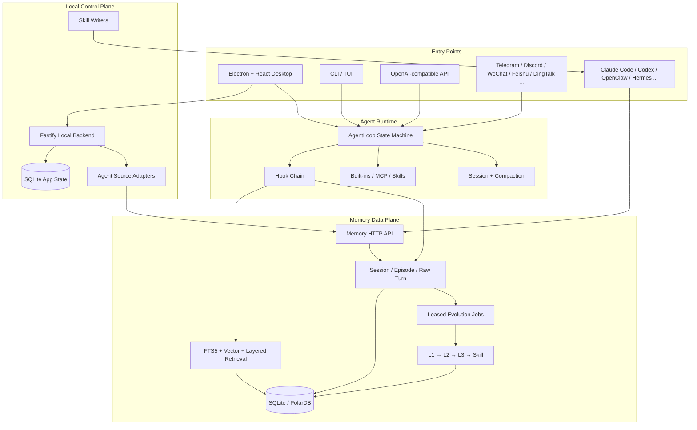

# Memmy Agent

> 一句话定位：把跨 Agent 历史接管、本地持久记忆、经验到技能的异步演化、完整 Agent runtime 和桌面控制面压进同一 TypeScript 产品；Memory 状态机有高复用价值，但整仓默认权限、API/browser 边界和二进制供应链尚不适合直接进入生产关键路径。

> 项目地址：<https://github.com/MemTensor/memmy-agent>  
> 分析日期：2026-07-31  
> 源码快照：`211d521b310fc23c63dd3d9ca848941173981c5e`（`main`）  
> 分析边界：源码、文档、Git 历史、GitHub 元数据与静态安全分析；**未安装依赖、未启动服务、未运行项目测试或安装包**。

## 基本信息

| 项目 | 结论 |
|---|---|
| 项目定位 | 个人 AI Agent + 本地共享记忆中枢：让 Claude Code、Codex、OpenClaw、Hermes Agent 等共享同一份用户、项目和技能记忆 |
| 组织关系 | MemTensor 旗下产品；仓内 Memory 引擎是 MemOS 思路的 TypeScript / SQLite 端侧产品化实现，不是与 MemOS 无关的第三方封装 |
| 产品形态 | Electron/React 桌面端、CLI/TUI、OpenAI-compatible API、Memory HTTP API、消息渠道与第三方 Agent source adapters |
| 核心语言 | TypeScript / TSX，少量 JavaScript、Shell、CSS |
| 许可证 | MIT |
| 主要栈 | TypeScript、Electron 38、React、Fastify、SQLite / `node:sqlite` / `better-sqlite3`、`sqlite-vec`、Playwright MCP、Vitest |
| 语言 | TypeScript / TSX / JavaScript / CSS |
| 公开历史 | 2026-07-16 建仓；本地 Git 快照 44 commits、9 个 API contributor identity；历史很短但提交和 PR 密集 |
| 社区快照 | 2026-07-31 Jina/GitHub HTML：274 stars、33 forks、8 open issues、4 open / 104 closed PR；Product Hunt 当日 #2、452 points、726 followers |
| 最新稳定发布 | 分析时 GitHub Release 页面为 v1.0.4；主线与 PR 页面已出现 v1.0.5 分支合并活动，但 `main` 仍锁定上述 commit |
| 综合判断 | **隔离试用 / 架构学习推荐；整仓生产采用暂缓** |
| 架构学习价值 | ⭐⭐⭐⭐⭐ |

Memmy 最准确的定义不是“带向量搜索的桌面聊天工具”，而是三个系统叠在一起：

1. **Memory substrate**：把 turn、episode、反馈、召回、策略、世界模型和 skill trial 做成持久状态；
2. **Agent runtime**：模型循环、工具、MCP、Skills、压缩、会话、渠道和 OpenAI-compatible API；
3. **Personal control plane**：Electron 桌面、Fastify 本地后端、账户/BYOK、历史扫描、记忆面板和安装包更新。

它的产品差异不在单点检索分数，而在“**把多个现有 Agent 的历史和未来会话收敛到一个可检查、可编辑、可反馈的本地记忆状态机**”。

## 场景一：是否值得采用

### 解决的问题

Memmy 解决的是跨 Agent 的身份与工作上下文碎片化：

- Claude Code、Codex、Cursor、OpenClaw、Hermes 等各自保存会话，用户反复解释偏好、项目背景和失败经验；
- 普通 RAG 只返回相似文本，不区分一次性 trace、可复用 policy、稳定 world model 和可执行 skill；
- 个人 Agent 要同时处理桌面、CLI、API、消息渠道、工具和模型配置，单独拼接成本高；
- 历史扫描往往是一次性导入，缺少 checkpoint、增量水位、重试和跨来源统一 session identity。

Memmy 的回答是：以 `user_id + source + profile_id + host_session_key` 建立跨来源 session scope，把原始 turn 转成 episode 和分层 memory，再通过 hook 在未来任务前召回、任务后回写。

### 核心能力与边界

#### 当前源码已经具备

- **共享 Memory Service**：SQLite + FTS5 + vector entries；另有 PolarDB/Postgres schema 路径。
- **分层记忆**：`L1 trace → L2 policy → L3 world model → Skill`。
- **反馈演化闭环**：显式/隐式 feedback、reward pipeline、decision repair、candidate pool、trace-policy link、skill trial。
- **可靠异步处理**：`evolution_jobs` 有 queued/leased/succeeded/failed/dead_letter、dedupe key、attempts、lease 与 retry；embedding 有独立 retry queue。
- **混合检索**：文本、向量、分层候选、负面经验、skill 与 world model 共同进入 ranking / filtering / injected context。
- **跨 Agent 历史接管**：Cursor、Claude Code、Codex、OpenCode、OpenClaw、Hermes Agent 等 source adapters，带 incremental cursor/checkpoint 和 secret redaction。
- **完整 Agent runtime**：显式 loop state machine、provider adapter、tool registry、MCP、Skills、browser、auto-compaction、长任务、渠道和 OpenAI-compatible endpoint。
- **桌面产品面**：Electron + React + Fastify + SQLite app state，支持项目 workspace、聊天、记忆面板、配置、账号/BYOK 和更新。

#### 完整本地路径与官方云路径要分开

**本地可运行的核心路径**：Memory SQLite、BYOK 模型、CLI、Agent loop、MCP/Skills、本地 API、历史扫描和桌面 app state 都有源码。

**默认仍接官方服务的路径**：仓库 `.env.example` 预填 `MEMMY_CLOUD_SERVICE=https://memmy-api.memtensor.cn`；账户试用 token、promotion/referral、云配置和 lifecycle analytics 使用官方 cloud。README 所说“no data needs to be uploaded”应理解为能力允许 local-first，而不是所有默认构建路径都零出站。

### 依赖 / SDK 选型证据

- 根工作区共 10 个 `package.json`，141 个 dependency entries；核心依赖包括 `better-sqlite3`、`sqlite-vec`、`@huggingface/transformers`、`fastify`、`electron`、`react`、`vite`、`zod`、provider SDK 与 MCP SDK。
- Memory 选择 SQLite/FTS5/vector entry，而不是强依赖外部 Qdrant/Neo4j，适合端侧单用户产品；schema 同时保留 PolarDB/Postgres 路径，说明团队希望向服务化扩展。
- 141 个声明中 140 个没有 upper bound；lockfile 能固定当前安装，但 manifest 的长期升级边界偏宽。

| Dependency | Type | Used for | Problem solved | Evidence | Reuse signal | Caution |
|------------|------|----------|----------------|----------|--------------|---------|
| `better-sqlite3` + `node:sqlite` | embedded database | Memory service 与 desktop app state | 单机进程内事务、WAL、可恢复状态 | `Memory/package.json`、`App/backend`、repository implementations | 端侧单用户 durable state 可优先评估 | 两套 SQLite API 增加 native ABI、migration 与一致性测试成本 |
| `sqlite-vec` | vector extension | memory embedding 与相似召回 | 不部署外部向量数据库即可本地 ANN | `Memory/package.json`、`App/backend/package.json`、vector repository | 轻量本地 RAG / memory hub 可评估 | native extension 打包在 macOS/Windows/Linux 已出现真实问题；不等价于大规模服务化向量库 |
| `@huggingface/transformers` | local ML runtime | 本地 embedding pipeline | BYOK/离线环境下在端侧生成向量 | `Memory/package.json`、embedding pipeline | 隐私优先且模型体积可接受时可复用 | 模型缓存、下载、GPU/WASM/CPU 性能和打包体积都要独立验证 |
| Fastify | local HTTP framework | Memory API 与 desktop backend | 以窄 HTTP contract 解耦 Memory、desktop 和 Agent | `Memory/src/entrypoints/http.ts`、`App/backend/src/bootstrap.ts` | 多进程本地产品可借鉴 local service boundary | loopback 不是认证；每个业务路由仍需 token、origin 和权限模型 |
| Electron 38 + React + Vite | desktop shell / UI | onboarding、memory control plane、settings、update | 把复杂 Agent/Memory 状态做成个人桌面产品 | `App/shell/desktop`、`App/frontend/desktop` | 需要跨平台个人控制面时可参考 | native dependency、installer、auto-update 与平台签名显著扩大供应链面 |
| MCP SDK + Playwright MCP | tool interoperability | 外部工具接入与 browser automation | 复用标准工具协议并让 Agent 操作真实浏览器 | `App/memmy-agent/src/core/agent-runtime/tools/mcp.ts`、`browser.ts` | 已有 MCP 生态时能减少自定义 adapter | 第三方工具扩大权限；browser navigation 当前缺 private-network SSRF guard |
| Zod | runtime schema | API、config、event 与 persistence 边界校验 | 让动态 JSON 在进入状态机前形成类型合同 | 各 workspace `package.json` 与 config/contracts | TypeScript 多进程系统值得复用 | schema 只能验证形状，不能替代授权、租户隔离与语义 invariant |
| Provider SDK / OpenAI-compatible adapters | model abstraction | BYOK 与多模型调用 | 把 Memory/Agent 与单一模型供应商解耦 | `App/memmy-agent/src/providers`、`package.json` | 多供应商 Agent runtime 可借鉴 adapter registry | API 语义、tool call、stream、reasoning 和 token accounting 仍有 provider drift |
| Vitest | test framework | Memory、Agent、backend、frontend 与 desktop contract tests | 在 TypeScript monorepo 内覆盖大量纯逻辑和状态机 | workspace scripts、`*.test.ts` / `*.spec.ts` | 状态机和边界 adapter 可用同一测试栈 | 本轮未执行；单元绿不能替代 source-build / installer / native ABI E2E |
- GitHub Actions 唯一 `uses:` 为 `actions/checkout@v4`，未 pin 到 commit SHA。
- README 要求 Node `>=22`，根 `package.json` engine 为 `>=20`，Agent package 又要求 `>=22`；实际使用 `node:sqlite` 等能力时应以 Node 22 路径为准，根级约束存在漂移。

### 风险评估

#### 1. OpenAI-compatible API 的认证配置没有进入服务端

`App/memmy-agent/src/entrypoints/openai-like-api/server.ts:359-378` 的 `/v1/models` 与 `/v1/chat/completions` 路由没有 Authorization 校验；`serve()` 在 `App/memmy-agent/src/entrypoints/cli/commands.ts:506-574` 允许通过参数或配置修改 bind host，却只把 model、timeout 传给 `createApp()`。配置中存在的 API key 没有进入这一请求链。

默认 `127.0.0.1` 将风险限制在本机，但不能当认证边界：本机低权限进程、浏览器/扩展、容器网络或用户改成 `0.0.0.0` 后，都可能把请求送进一个带 shell/filesystem/browser/MCP 权限的 Agent。服务端应对非 health 路由强制 bearer token，并在非 loopback + 无 token 时 fail closed。

#### 2. 默认 Agent 执行权限过宽

`App/memmy-agent/src/config/schema.ts:633-651` 中 `ExecToolConfig` 默认 `enabled=true`、`sandbox=""`；`ToolsConfig` 在 `:918-947` 默认 `restrictToWorkspace=false`。执行层确实做了危险命令 regex、私网 URL、最小环境变量和进程树清理，但：

- 没有统一的人类 approval gate；
- 默认 shell 直接运行在宿主；
- HOME 与宿主文件系统仍可读；
- `bwrap` 只是可选，且当前 wrapper 主要收窄文件系统，不是完整网络 capability sandbox；
- denylist 不能替代 capability allowlist。

对一个会吸收外部历史、网页、消息和 MCP 结果的 Agent，这个默认值不适合直接放在主力开发机高权限账户下。

#### 3. Browser navigation 没有复用 SSRF guard

`web_fetch` 和 shell URL 会调用 `App/memmy-agent/src/security/network.ts`，解析 DNS 并阻断 private/link-local/loopback 目标；但 `App/memmy-agent/src/core/agent-runtime/tools/browser.ts:539-582` 对 HTTP(S) `browser_navigate` 只做本地 path 分类，随后把 URL 原样交给 Playwright MCP，没有调用同一 validator，也没有 browser context route interception。

因此网页提示注入、消息渠道或无认证本地 API 可以诱导 browser 访问 `localhost`、路由器、云 metadata 或内网管理面。浏览器应在首跳、redirect 和子资源层统一执行网络 policy，默认拒绝 private ranges，而不是只保护 `web_fetch`。

#### 4. 记忆提示注入做了协议隔离，但不是安全边界

`App/memmy-agent/src/memmy-memory/hook.ts:45-47` 明确把 `<memmy_memory_context>` 标成 `untrusted historical evidence`，当前用户请求 authoritative；`beforeRun()` 把 memory block 注入当前 user message，而不是改 system prompt。这个设计优于“把历史记忆裸拼 system prompt”。

但历史文本依然进入模型上下文：如果 source history、工具结果或摘要中包含恶意指令、秘密或污染事实，提示级标签不能提供硬隔离。安全性还依赖 source redactor、模型遵循和下游工具权限。

#### 5. 注入总预算参数当前未生效

`Memory/src/service/retrieval/retrieval-service.ts:294-302` 在构建 injected context 时直接 `void budget`，随后将全部已渲染 sections 纳入结果；`droppedDueToBudget` 初始化为空。也就是说：

- 配置和调用链传入了 `contextBudget`；
- 每个片段可能有局部截断；
- 但总包 token/character budget 没有执行，观测字段还会报告“没有因预算丢弃”。

这会导致长召回包挤压当前任务上下文，并让 tuning/诊断误以为预算生效。属于明确可修的行为缺口。

#### 6. Privacy state 与 telemetry 执行路径脱节

`App/backend/src/infrastructure/app-state-store/repositories/bootstrap-repo.ts:244-248` 把 `telemetryOptIn`、`crashReportOptIn` 固定返回 `false`；但：

- `App/backend/src/analytics/analytics-transport.ts:36-43` 只要存在 `MEMMY_CLOUD_SERVICE` 就构造 `/api/analytics/events` 地址；
- Agent-source 与 Memory lifecycle analytics 的 sender 没有读取 `telemetryOptIn`；
- desktop `gtag-init.ts` 以构建时 measurement ID 决定初始化，没有绑定该 state。

源码自建且未配置 measurement ID 时 gtag 不会出站；但官方预构建包是否注入 measurement ID，仓库无法证明。最小修复应是一个真实、统一、默认关闭的 telemetry gate，而不是只在 DTO 中暴露固定 `false`。

#### 7. Release 与自动更新缺少端到端 artifact provenance

`.github/workflows/github-release.yml` 不从当前 commit 编译桌面安装包，而是从阿里云 OSS 下载四个预构建对象，读取同一对象源的 MD5 header 校验，再生成 SHA256 并上传 GitHub Release。

这能发现传输损坏，却不能证明“GitHub Release 二进制由这个公开 commit 构建”。v1.0.3 release notes 还明确说明 source tag 含某修复、冻结 installer 不含该修复，侧面证明源码与安装包并非天然同一状态。

客户端路径风险更直接：`App/shell/desktop/src/main/main.ts:1793-1890` 从 cloud manifest 提供的 URL 下载安装包、写临时文件并 rename；`:1990-2067` 随后打开或后台安装。该路径没有消费 GitHub Release 的 `SHA256SUMS`，也没有验证 pinned signing key。平台代码签名可能在安装时提供部分保护，但仓库没有建立“manifest 签名 + package digest + platform signature”的三重信任链。

#### 8. 本地秘密“加密”不是设备绑定的安全存储

`App/backend/src/infrastructure/app-state-store/secret-store.ts:21-28` 使用 AES-256-GCM，但在未配置 `MEMMY_SECRET_KEY` 时从固定公开字符串 `Memmy local SecretStore v1` 派生 key。获得 app SQLite 的攻击者可以用公开源码离线解密；这不是 OS keychain，也不是 machine/user-bound encryption。

另外四份 Electron builder 配置都把仓库根 `.env` 作为 `extraResources/.env` 打进安装包。仓库本身没有公开真实凭据，但构建环境若把 secret 留在根 `.env`，会被静默带入 artifact。发布流程应以 allowlist 生成 runtime config，构建前做 secret scan，并把 BYOK key 迁到 OS keychain/credential vault。

#### 9. SQLite repository 不是强多租户隔离边界

`Memory/src/service/namespace/namespace-scope.ts` 把缺省 namespace 归一到 `source=unknown / profileId=default / userId=local-user`；当前 repository 的多处查询并未系统性把 `user_id` 作为过滤条件。单用户桌面模式可以接受这个假设，但只要把同一 Memory service 暴露给多个账户、容器或团队，就可能出现跨 namespace 召回/写入混合。

PolarDB 文件当前主要是 schema/migration contract，不代表已有等价 repository implementation。企业服务化前必须下沉 tenant/user/project/profile 过滤、授权和加密边界，不能仅靠请求方传 namespace。

#### 10. 桌面打包和本地 embedding 仍在早期修复期

2026-07-27～28 的公开 issue 包括：

- 官方 macOS arm64 DMG 缺失 `libonnxruntime`，Memory Service 无法启动；
- `@huggingface/transformers` cache 写入只读 asar，索引失败；
- 从源码构建时 workspace dependencies 未进入 app.asar；
- Windows one-click dev build 文档缺口。

这些不是内核架构失败，但说明桌面分发和原生依赖矩阵还没稳定到“无条件生产采用”。

### 结论

**观望。推荐架构学习与固定版本隔离 PoC，不建议整仓生产或商业关键路径。**

- 学习和抽取 Memory 状态机；
- 作为个人本地 memory hub 做固定版本隔离试用；
- 用独立 OS 用户或 VM，先关闭 exec/browser/MCP，再按需开放；
- BYOK + 空 `MEMMY_CLOUD_SERVICE`，自行确认所有出站路径；
- 对 Memory API、DB export/restore、source redaction 和 recall budget 做自己的回归验证。

**暂不推荐：**

- 把官方桌面包直接装到高权限主力开发机并默认开放 shell；
- 把 GitHub Release checksum 当作源码可复现构建证明；
- 直接把它作为企业多租户记忆服务；
- 在未修复 telemetry gate 和 context budget 前，把“local-first / fully controlled”当成已经完备的安全合同。

## 场景二：技术架构学习

### 核心架构图



### 底层技术架构

#### 最小架构内核

Memmy 最小可复刻内核不是 Electron，也不是整个 Agent loop，而是五个对象：

1. `Session / Episode / RawTurn`：保留来源、用户、项目、宿主会话与原始证据；
2. `MemoryRecord(L1|L2|L3|Skill)`：统一记忆对象与版本、状态、可见性；
3. `RecallEvent`：记录 query、候选、注入、丢弃和 outcome；
4. `EvolutionJob`：可租约、去重、重试、dead-letter 的异步状态机；
5. `EvidenceLink / Trial`：记忆提升和 skill 演化必须回链证据与结果。

没有这五类 durable state，所谓“自演化记忆”很容易退化成定时让 LLM 重写摘要。

#### 核心抽象

- **Memory layer**：L1 是具体 task trace，L2 是可复用 policy，L3 是跨场景 world model，Skill 是可执行程序性记忆。
- **Episode**：不是聊天 UI 的 conversation，而是可关闭、可评分、可跑 evolution pipeline 的工作单元。
- **Decision repair**：把负反馈拆成 issue、suggestion、preference、anti-pattern，而不是只给一个总 reward。
- **Candidate pool**：L2 promotion 先进入池，按 evidence/support/gain 决策，不让单次输出直接成为长期规则。
- **Skill trial**：记录 skill memory、turn/tool call、outcome、feedback，再决定 pass/fail/unknown。
- **Hook**：Agent runtime 只知道生命周期；Memory 通过 hook 做 recall/capture，失败时不阻断主任务。

#### 控制面 / 数据面

- **控制面**：Electron UI、Fastify backend、app-state SQLite、账户/BYOK、source scan、skill install、配置和更新。
- **执行面**：AgentLoop、provider、tool registry、MCP、browser、shell、channels。
- **记忆数据面**：Memory HTTP API、SQLite/FTS5/vector、worker、evolution jobs、change log、audit log。

三者分层是正确的；风险来自产品为了“一键可用”把高权限执行面与个人长期记忆放在同一桌面进程群里。

#### 关键执行链路

**Agent turn：**

```text
entry → AgentRunner → AgentLoop
→ beforeRun hook 搜索 memory
→ 将 untrusted memory block 注入当前 user message
→ model stream → tool call / result loop
→ compaction / terminal result
→ afterRun hook 写 turn.complete
→ session/episode state → evolution job
```

**Memory evolution：**

```text
raw turn → L1 trace/span
→ reward + reflection + decision repair
→ L2 candidate pool / policy induction
→ L3 world-model pipeline
→ skill generation / trial
→ future recall_event outcome 回流
```

**历史接管：**

```text
source adapter 扫描本地历史
→ secret redactor
→ per-conversation cursor/checkpoint
→ Memory session/turn API
→ summary + embedding + evolution worker
→ 给外部 Agent 写入 Memory Skill
```

#### 状态模型

`Memory/src/storage/schema.ts` 的关键状态不是装饰字段，而是恢复合同：

- `sessions.status`: open / processing / closed；
- `episodes.status`: open / processing / closed；
- `episodes.pipeline_status`: idle / running / succeeded / failed；
- `memories.status`: activated / resolving / archived / deleted；
- `memories.memory_layer`: L1 / L2 / L3 / Skill；
- `skill_trials.status`: pending / pass / fail / unknown；
- `evolution_jobs.status`: queued / leased / succeeded / failed / dead_letter；
- `memory_processing_state`: summary 与 embedding 的细分阶段；
- `memory_change_log.seq`: 增量变更投影；
- `idempotency_keys`: 写入请求去重。

这是项目最值得学习的地方：状态、证据、异步作业和读模型都在数据库里，不靠 prompt 猜当前进度。

#### 契约边界

- Agent runtime ↔ Memory：HTTP client + hook lifecycle，而不是直接 import storage；
- Desktop ↔ local backend：token-protected local API + contracts package；
- External Agent ↔ Memory：CLI / HTTP / installed Skill；
- Tools ↔ loop：统一 tool definition / execution result；
- Evolution ↔ storage：repositories + job processor；
- Source adapters ↔ host history：每个来源独立 parser/checkpoint/redactor。

#### 失败与降级模型

- Memory hook 的 `safe()` 捕获异常，主 Agent turn fail-open；
- Memory service 不可用时手动 memory tool 返回真实错误，不制造 fake memories；
- summary / embedding / evolution 分阶段记录失败，可重试；
- job 有 lease、attempts、dedupe 与 dead-letter；
- browser executable 缺失时省略 browser tools，其他能力继续；
- command timeout/cancel 清理 descendant process tree；
- source scan 只 checkpoint 成功 conversation，失败项后续可重试；
- 但 exec 默认无 sandbox、contextBudget 不生效、telemetry gate 缺失，属于降级模型之外的合同漏洞。

#### 可复刻设计不变量

1. **原始证据、派生记忆和可执行 skill 必须分层存储。**
2. **每次提升都要保留 evidence link，不能只保存 LLM 结论。**
3. **召回必须可观测：候选、注入、丢弃、结果分别记录。**
4. **记忆失败不应让主任务假成功，也不应凭空返回 memory。**
5. **异步演化必须 durable、idempotent、lease-based、可 dead-letter。**
6. **负面经验与成功策略隔离，避免把失败样本提升为通用 skill。**
7. **跨 Agent identity 应显式包含 source/profile/host-session，而不是只靠 conversation title。**
8. **注入预算必须是硬合同，观测结果必须和实际裁剪一致。**
9. **记忆文本永远是非可信数据，工具权限必须在 memory prompt 之外独立约束。**

## 架构解剖

### 目录结构

```text
Memory/                    # Memory API、SQLite/PolarDB、retrieval、worker、evolution
App/memmy-agent/           # Agent loop、providers、tools、MCP、Skills、channels、CLI/API
App/backend/               # Desktop local backend、app state、source adapters、skill writers
App/frontend/desktop/      # React desktop renderer
App/shell/desktop/         # Electron main/preload/updater/process lifecycle
Migrations/                # app/memory migration assets
packages / contracts       # local API 与 shell interface contracts
.github/workflows/         # GitHub release relay workflow
```

约 1,525 tracked files、约 387k code-like LOC。测试文件占比高：静态计数约 575 个 test/spec files，其中 Agent 264、desktop frontend 128、Memory 86、backend 63。

### 技术栈

- Node 22、TypeScript、npm workspaces；
- Electron + React + Vite；
- Fastify local backend；
- SQLite / better-sqlite3 / FTS5 / sqlite-vec；
- provider SDK、MCP SDK、Chromium automation；
- Vitest + ESLint + TypeScript project references。

### 模块依赖关系

`Memory` 可以独立提供 HTTP/CLI；`memmy-agent` 通过 client/hook 使用它；desktop backend 管理配置、source scan 和 skill install；Electron 负责多进程与更新；renderer 只消费 local contracts。这个依赖方向总体清晰，Memory 没有被 UI 绑死。

### 扩展机制

- provider registry；
- builtin tool registry + MCP；
- Skills 文件协议；
- channel integrations；
- Agent source adapters；
- skill writers（Claude Code、Codex、Cursor、Hermes、OpenClaw 等）；
- Memory storage backend 与 model routes。

扩展面很广，但目前缺少统一 capability/approval policy 作为所有 extension 的安全窄腰。

## 关键代码走读

| 文件 / 符号 | 作用 | 判断 |
|---|---|---|
| `Memory/src/storage/schema.ts` | 记忆、episode、turn、feedback、jobs、trial、recall、audit 的 durable contract | 全仓最有复用价值的对象模型 |
| `Memory/src/service/session/session-turn-service.ts` | session/episode/turn capture 与关闭触发 | 把聊天记录变成可演化状态，而非直接写向量库 |
| `Memory/src/service/retrieval/retrieval-service.ts` | hybrid retrieval、layer filtering、injected context | 架构完整；总 budget 目前未执行 |
| `Memory/src/service/evolution/reward-pipeline.ts` | reward、reflection、negative memory、repair | 负面经验隔离设计正确 |
| `Memory/src/service/evolution/policy-induction.ts` | L2 policy 候选、证据、gain/support gate | 避免单样本直接晋升 |
| `Memory/src/service/evolution/world-model-pipeline.ts` | L3 world model | 把跨 episode 规律单独建模 |
| `Memory/src/service/evolution/skill-pipeline.ts` | Skill 生成与更新 | 与 trial resolver 组合后形成结果回写 |
| `Memory/src/service/worker/worker-runner.ts` | lease、retry、dead-letter、change log | 生产化异步状态机样本 |
| `App/memmy-agent/src/core/agent-runtime/loop.ts` | 显式 AgentLoop 状态机 | 功能密度高，但单文件约 2.3k 行，维护成本高 |
| `App/memmy-agent/src/memmy-memory/hook.ts` | recall/capture adapter | prompt protocol 和 fail-open 做得好 |
| `App/memmy-agent/src/entrypoints/openai-like-api/server.ts` | OpenAI-compatible local API | 默认 loopback，但业务路由没有认证 |
| `App/memmy-agent/src/core/agent-runtime/tools/shell.ts` | shell guard、env、timeout、sandbox wrapper | 有缓解，无 approval/capability 隔离 |
| `App/memmy-agent/src/core/agent-runtime/tools/browser.ts` | Playwright MCP browser session | 本地文件 preview 有限制；HTTP(S) navigation 缺 SSRF policy |
| `App/backend/src/adapters/outbound/agent-source/secret-redactor.ts` | 历史导入前秘密脱敏 | 正确前置，但 pattern redaction 不可能覆盖所有秘密 |
| `App/backend/src/infrastructure/app-state-store/secret-store.ts` | AES-GCM secret storage | 默认 key material 固定公开，不是设备绑定安全存储 |
| `App/backend/src/analytics/analytics-transport.ts` | lifecycle analytics queue/sender | 与 privacy state 没有统一 gate |
| `.github/workflows/github-release.yml` | 下载 OSS 预构建包并发布 GitHub Release | 可转发、不可复现源码 provenance |

## 质量与成熟度

### 代码质量

**优点：**

- Memory 的 domain/service/storage/read-model 分层清楚；
- 大量 schema validation、idempotency、dedupe、change/audit log；
- Agent loop 对工具调用、取消、超时、压缩和 provider 差异有完整分支；
- source adapters 有 fixture 和 redactor 测试；
- 发布说明会公开 installer/source mismatch，透明度比隐瞒好。

**不足：**

- `AgentLoop`、Memory service、repository 等仍有超大文件；
- 配置/文档合同漂移：Node 20/22、telemetry state、context budget；
- 依赖 manifest 几乎都没有 upper bound；
- 广泛使用 shell/child process，默认 capability policy 不够窄；
- 公开 Git 历史只有 44 commits，难以追溯完整设计演化。

### 测试

仓库有高密度 Vitest 资产，覆盖 Memory schema、retrieval/evolution、Agent loop/tools/channels、local API、frontend state 和 packaging contracts。测试数量是积极信号，但本报告遵守静态边界，**没有执行它们**；因此不能把“有测试文件”写成“当前 commit 测试全绿”。

公开 issue 仍出现 installer/native dependency 失败，也说明 unit/contract coverage 尚未替代真实安装矩阵。

### CI/CD

仓库只看到 release workflow，没有持续 lint/typecheck/test CI workflow。release job：

- 对 release PR 与 main commit 做了验证；
- 下载四类签名安装包；
- 校验 OSS MD5；
- 生成 SHA256SUMS；
- 创建 tag/release。

最大缺口不是“没有 checksum”，而是“不从公开源码构建”。

### 文档质量

README、双语 docs、Memory/source/security/API/release 文档覆盖广，架构概念与代码基本对应。扣分点：

- local-first 叙事没有充分解释 lifecycle analytics 默认条件；
- README 的“secure/conservative sandbox”容易让人高估默认隔离；
- source build 与 installer provenance 边界需要更显眼；
- Node engine 口径不一致。

### Issue / PR 健康度

- 2026-07-31 HTML：4 open / 104 closed PR，近几天合并速度很快；
- 8 open issues，包含真实安装/embedding/native dependency 问题；
- blank issue creation 页面显示 restricted，外部反馈入口不算完全开放；
- 44 commits 中 top-1 contributor 占 34.1%，top-3 占 70.5%，top-5 占 90.9%；
- 活跃度高，但公开历史只有两周，长期维护持续性暂无证据。

## 社区与生态

### 社区评价

- Product Hunt 2026-07-30 launch：当日 #2、452 points、726 followers；这是发布热度，不等价于长期留存或生产采用。
- GitHub 274 stars / 33 forks，在两周公开期内增长快；同样要防 launch-week 偏差。
- 本轮未找到足够独立、长期用户复盘；大部分公开材料来自项目方、GitHub issue 与发布页。

### 衍生项目 / 插件生态

Memmy 背后不是孤立小团队，而是 MemTensor/OpenMem 记忆产品线：

- MemOS：通用 Memory OS、cloud/self-host/plugin；
- MemOS local plugin：Hermes/OpenClaw 的 L1/L2/L3/Skill 端侧实现；
- MemRL、HaluMem、OmniMemEval：强化学习、幻觉与记忆评测；
- MemOS Cloud plugins/CLI：面向 OpenClaw 等宿主。

Memmy 把这些记忆方法压进个人桌面 Agent 产品，是产品化前台；MemOS 仍是更通用的基础设施与研究品牌。

### 竞品对比

| 项目 | 更准确的层级 | 相比 Memmy 的强项 | Memmy 的相对强项 |
|---|---|---|---|
| MemOS | Memory OS / cloud / self-host / plugins | 服务化、企业/多模态、benchmark 与生态成熟 | 桌面、Agent runtime、跨 Agent history onboarding 一体化 |
| mem0 | 通用 SDK/API/cloud memory layer | SDK 易集成、生产服务与社区更成熟 | 本地个人控制面、完整 Agent 与历史接管 |
| Letta | Stateful agent platform | 长期 stateful agent server、API 与治理成熟 | 端侧共享 memory hub、外部 Agent source/Skill 安装 |
| OpenMemory | local cognitive memory engine | SDK/server/MCP 边界轻 | Memory evolution + desktop/runtime/渠道产品闭环更完整 |
| Hermes / OpenClaw | 通用 personal Agent | Agent runtime、渠道、工具与社区更成熟 | 跨多个 Agent 共享同一记忆、历史接管与分层演化 |

## 评分

| 维度 | 分数 | 说明 |
|---|---:|---|
| 功能完整度 | 5/5 | Memory、Agent、desktop、CLI/API、source/channel 已形成完整产品面 |
| 技术架构 | 5/5 | durable state、evidence linkage、leased jobs、hook boundary 很有学习价值 |
| 代码质量 | 4/5 | 测试密、分层清楚；仍有超大文件和合同漂移 |
| 社区健康 | 3/5 | 发布期活跃、PR 响应快；公开历史太短、issue 入口受限 |
| 文档质量 | 4/5 | 覆盖广；安全、遥测、发布 provenance 叙事需更精确 |
| 创新性 | 5/5 | 跨 Agent 历史接管 + L1/L2/L3/Skill + 本地产品闭环有明显差异化 |
| 生产就绪度 | 2/5 | 默认 exec、telemetry gate、预算失效、二进制 provenance 与打包 bug 是硬阻碍 |
| **总分** | **28/35** | **架构学习强烈推荐；生产整仓采用暂缓** |

## 总结

### 一句话评价

**Memmy 是目前少见的“把自演化记忆基础设施真正产品化成跨 Agent 个人控制面”的完整样本；它的 Memory 内核比它的桌面分发与安全默认值更成熟。**

### 谁应该用

- 想研究长期记忆、episodic→policy→world model→skill 的 Agent 架构人员；
- 需要统一 Claude Code/Codex/OpenClaw/Hermes 历史与偏好的个人用户；
- 愿意固定版本、BYOK、隔离权限并自行审计出站的高级用户；
- 正在构建 personal memory hub、Agent source importer 或 memory evolution pipeline 的团队。

### 谁不应该直接用

- 要求可复现供应链、默认最小权限和企业审计闭环的生产团队；
- 不愿意管理本地 SQLite/embedding/native dependency/模型 key 的普通用户；
- 希望开箱就是多租户企业 memory service 的团队；
- 会把 Agent 直接放在高权限主机、生产凭据和敏感仓库旁运行的人。

### 下一步

**上游必做：**

1. 为 OpenAI-compatible API 强制鉴权；非 loopback bind 且无 token 时 fail closed；
2. 默认关闭 exec，或增加 workspace restriction + OS capability sandbox + 高风险调用批准；
3. 让 browser 首跳、redirect 与子资源统一走 SSRF/private-network policy；
4. 真正执行 injected context 总预算，并使 `droppedDueToBudget` 与实际一致；
5. 让 telemetry/gtag/lifecycle analytics 统一受默认关闭的真实 opt-in gate 控制；
6. 用 OS keychain/credential vault 替代固定 key material，并停止把根 `.env` 整体打进安装包；
7. GitHub Actions 从 tag 构建 installer，生成 provenance/SBOM/signature；客户端验证 manifest、digest 和平台签名；
8. 增加 source-build 与 installer 的 Windows/macOS/Linux E2E matrix；
9. pin GitHub Actions SHA，并收敛 dependency upper bounds。

**采用方必做：**

1. 固定 commit/release 与独立 OS 用户/VM；
2. 首轮关闭 exec/browser/MCP/channel，只验证 Memory；
3. 不把 OpenAI-compatible API 暴露到非 loopback；用主机防火墙阻断非必要内网与 cloud endpoint；
4. 使用 BYOK，并清空/阻断不需要的 cloud 与 analytics endpoint；
5. 定期导出 SQLite snapshot，验证 WAL 一致性和恢复；
6. 对 source redaction、prompt injection、recall budget、negative-memory isolation 建自己的回归集。

### 证据来源

- 源码快照：<https://github.com/MemTensor/memmy-agent/tree/211d521b310fc23c63dd3d9ca848941173981c5e>
- README / 架构 /安全 / Memory / API 文档：仓库 `README.md`、`docs/en/`
- Release：<https://github.com/MemTensor/memmy-agent/releases>
- Issues：<https://github.com/MemTensor/memmy-agent/issues?q=is%3Aissue>
- Pull Requests：<https://github.com/MemTensor/memmy-agent/pulls?q=is%3Apr>
- Product Hunt：<https://www.producthunt.com/products/memmy?launch=memmy-agent>
- MemTensor/MemOS：<https://github.com/MemTensor/MemOS>
- mem0：<https://github.com/mem0ai/mem0>
- Letta：<https://github.com/letta-ai/letta>
- OpenMemory：<https://github.com/CaviraOSS/OpenMemory>
