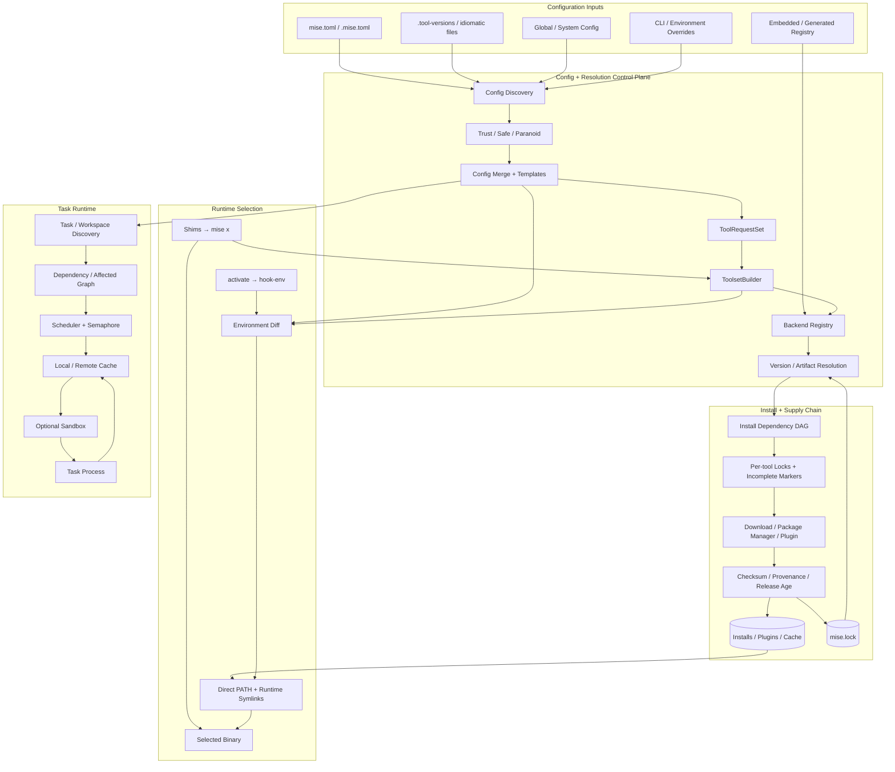

# mise

> 一句话定位：mise 是把多语言工具版本解析/安装、目录环境注入、任务 DAG/cache 与供应链 lock/provenance 收敛到一个 Rust 单二进制的开发环境控制面；核心 tools/env 已成熟到值得积极采用，但 CI trust、自动安装、backend 覆盖差异和仍在高速扩张的 task/sandbox/cache 面意味着企业应固定版本并分层启用，而不是把它当成 Nix/Bazel 级 hermetic substrate。

> 项目地址：<https://github.com/jdx/mise>
>
> 分析日期：2026-08-04
>
> 源码快照：`72379d0c459808f980a037065ac9c39a60032280`（`main`，`v2026.8.1` 后 18 commits）
> 分析边界：源码、文档、Git 历史、GitHub / crates.io / Homebrew / HN 公开元数据与静态安全分析；**未安装依赖、未运行 mise、未运行项目测试/构建、未执行目标代码或安装包**。GitHub 匿名 API 在竞品补采阶段触发 rate limit，未用搜索缺口推导社区结论。

## 基本信息

| 项目 | 结论 |
|---|---|
| 项目定位 | Polyglot developer toolchain manager：统一 tools、env、tasks、lock/provenance、monorepo workspace 与 shell activation |
| 产品形态 | Rust 单二进制 CLI + shell hook/shims + native/asdf/vfox backends + checked-in registry + task/cache/sandbox subsystem |
| 最小内核 | `Config graph → ToolRequestSet → Backend resolve → install DAG → lock/install state → PATH/shim dispatch` |
| 主要语言 | Rust；少量 Bash、PowerShell、Fish、Python、Lua 与生成/声明数据 |
| 许可证 | MIT |
| 主要栈 | Rust 2024、Clap、Tokio、Reqwest、Serde/TOML、Git、Aqua/Sigstore/Minisign、Landlock/seccomp、Tera、Rattler、custom E2E harness |
| 公开历史 | 2023-01-27 建仓；冻结快照 8,029 commits；贡献由大量外部 PR 驱动，但代码归因和合并权仍高度集中 |
| 代码体量 | 3,156 tracked files；496 个 Rust 文件、约 24.1 万行 Rust；798 个 Unix `test_*` E2E 脚本、37 个 Windows PowerShell E2E 文件、2,278 个 Rust `#[test]` attributes |
| 社区快照 | 约 31.5k stars、1.3k forks、183 subscribers；26 open / 1,544 closed issues，29 open / 7,137 closed PR，6,375 merged PR |
| 最新发布 | `v2026.8.1`，2026-08-03；冻结 HEAD 比 release 多 18 commits |
| 采用建议 | **核心 tools/env 推荐；团队受控采用；advanced task remote cache / sandbox / monorepo 能力固定版本试点** |
| 架构学习价值 | ⭐⭐⭐⭐⭐ |

mise 已不是“更快的 asdf”。它在一个 CLI 中同时承担四类职责：

1. **工具链控制面**：发现项目配置、解析 loose/prefix/ref/path/system version request、选择 backend、并发安装和切换版本；
2. **环境控制面**：按目录合并 `[env]`、path、source、template、secret backends 和 shell aliases，并通过 `hook-env` 返回差量；
3. **任务控制面**：发现 TOML/file tasks，建立依赖图，执行 affected/monorepo tasks，提供 local/remote cache、watch、timeout 和可选 sandbox；
4. **供应链控制面**：lockfile、artifact URL/checksum、provenance、minimum release age、签名验证和 release provenance。

其真正价值是：**用一个可提交到仓库的 config graph，把“我该用什么工具、什么版本、什么环境、如何运行项目”变成团队共享合同。**

其真正风险也是同一句话：**同一个 config graph 可以触发下载、插件脚本、template code、环境注入和 task side effects。**

## 场景一：是否值得采用

### 解决的问题

多语言项目通常把开发环境状态散在：

- `.tool-versions`、`.nvmrc`、`.python-version`、`rust-toolchain.toml`；
- pyenv/nvm/rbenv/sdkman/asdf/Homebrew/Cargo/npm/pipx；
- `.envrc`、shell profile、CI env、secret loader；
- Makefile、justfile、Taskfile、package scripts、CI YAML；
- README 中“先装这些版本，再跑这些命令”的人工步骤。

mise 把这些状态压成一个读取顺序明确的配置图，随后统一版本解析、安装、PATH、环境和任务执行。对多语言个人开发者和中小团队，这能明显减少 onboarding、机器漂移和“这个命令到底由哪个版本提供”的认知成本。

### 核心能力与边界

- `mise.toml`、`.mise.toml`、`.tool-versions`、idiomatic version files 与 global/system config；
- Node、Python、Ruby、Go、Rust、Java 等 core backends；
- Aqua、GitHub/GitLab Releases、Cargo、npm、pipx、gem、Go、Conda、HTTP、S3、UBI 等通用 backends；
- asdf 与 vfox plugin compatibility；
- loose/latest/prefix/ref/path/system/sub requests 与 per-platform options；
- direct PATH activation、runtime symlinks、Unix symlink shims 与 Windows executable shims；
- env vars、path、file/source、templates、secret backends 与 shell aliases；
- TOML/file tasks、dependency DAG、parallelism、watch、timeout、workspace/affected selection；
- source/output freshness、实验性 local cache、HTTP remote CAS、OIDC/static token；
- Linux Landlock/seccomp 与 macOS Seatbelt task sandbox；
- `mise.lock` 的 platform URL/checksum/provenance；
- minimum release age、Aqua verification、Node/Swift OpenPGP；
- Homebrew、npm、Cargo、apt/rpm、Scoop/winget/Chocolatey 等多渠道分发。

边界同样明确：

- 它管理“开发工具与命令环境”，不是完整 OS/package closure；
- lock/provenance 能力按 backend 与 upstream metadata 不对称；
- asdf/vfox plugin 仍会执行第三方代码；
- task cache 不等于 Bazel action model；
- task sandbox 不等于容器/microVM，也不是全平台 fail-closed；
- shell hook 改写当前进程环境，不提供 Devbox/Nix 的隔离 shell 语义；
- 高频 release 让升级收益和回归面同时很高。

### 依赖 / SDK 选型证据

根 `Cargo.toml` 静态统计约 144 个 direct dependency entries，其中 120 个普通 runtime entries；workspace 另含 `vfox`、`aqua-registry`、`mise-interactive-config`、`mise-shim`、`mise-sigstore` 五个成员。体量大，但依赖与产品边界基本对应。

| Dependency | Type | Used for | Problem solved | Evidence | Reuse signal | Caution |
|---|---|---|---|---|---|---|
| Clap + `usage-lib` | CLI/schema | command tree、help、completion、task usage | 大型 CLI 的 typed parsing 与统一 UX | `Cargo.toml`、`src/cli/mod.rs` | command contract 集中、可测试 | alias/猜测式 UX 过多会提高歧义与维护成本 |
| Tokio + Rayon | async/concurrency | HTTP、并发安装、task scheduler、cache | I/O 与 CPU 工作并行 | `src/toolset/toolset_install.rs`、`src/task/task_scheduler.rs` | install DAG + semaphore 模式值得复用 | 全局 cache/locks 与 async 交织，死锁和取消语义需持续 E2E |
| Reqwest | HTTP | metadata、downloads、remote cache、registries | 单一网络层 | `src/http.rs`、backend modules | 统一 timeout/retry/user-agent/policy | backend 可自定义 host/URL，SSRF/credential forwarding 要按调用链审计 |
| Serde + TOML/YAML/JSON | config/contract | config、lock、registry、cache metadata | 动态配置进入 typed graph | `src/config`、`src/lockfile.rs` | 版本化 schema + typed merge | 配置来源很多，优先级与 migration 是长期复杂度 |
| `color-eyre` / `eyre` | diagnostics | 错误链与 CLI context | 大型 CLI 的可行动错误 | 全仓 | context-rich errors 明显改善 DX | 超大模块仍可能把 domain error 压成字符串合同 |
| Git/libgit2 + subprocess Git | source control | plugin、ref、workspace、registry | clone/update/ref discovery | `src/git.rs`、`src/plugins` | compatibility 优先，可切 implementation | credential/helper/proxy 语义会因 backend 不同而变化 |
| Aqua + mise-sigstore + minisign | supply chain | checksum、Cosign、SLSA、GitHub attestations | 验证 release artifacts | `src/lockfile.rs`、`crates/mise-sigstore` | 把 provenance 变成 lock contract 很有价值 | 只有提供 metadata 的 backend 才能覆盖；不能外推到全部工具 |
| Landlock + seccompiler | sandbox | Linux filesystem/network restriction | task best-effort hardening | `src/sandbox/landlock.rs`、`seccomp.rs` | 轻量、无需 daemon | kernel/platform 相关；不是容器、namespace 或 Windows boundary |
| Seatbelt profile | sandbox | macOS task restriction | 可选 filesystem/network deny | `src/sandbox/macos.rs` | 直接包裹 command | `sandbox-exec` 不是跨平台长期稳定 contract，默认有必要 allow surface |
| Rattler | package solving | Conda backend | 跨平台 package metadata/solve | Cargo manifest、`src/backend/conda.rs` | native backend 比 shell wrapper 更可控 | 引入较重 solver 与平台 edge cases |
| Duct / command runner | process | plugins、tools、tasks、shell | 统一 subprocess 管理 | `src/cmd.rs`、task/backend code | central command builder 可挂 sandbox/env | 最终 side effect 仍由外部脚本/二进制决定 |
| Tera + template engines | dynamic config | config/task templates | 减少重复配置 | `src/config`、task template | 灵活 | `exec()` / `read_file()` 将模板变成代码执行面，必须受 trust/safe 控制 |

### 优势判断

#### 1. Core tools/env 已具备成熟项目的深度

冻结快照有 8,029 commits，版本管理主链从 2023 年持续演进。它不是只支持几个 demo runtime：

- `Backend` trait 与 `BackendArg` 统一 core/generic/plugin backend；
- registry 为大量工具保存 backend、binary、detection 与 idiomatic file metadata；
- `ToolRequestSet` 处理 config precedence 和多种 version request；
- install path 有 per-tool locks、dependency toolset、incomplete markers、shim/runtime symlink rebuild；
- activation 与 shim 都有 offline-preference 和 recursion protection；
- Windows 有单独 `mise-shim` crate 与 37 个 PowerShell E2E assets。

这种深度是从 asdf 迁移时最现实的价值：不只更快，还减少了频繁 fork shell、shim 解析和插件脚本依赖。

#### 2. 供应链设计明显领先普通版本管理器

`docs/security.md` 与实现覆盖：

- Aqua Cosign/Minisign/SLSA/GitHub attestations；
- Node/Swift OpenPGP；
- lockfile artifact URL/checksum/provenance 及 `provenance_verified`；
- platform-specific lock entries；
- `minimum_release_age`；
- `locked` 与 `locked_verify_provenance`；
- remote task cache digest、path/symlink validation、OIDC/static credential；
- release checksum、minisign、SBOM 与 package publishing。

它没有把“下载成功”当供应链完成态，这是很高的架构学习价值。

#### 3. 测试与发布工程强

静态事实：

- 798 个 Unix `test_*` E2E scripts；
- 37 个 Windows PowerShell E2E files；
- 2,278 个 Rust `#[test]` attributes；
- custom E2E runner 为每个测试创建隔离 HOME/workdir/tmp/data/config/state/cache；
- runner 支持 Bash/Zsh/Fish，并可在 read-only Docker rootfs 中运行；
- 22 条 GitHub workflows；
- 136 个 remote `uses:` 全部是 40-char commit SHA pin；
- test workflow 覆盖 format/lint/unit/E2E、多 OS、多 arch 与发布路径；
- release workflow 生成多平台 binaries/packages、checksums、signatures 与 SBOM；
- Zizmor workflow 审计 Actions。

本次没有运行这些测试，因此结论是“测试资产和 CI gate 很强”，不是“冻结快照由本机验证通过”。

### 风险评估

#### 1. CI 默认信任与 project config 的代码执行面必须联合理解

**风险：高（采用配置风险，不是默认远程漏洞）｜源码确认**

`src/config/config_file/mod.rs` 的 trust path 在 `settings.ci && !settings.paranoid` 时直接返回 trusted。普通交互环境会检查 config trust，但 CI 默认可能假定配置可信。

同一份 project config 可以：

- 使用 template `exec()` / `read_file()`；
- 注入 `PATH`、`LD_PRELOAD`、`NODE_OPTIONS` 等环境；
- 注册 hooks/tasks；
- 指向 asdf/vfox plugin repository；
- 触发 tool/plugin install。

`src/plugins/asdf_plugin.rs` 对 registry 未信任的社区 plugin 通常 warning/confirm，paranoid 会拒绝；但显式 repo URL 由已信任 config 提供时不会走同一确认，clone/zip 后可执行 `post-plugin-add` 和 install scripts。

风险成立的前提是：**消费方在不可信 PR checkout 上运行 mise install/task/version resolution，且没有 safe/paranoid/容器等边界。**

正确做法：

- 对只需解析/更新 lock 的 untrusted PR job 使用 `MISE_SAFE=1`；
- operator global config 或 env 启用 paranoid；
- 不让 project config 自己决定安全开关；
- untrusted PR 的真实测试本来就会执行 PR 代码，应放在隔离 runner/ephemeral container，不把 mise trust 当 sandbox；
- fork PR 不注入长期 registry/cache/cloud credentials。

#### 2. Safe mode 是硬边界，但安全文档内部有一句冲突

`MISE_SAFE=1` 会拒绝 template code、tasks、plugin install/asdf scripts，忽略 project env/shell/settings，并允许 HTTP-based backend 做纯 version resolution。`safe` 是 global-only，project config 无法自行关闭。

`docs/security.md:63-67` 与实现说明 safe mode 下可加载 untrusted config 而无需 trust；但同页 tip `:78-82` 又写“Untrusted configs still require mise trust”。这与上文和 `trust_check || settings.safe` 行为冲突。

行为边界从实现与前文可判定，但文档应明确区分：

- normal mode：trust 决定是否加载可执行配置；
- safe mode：加载配置但剥离/拒绝执行面，因此不要求项目 trust。

这是文档一致性问题，不是运行时存在两套随机行为。

#### 3. Lockfile 支持不等于默认严格可复现

默认状态要拆开：

- `lockfile` 未显式设置时按 enabled 处理，但不会无条件自动创建；
- `locked` 默认 false；
- `locked_verify_provenance` 默认 false；
- lock 中同时有 checksum/provenance 时，默认可信任 lock 记录而跳过重新验证；
- paranoid 会自动增强 provenance re-verification。

而且 backend coverage 不对称：

- Aqua/GitHub/HTTP/core 中部分工具可获得 URL/checksum/provenance；
- `asdf`、部分 package-manager 或 opaque plugin path 可能只有 version/ref；
- URL/checksum 是否可跨平台解析取决于 backend metadata；
- explicit ref/path/system 语义无法获得同等 artifact contract。

团队若要可复现，应提交 `mise.lock`、设置 `locked=true`，并在关键环境启用 provenance re-verification；仍要按工具检查 lock entry，而不是只看 lockfile 存在。

#### 4. `minimum_release_age` 有用，但不是通用依赖冷静期

默认文档值为 24h，但能力边界写得很清楚：

- 多数 backend 只对 fuzzy/latest request 生效；
- explicit version pins 绕过；
- 没有 release timestamp 的版本默认保留；
- transitive dependency filtering 当前只有 npm/pipx 转发；
- 已安装 fuzzy match 不会因为新 cutoff 自动失效。

它能降低“刚发布即安装”的风险，但不能替代完整依赖 lock、artifact verification 或 registry quarantine。

#### 5. 命令缺失自动安装默认开启，便利性与 side effect 绑定

`not_found_auto_install` 默认 true。shim resolution 会优先离线，但在 configured/known provider 缺失时可安装并联网；completion 对 `usage` 特判为 offline，避免按 Tab 时下载。

个人开发体验很好，企业/CI 则建议：

- `not_found_auto_install=false`；
- bootstrap 阶段显式 `mise install --locked`；
- 执行阶段禁止改变工具链；
- cache miss 直接失败或走独立构建步骤。

否则“运行一个命令”与“改变本机/runner 工具状态”不是清晰分开的动作。

#### 6. 默认匿名安装统计是 opt-out，且发送时点与文档不一致

**风险：中（隐私与统计准确性）｜源码确认**

`use_versions_host_track` 默认 true。文档写“成功安装后”向 `mise-versions.jdx.dev` 发送匿名统计，但 `src/backend/mod.rs:2715-2720` 在真正安装前调用 `track_install()`；请求体包含 backend/full id、version、OS、arch，并由 fire-and-forget Tokio task 发出。

因此：

- 安装失败/取消也可能已经计数；
- 快速退出也可能来不及投递；
- 服务端可观察来源 IP；“每日 hash、不保留原始 IP”只能由服务端政策证明，客户端源码无法证明；
- offline、`use_versions_host=false` 或 `use_versions_host_track=false` 会关闭发送；
- 只对 core/registry known tools 发送，不是任意 task/command telemetry。

企业/高敏环境建议显式设置 `MISE_USE_VERSIONS_HOST_TRACK=false`，并把文档与实际发送时点差异视为需上游修正的问题。

#### 7. asdf/vfox compatibility 仍是第三方代码执行信任根

native backend 减少了 shell plugin 面，但 compatibility 是 mise 迁移价值的重要组成，所以不能简单删掉。

真实边界：

- plugin 是 Git/zip/local source；
- Git ref 可以固定，但常见更新仍沿 branch/tag；
- plugin hooks、list-all、download、install、exec-env 都会执行第三方脚本；
- config trust、community prompt、paranoid 和 safe mode 是控制层；
- plugin 本身并不自动获得 Aqua/Sigstore 等同等级 provenance。

采用时优先 core/Aqua/typed generic backends；只在缺少替代时启用 asdf/vfox，并固定 source/ref、审计脚本和更新差异。

#### 8. Task sandbox 是 best-effort hardening，不是通用隔离

当前实现：

- Linux：Landlock filesystem rules + seccomp network socket restriction；
- macOS：Seatbelt profile / `sandbox-exec`；
- Windows/其他平台：warning 后无 sandbox 执行；
- Linux `allow-net` per-host 规则不支持，只能 deny all network；
- macOS 需保留 `/tmp`、`/dev`、Unix sockets 等必要 allow surface；
- task 可选择 deny/read/write/env/net 与 allow lists。

因此：

- unsupported platform 不是 fail-closed；
- kernel feature/version 会影响实际 enforcement；
- 它不隔离 process namespace、kernel、devices、resource quota、container image 或 cloud identity；
- secret/credential/network policy 仍需 runner/container 层处理。

适合减少 accidental reads/writes 和普通 task blast radius，不适合执行高风险不可信代码。

#### 9. Advanced task/cache 面很强，但很新、且仍受 experimental gate

`v2026.8.1` 的标题就是 remote task cache / affected tasks。相关 hardening、HTTP CAS、OIDC credential、compatibility suite 大量集中在冻结前 1–2 天。

当前源码已经有：

- local + remote composite cache；
- BLAKE3/SHA-256 digest；
- canonical metadata/CAS；
- read-write/read-only/write-only modes；
- artifact/path/symlink validation；
- OIDC/static token；
- dependency cache-key propagation；
- affected workspace task selection；
- Linux `strace` cache audit。

但 `TaskArtifactCache::prepare()` 会先调用 `ensure_experimental("task artifact caching")`。也就是说 release headline 已主打 remote task cache，不代表它已成为普通稳定默认面。

这是明显能力跃迁，也意味着：

- protocol/compatibility 还缺长期版本证据；
- cache poisoning、credential audience、cross-project namespace、large artifact/partial failure 需实测；
- monorepo graph 对 Cargo/pnpm 等生态的 inference 会持续补 edge cases。

core tool management 的成熟度不能直接外推到这些刚落地的高级能力。

#### 10. Windows `cmd.exe` 参数边界与 npm 发行存在两个独立缺口

**风险：中｜一个 runtime 待证、一个发行事实已确认**

Windows inline task 通过 `cmd.exe /c` 时，会把 task body 与 forwarded args 重组为命令文本。实现会 quote 空格与常见元字符，但源码明确指出 `%` 在引号中仍会发生 CMD expansion。只有在“可信 task 接收不可信参数/环境”的前提下才可能越过 argv 边界；需专项测试 `%VAR%`、`!VAR!`、换行与变量展开后元字符，不能仅凭静态代码宣称可利用。

npm 发行缺口则已由源码和 registry 交叉确认：

- `scripts/release-npm.sh` 只发布 Linux x64/arm64/armv7 与 macOS x64/arm64 platform packages；
- wrapper 在 Windows 会请求 `@jdxcode/mise-windows-<arch>`；
- 2026-08-04 查询 npm registry，Windows x64/arm64/x86 子包均 404，而 Linux/macOS 子包的 latest 为 `2026.8.1`。

这意味着 Windows 用户不应把 `npm install mise` 当受支持安装路径，应使用 Winget/Scoop/Chocolatey/standalone 等渠道；上游 wrapper 或发布矩阵需要修正。

#### 11. 复杂度已经形成数个高密度核心模块

最大代码集中点包括：

- `src/lockfile.rs`：约 6k 行；
- `src/task/mod.rs`：约 4.6k 行；
- `src/backend/mod.rs`：约 4k 行；
- `src/config/mod.rs`：约 3.5k 行；
- `src/task/task_cache_store.rs`：约 2.3k 行；
- `src/shims.rs`：约 1k 行。

大文件不等于坏代码；很多复杂度来自真实兼容矩阵。但其后果是：

- backend/lock/config/task invariant 跨大模块；
- feature scope 持续扩大；
- release 频率高时回归面也扩大；
- 新贡献者需要先掌握大量隐式 global cache/settings/state。

应继续把 lock backend adapter、provenance verifier、task cache protocol 与 config execution policy抽成更窄 contract，而不是再向顶层模块添加 condition ladders。

#### 12. 维护吞吐高，但治理明显 maintainer-led

外部贡献是真实的；但合并作者身份后：

- jdx/Jeff Dickey 约占 56.6% commits；
- Risu 约 7.8%；
- Renovate/release automation 占明显份额；
- 最近已合并 PR 的创建到合并中位数约 2 小时；
- 快路径不能代表全部体验：2026-08-04 08:33 UTC 的 29 个 open PR HTML 快照中，14 个外部 PR 的年龄中位数 5.73 天、P90 22.51 天，最老 112.81 天。

`issue-closer.yml` 还明确规定：除 jdx 外，新开的 Issues 自动关闭，理由是“issues may only be created by maintainers”；bugs/ideas 入口转向 Discussions。

这带来两面：

- 决策快、release 快、PR backlog 低；
- 方向、triage 和 issue curation 强依赖主维护者；
- 26 open issues 不能与开放 issue intake 的项目直接比较；
- 外部用户追踪 bug/roadmap 的传统 GitHub workflow 较弱。

#### 13. 发布频率是响应力，也是升级风险

2026-07-20 到 2026-08-03 有 10 个正式 releases。高速发布适合快速修复海量 backend edge cases，但团队不应无条件追 latest：

- config/lock/task semantics 可能频繁变化；
- registry metadata 与 binary provider mapping 变化快；
- advanced feature 可能在几天内连续 harden；
- Homebrew `latest` 与 project lock 的升级节奏应分离。

建议固定版本、按周/月升级，并跑团队自己的 toolset/lock/task compatibility suite。

#### 14. CI supply-chain discipline 很强，但 advisory ignore 仍要周期复查

136 个 remote Actions 全 SHA pin，release 有 signatures/SBOM，Zizmor 单独运行，整体明显高于平均。

`deny.toml` 同时显式忽略 4 个 RustSec advisories，其中包括 sigstore 链上的 RSA Marvin attack 及数个无安全升级/非运行时或上游待修项。配置有说明，不是静默忽略；但采用方不能把 `cargo-deny` workflow 存在解释成“0 advisories”。这些 ignore 应随上游升级持续复查，尤其是 artifact verification path 中的 cryptographic dependency。

发布控制面仍有集中风险：同一 release workflow 导入 Apple/GPG/minisign、R2/CDN 与发布 token，并继续执行仓库内 build/release scripts；这不是 fork PR 能直接窃密，但 release branch/tag 或受信任脚本一旦失守，爆炸半径会跨 GitHub Release、CDN 与包仓库。更理想的结构是 build 与 sign/publish 分离，发布阶段只消费按 digest 固定的制品，并用 environment approval/keyless/OIDC 缩小长期密钥面。

Standalone installer 对当前版本可嵌入 checksum，但安装指定旧版本时会从同一 GitHub Release 获取 tarball 和 checksum，且未使用已发布的 checksum signature；npm publish workflow 还实时执行 `curl -fsSL https://mise.run | sh`。这些是“同源真实性”和 release bootstrap 边界，不应被 checksum/SBOM 的存在掩盖。

### 结论

**推荐，但分层采用。**

#### 强推荐：core tools + env

适合：

- 多语言个人开发者；
- 从 asdf/pyenv/nvm/rbenv/sdkman 整合；
- 需要 checked-in tool versions 与统一 onboarding；
- 不想承担 Nix 学习成本；
- 希望本机直接运行、保留原生 IDE/terminal workflow。

#### 受控采用：团队 CI

建议基线：

```toml
# operator-owned global config or centrally managed config
[settings]
paranoid = true
not_found_auto_install = false
minimum_release_age = "7d"
locked = true
locked_verify_provenance = true
use_versions_host_track = false
```

注意：`paranoid` / `safe` 等 global-only 设置不能依赖 project config 自己声明。团队还应：

1. 提交 `mise.toml` 与 `mise.lock`；
2. 检查关键工具 lock entry 是否真的有 URL/checksum/provenance；
3. bootstrap 与 run 阶段分离；
4. 优先 native/Aqua backend；
5. untrusted PR resolution 使用 `MISE_SAFE=1`；
6. 真正运行 PR 代码时使用 ephemeral runner/container、最小 token 和无生产 secret；
7. 固定 mise version，不自动追 latest。

#### 固定版本试点：advanced tasks/cache/sandbox

适合：

- 多语言 monorepo 想统一 task entrypoint；
- 需要 affected task 与跨项目依赖；
- 团队能自己压测 remote cache、OIDC、namespace 与 cache poisoning；
- 接受 Linux/macOS sandbox 的平台差异。

暂不建议：

- 把 task sandbox 当不可信代码隔离；
- 把 remote cache 当成熟 Bazel Remote Execution 替代；
- 在 Windows 上假设 sandbox parity；
- 让 project config 持有生产 cache/cloud credentials；
- 用 mise lock 替代容器 digest、OS closure 或 language package lockfiles。

### 最小 PoC 路径

1. 固定 `v2026.8.1` 或更高经过团队审计的 release；
2. 只迁移 2–3 个 core backend tools，不同时迁 env/tasks/plugins；
3. 提交 `mise.toml` 与 `mise.lock`，启用 `locked`；
4. 关闭 command-not-found auto install；
5. 在干净 ephemeral runner 验证 Linux/macOS/Windows 关键命令；
6. 再迁 env，核对 PATH、IDE、shell、CI 与 secret injection；
7. 最后单独试 task DAG/cache；sandbox 与 remote cache 作为独立验收项；
8. 每次升级对 lock diff、registry/backend change 和 task/cache compatibility 做 review。

## 场景二：技术架构学习

### 核心架构图



### 底层技术架构

#### 最小架构内核

如果删除 tasks、sandbox、remote cache、secret integrations、OCI 和大部分 generic backends，mise 的核心仍可归结为六个对象：

1. **Config graph**：发现并合并当前目录、父目录、global/system、legacy/idiomatic files；
2. **ToolRequestSet**：保存“工具 + 版本请求 + options + source”，不是直接保存最终版本；
3. **Backend**：把 request 解析为 remote/local versions、artifact metadata、install path 和 executable paths；
4. **Toolset**：某个 invocation 的最终 tools/versions/env view；
5. **Install state**：downloads、installs、plugins、locks、incomplete markers、runtime symlinks；
6. **Runtime dispatch**：shell environment diff/direct PATH 或 shim → `mise x`。

核心不变量：

> 同一个目录与同一组 operator settings，在给定 registry/lock/backend metadata 下，应解析出一致 toolset；运行命令时只把该 toolset 的 binaries/env 注入当前 process context。

#### 核心抽象

##### Config 不是单文件，而是有信任与优先级的图

`Config::get()` 构建并缓存全局视图；loader 同时考虑：

- system/global config；
- 当前目录向上的 config；
- environment-specific config；
- `.tool-versions`；
- idiomatic files；
- CLI overrides；
- monorepo roots/subprojects；
- trusted/ignored paths。

每个 config file 保留 source path，便于：

- 解释某个 tool/env/task 来自哪里；
- 对非 global config 做 trust；
- 构造 lockfile 路径；
- 计算 task cache/config source；
- 在 safe mode 区分 operator-owned 与 repo-owned data。

这比“读一个 TOML 再 merge”更值得学习：安全策略必须跟 provenance/source 一起进入 config AST，而不是 merge 完后才猜来源。

##### Backend 是 capability adapter，不是同构 installer

`Backend` trait 给出共同合同，但不同 backend 能力不同：

- remote version timestamps；
- artifact URL/checksum；
- provenance；
- dependencies；
- binary paths；
- exec env；
- install/uninstall；
- idiomatic version files；
- plugin source。

`BackendType` 当前覆盖 Aqua、Asdf、Cargo、Conda、Core、Dotnet、Forgejo、Gem、GitHub、GitLab、Go、npm、pipx、Pkgx、SPM、HTTP、S3、UBI、vfox 等。

设计亮点不是“所有 backend 完全统一”，而是：**统一 tool request/install/runtime contract，同时显式保留 backend capability 差异。**

##### ToolRequest 与 ToolVersion 分离

`node = "22"`、`latest`、`prefix:`、`ref:`、`path:`、`system` 都是 request，不是最终 version。流程大致为：

1. 收集 request 与 source precedence；
2. 选择 backend；
3. 读取 lockfile/installed/cache/remote metadata；
4. 应用 platform/options/minimum release age；
5. 解析为 `ToolVersion`；
6. 计算依赖与 install plan；
7. 安装后重建 runtime symlink/shim；
8. 必要时更新 lockfile。

这种分离允许 config 保留意图、lock 保存确定结果，也允许 `mise upgrade` / `lock --bump` 重新解析。

#### 控制面 / 数据面

- **输入面**：project/global/system config、legacy/idiomatic files、CLI/env overrides、registry；
- **控制面**：discovery、trust/safe/paranoid、merge、request resolution、lock/provenance policy；
- **安装数据面**：backend metadata、download、plugin/package-manager process、installs/cache；
- **运行数据面**：shell env diff、runtime symlink/shim、selected binary；
- **任务数据面**：workspace graph、scheduler、cache store、sandbox、task process。

#### 关键执行链路

##### 流程一：`mise install`

```text
CLI parse
  → Config::get / trust check
  → ToolsetBuilder + ToolRequestSet
  → resolve missing ToolVersions
  → build dependency toolsets / install DAG
  → per-tool lock + incomplete marker
  → backend download/install scripts or native installer
  → artifact verification / release-age policy
  → verify install output
  → update install state
  → rebuild runtime symlinks + shims
  → update mise.lock when applicable
```

值得复用的细节：

- 安装依赖不是简单并发 map，而是 dependency-aware；
- per-tool lock 防止多个进程同时安装同一版本；
- incomplete marker 防止半安装目录被当成成功；
- install 成功后统一 rebuild runtime artifacts；
- dry-run 与 locked mode 进入同一 planner，而不是另写一条近似路径。

##### 流程二：shell activation

```text
mise activate <shell>
  → 输出 shell hook
  → 每次 prompt/cd 调 mise hook-env
  → Config + Toolset resolution（优先 cache/offline）
  → 计算 old/new env diff
  → shell eval 差量：PATH/env/aliases
  → 下一次目录变化再撤销/替换差量
```

其性能优势来自直接 PATH，而不是每次执行目标命令都经过重 shim 进程。shims 仍用于 IDE、cron、非交互环境和 compatibility。

##### 流程三：shim dispatch

Unix shims 通常指向 mise binary；Windows 可使用独立 `mise-shim` executable。核心路径：

```text
shim filename → tool/bin name
  → recursion detection
  → prefer-offline ToolsetBuilder
  → configured provider / installed provider resolution
  → optional missing-bin auto-install
  → system PATH fallback（跳过 mise shims）
  → Exec / mise x → selected binary
```

completion 对 `usage` shim 强制 offline，说明维护者意识到“隐式网络 side effect”对交互延迟的破坏。

##### 流程四：`mise run`

```text
Task discovery（TOML / file / workspace）
  → task template + env/tools merge
  → dependency graph / cycle validation
  → affected/workspace selection
  → Scheduler queue + semaphore
  → source/output/cache-key decision
  → local/remote cache lookup
  → optional sandbox policy merge
  → shell process
  → output capture / artifact publish
  → completion/cache-key propagation to dependents
```

Task runtime 对 interactive task 使用全局写锁、非交互 task 使用读锁，避免多个交互进程抢 TTY。

#### 状态模型

##### Lockfile 与 provenance

`mise.lock` 不只是 `tool → version`：

- backend 与 options；
- per-platform install URL；
- checksum；
- API/source URL；
- provenance type；
- provenance 是否已 cryptographically verified；
- additional artifacts；
- platform qualifiers；
- selector/resolved version。

值得复用的模式：

1. **intent 与 resolution 分开**：`mise.toml` 可写 `22`/`latest`，lock 保存具体版本；
2. **artifact metadata 与 version 同级**：不是把 checksum 留在下载 cache；
3. **provenance detected 与 verified 分开**：避免“看见 .sig 文件”被写成已验证；
4. **platform entry merge**：不同 OS/arch 可逐步补齐；
5. **relock 防回退**：新结果不应丢失旧平台或 verified metadata；
6. **atomic save**：lockfile 写入经过临时文件/rename 与并发修复。

#### 契约边界

##### Task cache architecture

当前 cache 已超出简单 timestamp：

- task identity + command/env/tools/config/source/dependency state 形成 action key；
- output artifact 有 manifest 与 digest；
- local store 与 HTTP remote store 通过 composite adapter 组合；
- remote protocol 分 action、metadata、directory/files/symlinks/CAS blobs；
- remote mode 支持 read-write/read-only/write-only；
- credential 支持 bearer、token file、OIDC audience；
- remote artifact 做 digest、path、symlink target validation；
- remote hit 回填 local；
- dependency output identity进入下游 key；
- Linux audit 可用 `strace` 对实际 read/write 与 declared sources/outputs 做比对。

这条链很有学习价值：它先建立 local cache contract，再把 remote 当同一 trait 的另一个 store，避免 task executor 直接知道 HTTP。

但它仍不是 Bazel：

- command 可读宿主广泛状态，除非另开 sandbox；
- language dependency discovery 由 provider heuristics 提供；
- 没有统一 toolchain/container execution digest；
- 没有 remote execution scheduler；
- sandbox/platform 语义不一致；
- task shell 本身可产生未声明 side effects。

##### 状态与目录

按 XDG/平台目录分层的主要状态：

| State | Purpose | Lifecycle |
|---|---|---|
| config/system/global | operator policy 与全局 tools/env/tasks | 人工管理、长期 |
| project config | repo-owned tool/env/task intent | Git 版本化 |
| `mise.lock` | resolved version/artifact/provenance | Git 版本化、升级时变更 |
| installs | 已安装 tool versions | 版本级持久、可 prune |
| downloads/cache | metadata 与 artifact cache | 可清理、可重建 |
| plugins | asdf/vfox source 与 hooks | 需审计更新 |
| shims/runtime symlinks | runtime dispatch artifacts | 安装/升级后重建 |
| state/trust | trusted config hashes/paths、usage/state | machine-local |
| task cache | action metadata/output artifact/local mirror | 可清理；remote 可共享 |
| task/output temp | command capture、staging、audit traces | execution-scoped |

关键设计点是：**config intent 与 machine install/cache 分离，lock 处在二者之间。**

#### 失败与降级模型

- remote metadata/download 失败可使用 installed/cache/offline 路径，但 locked/safe/paranoid 模式必须按配置失败；
- install 中断用 incomplete marker 防止半成品进入 active toolset；
- task dependency 失败阻断下游，scheduler 负责取消/interrupt 传播；
- remote cache 不可用可退回 local/miss，corrupt blob/path/symlink 则拒绝恢复；
- unsupported sandbox platform 当前 warning 后执行，因此上层不能把“请求 sandbox”当成已强制；
- backend 缺少 timestamp/checksum/provenance 时显式降级能力，而不是伪造验证结果。

#### 可复刻设计不变量

1. config value 必须保留 source provenance；
2. request intent 与 resolved artifact 必须分离；
3. backend capability 缺失必须可见；
4. 同一 tool/version 安装必须跨进程互斥并标记 incomplete；
5. runtime fast path 不应每次触发网络解析；
6. safe mode 必须从 repo config 移除执行/环境注入能力；
7. cache restore 前必须验证 digest 与输出路径边界。

## 质量与成熟度

### 代码质量

#### 做得好的地方

- 大量真实 E2E，而非只 mock backend；
- 隔离 HOME/XDG state，降低测试污染；
- Linux/macOS/Windows 都有显式路径；
- Actions 全 SHA pin；
- release artifact 签名/SBOM；
- error context 与 progress reporting 成熟；
- install/task 并发受 lock/semaphore 控制；
- config safe mode 有专门 threat model；
- remote cache 有 corrupt blob/path/symlink tests；
- lockfile merge/回退/跨平台 edge cases 有长期修复历史。

#### 主要架构债务

- config/backend/task/lockfile 超大模块；
- 全局 `Settings::get()`、lazy caches、process env 使纯函数边界减少；
- backend capability 通过大量 optional/default methods 表达，组合爆炸仍会回到条件分支；
- task runner 正在快速接近独立构建系统规模；
- registry 近千 TOML + generated Rust data，使 source tree 与 release binary 体量/审计面扩大；
- 兼容 asdf/vfox/native/package managers 的同时，无法提供单一强供应链语义；
- 文档体量大且局部存在快速演化后的矛盾。

### 测试

- 2,278 个 Rust `#[test]` attributes；
- 798 个 Unix `test_*` E2E scripts；
- 37 个 Windows PowerShell E2E files；
- custom runner 隔离 HOME/XDG/tmp/workdir，并支持 read-only Docker rootfs；
- lock、trust/safe、shim、backend、task/cache、sandbox、Windows edge case 都有专门测试资产。

本次静态审计未执行测试，因此不声明冻结 HEAD 在本机通过。

### CI/CD

- 22 条 workflows；
- 136 个 remote Actions `uses:` 全 SHA pin；
- format/lint/unit/E2E/performance/registry/release 分开；
- release 生成多平台 binary、checksum、minisign、SBOM 与 package-manager artifacts；
- Zizmor 审计 Actions；`deny.toml` 的 advisory ignores 有显式原因但需周期复查。

门禁边界：nightly 是 `continue-on-error`；社区/asdf plugin smoke 主要按周或 release 跑，不是普通 PR gate；release tarball E2E 主要覆盖 Linux，Windows E2E 使用 debug artifact；npm Windows platform package 当前缺失。它们不抹掉整体质量，但说明“跨平台测试存在”不等于“每个发行渠道都做同等级最终制品验证”。

### 文档质量

文档覆盖 backend、lock、safe、trust、tasks、monorepo、cache 与 migration，明显高于同类平均。主要问题不是“缺文档”，而是高速变化导致导航、历史页面和局部语义漂移；`docs/security.md` 对 safe mode 是否仍需 trust 的相邻段落就是一处需修正的矛盾。

### Issue / PR 健康度

- 26 open / 1,544 closed issues；29 open / 7,137 closed PR；6,375 merged PR；
- closed PR 中约 89.3% merged；最近 91 个 merged PR 的创建到合并中位数约 2.2h；
- Issues 只允许 maintainer 创建，外部 bugs/ideas 进入 Discussions，因此低 issue backlog 不可直接解读为低缺陷；
- throughput 很强，但 triage、release 与方向明显 maintainer-led。

## 架构解剖

### 目录结构

- `src/config`：配置、信任、环境与 task/tool assembly；
- `src/backend`：native/generic/plugin backend；
- `src/toolset`：request、resolved version、install DAG；
- `src/task`：workspace/DAG/cache/executor；
- `src/sandbox`：Linux/macOS task restrictions；
- `src/plugins`：asdf/vfox compatibility；
- `registry`：近千个工具声明；
- `crates/*`：shim、sigstore、vfox、aqua registry、interactive config；
- `e2e` / `e2e-win`：跨平台行为测试；
- `.github/workflows`：CI/release/registry automation。

### 技术栈

Rust 2024 单二进制为主，Tokio/Reqwest 处理网络与并发，Serde/TOML 表达配置与 lock，Clap/usage-lib 提供 CLI，Git/HTTP/package-manager/plugin 作为 backend，Landlock/seccomp/Seatbelt 提供可选 sandbox，Sigstore/Minisign/OpenPGP 负责 artifact verification。

### 模块依赖关系

`main/cli` 读取 `Config`；`Config` 产生 `ToolRequestSet/Toolset`；`Toolset` 通过 `Backend` resolution/install；成功状态回写 installs/lock/shims/runtime symlinks。Task subsystem 复用 Config/Toolset/command runner，再叠加 graph/cache/sandbox。供应链 policy 横切 backend、lock 与 install，而不是独立末端检查。

### 扩展机制

- 新 native backend：实现 `Backend` contract 并接入 registry；
- generic backend：通过 `aqua:`, `github:`, `http:`, `cargo:`, `npm:`, `pipx:` 等前缀表达；
- registry entry：声明 backend、bins、detect/idiomatic files；
- asdf/vfox plugin：兼容外部生态，但带代码执行信任面；
- task files/templates：扩展项目命令图；
- task cache store：local/remote 通过共同 trait 组合。

### 最值得复用的模式

#### 1. Config node 保留 source provenance

不要 merge 成无来源 HashMap。每个值应知道来自哪个文件/层，这样 trust、lock、diagnostic 和 task cache 才能做对。

#### 2. Tool request 与 resolved artifact 分离

用户写意图，lock 保存结果，installer 消费 artifact contract。不要把 `latest` 直接覆盖成具体版本而丢失升级意图。

#### 3. Backend trait 允许 capability 不对称

统一生命周期，不伪造能力。没有 checksum/provenance/timestamp 的 backend 应显式返回 None，而不是给虚假“已验证”。

#### 4. 安装状态有 incomplete marker

下载完成不等于安装完成；目录存在也不等于可用。跨进程 lock + incomplete state 是 CLI installer 的低成本高价值模式。

#### 5. Direct PATH 为主、shim 为 compatibility

高频 shell path 用环境 diff，IDE/cron 再用 shim。不要让所有正常命令都多一次重型 resolver 启动。

#### 6. Safe mode 剥离执行能力而不是只跳过 prompt

处理 untrusted config 时，真正危险的是 template、env、hooks、tasks、plugins。把这些 capability 关掉比“自动回答不信任”更可靠。

#### 7. Remote cache 放在 store adapter 后

Executor 只理解 cache hit/miss/commit；HTTP/CAS/OIDC 在 store 层。这样 local-only 与 remote 模式共享相同 task semantics。

### 不建议照搬的部分

- 不要为了“一个 CLI”一开始就同时做 version manager、env loader、task runner、remote cache、sandbox、OCI 与 package manager；
- 不要把 mutable Git plugin script 当默认扩展面；
- 不要默认开启命令缺失自动安装；
- 不要在 CI 检测后无条件把 repo config 当 operator-owned；
- 不要把 optional checksum 写成统一“安全安装”宣传；
- 不要用数千行中心模块承接每个 backend exception；
- 不要把 task shell + cache 宣传成 hermetic build；
- 不要在 unsupported sandbox platform 上 warning 后仍让上层以为策略已执行；
- 不要让 project config 控制自身的 safe/paranoid 边界。

### 模块地图

| 模块 | 职责 |
|---|---|
| `src/main.rs` | 进程初始化、signal/panic/env、shim/CLI entry |
| `src/cli/mod.rs` | CLI command registry/dispatch |
| `src/config/mod.rs` | config discovery/merge/cache、tool/env/task assembly |
| `src/config/config_file` | per-file parsing、trust、safe mode、source provenance |
| `src/backend/mod.rs` | `Backend` contract、registry、resolution defaults |
| `src/backend/*` | core/generic/package/plugin backend implementations |
| `src/toolset` | requests、resolved versions、install plan、runtime paths |
| `src/toolset/toolset_install.rs` | dependency-aware concurrent installation |
| `src/lockfile.rs` | lock schema、merge、platforms、checksums/provenance |
| `src/shims.rs` | shim discovery/rebuild/dispatch |
| `crates/mise-shim` | Windows/portable executable shim |
| `src/cli/activate.rs` / `hook_env.rs` | shell hook 与 environment diff |
| `src/task` | task model/discovery/config/workspace |
| `src/task/task_scheduler.rs` | DAG queue、parallel semaphore、completion |
| `src/task/task_executor.rs` | command execution、output、timeout、cache/sandbox integration |
| `src/task/task_cache*` | action key、local/remote store、CAS、audit |
| `src/sandbox` | Linux/macOS task restrictions |
| `src/plugins` | asdf/vfox plugin source、hooks、update |
| `registry/*.toml` | tool → backend/bin/detection metadata |
| `.github/workflows` | CI、release、security、registry automation |

## 关键代码走读

### CLI 与 config 入口

- `src/main.rs`：进程初始化、shim mode、CLI entry；
- `src/cli/mod.rs`：command parse/dispatch；
- `src/config/mod.rs`：config discovery/cache 与最终 tool/env/task view；
- `src/config/config_file/mod.rs`：trust、CI assumption、safe mode。

### 安装与运行

- `src/backend/mod.rs`：backend trait 与 capability defaults；
- `src/toolset/toolset_install.rs`：dependency-aware install、locks、并发；
- `src/cli/install.rs`：CLI plan、error aggregation、rebuild；
- `src/shims.rs` 与 `crates/mise-shim/src/main.rs`：runtime dispatch；
- `src/cli/activate.rs` / `hook_env.rs`：shell hook 与 env diff。

### Lock、task 与安全

- `src/lockfile.rs`：platform artifact/checksum/provenance merge；
- `src/task/task_scheduler.rs`：DAG queue/semaphore；
- `src/task/task_executor.rs`：task process/cache/sandbox；
- `src/task/task_cache_store.rs`：local/HTTP remote CAS、OIDC、digest/path validation；
- `src/sandbox/*`：Landlock/seccomp/Seatbelt 与 unsupported fallback；
- `src/plugins/asdf_plugin.rs` / `src/backend/asdf.rs`：plugin source、prompt/paranoid、script execution。

## 社区与生态

### 衍生项目 / 插件生态

mise 的生态不是单一 plugin list：它同时复用 asdf plugins、vfox plugins、Aqua registry、GitHub/GitLab releases、language package managers 与自有 registry；另有 `jdx/mise-action`、Homebrew/apt/rpm/npm/Cargo/Windows packages 等分发/CI surface。广度是 adoption 优势，也是 capability 与信任语义不一致的来源。

冻结 SHA 的 954 个 registry TOML 条目中，默认第一 backend 约 66.8% 为 Aqua、11.1% 为 GitHub、11.7% 为 core/bare、4.4% 为 vfox；没有条目把 asdf 放在第一默认位，但 asdf 仍在 546 个候选列表中作为 fallback/显式兼容路径。这说明供应链迁移取得实质进展，同时 compatibility trust surface 仍然存在。

### 竞品对比

#### 先分清产品层

mise 同时跨越多个传统工具边界，所以“mise vs X”只有先限定问题才有意义：

- **版本管理**：asdf、proto；
- **目录环境**：direnv；
- **任务执行**：just/Taskfile；
- **系统级可复现开发环境**：Nix/Devbox；
- **大型构建图**：Bazel/Buck2/Pants；
- **mise**：试图用一个 config/CLI 覆盖上述中间地带，而不是在每层都做到最强。

#### 对比矩阵

| 项目 | 首要层 | 工具版本 | Env | Tasks/cache | 隔离/闭包 | 扩展面 | 最适合 |
|---|---|---|---|---|---|---|---|
| mise | 一体化开发工具控制面 | 强；native + generic + asdf/vfox | 强；目录差量、templates、secrets | 强；DAG、affected、local/remote cache、可选 sandbox | 弱于 Nix/容器；sandbox best-effort | Rust backends + registry + plugin compatibility | 多语言个人/团队，追求低学习成本与统一 UX |
| asdf | 版本管理 | 强；`.tool-versions` 与 plugin 生态 | 主要围绕 runtime PATH | 非首要职责 | 无 | shell plugin；现代 core 已是 Go | 想保持窄 scope、已有 asdf plugin/workflow 的团队 |
| proto | 新一代版本管理 | 中强；支持主要语言与工具 | contextual detection | 非主职责，常与 moon 配合 | 无 | WASM plugins | 只想要跨平台 version manager、偏好 capability-sandboxed plugin 架构 |
| direnv | 目录环境注入 | 不安装工具 | 很强、极窄；`.envrc` trust | 无 | subshell 计算 env diff，不是隔离环境 | shell stdlib | 已有 Nix/asdf/自定义脚本，只缺可靠目录 env hook |
| just | 命令 runner | 无 | dotenv/recipe env | 强 recipe UX；明确不是 build system | 无 | recipes/shebang language | 只要清晰任务入口，不想引入工具安装/activation |
| Devbox | Nix-backed dev environment | OS/package level，版本来自 Nix package universe | isolated shell | scripts，但不是其最强差异 | 强于 mise；Nix closure/isolated shell | Nix packages/plugins | 团队更重视确定性、隔离和生产镜像映射 |
| Nix/devenv | package/build/environment substrate | 最强闭包/版本化能力 | declarative shell | 可组合，但学习/调试成本高 | 最强 | Nix language/modules | 对 hermeticity、OS deps、CI/生产一致性要求高 |
| Bazel/Buck2 | build system | toolchain model | action env | 最强 graph/cache/remote execution | hermetic action model | rules/toolchains | 大型 monorepo、远端执行、增量构建正确性优先 |

#### mise vs asdf

2026 年不能再沿用“Rust vs Bash core”叙事：现代 asdf core 已重写为 Go。真正差异是：

- mise 保持 `.tool-versions` / plugin compatibility，同时提供 native/generic backends；
- mise 直接 PATH 为主、shim 为 compatibility；
- mise 把 env/tasks/lock/provenance 纳入同一 config；
- asdf scope 更窄，生态 mental model 更稳定；
- asdf shell plugins 与 mise asdf compatibility path 都保留第三方脚本信任面。

**选择 mise**：多语言、想统一 env/tasks、接受更大 scope。

**保留 asdf**：现有 plugin 全覆盖、团队不想引入新 config 语义，或明确偏好窄职责。

#### mise vs proto

proto 是 Rust 版本管理器，WASM plugin、checksum 与 contextual detection 是核心卖点，支持面更聚焦。它通常与 moon toolchain 组合，而不是自己吞下 env/task/cache/sandbox。

**选择 mise**：需要工具数量、asdf migration、env/tasks 与 broad generic backends。

**选择 proto**：只需要 version manager，偏好 WASM plugin boundary 和更窄 product scope。

#### mise vs direnv

两者都在 shell prompt 前后计算 environment diff，并都有 trust 概念。区别是：

- direnv 的 `.envrc` 明确是 Bash code，能力小而直观；
- mise config 同时影响 toolset、env、hooks、templates、tasks 和 plugins；
- direnv 可与 Nix/asdf 任意组合；
- mise 减少工具数量，但扩大一个配置面的权限。

已有稳定 direnv + Nix/asdf 的团队不必为了“少一个 binary”迁移；新建多语言项目可直接用 mise 降低拼装成本。

#### mise vs just

just 明确是 command runner，不是 build system。它的优势是 recipe language、静态错误、跨平台 shell 选择和极小 side-effect surface。

mise tasks 的优势是自动继承 tool/env、monorepo discovery、affected/cache；代价是更大 config/runtime。只要任务入口选 just；需要工具链与任务图协同选 mise。

#### mise vs Devbox/Nix

这是 UX 与 hermeticity 的权衡：

- mise 直接使用宿主 OS，启动快、IDE/terminal 直观、学习成本低；
- Devbox/Nix 管理 OS-level packages/closure，隔离和可复现更强；
- mise lock 不能完整描述 libc、system headers、daemon、kernel 或 arbitrary package-manager transitive closure；
- 两者可组合：Nix/Devbox/container 提供基础环境，mise 统一项目 runtime 与 task UX，但要避免重复管理同一 tool/PATH。

### 社区评价

#### 真实 adoption 与公开反馈

##### 硬指标

截至 2026-08-04：

- GitHub 约 31.5k stars / 1.3k forks；
- contributor API 至少 400 accounts；
- crates.io `mise` 累计约 439,878 downloads、recent 8,407；
- Homebrew `install_on_request`：30d 73,538、90d 219,785、365d 785,224；
- 6,375 merged PR；最近样本 merge 中位数约 2.2h；
- 2026-07-20—08-03 有 10 个正式 releases。

这证明它有真实使用与维护吞吐，不只是 stars。

公开代码采用也提供下界证据：Sourcegraph 的非 fork、非 archived 索引中，根 `mise.toml` 搜索达到 5,000 match 上限，已返回至少 1,417 个唯一仓库；`.github/workflows` 使用 `jdx/mise-action` 的结果涉及 630 个唯一仓库。样本包括 Kong/charts、Pulumi pulumi-vsphere、GitGuardian VS Code extension 与 Grafana otel-checker。该数字只是 Sourcegraph 可见索引下界，不是 GitHub 全站安装数。

##### HN 反馈

可直接访问的三条 HN 讨论：

- 2024-12：468 points；主题是 tools/env/tasks；
- 2024-04：164 points；主题是 polyglot version manager；
- 2025-10：379 points；主题是 monorepo tasks。

正面集中在：

- 从 RVM/NVM/pyenv/SDKMan/asdf 迁到一个工具；
- “same functionality but much snappier with better UX”；
- 多语言团队不必直接上 Nix/Docker；
- tools + env + tasks 降低 repo 切换与 onboarding 成本；
- 在企业网络和 monorepo 中统一入口。

负面集中在：

- “doing everything” 容易泄漏底层 package manager abstraction；
- scope 从 version/env 扩到 tasks/monorepo/cache 后，单点复杂度和 PATH ownership 变大；
- 文档结构、Windows 与 IDE integration 曾让用户困惑；
- 专用工具在 recipe language、build graph、hermeticity 上更深；
- Nix/Devbox 用户不认为较弱可复现性足以换取统一 CLI。

时间校正：2025 HN 对“没有 task cache”的批评已经被当前 local/remote cache 实现补上；2024 的“Windows very minimal”也不能原样当 2026 现状，当前已有 Windows installer/shim 和 PowerShell E2E。不过 sandbox 仍无 Windows backend，平台语义不完全一致。

#### 选型结论

| 需求 | 首选 |
|---|---|
| 多语言个人开发、低学习成本、快速 onboarding | mise |
| 现有 asdf 生态稳定，只要版本管理 | 保留 asdf |
| 想要窄版 Rust version manager + WASM plugins | proto |
| 只需要目录 env hook | direnv |
| 只需要清晰命令 runner | just |
| OS packages / isolated shell / production image 一致性 | Devbox/Nix |
| 大型 monorepo hermetic build / remote execution | Bazel/Buck2/Pants |
| 多语言团队想逐步整合工具链 | mise core → env → tasks 分阶段 |
| 不可信 PR automation | mise safe resolution + isolated runner；不要依赖 normal CI trust |

## 评分

| 维度 | 评分 | 判断 |
|---|---:|---|
| 采用价值 | 9/10 | core tools/env 对多语言个人和团队价值明确 |
| 架构学习 | 10/10 | config provenance、backend capability、lock/provenance、cache adapter 都值得复用 |
| 工程质量 | 9/10 | 测试/CI/release 很强；中心模块复杂度高 |
| 安全设计 | 8/10 | safe/provenance/release-age/sandbox 意识强；默认 CI trust、自动安装和 backend coverage 需硬化 |
| 社区健康 | 8/10 | 使用规模、PR throughput、外部贡献强；维护集中且 Issues 封闭 |
| 成熟度 | 8.5/10 | core 长期成熟；2026 advanced task/cache/sandbox 仍新 |
| 综合 | **8.8/10** | **推荐分层采用，advanced 能力固定版本试点** |

## 总结

### 三个问题

### 1. 最值得学习的是什么？

**不是 Rust 重写，而是“config provenance + unresolved intent + backend capability + lock artifact contract”的分层。**

这套模型允许同一个 `node = "22"` 同时保留用户意图、团队锁定结果、backend metadata 与运行时 PATH，而不把它们混成一个字符串。

### 2. 最大风险是什么？

**同一项目配置既是声明，也是代码/环境/安装/任务入口；CI 又默认可能假定其可信。**

如果团队没有按 untrusted PR、trusted branch、developer workstation 分开 threat model，mise 的便利性会把多个 side-effect surface 一次性带入 runner。

### 3. 如果自己实现，应该复制什么、删掉什么？

复制：

- config source provenance；
- ToolRequest / ToolVersion 分离；
- capability-aware Backend trait；
- install locks + incomplete markers；
- lock artifact/checksum/provenance；
- safe mode capability stripping；
- local/remote cache store adapter。

删掉或延后：

- mutable shell plugin compatibility；
- command-not-found auto-install；
- 一个进程同时承载 version/env/task/cache/sandbox/OCI/package manager；
- 无需求支撑的 backend 数量；
- unsupported platform warning 后继续执行的 security policy；
- 由 repo config 自己控制 trust posture。

### 一句话评价

mise 已经是多语言开发工具链领域最值得采用和学习的开源项目之一。

它的成熟核心不是“命令更多”，而是：

- config graph 有来源；
- version intent 与 artifact resolution 分离；
- backend 统一但不伪造 capability；
- shell 快路径与 shim compatibility 分开；
- install/lock/provenance/task cache 都有真实状态模型；
- 测试、release、Actions supply chain 达到成熟基础设施水平。

但不要把它神化成万能可复现环境：

- project config 具有执行能力；
- CI trust 需要显式 threat model；
- lock/provenance 按 backend 不对称；
- plugin compatibility 仍是第三方脚本；
- task sandbox 不是强隔离；
- remote cache/affected/sandbox 是比 core version management 更新的能力；
- 维护与方向仍强依赖主维护者。

**最终建议：个人与多语言小团队可以积极采用 core tools/env；企业团队固定版本、提交 lock、关闭隐式安装、启用 paranoid/provenance，并把 untrusted PR 放进 safe + isolated runner；advanced tasks/cache/sandbox 先以独立 PoC 验证，不要直接替换 Nix/Bazel/容器等更强边界。**

### 谁应该用

- 多语言个人开发者；
- 从 asdf/nvm/pyenv/rbenv/sdkman 收敛工具链的团队；
- 想用一个 checked-in config 统一 tool/env/task onboarding 的中小团队；
- 接受宿主式开发体验、但不想直接承担 Nix 学习成本的人。

### 谁不应该直接用

- 要求 OS/package/toolchain 完整 hermetic closure 的团队；
- 把不可信代码隔离寄托在 task sandbox 上的环境；
- 需要 Bazel 级 remote execution/action model 的大型 monorepo；
- 不愿固定版本、审计 lock/backend/plugin，又准备在 CI 注入高权限 credentials 的团队。

### 下一步

先用固定 release 做 core tools/env PoC；提交并审查 lock，关闭隐式安装；再把 CI 分成 trusted bootstrap 与 untrusted PR isolation；最后单独验证 task affected/cache/sandbox。升级时重点 review lock/provenance、registry、plugin 和 advanced task protocol 变更。
