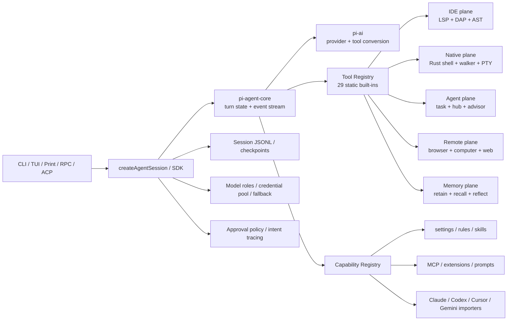

# Oh My Pi

> 一句话定位：基于 Pi substrate 深度分叉、把 IDE 智能、原生执行、多 Agent、浏览器与长期记忆内置为一等能力的 batteries-included Coding Agent runtime。

## 基本信息

| 项目 | 值 |
|------|----|
| 仓库 | `can1357/oh-my-pi` |
| URL | `https://github.com/can1357/oh-my-pi` |
| 上游基线 | Pi，当前 canonical repo 为 `earendil-works/pi`，历史名 `badlogic/pi-mono` |
| Star | 25,276（2026-08-17） |
| Fork | 2,434（2026-08-17） |
| 许可证 | MIT |
| 主要语言 | TypeScript + Rust；另有少量 TSX / Python 测试与工具 |
| 首次提交 | 2025-08-09（保留了分叉前历史） |
| 最近提交 | 2026-08-16（分析 commit `37eee71`） |
| 最新 Release | `v17.3.5`，2026-08-16 |
| 贡献者数 | 457（GitHub contributors API，含匿名，2026-08-17） |
| Open Issues / PRs | 947 / 481（GitHub Search API，2026-08-17） |
| 项目分类 | Coding Agent |
| 分析日期 | 2026-08-17 |

> 版本号不可直接横比：OMP 的 `17.x` 与 Pi 的 `0.84.x` 是两条独立 release line。GitHub 也未把 OMP 标记为 fork；本报告通过当前源码能力面对照，而不是依赖 GitHub fork diff。

---

## 场景一：是否值得采用

### 解决的问题

Pi 当前把产品哲学定义为“最小核心 + Extension/Skill/Package 自行扩展”，默认只内置 `read`、`bash`、`edit`、`write`、`grep`、`find`、`ls` 七个工具，并刻意不内置 MCP、权限弹窗、todo、后台 bash 等能力。

Oh My Pi 选择相反路线：保留 Pi 的 `pi-ai`、`pi-agent-core`、session tree、TUI、SDK 与扩展系统，同时将高频高级能力收进发行版，使用户不必自己拼装 Extension、原生 helper、MCP host、浏览器桥、subagent runtime 和长期记忆。

类比：**Pi 像可嵌入的 TypeScript Agent substrate；OMP 像基于这套 substrate 构建的完整“终端 Agent OS”。**

### 核心能力与边界

#### 相比当前 Pi 的实质新增

1. **IDE intelligence 进入核心写入链路**
   - `lsp` 暴露 definition、references、hover、symbols、rename、code actions、diagnostics 等操作。
   - DAP 提供 breakpoint、step、stack、scope、evaluate 等调试面。
   - `edit` / `write` 与 LSP write-through 联动，写后格式化、rename hook、延迟 diagnostics 回灌不再是外部插件约定。

2. **Rust 原生数据面**
   - `crates/` 提供 shell、walker、AST、隔离、voice、native addon 等实现。
   - 目标不是“换语言重写 UI”，而是把高频 grep/glob/walk/shell/AST 与跨平台能力下沉为 native substrate。
   - Pi 当前主仓没有 Rust 工作区，主要是 TypeScript runtime。

3. **更强的编辑与广义文件系统协议**
   - 默认 `hashline` 编辑以稳定行锚处理并发/漂移；同时保留 patch、replace、apply_patch。
   - 内置 `ast_grep` / `ast_edit`，支持结构化匹配、预览和原子变更。
   - `read` 不只读本地文件，还通过 internal URL router 读取 `agent://`、`memory://`、`mcp://`、`rule://`、`skill://`、`ssh://`、`issue://`、`pr://`、`artifact://` 等资源。

4. **多 Agent 运行时产品化**
   - `task` 支持单任务、并行 fan-out、链式执行、typed result、provider concurrency、独立 worktree 与持久 revive。
   - `hub` / Agent Hub 提供 peer 发现、消息、共享任务和跨 session 协作。
   - `/advisor`、`/plan-review`、`/collab`、`/vibe`、`/loop` 等把审查、协作和自治流程做成一等命令，而不是示例扩展。

5. **内置浏览器、桌面与搜索数据面**
   - `browser`、`computer`、`web_search`、`inspect_image` 直接注册为内置工具。
   - Browser Relay、CDP/Electron 控制、截图坐标模型和远端页面读取进入同一 session/tool contract。

6. **长期记忆与自我改进工具**
   - `retain`、`recall`、`reflect`、`learn`、`memory_edit`、`manage_skill` 是静态工具注册表的一部分。
   - 支持 local、Hindsight、Mnemopi 等 backend；这超出 Pi 的 session JSONL + compaction 边界。

7. **模型角色、凭据池与 fallback**
   - 除主模型外，可为 `slow`、`fast`、`plan`、`review`、`commit`、`summarize`、`task`、`vision`、`web_search`、`image` 等角色单独路由。
   - 多凭据 round-robin、session affinity、429 backoff、fallback chain 和 path-scoped 模型配置进入配置层。

8. **兼容与迁移控制面**
   - capability providers 可导入 Claude Code、Codex、Cursor、Gemini、OpenCode 等工具的 rules、skills、settings、MCP 和 context files。
   - MCP host、ACP、RPC、SSH profile、package/marketplace 管理直接内建。

9. **协作与可观测性**
   - `collab-web` 支持加密 relay、链接/二维码加入和 read-only/read-write 会话。
   - stats、OpenTelemetry、tool intent tracing、checkpoint/rewind、安全扫描进入产品面。

#### 当前 Pi 已有，不能算 OMP 独占

- 统一多 provider `pi-ai` substrate。
- 通用 agent core、steering/follow-up queue 与 tool lifecycle。
- JSONL session tree、branch/fork、compaction、resume。
- CLI/TUI、print/JSON/RPC 模式、可嵌入 SDK。
- TypeScript Extension、skills、prompts、themes、packages。
- subagent 示例与 experimental orchestrator。

OMP 对这些能力的主要贡献是**产品化、加深实现或改默认策略**，不是从零发明。

#### 主要只是包装 / 体验增强

- `omp` 命令名、logo、主题、安装脚本、Homebrew/Nix/mise/Windows 分发。
- 76 个内置 slash command 中相当一部分是现有 session/model/config 能力的更细入口。
- provider catalog 数量和 preset 本身不是架构创新；真正增量是 role routing、credential pool 与 fallback policy。
- `--print`、JSON/RPC、SDK、session tree 属于 Pi 原能力的重命名或延续。

### 集成成本

- **终端试用：低到中。** 预编译 binary / npm 安装路径直接，配置已有导入机制。
- **安全采用：中到高。** 默认 `tools.approvalMode` 为 `yolo`，必须主动改为 `write` 或 `always-ask`，并审计 project-level config/rules/extensions。
- **源码二次开发：高。** 当前 17 个 workspace package，TypeScript 与 Rust 双栈，Bun + Cargo + Bazel + native addon + 多平台 release matrix；远高于 Pi 的纯 TypeScript substrate。
- **团队生产化：高。** 需要固定版本、隔离工作区、出站策略、凭据最小化、MCP/extension allowlist 和 native artifact provenance。

### 依赖 / SDK 选型证据

| Dependency | Type | Used for | Problem solved | Evidence | Reuse signal | Caution |
|------------|------|----------|----------------|----------|--------------|---------|
| `@oh-my-pi/pi-agent-core` | Runtime SDK | Agent loop、tool settlement、state/events | 把产品 UI 与模型/工具执行内核分开 | `packages/agent/package.json`、`packages/coding-agent/src/sdk.ts` | 需要可嵌入 TypeScript Agent runtime 时优先评估 | 与上游 Pi scope 已分叉，升级不能按 drop-in replacement 假设 |
| `@oh-my-pi/pi-ai` | Provider SDK | 多协议模型流、tool conversion、credential routing | 统一 Anthropic/OpenAI/Google 及兼容 API | `packages/ai/package.json`、`packages/coding-agent/src/config/model-registry.ts` | 多 provider 产品需要统一事件模型时可复用 | provider 与兼容层很宽，回归面大 |
| `@oh-my-pi/pi-natives` | Native runtime | shell、walker、AST、隔离、语音 addon | 降低高频文件/进程操作开销并补跨平台原语 | `packages/natives/package.json`、`crates/`、`.github/workflows/ci.yml` | TUI Agent 遇到 Node 文件遍历或 shell 性能瓶颈时可评估 | 增加二进制供应链、ABI 与跨平台发布成本 |
| `@oh-my-pi/hashline` | Editing protocol | 稳定行锚编辑 | 缓解行号漂移和大文件 patch 定位失败 | `packages/hashline/`、`settings-schema.ts` 的默认 edit mode | 多轮 Agent 编辑容易发生定位漂移时值得借鉴 | 需要模型遵循专用 wire format，兼容桥复杂 |
| `@oh-my-pi/pi-mnemopi` | Memory backend | 长期记忆与检索 | 将 session history 之外的记忆变成独立 backend | `packages/mnemopi/`、`docs/memory.md` | 需要本地长期记忆但不想绑单一 SaaS 时评估 | 记忆注入会扩大隐私与 prompt contamination 风险 |
| `@modelcontextprotocol/sdk` | Protocol SDK | MCP client/host | 接入外部工具生态 | `packages/coding-agent/package.json`、`src/capability/mcp.ts` | 需要标准化外部工具互操作时优先复用 | MCP server 与 project config 都应进入信任边界 |
| `node-pty` / native PTY layer | Runtime | persistent shell、后台任务、交互进程 | 让命令执行跨 turn 持久化并可恢复 | coding-agent manifest、shell/job implementation | 长任务或 REPL 场景有明确收益 | PTY 生命周期、孤儿进程和权限边界难度高 |
| `tree-sitter` / native AST layer | Parser | AST search/edit | 比文本 grep/replace 更稳的结构化改写 | `crates/pi-ast/`、`src/tools/ast-*` | 多语言结构化重构值得复用 | grammar 版本与语言覆盖需持续治理 |

### 风险评估

| 风险项 | 评估 | 说明 |
|--------|------|------|
| 许可证合规 | ✅ / ⚠️ | 根仓 MIT；native/vendor/模型相关资产仍应逐项核验上游许可 |
| Bus factor | 中 | 457 contributors、活跃 PR 面降低单点风险；核心 release/架构决策仍明显集中 |
| 供应商锁定 | 低到中 | provider 很宽，但 OMP 私有配置、internal URL、hashline、native layer 会形成实现锁定 |
| 维护趋势 | 活跃但高压 | 同日有 release 与 push；同时 947 issues、481 PRs，backlog 很大 |
| 安全默认值 | ⚠️ 高风险 | approval framework 存在，但默认 `yolo`；浏览器、桌面、shell、MCP、extensions 组合后权限面很宽 |
| 供应链 | ⚠️ 中高 | native npm leaves、多平台二进制和运行时下载扩大 provenance 面；根仓未见独立 `SECURITY.md` |
| 上游漂移 | ⚠️ 中高 | `docs/porting-from-pi-mono.md` 记录的 last sync marker 为 2026-03-22；当前 Pi 与 OMP 已独立高速演化 |
| CI 盲区 | ⚠️ 中 | PR 侧 Rust validation 默认跳过，native-changing PR 使用 latest release addon；真实 native 变更主要 post-merge 验证 |

### 结论

**推荐个人受控试用；团队生产采用观望。**

- 如果需求是“开箱即用、工具面完整、愿意接受复杂度”，OMP 比 Pi 更接近成品。
- 如果目标是“可嵌入、可控、最小可信计算面”，Pi 更适合作为内部 substrate。
- OMP 的最大采用前提不是模型 key，而是先把 `tools.approvalMode` 从默认 `yolo` 改掉，并使用容器/VM或低权限账号隔离高权限工具。

---

## 场景二：技术架构学习

### 核心架构图



### 底层技术架构

#### 最小架构内核

`Pi-compatible Agent Core + Capability Registry + Role-aware Model Router + Rich Tool Runtime + Native/IDE Data Plane + Persisted Session/Memory Contracts`

#### 核心抽象

| 抽象 | 源码位置 | 职责 | 关键字段 / 方法 | 为什么重要 |
|------|----------|------|-----------------|------------|
| `AgentSession` / SDK composition root | `packages/coding-agent/src/sdk.ts` | 组装 model、tools、session、yield queue、UI/RPC bridge | `createAgentSession`、tool factories、queue callbacks | 将同一 runtime 暴露给 CLI、RPC、ACP 与嵌入方 |
| Built-in Tool Registry | `packages/coding-agent/src/tools/index.ts` | 冻结静态工具名、工厂与 handler | 29 个 tool factory mapping | 把“产品能力”从扩展示例提升为稳定 agent-facing contract |
| Capability Registry | `packages/coding-agent/src/capability/` | 统一发现 settings、rules、skills、MCP、extensions、SSH 等 | capability id、provider registration、load result/warnings | 解决多宿主配置导入与优先级组合问题 |
| Model Registry | `src/config/model-registry.ts` | provider/model overlay、OAuth、credential-aware projection | `registerProvider`、runtime overlay、fallback | 把模型目录、凭据与运行时路由解耦 |
| Internal URL Router | `src/internal-urls/router.ts` | 将本地/远端/记忆/agent/MCP资源统一为可读 URI | scheme registry、parse、resource contract | 让 `read` 成为广义资源入口，而不是单纯文件系统调用 |
| Task Runtime | `src/task/executor.ts`、`parallel.ts`、`worktree.ts` | 子代理并发、隔离、持久 revive 与结果组装 | spawn policy、provider concurrency、yield assembly | 将多 Agent 从示例脚本推进为可恢复运行时 |
| LSP write-through | `src/lsp/writethrough.ts` | 把编辑副作用、格式化、rename 与 diagnostics 串成一条链 | pre/post write hooks、deferred diagnostics | 让代码智能进入写入正确性边界，而非仅查询工具 |
| Approval Policy | `src/tools/approval.ts`、`config/settings-schema.ts` | 按 tier 与 per-tool policy 决定 allow/deny/prompt | `always-ask`、`write`、`yolo` | 是宽工具面能否安全部署的控制边界 |

#### 控制面 / 数据面

- **控制面：** settings/capability discovery、model roles、credential pool、fallback、approval policy、tool visibility、task spawn policy、session/checkpoint lifecycle。
- **数据面：** provider streaming、Rust shell/walker/AST、LSP/DAP、浏览器/桌面输入、MCP calls、subagent execution、memory backend I/O。

#### 关键执行链路

```text
用户输入
  → SDK/AgentSession admission
  → model role + provider + credential + fallback 解析
  → pi-agent-core streaming turn
  → tool call 进入 approval policy
  → static tool / MCP / extension / task runtime
  → result + diagnostics + intent trace 回灌
  → JSONL session / checkpoint / memory backend 持久化
```

```text
edit/write
  → hashline/patch/replace 参数解析
  → workspace 边界与 approval
  → 文件变更
  → LSP will/did rename + format-on-save
  → deferred diagnostics
  → tool result / checkpoint
```

```text
task fan-out
  → agent profile 与模型角色解析
  → read-only 或 worktree isolation
  → provider concurrency 控制
  → 子 session 执行与 yield
  → structured result assembly
  → parent session 回灌 / revive metadata
```

#### 状态模型

| 状态类型 | 位置 | 谁读写 | 生命周期 / 一致性规则 |
|----------|------|--------|------------------------|
| 持久 session | JSONL session tree / checkpoint | SessionManager、CLI/RPC/ACP | append-oriented，支持 branch/fork/compact/rewind |
| 用户/项目配置 | `~/.omp/agent/config.yml`、`.omp/config.yml` 与导入源 | Capability loaders、Settings manager | 分层 merge；项目配置属于信任边界 |
| 运行时模型状态 | ModelRegistry、credential pool、backoff | provider router | session affinity + 失败退避 + fallback |
| 子代理状态 | task metadata、worktree、revive records | Task runtime / Hub | 与父 session 隔离，结果通过显式 yield 合并 |
| 长期记忆 | local/Hindsight/Mnemopi backend | memory tools | 跨 session；应按 workspace/用户隔离 |
| 外部状态 | MCP server、browser tab、SSH host、LSP server | 对应 tool/client | 非事务性；失败必须显式降级或重连 |

#### 契约边界

- **内部契约：** `AgentTool`、tool registry、capability item/result、provider stream event、session event、task result schema。
- **外部契约：** CLI flags、JSON/RPC、ACP、MCP、internal URL schemes、package manifest、collab relay protocol。
- **Agent-facing 契约：** 29 个静态 tool schema、skills/rules/context files、slash commands、role-specific prompt/model policy。

#### 失败与降级模型

| 失败类型 | 检测方式 | 系统行为 | 降级 / 修复动作 |
|----------|----------|----------|------------------|
| Provider 429 / quota | status、credential state | backoff 当前 key，切 sibling credential 或 fallback model | 冻结失败桶并记录 route |
| LSP 不可用 | server discovery / startup failure | `lsp` factory 可返回 unavailable；核心 edit 仍可执行 | 退化为文本/AST edit，明确无 diagnostics |
| Native addon 不可用 | loader / ABI smoke | 选择平台 leaf 或 baseline build | 回退 JS path（若实现支持）或 fail closed |
| MCP / browser / SSH 不可达 | handshake / timeout | tool error 回灌，不应伪装成功 | 重连、切 backend、停用 capability |
| 子代理失败 | exit/result schema/timeout | isolated failure 进入 assembly | 部分结果返回、重试或 persisted revive |
| 写入冲突 | hashline/patch context mismatch | 拒绝错误定位写入 | 重新读取锚点后再执行 |
| 权限拒绝 | approval policy | deny/prompt，阻断 tool body | 用户显式授权或降低任务范围 |

#### 可复刻设计不变量

1. 高权限工具必须经过统一 approval contract，不能各自实现安全逻辑。
2. 配置导入先归一为 capability item，再进入 runtime；不要让每个子系统直接扫全盘配置。
3. 多模型路由应把“角色、凭据、fallback、backoff”结构化，而不是埋在 prompt。
4. 文件写入后 diagnostics 是同一事务语义的一部分，即使底层无法真正 ACID。
5. 子代理必须有 isolation、concurrency、yield 和 revive 边界，不能只是无界 child process。
6. 广义资源 URI 必须携带 scheme ownership 与 writable/immutable 属性。
7. Native 加速层必须有平台探测、artifact provenance 和可观测降级。
8. session、长期 memory 和外部工具状态必须分层，不要混成一个“上下文”。

### 关键设计决策与 trade-off

| 决策 | 选择 | 放弃了什么 | 为什么 |
|------|------|-----------|--------|
| 极小核心 vs batteries-included | OMP 选择大量内置能力 | 更小 schema、较低 TCB、Pi 的可组合纯度 | 降低真实用户拼装成本 |
| 纯 TypeScript vs TS + Rust | OMP 采用 native data plane | 构建简单性与单语言调试 | 获取 shell/walker/AST/跨平台性能与控制 |
| Extension-only subagents vs first-class task runtime | 内置 task/hub/worktree | 更少的状态与恢复复杂度 | 支撑并行、持久、可协作 Agent |
| 普通路径 vs URI resource fabric | internal URL router | 简单文件心智 | 统一 memory/MCP/agent/SSH/artifact 资源访问 |
| 安全保守默认 vs迁移顺滑默认 | approval framework + 默认 `yolo` | 安全开箱即用 | 保持旧式 coding agent 无阻塞体验；这是采用时必须反转的 trade-off |

### 值得学习的模式

- **Capability-first discovery：** 先定义 skill/rule/settings/MCP 等能力，再让 Claude/Codex/Cursor/Gemini discovery provider 产出统一 item。
- **LSP write-through：** 不是给模型加一个“查 definition”的工具，而是让编辑路径承担格式化、rename 与 diagnostics 语义。
- **Role-aware model router：** 同一 session 将 plan/review/vision/task 等 workload 拆为显式模型角色。
- **Internal URL as resource fabric：** 把跨域资源统一成只读/可写、可审计的 scheme contract。
- **Task isolation ownership：** worktree、provider concurrency、yield assembly、persisted revive 同时存在，避免“多 Agent = Promise.all”。
- **Native sidecar as data plane：** TypeScript 留在控制面，Rust 集中处理高频数据和系统原语。

### 反模式 / 踩坑点

- 默认 `yolo` 与“安全框架很完整”并不矛盾：框架存在不代表默认安全。
- 29 个静态工具、76 个 slash commands 会显著增加 schema/prompt、测试矩阵和认知负担。
- 双栈 + Bazel + native leaf 包使 release engineering 成为核心业务，不能当作普通 npm CLI 维护。
- PR 侧不验证真实 Rust/native 变更，会把关键反馈推迟到 main 或 release。
- 上游 Pi 仍在高速演化；长周期分叉需要明确的 backport/intent policy，不能只靠一次性 porting guide。

### 可借鉴的具体技术点

- 从 `capability/` 抽取多宿主配置归一层。
- 从 `lsp/writethrough.ts` 学习编辑后诊断的 lifecycle seam。
- 从 `task/` 学习 subagent isolation、并发和结果 assembly。
- 从 `internal-urls/` 学习 agent-facing resource protocol。
- 从 `tools/index.ts` 学习静态工具 registry 与 settings-gated factory 的组合。

---

## 架构解剖

### 目录结构

```text
packages/
  ai/             多 provider 与 tool-format substrate
  agent/          通用 agent loop 与事件
  coding-agent/   CLI、SDK、session、tools、capabilities、task/LSP/browser
  tui/            终端 UI
  catalog/        model/provider catalog
  natives/        Rust addon JS loader 与平台 leaf
  hashline/       稳定锚编辑协议
  mnemopi/        本地长期记忆 backend
  browser-relay/  浏览器扩展/relay
  collab-web/     协作会话 Web 客户端
  wire/           transport/protocol types
crates/
  pi-ast/         AST 数据面
  pi-shell/       shell/PTY 系统能力
  pi-walker/      文件遍历与搜索
  pi-natives/     addon composition
  pi-iso/         隔离相关原语
  pi-voice/       语音 native 能力
docs/             settings、memory、MCP、approval、porting 等
```

### 技术栈

- **运行时：** Bun / Node-compatible TypeScript、Rust native addons。
- **构建：** Bun workspace、Cargo、Bazel/Bazelisk、多平台 binary/napi leaf package。
- **测试：** Bun test；TS workspace、singleton、UI、runtime、native、smoke 分桶；Rust test/clippy/rustfmt。
- **CI/CD：** GitHub Actions + self-hosted `omp-kata`、Bazel remote cache、npm + GitHub Release 多平台发布。

### 模块依赖关系

`coding-agent` 是 composition root，向下依赖 `agent` 与 `ai` substrate；通过 `natives/hashline/catalog/mnemopi/wire` 扩展数据面和协议；`browser-relay/collab-web` 是外部交互壳。Rust crates 由 `pi-natives` 聚合成平台 addon，再被 TypeScript loader 选择。

### 扩展机制

- TypeScript extensions 与 lifecycle hooks。
- capability providers：settings/rules/skills/MCP/context/SSH 等统一 discovery。
- packages/marketplace、skills、prompts、themes。
- MCP、ACP、RPC 与 internal URL protocol。
- custom provider/model registration 与 OAuth projection。

---

## 关键代码走读

### 1. `packages/coding-agent/src/tools/index.ts`

- 维护 29 个静态 built-in tool 的 canonical registry。
- 工厂可以因 LSP/browser/memory 等前置能力缺失而不构造工具。
- 这份 registry 是 OMP 相比 Pi“内置什么”的最可靠证据，比 README 数字更准确。

### 2. `packages/coding-agent/src/capability/index.ts` 与 `discovery/`

- capability 定义与 provider registration 分离。
- Claude、Codex、Cursor、Gemini 等 loader 不直接污染 runtime，而是返回统一 item + warning。
- 这是 OMP 配置兼容面没有退化成 condition ladder 的关键。

### 3. `packages/coding-agent/src/lsp/writethrough.ts`

- 将文件写入与 LSP lifecycle 连接。
- 重点不是“支持 LSP”，而是把 format/rename/diagnostics 变成 edit side-effect 的后续阶段。

### 4. `packages/coding-agent/src/task/executor.ts`

- 负责 agent profile、tool policy、isolation、并发和子 session 生命周期。
- 与 `parallel.ts`、`worktree.ts`、`persisted-revive.ts` 共同构成可恢复 multi-agent runtime。

### 5. `packages/coding-agent/src/internal-urls/router.ts`

- 按 scheme 注册 handler，将 memory/MCP/agent/SSH/issue/artifact 统一为资源协议。
- 这个边界使 `read` 可以扩展而不不断膨胀参数 schema。

---

## 质量与成熟度

### 代码质量

- TypeScript 与 Rust 都有明确分层；复杂 subsystem（task、LSP、capability、internal URL）不是单文件堆叠。
- 类型契约、settings schema、provider overlays 和 tool factories 较完整。
- 代价是体量非常大、global/session lifecycle 复杂，维护门槛显著高于 Pi。

### 测试

- CI 将 TS tests 分为 workspace、singleton/global-state、native/integration、UI、runtime/session、native/unit、CLI smoke、install methods。
- Rust 在 main/release 跑 tests、clippy、rustfmt。
- **静态分析边界：** 本次按 TK 默认只做源码/CI/测试布局审计，没有安装依赖、运行构建或测试。
- 主要缺口：PR 默认不跑 Rust validation，native-changing PR 使用最近 release addon，不能证明 PR 自身 native 变更已通过。

### CI/CD

- 发布链有 release metadata、atomic tag/main intent、validation gate、平台 binary matrix 与 addon smoke。
- 自托管 runner 与 Bazel cache 提高吞吐，但增加复现与运维依赖。
- 部分 Actions 使用 floating major tag（如 `actions/checkout@v4`），供应链 pinning 不够严格。

### 文档质量

- README 与 `docs/` 对 tools、settings、memory、MCP、approval、packages、porting 有较高覆盖。
- `porting-from-pi-mono.md` 很有价值，明确记录哪些上游行为被保留、删除或重写。
- 根仓未见独立 `SECURITY.md`；对默认 yolo、project discovery、浏览器/桌面/MCP 组合威胁模型的集中说明仍不足。

### Issue / PR 健康度

- 2026-08-17：947 open issues、481 open PRs，不能使用仓库 `open_issues_count` 直接当 issue 数。
- 最近 open PR 包含 compaction、CLI、TUI、auth gateway、provider payload、Nix 等真实贡献，不是单纯机器人噪音。
- 高频 release 与大 contributor 面证明维护活跃；超大 backlog 也说明兼容面和 review 压力很高。

---

## 社区与生态

### 社区评价

- **正向信号：** 半年级公开周期达到 25k+ stars，457 contributors，且围绕 provider、TUI、Nix、auth、compaction 持续有外部变更。
- **真实痛点：** provider compatibility、429 key rotation、shell completion、配置 token、Windows/Nix、TUI 交互等边缘问题持续出现；这与其超宽产品面一致。
- **判断：** 不是纯 hype，也不是稳定低变更工具；更像高势能、快速扩张、backlog 很重的独立发行版。

### 衍生项目 / 插件生态

- 兼容 Pi extension/skill/package 心智，但 npm scope 与实现已分叉。
- MCP、marketplace、Smithery search、Claude/Codex/Cursor/Gemini/OpenCode importers 让它能消费多个既有生态。
- Browser Relay、collab-web、Mnemopi 等是仓内一等 companion package，不只是第三方例子。

### 竞品对比

- **最强直接竞品：Pi。** 同源 substrate，采用哲学相反：Pi 最小、OMP 全内置。
- **现实替代路径：OpenCode。** 如果需要完整多入口 runtime、MCP/plugin 和更成熟产品生态，不必承受 fork migration 心智。
- **架构邻居：jcode / Grok Build。** 前者同样强调 Rust terminal runtime，后者在 ACP/actor/tool/sandbox/worktree 组合上可对照学习。
- **闭源参照：Claude Code / Codex CLI。** OMP 的导入兼容和完整工具面瞄准的是这类“开箱即用”体验，而非只做库。

---

## 评分

| 维度 | 评分(1-5) | 说明 |
|------|----------|------|
| 功能覆盖度 | 5 | 29 个静态工具 + IDE/native/multi-agent/browser/memory/control plane |
| 代码质量 | 4 | 分层与类型边界强；体量、双栈和生命周期复杂度高 |
| 文档质量 | 4 | 用户与移植文档丰富；集中 threat model / SECURITY 仍不足 |
| 社区活跃度 | 5 | 25k+ stars、457 contributors、高频 release；backlog 同样巨大 |
| 架构设计 | 5 | capability、role routing、internal URL、LSP write-through、task isolation 有独立价值 |
| 学习价值 | 5 | 是研究“最小 substrate 如何长成 Agent OS”的高密度样本 |
| 可借鉴度 | 4 | 模式可借鉴，整仓直接复用成本高 |

---

## 总结

### 一句话评价

OMP 不是“Pi 换皮 + 多几个 provider”，而是把 Pi 的可扩展 substrate 推向 IDE-aware、native-backed、multi-agent、resource-protocol-driven 的完整终端 Agent runtime。

### 谁应该用

- 想要开箱即用的 terminal coding agent，并明确需要 LSP/DAP、浏览器、subagent、MCP、memory。
- 愿意固定版本、主动配置权限、接受快速迭代和较大安装/运行时表面。
- 想研究 coding agent 从 minimal harness 向 agent OS 演进的工程团队。

### 谁不应该直接用

- 需要最小可信计算面、严格供应链、长期稳定 API 的团队。
- 只想嵌入 provider/agent SDK，而不需要完整 CLI 产品面的人；此时 Pi 更合适。
- 不准备做隔离、却要把 production credentials 与未审计仓库交给默认 yolo runtime 的场景。

### 下一步

1. 个人试用先设置 `tools.approvalMode: write`，禁用不需要的 browser/computer/MCP/project extensions。
2. 团队 PoC 固定 `v17.3.5`，放入低权限容器/VM，验证 native artifact provenance、出站和 workspace boundary。
3. 二次开发先抽 capability registry、model role router、task isolation 与 LSP write-through，不建议直接 fork 全仓继续叠功能。
