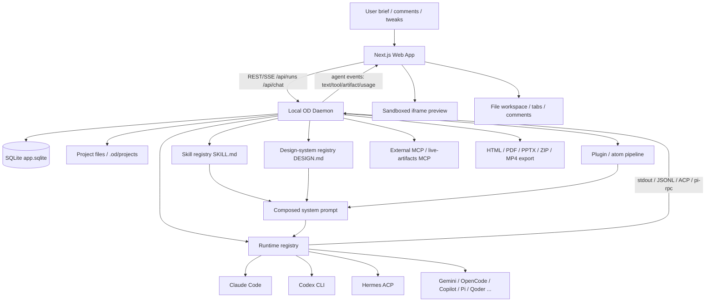

# open-design

> 一句话定位：Open Design 是一个本地优先、带官方 Cloud 服务和桌面壳的 agent-native 设计工作台 / design substrate，用用户已有的 Claude Code / Codex / Cursor / Gemini / Hermes 等 Agent CLI，或任意 OpenAI-compatible BYOK endpoint，把自然语言 brief 变成可预览、可编辑、可导出的 HTML / Deck / Image / Video / Design-System / Live Artifact 等设计产物。

## 基本信息

| 项目 | 值 |
|------|----|
| 仓库 | `nexu-io/open-design` |
| URL | `https://github.com/nexu-io/open-design` |
| Star | 76,003（GitHub API，2026-07-08） |
| Fork | 8,669（GitHub API，2026-07-08） |
| Watch | 249（GitHub API，2026-07-08） |
| 许可证 | Apache-2.0 |
| 主要语言 | TypeScript |
| 仓库创建 | 2026-04-28T04:25:20Z |
| 最近提交 | 2026-07-07：`c3712b738866370c473acc34ab6600af2656d46b` `fix(daemon): classify runtime stream failures (#5223)` |
| 最新 Release | `open-design-v0.13.0` / Open Design 0.13.0 — Stay in Flow，2026-07-02 |
| 贡献者数 | 约 364（GitHub contributors pagination，2026-07-08） |
| Issue / PR 健康口径 | open issues：323；open PRs：218；GitHub repo `open_issues_count=541` 含 PR |
| 本地源码规模 | 约 10,827 个文本文件；TypeScript 约 717k 行、TSX 约 235k 行、Markdown 约 353k 行、HTML 约 486k 行、JSON 约 417k 行（自定义统计，排除 `.git/node_modules/dist/build/.next/.cache/coverage/out` 等） |
| 分析日期 | 2026-07-08 |
| 本地分析版本 | `c3712b738866370c473acc34ab6600af2656d46b` |

---

### 定位与类比

#### 一句话定位

它已经不只是“design-agent shell”了，而是一个 **agent-native design platform / substrate**：Web + daemon + desktop + packaged runtime 提供项目、聊天、预览、导出、自动化、插件、集成和发布壳层；真正的智能循环既可以交给用户本机已有的 Agent CLI，也可以走官方 Open Design Cloud 或任意 OpenAI-compatible BYOK proxy。

#### 类比法

- 类似 **Claude Design**，但把技能、设计系统、插件、MCP 与运行时适配开放成文件协议和本地/自托管边界。
- 类似 **Open CoDesign**，但不坚持单一自研 agent loop，而是把 Claude Code、Codex、Cursor、Hermes、OpenCode、Copilot 等当成 runtime substrate。
- 类似 **Cursor/Claude Code + 设计技能库 + 沙盒预览器 + 本地 daemon + 官方模型服务** 的组合产品。

#### 项目分类

`AI Design Platform / Agent-Native Design Substrate`

它仍然是垂直设计平台，不是通用个人 AI 助手；但因为它已经具备 runtime registry、MCP server、BYOK proxy、desktop shell、automation 与 plugin substrate，这一轮可以作为 `Agent Platforms` 横评里的“垂直 design shell / substrate”锚点来比较。

---

## 场景一：是否值得采用

### 解决的问题

Open Design 解决的是“AI 设计产物生成”落地时最麻烦的几件事：

1. **设计产物不是聊天文本**：需要真实文件、预览 iframe、导出 HTML/PDF/PPTX/ZIP/MP4 等。
2. **设计质量不能只靠 prompt freestyle**：需要 Skill、DESIGN.md、craft references、preflight、critique checklist，把“审美和流程”显式文件化。
3. **用户已经有代码 Agent**：不应再造一个模型路由/工具调用框架，而是复用 Claude Code/Codex/Cursor/Gemini/OpenCode/Hermes 等现成 Agent CLI。
4. **本地文件和密钥边界**：设计项目、API key、Agent auth、文件写入都尽量留在本机 daemon；Web 层可以部署，秘密不必上云。

目标用户：独立开发者、设计系统维护者、内容/产品团队、会用 coding agent 的设计/前端混合型用户，以及想把“设计技能”产品化成文件资产的团队。

### 核心能力与边界

#### 能做什么

- **多形态产物**：prototype、deck、template、design-system、image、video、audio、live artifact、HyperFrames motion graphics。
- **Agent CLI 适配**：README 当前宣称支持 Claude Code、Codex、Cursor、Copilot、Gemini、OpenCode、OpenClaw、Antigravity、Cline、Trae、Kimi、Pi、Vibe、Hermes 等，并可 `od mcp install <agent>` 注入 MCP server。
- **BYOK + 官方 Cloud**：除了本地 CLI，还支持 Anthropic/OpenAI/Azure/Google/Ollama/SenseAudio 等 proxy 路径；README 直接把 Open Design Cloud 放到产品主叙事，成为官方模型服务层。
- **Skill / DESIGN.md / Plugin 资产层**：扫描 `skills/`、`design-systems/`、`plugins/`、`craft/`，把 prompt 方法论、品牌 contract、插件 pipeline 和媒体模板文件化。
- **本地 daemon**：Express + SQLite + 文件系统项目根，负责 REST/SSE、Agent spawn、artifact store、export、media、MCP、memory、automation、plugin 等。
- **Web/桌面/打包分发**：Next.js Web、Electron desktop、packaged runtime、mac/Windows/Linux 打包工具和多 release channel workflow。

#### 不能做什么 / 不适合什么

- **不是 Figma 替代品**：输出主要是 HTML/JSX/Markdown/PPTX/视频/图片，不是多人协作矢量画布。
- **不是低维护 SaaS**：Node 24 + pnpm 10 + better-sqlite3 + Electron + 多 CLI adapter + 大量 release/packaging/workflow 面，接管复杂度很高。
- **不是模型/服务无关的完全自足系统**：虽然支持 BYOK 与本地 CLI，但当前 README 已明显把 Open Design Cloud 纳入核心体验，实际质量与运营路径会受云服务和外部 agent/runtime 影响。
- **不是强隔离执行沙箱**：预览 iframe、daemon、skills、plugins、外部 MCP、BYOK proxy、desktop host bridge 都是高权限面，需要团队自己做治理。
- **不是稳定企业级设计平台**：repo 只创建约两个多月，但 backlog、release channel、产品面和代码规模已经非常大。

### 集成成本

- **依赖链**：根 `package.json` 要求 Node `~24` 与 pnpm `10.33.2`；web 是 Next.js 16 / React 18，daemon 是 Express 5 + better-sqlite3 + node-pty，desktop 是 Electron 41。
- **部署复杂度**：
  - 本地 dev：`corepack enable && pnpm install && pnpm tools-dev run web`，但必须满足 Node 24 和原生依赖编译。
  - Web + local daemon：依旧是最核心的运行形态。
  - Desktop / packaged：现已是正式产品面，不再只是实验壳；因此打包、签名、更新、sidecar 和多平台验证都是实打实的维护负担。
  - Cloud / BYOK：官方 Open Design Cloud 降低了首次使用门槛，但也把“本地设计壳”进一步推向“本地壳 + 云服务”的混合产品。
- **学习曲线**：高。要同时理解 Agent CLI、prompt/skill、DESIGN.md、Next/Web UI、daemon、SSE、Electron/sidecar、插件、自动化、媒体生成和发布链路。
- **从零到 demo**：如果已有 Node 24 + pnpm + 一个可用 Agent runtime / BYOK key，跑出 demo 仍可很快；但要接手全部平台面与稳定性，就不是“几分钟体验”的复杂度了。

### 依赖 / SDK 选型证据

> 全量 direct dependencies 由 `tk catalog build` 从本地源码 manifest 写入 catalog；本表只解释影响 build-vs-buy 的关键库 / SDK。

| Dependency | Type | Used for | Problem solved | Evidence | Reuse signal | Caution |
|------------|------|----------|----------------|----------|--------------|---------|
| Next.js 16 + React 18 | Web framework | Studio、项目页、预览、设置、集成、dashboard UI | 统一 Web app / SSR / 静态资源 / React 组件系统 | `apps/web/package.json` | 如果你也要做“agent + artifact preview”产品，这套组合仍然是主流安全选项 | 前端体量已非常大，UI 演进速度高，必须接受高测试/重构成本 |
| Express 5 + better-sqlite3 | Node server + local DB | 本地 daemon、REST/SSE、项目元数据、artifact 管理 | 把高权限本地文件/Agent spawn/导出能力收口到 daemon 边界 | `apps/daemon/package.json` | 很适合本地优先、单机型 Agent 产品 | Node 24 + 原生依赖 + 跨平台打包会显著抬高运维复杂度 |
| `node-pty` | Native process bridge | CLI runtime spawn / interactive session | 对 Claude Code / Codex / Cursor / Copilot 等本地 Agent CLI 做真实 TTY/进程编排 | `apps/daemon/package.json` | 多 Agent CLI 适配时几乎是绕不开的基础设施 | Windows/macOS/Linux 行为差异大，长期维护成本高 |
| `@modelcontextprotocol/sdk` | MCP SDK | `od mcp install`、MCP server 能力 | 让 Open Design 不只是“消费 CLI”，还可以反向把设计能力暴露给外部 agent | `apps/daemon/package.json` + README MCP 安装表 | 很强的 platform 化信号，值得借鉴 | 也意味着协议兼容、版本升级、外部工具信任模型更复杂 |
| `pptxgenjs` + `pdf-lib` + `jszip` | Export toolchain | PPTX / PDF / ZIP 导出 | 把“设计输出不是聊天文本”做成真实交付物链路 | `apps/daemon/package.json` | 如果你的产品目标是可交付 artifact，而非单纯聊天，这层非常值得抄 | 导出质量、浏览器/字体/平台差异、回归测试成本都不低 |
| Anthropic / OpenAI SDK + proxy contracts | Model/API bridge | 官方 Cloud、BYOK、图像附件代理 | 允许无 CLI 路径也能跑，并把多家 provider 收口到统一 UX | `apps/web/package.json`、`apps/web/src/providers/api-proxy.ts`、README | 有利于降低 onboarding 门槛 | 会把产品从“纯本地壳”推向“本地壳 + 云服务 / proxy”混合架构 |
| Electron 41 + sidecar/proto/platform | Desktop shell | 桌面分发、系统权限、sidecar 生命周期 | 把 Web + daemon 封成正式桌面产品而不是 demo | `apps/desktop/package.json` | 适合需要系统级路径、安装器、自动更新的产品 | 打包、签名、更新、权限、崩溃诊断全都会成为长期负担 |

### 风险评估

| 风险项 | 评估 | 说明 |
|--------|------|------|
| 许可证合规 | 中 | 根许可证 Apache-2.0，主仓库较友好；但 README 明确保留外部 skill / 模板 / 图像 / deck 来源，商业使用时仍要逐项核上游素材和品牌/trademark 边界。 |
| Bus factor | 中 | contributors API 已到约 364，merged PR 约 1,877，说明不是单人仓库；但 runtime/daemon/release/desktop/cloud 的关键治理面仍明显集中在核心团队。 |
| 供应商锁定 | 中 | 它一开始是反锁定设计，但现在官方 Open Design Cloud 已成为主叙事之一；仍支持 BYOK 和本地 CLI，但真实产品路径已不再完全“agent-neutral / cloud-neutral”。 |
| 维护趋势 | 极活跃但高波动 | 2026-04-28 创建，2026-07-08 已 76k stars、8.6k forks、5k+ issue/PR 编号，活跃度极高；同样意味着目录、功能面、路由与文档会持续快速变化。 |
| 安全面 | 中 | 可以看到 host boundary test、proxy route test、sandbox/路径守卫等安全意识；但 daemon + Agent spawn + desktop + plugins + MCP + BYOK proxy 仍是高权限体系，默认不等于强隔离。 |
| 文档一致性 | 中 | 早期 `docs/spec.md` non-goals 仍写“we do not ship a desktop app”，而当前仓库已正式包含 `apps/desktop` 与 packaged runtime；README 也同时出现 `0.13.0` 发布宣传、`package.json` 仍为 `0.12.1`、以及 21/22 agent 数字漂移。 |
| CI 可信度 | 中高 | 当前 `.github/workflows` 已有 44 个 workflow，`ci.yml` 做 scopes / static gate / visual handoff / 多矩阵验证，workflow 面比 5 月更完整；但其复杂度本身也代表维护与回归成本很高。 |

### 结论

**强烈推荐研究与 PoC；若要生产采用，先把它当“平台底座候选”而不是直接可托底的稳定产品。**

理由：

- **如果你要理解 agent-native 设计产品会怎样从 demo 走向平台**，Open Design 是现在最值得看的样本之一：它已经从“本地 design shell”长成了带 desktop、MCP、automation、plugin、Cloud 的完整产品面。
- **如果你要做内部设计生成工具 / 内容生产基座**，它依旧很值得借：`SKILL.md`、`DESIGN.md`、runtime registry、daemon↔web SSE、artifact preview/export、MCP 安装链路都很有复用价值。
- **如果你要直接押生产主线**，仍应谨慎：backlog 巨大、产品面扩张快、文档有漂移、release/workflow/desktop/cloud 维护面都很重，真正接手后不是“跑起来”而是“长期守住复杂度”。

推荐采用方式：

1. 先按 **本地 Web + daemon + 一个熟悉 Agent runtime / BYOK provider** 验证真实业务场景。
2. 把它当 **设计 substrate / 协议与流程样板**，先抽 `SKILL.md`、`DESIGN.md`、runtime adapter 表、artifact preview/export，而不是立刻整仓接手。
3. 若要继续跟进，优先围绕 **runtime resume、desktop shell、proxy security、plugin/automation contract** 建自己的验证清单。
4. 如果要 fork 深改，先冻结 tag / commit（至少 `open-design-v0.13.0` 或你验证过的 SHA），不要直接追 `main`。

---

## 场景二：技术架构学习

### 核心架构图

### 底层技术架构

#### 最小架构内核

open-design 的最小内核是 **Local Daemon + Runtime Registry + Skill/DESIGN File Protocol + Prompt Composer + Project File Store + SSE Event Contract + Sandboxed Preview/Export**。Next.js、Electron 和具体 Agent CLI 可替换，但“本地 daemon 统一调度外部 Agent 生成可预览产物”这条链路不能丢。

#### 核心抽象

- `RuntimeAgentDef`：声明 CLI runtime 的 args、streamFormat、stdin、image path、model list、MCP 注入和平台限制。
- `SkillInfo` / `SKILL.md`：把技能正文、frontmatter、assets、references、examples 和 UI metadata 分离。
- `DESIGN.md`：品牌/设计系统协议，给 prompt composer 注入稳定设计上下文。
- `Project` / file store：项目、tabs、comments、artifacts 和 linked folder 的本地文件事实源。
- `Run` / `AgentEvent`：一次 chat run 的生命周期和统一 SSE payload。
- `Plugin` / `Atom pipeline`：设计迁移、handoff、diff-review、build-test 等扩展阶段。
- `Sandboxed preview`：将 artifact 与宿主 DOM 隔离的 iframe 边界。

#### 控制面 / 数据面

- **控制面**：daemon REST/SSE、SQLite metadata、runtime registry、prompt composer、skill/design-system/plugin registry、preflight、path/HMAC guard、desktop sidecar lifecycle。
- **数据面**：spawn 外部 Agent CLI、stdin/stdout/JSONL/ACP/Pi RPC 流、项目文件读写、artifact preview、PDF/PPTX/ZIP/MP4 export、外部 MCP 注入。

#### 关键执行链路

1. **Chat run**：Web 发起 `/api/runs`，daemon 读取项目、skill、design system、plugin stage 和 research contract，按 runtime def 构造 args/stdin/MCP 注入，spawn CLI，并把 stdout/tool/artifact/usage 统一成 SSE。
2. **Skill 注入**：`skills.ts` 扫描多个 root，解析 `SKILL.md` frontmatter/body/attachments，处理 user shadow、id alias、examples，再给 prompt composer 和 UI 使用。
3. **文件与预览**：Agent 在项目 cwd 读写文件，daemon 通过 safe resolver 列表/读取/归档/上传，Web 用 sandboxed iframe 预览并触发导出。

#### 状态模型

- **持久状态**：`app.sqlite`、`.od/projects`、项目文件、artifact manifest、skill/design-system/plugin 文件。
- **运行时状态**：agent subprocess、SSE run stream、stdin tool_result 回写、watchdog、desktop sidecar、preview tab 状态。
- **外部状态**：Claude/Codex/Hermes/Pi 等 CLI auth 与 model list、用户外部 MCP、linked folder、OS process/path。daemon SQLite 和 project files 共同构成事实源。

#### 契约边界

- **内部契约**：`RuntimeAgentDef`、prompt block composer、project safe path resolver、plugin manifest/atom pipeline、contracts package。
- **外部契约**：daemon REST API、SSE event schema、Electron/sidecar protocol、Agent CLI argv/stdin/stdout/JSONL/ACP/Pi RPC。
- **Agent-facing 契约**：`SKILL.md` / `DESIGN.md` / craft refs / staged `.od-skills` 目录和外部 MCP 注入。

#### 失败与降级模型

- Runtime adapter 处理 auth failure、empty output、stdin EPIPE、inactivity watchdog、Windows argv limit 和 sandbox 差异。
- Web preview 使用 iframe sandbox 且不加 `allow-same-origin`，降低 artifact XSS/host cookie 风险。
- Folder import HMAC gate、trusted picker marker、path traversal guard 和 non-loopback token requirement 收紧本地高权限能力。
- 外部 CLI 行为漂移是长期风险，必须通过 per-runtime definition 和 stream parser 隔离。
- 早期 release workflow 仍允许部分 tests 非 gating，生产采用需自行冻结版本和补验证。

#### 可复刻设计不变量

1. Web UI 不应直接持有本地高权限能力，必须经 daemon。
2. 多 CLI runtime 要用 capability definition 表达，而不是业务 if/else。
3. Skill 和 Design System 应作为文件协议，便于版本化、fork 和 review。
4. Prompt composition 要分块，不能把所有上下文揉成一段。
5. UI 消费统一 SSE event，不能解析各 CLI 原始 stdout。
6. Artifact preview 必须 sandbox，文件 HTTP path 必须 safe resolve。
7. 本地 Agent orchestration 要显式处理 auth、stdin、argv、watchdog、empty-output。
8. Plugin/atom 扩展必须有 manifest 和 fallback，不应直接污染核心 run pipeline。

### 关键设计决策与 trade-off

| 决策 | 选择 | 放弃了什么 | 为什么 |
|------|------|-----------|--------|
| Agent loop ownership | 复用用户已有 Agent CLI，而不是自研 agent loop | 对模型/tool protocol 的完全控制 | 复用 Claude Code/Codex/Cursor 等成熟能力，降低自研复杂度，适配用户已有订阅 |
| 能力单元 | `SKILL.md` + `DESIGN.md` 文件协议 | 纯数据库/闭源内部 skill | 让设计方法、品牌规范、prompt workflow 可版本化、可 fork、可 PR review |
| 部署形态 | Web App + local daemon + optional Electron packaged shell | 单一 Electron 或纯云 SaaS | Web 易部署，本地 daemon 持有密钥与文件，desktop 作为外壳补系统能力 |
| 产物存储 | SQLite 存元数据 + 文件系统存 artifacts | 全部塞 DB 或全部 localStorage | 文件可被 git/CLI/Agent 直接操作；DB 只负责项目、会话、tab、message 状态 |
| 预览隔离 | `iframe sandbox="allow-scripts"`，不加 `allow-same-origin` | artifact 与宿主 DOM 深度集成 | 降低 XSS/host cookie 风险，牺牲部分 localStorage/cookie 兼容性 |
| Runtime 适配 | `RuntimeAgentDef` + stream parser 分层 | 单一 adapter 代码路径 | 支持多 CLI，但必须维护大量 CLI quirks、stdin/argv/Windows 限制、auth failure 诊断 |
| 质量控制 | preflight + critique theater + stub guard + handoff manifest | 只靠模型一次生成 | 把“高级设计师流程”显式化；代价是 prompt/状态机复杂度上升 |
| 扩展方向 | plugin runtime + atom pipeline + GenUI | 只做固定 skills | 为后续 design migration / Figma / code migration / handoff 铺路，但当前架构负载明显变重 |

### 值得学习的模式

1. **Substrate 而不是 Product-only**
   - README 自己总结得很准：Claude Design 是产品，Open Design 是 substrate。
   - 它的核心价值不是某个生成模型，而是把 Agent、Skill、Design System、Artifact Preview、Export、Plugin pipeline 组织成平台底座。

2. **Capability-first runtime abstraction**
   - `apps/daemon/src/runtimes/registry.ts` 把 Claude、Codex、Hermes、Pi、Copilot 等作为 runtime definition。
   - `RuntimeAgentDef` 抽象了 `buildArgs`、`streamFormat`、`promptViaStdin`、`promptInputFormat`、`supportsImagePaths`、`externalMcpInjection` 等能力，而不是在业务层硬编码每个 CLI。

3. **File protocol as extension point**
   - Skill 是文件夹 + `SKILL.md`，Design System 是 `DESIGN.md`，craft rules 是 `craft/*.md`。
   - 这非常适合 agent-native 生态：工具不需要先注册到云端 marketplace，放进文件系统就能被扫描、注入、版本控制。

4. **Prompt composition pipeline 显式分层**
   - 系统 prompt 不是一坨文本：daemon system prompt、skill body、design system、craft refs、plugin active stage、client instruction、research contract、linked dirs hint 都是结构化拼装。
   - 这比“把所有上下文塞给模型”更可维护，也便于测试每个 block。

5. **Streaming event contract 分层**
   - `packages/contracts/src/sse/chat.ts` 定义 chat SSE 的 start/stdout/stderr/agent/error/end；agent payload 又分 status/text_delta/thinking/tool_use/tool_result/usage/live_artifact。
   - 对 Agent UI 很值得借鉴：UI 不直接解析不同 CLI 的 stdout，而消费统一事件流。

6. **Local privileged daemon boundary**
   - Web UI 不直接拿系统权限；daemon 才能读写项目、spawn CLI、访问本地配置、导出 PDF/PPTX、连接 MCP。
   - Desktop 再通过 sidecar/IPС 获取本地能力，不让 renderer 自行决定敏感路径。

7. **高风险本地能力的“逐步 fail-closed”思路**
   - folder import HMAC gate、trusted picker marker、path traversal guard、iframe sandbox、non-loopback token requirement、外部 MCP 注入策略显式化，说明维护者已经在补安全边界。

### 反模式 / 踩坑点

1. **项目过新但架构面已经很大**
   - 仅 3 周左右历史，却已覆盖 web、daemon、desktop、packaged、plugins、media、memory、MCP、connectors、routines、landing page、release pipeline。
   - 对采用者来说，这意味着“能借鉴很多”，也意味着“跟主线会很累”。

2. **文档漂移明显**
   - 早期 `docs/spec.md` 的 non-goals 写“不 ship desktop app”，当前代码已有 Electron desktop 与 packaged runtime。
   - README 对 skills/design systems 数字多处不一致（例如 31/72、129、badge 149/131），说明内容生成和实际状态同步还在高速变动。

3. **过度依赖外部 CLI 行为稳定性**
   - 每个 Agent CLI 的 stdin、JSONL、auth、model list、Windows argv 限制、MCP 支持都不同。
   - Open Design 已经写了大量兼容代码，但这个维护面会长期存在。

4. **安全边界复杂**
   - Agent 能读写文件、skill 可诱导 shell、MCP 可接外部工具、plugins 可带 pipeline/atoms、desktop 可打开本地路径；每层都有自己的 trust story。
   - 若企业采用，需要先做 threat model，而不是只看 UI 效果。

5. **CI/release 速度优先于完全收敛**
   - CI 很丰富，但 release-stable workflow 明确说明 workspace tests 因 i18n drift 暂不 gating。
   - 这不一定是坏事：项目早期高速推进合理；但生产依赖要自己加冻结和验证。

### 可借鉴的具体技术点

- `RuntimeAgentDef`：用数据定义多 CLI adapter，特别是 `promptViaStdin`、`streamFormat`、`externalMcpInjection` 这些字段很实用。
- `SKILL.md + od frontmatter`：非常适合 Hermes / Codex / Claude Code 等 agent workflow 生态复用。
- `DESIGN.md` 设计系统协议：把品牌/设计规范变成 agent 可读文件，比纯 prompt 更稳定。
- `project file store + safe path resolver`：本地文件型 artifact 产品的基础设施样板。
- `contracts` package：前后端共享 SSE/API 类型，防止 daemon/web drift。
- `Critique Theater / handoff manifest`：把 AI 设计生成后的验收、评论、导出和实现移交做成结构化状态，而不是口头总结。
- `tools-dev / tools-pack` 控制面：复杂多进程本地产品（daemon/web/desktop）值得参考的运维入口。

---

## 架构解剖

### 目录结构

| 目录 | 职责 |
|------|------|
| `apps/web` | Next.js 16 + React 18 Web Runtime；项目列表、聊天、设计系统、插件、文件工作区、预览、设置等 UI。 |
| `apps/daemon` | Express + SQLite 本地 daemon；REST/SSE、Agent CLI spawn、skills/design systems、artifacts、MCP、media、memory、plugins、routines、export。 |
| `apps/desktop` | Electron shell；系统路径、PDF、窗口、IPC、sidecar 集成。 |
| `apps/packaged` | 打包版 Electron runtime entry；启动 packaged daemon/web sidecars。 |
| `packages/contracts` | Web/daemon 共享 API/SSE/analytics/prompts 类型，纯 TypeScript。 |
| `packages/sidecar-proto` / `sidecar` / `platform` | sidecar 协议、runtime bootstrap、OS process/stamp/toolchain primitive。 |
| `packages/plugin-runtime` / `registry-protocol` | 插件 manifest、parser、validate、pipeline fallback、registry protocol。 |
| `tools/dev` | 本地开发生命周期控制面：daemon → web → desktop。 |
| `tools/pack` | mac/Windows/Linux 打包、安装、启动、清理、release artifact。 |
| `tools/pr` | 维护者 PR-duty 控制面，封装 gh 查询、lane、review checklist。 |
| `skills` | 设计/营销/运营/工程等功能技能，`SKILL.md` 为核心。 |
| `design-systems` | 内置品牌设计系统，核心文件为 `DESIGN.md`，部分含 tokens/components/preview。 |
| `design-templates` / `templates` | 设计模板、live artifacts 示例、landing/deck 等可复用产物。 |
| `plugins` | 官方插件、atoms、scenario pipelines。 |
| `craft` | 通用设计 craft rules，如 typography/color/anti-ai-slop。 |
| `docs` / `specs` | 架构、协议、roadmap、change specs。 |
| `e2e` | Vitest/Playwright 端到端测试。 |

### 技术栈

- **运行时 / 框架**：Node `~24`、pnpm `10.33.2`、TypeScript、Next.js 16、React 18、Express、Electron。
- **持久化**：SQLite (`better-sqlite3`) + WAL；项目文件在本地文件系统；部分 storage/S3 adapter 正在演进。
- **Agent 通信**：child_process spawn、stdin prompt、stdout JSONL/plain parsing、ACP JSON-RPC、Pi RPC、MCP config 注入。
- **预览与导出**：sandboxed iframe、HTML/JSX preview、PDF、PPTX、ZIP、video/audio/image media routes。
- **测试**：Vitest、Node built-in test、Playwright UI automation、workspace typecheck、guard、i18n check。
- **CI/CD**：GitHub Actions；PR/main CI、landing page deploy、docker image、多 release channel（beta/nightly/preview/stable）、packaging workflows。

### 模块依赖关系

1. `apps/web` 通过 `/api/*` 与 daemon 通信，消费 `/api/runs/:id/events` 或 `/api/projects/:id/events` SSE。
2. `apps/daemon` 读取 SQLite 元数据与 project files，组合 prompt 后 spawn agent runtime。
3. `apps/daemon/src/runtimes/*` 提供 CLI 定义、检测、launch env、model list、stream parser。
4. `skills.ts` / `design-systems.ts` / `craft.ts` / `plugins/*` 向 prompt composer 提供结构化上下文。
5. Agent CLI 在项目 cwd 内读写文件，daemon 把 stdout/stderr/agent events 转为 SSE 给 web。
6. Web file workspace 刷新项目文件、打开预览、展示 tool cards、评论、导出。
7. Desktop/packaged 通过 sidecar/proto/platform 控制 daemon/web 生命周期并补系统能力。

### 扩展机制

- **Skill 扩展**：新增 `skills/<slug>/SKILL.md`；支持 assets/references/example；`od` frontmatter 控制 mode、preview、inputs、parameters、craft、design_system、critique 等。
- **Design System 扩展**：新增 `design-systems/<brand>/DESIGN.md`，可带 manifest、tokens、components、preview、assets。
- **Agent Runtime 扩展**：新增 `apps/daemon/src/runtimes/defs/<agent>.ts` 并注册到 `registry.ts`，必要时增加 stream parser。
- **Plugin/Atom 扩展**：`plugins/_official/atoms`、scenario pipeline、manifest validation、GenUI surface、handoff/diff-review/build-test atoms。
- **MCP 扩展**：用户外部 MCP server 可被 Claude `.mcp.json`、ACP merge、OpenCode env content 等策略注入。
- **Media provider 扩展**：image/video/audio provider/config/model 列表与 `/api/projects/:id/media/generate`。

---

## 质量与成熟度

### 代码质量

- **类型系统**：总体 TypeScript 化程度很高；`packages/*`、`apps/*`、`tools/*` 的 workspace 边界清晰，`contracts` / `platform` / `sidecar` 这种拆分仍然是它最值得学的地方之一。
- **核心复杂度**：daemon 核心 `apps/daemon/src/server.ts` 这轮仍然是 `// @ts-nocheck`，而且约 8,077 行，说明最值钱的 orchestration 中枢依旧带着明显的历史包袱和演化压力。
- **边界意识**：`apps/web/tests/host-boundary.test.ts` 直接约束 web 侧不得碰 preload globals，说明它不只是“写功能”，而是真的把 host/web/desktop 边界当成长期治理对象。
- **代码风格**：规范、测试、workflow、工具脚本都很系统；但快速扩张下，README / spec / package version / release 之间仍会出现漂移。

### 测试

- 自定义统计下，测试/规格相关文件约 **1,145** 个，明显高于 5 月口径。
- 当前可直接看到：
  - `apps/web` 大量 Vitest：runtime、router、state、styles、i18n、provider、host-boundary、preview 等。
  - `apps/daemon/tests` 覆盖 proxy routes、runtime 恢复、项目文件、导出、MCP/代理与系统边界。
  - `apps/desktop`、`packages/*`、`tools/*`、`e2e` 也都有独立测试面。
- 本轮依旧**没有直接跑 install/typecheck/test**：当前机器 `node -v` 是 `v22.22.3`，而项目 manifest 要求 `node ~24`，直接执行会得到与项目目标环境不一致的结果。

### CI/CD

优点：

- `.github/workflows/` 当前已有 **44 个 workflow**，已经不是“有 CI”而是“有一整套发布与治理工厂”。
- `ci.yml` 具备 scopes 检测、static gate、actionlint、visual report handoff、多矩阵验证等机制。
- release 体系覆盖 stable / preview / prerelease / beta / docker / landing page / contributor refresh / backport / visual baseline 等，说明维护者已经把产品、发布和社区运营一起产品化。

风险：

- 这套 workflow 面本身就是复杂度来源；接手者不仅要维护应用代码，还要维护大量 release / packaging / automation 资产。
- Node 24、pnpm、better-sqlite3、Electron、desktop sidecar、Cloud / BYOK proxy 叠加后，环境漂移和跨平台回归成本始终不低。

### 文档质量

- README 现在比 5 月更像“产品官网入口”：release 宣传、Open Design Cloud、Fellow program、平台兼容表、产品 tour、演示素材都很完整。
- `docs/spec.md`、`docs/architecture.md`、`docs/skills-protocol.md`、`docs/agent-adapters.md` 仍然是很有学习价值的设计文档。
- 不足也更明显：早期 spec non-goals 仍写“不 ship desktop app”，但当前产品已正式包含 desktop；README / package version / release 文案之间也出现轻微漂移，采用时必须以源码和当前 release 共同校对。

### Issue / PR 健康度

- open issues：323；open PRs：218；closed issues：732；merged PRs：1,877（GitHub Search API，2026-07-08）。
- 当前 open queue 主题很能说明项目状态：一边在修 Windows Trae CLI 启动、annotation UI、resume/recover 之类稳定性问题；一边继续上 showcase、WebGL preview、Kiro MCP client、AMR failure recovery 等新能力。
- 结论：**社区和核心团队仍极强推进，但 backlog 非常大，项目已进入“边冲功能边修平台底座”的阶段。**

---

## 社区与生态

### 社区评价

基于 GitHub 指标和 issue/PR：

- **热度继续上冲**：从 5 月的 47k stars 增长到 76k+ stars、8.6k+ forks，依然牢牢占住“开源 Claude Design alternative / agent-native design platform”的流量高地。
- **贡献密度继续扩大**：contributors 约 364，merged PR 接近 1.9k，说明它已经不是单纯 README 爆红项目。
- **产品化预期明显升级**：官方 Open Design Cloud、桌面壳、showcase、自动化、插件、MCP、release channel 一起推进，社区期待它成为真正的平台而不是单点 demo。
- **真实压力也同步变大**：Windows/macOS CLI 兼容、resume/recover、preview、desktop、proxy、安全、release、packaging 都持续出现在 backlog。

### 衍生项目 / 插件生态

Open Design 自己就在把生态做成四层资产：

- `skills/`：设计、营销、运营、产品、工程等可直接复用的生成方法。
- `design-systems/`：`DESIGN.md` 品牌 contract 与 token/component 资产。
- `plugins/`：官方插件、atoms、scenario pipelines。
- `prompt-templates/` / media / showcase：把 prompt、视觉模板、演示产物继续产品化。

外部生态仍更像“上游 inspiration + runtime 邻居”：

- `OpenCoworkAI/open-codesign`：最直接的开源对标物。
- `op7418/guizang-ppt-skill`：deck 路线的重要来源。
- `VoltAgent/awesome-design-md`、`bergside/awesome-design-skills`：协议 / 素材库邻居。
- `Hermes Agent`：已在 README runtime 表中作为受支持 agent 之一。

### 竞品对比

#### 直接竞品

- **Open CoDesign**：同样是开源 Claude Design alternative，定位最接近。差异是 Open CoDesign 更偏桌面 app + 自身 agent/provider loop；Open Design 更偏 Web + daemon + BYO Agent CLI shell。
- **Claude Design**：闭源标杆，不是开源竞品但定义了用户心智。

#### 邻近替代

- **Figma AI / Figma Make / Google Stitch / v0 / Lovable / Replit Agent**：更产品化或更面向 UI/code generation，但不是本地 SKILL.md/Agent CLI substrate。
- **Cursor/Claude Code + 手写 skills/design systems**：轻量替代路径，适合不需要专门 UI/预览/导出的用户。

#### 架构邻居

- **multica**：daemon + PATH-scan agent detection + agent-as-teammate 思路。
- **Hermes Agent**：多 tool/skill/gateway/Agent orchestration 的生态化经验；Open Design 已把 Hermes 作为 runtime 之一。
- **UI-TARS-desktop**：桌面 runtime、GUI automation、packaged app、sidecar 分层可互相参照。

---

## 关键代码走读

### 1. Agent Runtime Registry

- 路径：`apps/daemon/src/runtimes/registry.ts`
- 职责：集中注册所有 Agent runtime definition。
- 实现要点：
  - `BASE_AGENT_DEFS` 这一轮已包含 AMR、Claude、Codex、Devin、OpenCode、BYOK OpenCode、Hermes、Trae CLI、Grok Build、Kimi、Cursor、Qwen、Qoder、Copilot、Amp、Pi、Kiro、Kilo、Vibe、DeepSeek、Aider、Antigravity、Reasonix、CodeBuddy、Mimo 等一整张运行时表。
  - `readLocalAgentProfileDefs()` 允许本地 profile 扩展，说明不是只能靠内置列表。
  - 注册时做 duplicate id 检查，保持 runtime id 唯一。
- 学习点：多 adapter 系统应优先做“定义表 + 能力字段”，而不是每个 agent 在主逻辑里 if/else。

### 2. Runtime Definition 类型与 Claude/Codex 适配

- 路径：`apps/daemon/src/runtimes/types.ts`、`apps/daemon/src/runtimes/defs/claude.ts`、`apps/daemon/src/runtimes/defs/codex.ts`
- 职责：定义一个 CLI runtime 需要声明的能力和启动方式。
- 实现要点：
  - `RuntimeAgentDef` 包含 `buildArgs()`、`streamFormat`、`promptViaStdin`、`promptInputFormat`、`supportsImagePaths`、`listModels`、`externalMcpInjection` 等。
  - Claude 用 `--input-format stream-json --output-format stream-json`，stdin 保持打开以支持 `AskUserQuestion` 的 tool_result 回写。
  - Codex 用 `codex exec --json` + stdin，Linux/macOS 用 workspace-write sandbox + network flag，Windows 退到 `danger-full-access` 解决 shell 被 policy 拒绝的问题。
- 学习点：adapter 不只是“命令行参数”，还要把平台、权限、stdin/argv 限制、model list、structured stream、MCP 注入方式都编码成 contract。

### 3. Chat Run Spawn Pipeline

- 路径：`apps/daemon/src/server.ts`
- 职责：把一个用户 chat run 转换为可执行 Agent CLI 进程，并把结果流回 UI。
- 实现要点：
  - 先组合 daemon system prompt、active skill、design system、plugin stage、research contract、run context、linked dirs。
  - 将 active skill stage 到项目 cwd 的 `.od-skills/<folder>`，优先给 agent 一个 cwd-relative 读取路径。
  - 对 Codex 生成图片目录、external MCP、OpenCode env-content、Claude `.mcp.json`、ACP merge 等做 per-runtime 注入。
  - 做 prompt argv budget / Windows cmd shim / direct exe budget 预检查。
  - spawn 后按 `streamFormat` 走 Claude JSON、Qoder JSON、Copilot JSON、Pi RPC、ACP、OpenCode/Codex JSON-event、plain stdout 等分支。
  - 有 inactivity watchdog、empty-output guard、auth failure diagnosis、stdin EPIPE 保护、tool_result 注入。
- 学习点：这是整个项目最值钱也最危险的“本地 Agent orchestration”中枢。它体现了真实产品适配多 CLI 时要处理的全部边角料。

### 4. Skill Registry

- 路径：`apps/daemon/src/skills.ts`
- 职责：扫描 skills root，解析 `SKILL.md` frontmatter/body，返回可用于 UI 和 prompt 的 `SkillInfo`。
- 实现要点：
  - 多 root 优先级：第一个 root 视为 user，可 shadow built-in。
  - 支持 id alias，避免 skill rename 让旧项目丢 prompt。
  - 解析 `od.mode`、`surface`、`platform`、`scenario`、`category`、`craft.requires`、`design_system.requires`、`preview.type`、`default_for`、`critique.policy`。
  - 对带 assets/references 的 skill 自动加 `Skill root` preamble，让 agent 知道相对/绝对读取路径。
  - 支持 derived examples，方便一个 skill 下多个示例作为 gallery card。
- 学习点：Skill 生态要能长期演进，必须处理优先级、别名、示例、附件路径、UI metadata 与 prompt body 的分离。

### 5. Project File Store 与安全路径

- 路径：`apps/daemon/src/projects.ts`
- 职责：管理 project folder、文件列表、raw read/write、archive、artifact manifest、上传等。
- 实现要点：
  - `resolveProjectDir()` 支持 daemon-managed project 和 metadata.baseDir 的 linked folder。
  - `listFiles()` 对 linked folder 默认跳过 `node_modules/.git/dist/build/.next/.cache/.od` 等，避免 UI 被依赖目录淹没。
  - `buildProjectArchive()` 使用 realpath-aware resolver 防 symlink escape；archive 排除 hidden segments 和 artifact sidecar。
  - 文件 kind/mime/manifest 识别让 UI 能正确预览不同产物。
- 学习点：artifact 产品最好把产物作为普通文件保存，但所有 HTTP path 都必须经过严格 resolver。

### 6. Web SSE Client 与 Transcript Builder

- 路径：`apps/web/src/providers/daemon.ts`
- 职责：Web 侧创建 run、消费 daemon SSE、把 agent events 转成 UI message/tool/artifact 状态。
- 实现要点：
  - `buildDaemonTranscript()` 将历史消息折叠成 `## user / ## assistant` transcript，并按 agent id scope history，避免切换 agent 时污染上下文。
  - 对过长历史消息做 12k 字符截断，并对高 input token/大 tool result/agent-browser dump 加 context warning。
  - `streamViaDaemon()` 先 `POST /api/runs`，再消费 `/api/runs/:id/events`，并把 runId/status/eventId 回调给 UI。
- 学习点：多轮聊天接 CLI print-mode agent 时，前端 transcript compaction 和 reattach 逻辑同样是关键能力，不是纯 UI 细节。

---

## 评分

| 维度 | 评分(1-5) | 说明 |
|------|----------|------|
| 功能覆盖度 | 5 | prototype / deck / design-system / template / media / desktop / plugin / automation / MCP / Cloud 全都进了产品面，功能覆盖几乎是平台级。 |
| 代码质量 | 4 | 边界设计、测试和 contracts 很强；但 daemon `server.ts` 仍 8k+ 行且 `@ts-nocheck`，关键中枢复杂度依然偏高。 |
| 文档质量 | 4 | README/docs/spec/AGENTS 都非常丰富；但 spec non-goals、README 数字、package 版本与 release 文案之间仍有漂移。 |
| 社区活跃度 | 5 | 76k stars、8.6k forks、约 364 contributors、merged PR 近 1.9k，热度与贡献密度都很高。 |
| 架构设计 | 5 | Web + daemon + desktop + BYO Agent + MCP + DESIGN.md / SKILL.md / plugin substrate 的平台化思路非常完整。 |
| 学习价值 | 5 | 是 agent-native design platform 从 shell 走向平台的优秀样本，尤其适合学习 runtime registry、artifact pipeline、desktop/daemon 边界。 |
| 可借鉴度 | 5 | Skill/Design System/runtime registry/SSE contract/daemon boundary/export pipeline 都可直接拆出来复用。 |

---

## 总结

### 一句话评价

Open Design 依然是当前最值得研究的 agent-native 设计平台之一；而且和 5 月相比，它已经不只是“会生成页面的设计壳”，而是明显朝 **带 Cloud、desktop、MCP、automation、plugin 的 design substrate** 演化了。

### 谁应该用

- 想快速试用开源 Claude Design alternative、同时关心长期平台化方向的个人开发者/设计师。
- 已有 Claude Code / Codex / Cursor / Hermes 等 Agent runtime，并希望把它们系统化用于设计产物生成的人。
- 想沉淀 `SKILL.md`、`DESIGN.md`、设计模板、deck/海报/landing 生产流程的内容团队。
- 正在做 Agent UI / Agent workflow / 本地 daemon / skill ecosystem / design substrate 研究的人。

### 谁不应该直接用

- 要稳定企业级多人协作设计平台的人。
- 希望替代 Figma 矢量编辑/协同编辑的人。
- 没有 Node 24 / pnpm / Agent runtime / BYOK 环境，也不想维护本地工具链的人。
- 对本地高权限 Agent、外部 skills/plugins/MCP、proxy 与 desktop host 能力没有安全治理能力的团队。

### 下一步

1. **短期 PoC**：固定 `open-design-v0.13.0` 或某个已验证 commit，跑本地 daemon + 一个 Agent runtime / BYOK provider，验证 3 个场景：landing page、deck、design system。
2. **架构抽取**：重点读 `runtimes/defs/*`、`skills.ts`、`design-systems.ts`、`server.ts` chat spawn pipeline、`providers/daemon.ts` SSE client。
3. **和 Hermes 结合**：Open Design 已把 Hermes 作为 runtime 之一；值得继续验证 Hermes skill/agent 与 Open Design 的 `SKILL.md` / `DESIGN.md` / MCP 资产是否能互相借力。
4. **如果要内部化**：不要先 fork 全仓库；优先复制它的协议和流程层：`SKILL.md`、`DESIGN.md`、artifact preview/export、runtime adapter 表、daemon↔web 事件合同。
5. **如果要贡献**：低风险入口可放在文档同步、runtime docs、design systems、skills 示例、proxy/desktop/test 补强；不要一开始碰 daemon spawn 中枢或 release/packaging 主链路。
