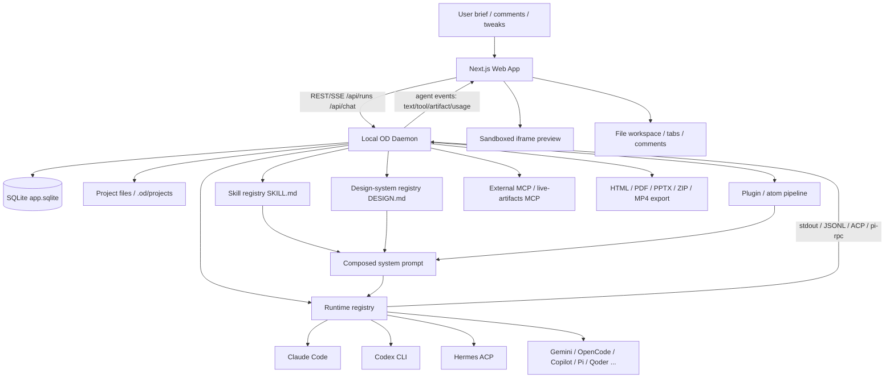

# open-design

> 一句话定位：Open Design 是一个本地优先、可 Web/桌面分发的 agent-native 设计工作台，用用户已有的 Claude Code / Codex / Cursor / Gemini / Hermes 等代码 Agent CLI，把自然语言 brief 变成可预览、可编辑、可导出的 HTML/Deck/Image/Video/Design-System 等设计产物。

## 基本信息

| 项目 | 值 |
|------|----|
| 仓库 | `nexu-io/open-design` |
| URL | `https://github.com/nexu-io/open-design` |
| Star | 47,186（GitHub API，2026-05-20） |
| Fork | 5,368（GitHub API，2026-05-20） |
| 许可证 | Apache-2.0 |
| 主要语言 | TypeScript |
| 首次提交 | 2026-04-28：`a98096a0` |
| 最近提交 | 2026-05-20：`a5e43ae2` |
| 最新 Release | `open-design-v0.7.0` / Open Design 0.7.0，2026-05-13；README 同时宣传 `0.8.0-preview` |
| 贡献者数 | 约 221（GitHub contributors pagination，2026-05-20） |
| Issue / PR 健康口径 | open issues：254；open PRs：171；GitHub repo `open_issues_count=424` 含 PR |
| 本地源码规模 | 约 4,307 个文本文件、约 1,043,744 行文本；其中 TypeScript 约 329k 行、TSX 约 112k 行、Markdown 约 162k 行、HTML 约 246k 行（自定义统计，排除 `.git/node_modules/dist/build/.next/.cache` 等） |
| 分析日期 | 2026-05-20 |
| 本地分析版本 | `a5e43ae2` |

---

## 定位与类比

### 一句话定位

它不是“自己实现一个设计模型”，而是一个 **design-agent shell**：前端负责项目/聊天/预览/导出，daemon 负责本地文件、技能、设计系统、Agent CLI spawn，真正的智能循环交给用户机器上已有的代码 Agent。

### 类比法

- 类似 **Claude Design**，但强调开源、本地优先、BYOK、可接入多种 Agent CLI。
- 类似 **Open CoDesign**，但不自己内建单一 agent loop，而是把 Claude Code/Codex/Cursor/Hermes 等作为可替换 runtime。
- 类似 **Cursor/Claude Code + 设计技能库 + 沙盒预览器** 的组合产品：把 prompt、文件系统、设计规范、产物预览和导出打成一个设计工作台。

### 项目分类

`AI Design Platform / Agent-Native Design Tool`

这个分类与已有 `Agent Platforms` 横评不完全同层：Open Design 是垂直的设计产物工作台，不是通用个人 AI 助手或 GUI automation 平台。因此本次未强行并入 `agent-platforms.md` 横评。

---

## 场景一：是否值得采用

### 解决的问题

Open Design 解决的是“AI 设计产物生成”落地时最麻烦的几件事：

1. **设计产物不是聊天文本**：需要真实文件、预览 iframe、导出 HTML/PDF/PPTX/ZIP/MP4 等。
2. **设计质量不能只靠 prompt freestyle**：需要 Skill、DESIGN.md、craft references、preflight、critique checklist，把“审美和流程”显式文件化。
3. **用户已经有代码 Agent**：不应再造一个模型路由/工具调用框架，而是复用 Claude Code/Codex/Cursor/Gemini/OpenCode/Hermes 等现成 Agent CLI。
4. **本地文件和密钥边界**：设计项目、API key、Agent auth、文件写入都尽量留在本机 daemon；Web 层可以部署，秘密不必上云。

目标用户：独立开发者、设计系统维护者、内容/产品团队、会用 coding agent 的设计/前端混合型用户，以及想把“设计技能”产品化成文件资产的团队。

### 核心能力与边界

#### 能做什么

- **多形态产物**：prototype、deck、template、design-system、image、video、audio、live artifact。
- **Agent CLI 适配**：内置 Claude Code、Codex、Devin、Gemini、OpenCode、Hermes、Kimi、Cursor Agent、Qwen、Qoder、Copilot、Pi、Kiro、Kilo、Vibe、DeepSeek 等 runtime definition。
- **Skill 文件协议**：兼容 Claude Code 的 `SKILL.md`，再扩展 `od.mode / od.preview / od.inputs / od.parameters / od.craft / od.design_system` 等元数据。
- **设计系统**：扫描 `design-systems/*/DESIGN.md`，支持 schema、tokens、preview、组件 manifest、用户生成/修订的设计系统。
- **本地 daemon**：Express + SQLite + 文件系统项目根，负责 REST/SSE、Agent spawn、artifact store、export、media、MCP、memory、plugin 等。
- **Web/桌面/打包分发**：Next.js Web、Electron desktop、packaged runtime、mac/Windows/Linux 打包工具和 release workflow。
- **插件/自动化方向**：内置 plugin runtime、atom pipeline、diff-review、handoff、routine、memory、connector 等快速演进中的平台能力。

#### 不能做什么 / 不适合什么

- **不是 Figma 替代品**：输出主要是 HTML/JSX/Markdown/PPTX/视频/图片，不是可多人协作编辑的矢量画布。
- **不是稳定企业级设计平台**：项目创建不到一个月，主线变化极快，open PR 和 issue 数都很高。
- **不是模型无关的完全自足系统**：质量强依赖你接入的 Agent CLI、模型、授权状态和本地环境。
- **不是低维护 SaaS**：Node 24 + pnpm 10 + Electron + better-sqlite3 + 多 CLI adapter + 大量前端/daemon/packaging 代码，接管复杂度不低。
- **不是强隔离安全沙箱**：预览 iframe 有 sandbox，但 Agent 文件操作主要继承底层 Agent 的权限模型；技能/插件/外部 MCP 的信任模型需要使用者自己认真管理。

### 集成成本

- **依赖链**：Node `~24`、pnpm `10.33.2`、better-sqlite3、Next.js 16、React 18、Express、Electron、各类 Agent CLI；本地当前环境 Node 是 `v22.22.2`，不满足项目要求，因此未直接跑完整 install/typecheck。
- **部署复杂度**：
  - 本地 dev：`corepack enable && pnpm install && pnpm tools-dev run web`，但依赖 Node 24 和原生依赖编译。
  - Docker：`deploy/docker-compose` 提供路径。
  - Web/Vercel + local daemon：概念清楚，但 daemon 连接、tunnel、密钥、SSE 代理都需要配置。
  - Packaged desktop：能力强，但打包、签名、更新和多平台验证面很重。
- **学习曲线**：中高。理解产品需要同时懂 Agent CLI、prompt/skill、设计系统、Next/Web UI、daemon、SSE、Electron/sidecar、插件 pipeline。
- **从零到 demo**：如果已有 Node 24 + pnpm + Claude Code/Codex 授权，大约 10–30 分钟可跑；如果要走 desktop/package/provider/mcp/视频等能力，可能上升到数小时。

### 依赖 / SDK 选型证据

> 全量 direct dependencies 由 `tk catalog build` 从本地源码 manifest 写入 catalog；本表只解释影响 build-vs-buy 的关键库 / SDK。

| Dependency | Type | Used for | Problem solved | Evidence | Reuse signal | Caution |
|------------|------|----------|----------------|----------|--------------|---------|
| _待补关键依赖_ | | | | | | |

### 风险评估

| 风险项 | 评估 | 说明 |
|--------|------|------|
| 许可证合规 | ✅/⚠️ | 根许可证 Apache-2.0；README 明确保留 guizang-ppt 等上游 LICENSE。但内置设计系统、品牌灵感、截图/模板/技能素材很多，商业使用时仍要逐项核上游素材与品牌/trademark 边界。 |
| Bus factor | 中 | contributor 页面约 221 人，PR 活跃；但核心架构与发布治理仍高度依赖少数维护者和 bot/agent 贡献流。 |
| 供应商锁定 | 中 | 产品定位是反锁定，但实际质量强依赖 Claude Code/Codex 等外部 CLI 和模型；更换 Agent 可行但能力不等价。 |
| 维护趋势 | 非常活跃但高波动 | 2026-04-28 创建，2026-05-20 已 2k+ PR 编号、47k star、每日大量提交；活跃度极高，也意味着 API/目录/文档频繁变动。 |
| 安全历史 | ⚠️ | 源码中已有 HMAC-gated folder import、path traversal guard、iframe sandbox、loopback auth 等意识；但本地 daemon + Agent spawn + skills/plugins/MCP 天然是高权限面。 |
| 文档一致性 | ⚠️ | README、docs/spec、docs/architecture 与当前代码存在演进漂移：例如 spec 早期写“do not ship a desktop app”，当前已包含 `apps/desktop` 和 packaged runtime；README 中 skills/design-system 数字也多处不一致。 |
| CI 可信度 | ⚠️ | CI 覆盖 typecheck、guard、app/package/tool tests、release workflows；但 release-stable 中明确暂未 gating 全 workspace tests（i18n drift），说明主线速度优先于完全收敛。 |

### 结论

**推荐学习与 PoC，生产采用先观望。**

理由：

- **如果你要快速验证“AI 设计工作台”方向**，Open Design 很值得跑：定位准、产品闭环完整、社区热度和维护速度非常强。
- **如果你要做内部工具/内容生产原型**，可作为可落地基座：特别适合生成落地页、deck、海报、设计系统草案、HTML 动效和设计 handoff。
- **如果要生产化依赖**，建议暂缓直接押主线：项目极新、架构面快速膨胀、open PR/issue 高、文档漂移明显、Agent/插件/桌面/打包/安全面都需要二次 hardening。

推荐采用方式：

1. 先只跑 **本地 Web + daemon + 一个熟悉 Agent CLI**。
2. 把它当 **设计产物生成器 / skill 资产库 / 架构样板**，不要先当企业级设计平台。
3. 内部复用优先抽取三层：`SKILL.md` 协议、`DESIGN.md` 设计系统、daemon→Agent CLI spawn/SSE 适配。
4. 如果要 fork 深改，先冻结版本/tag，不要直接跟 `main`。

---

## 场景二：技术架构学习

### 核心架构图

### 关键设计决策与 trade-off

| 决策 | 选择 | 放弃了什么 | 为什么 |
|------|------|-----------|--------|
| Agent loop ownership | 复用用户已有 Agent CLI，而不是自研 agent loop | 对模型/tool protocol 的完全控制 | 复用 Claude Code/Codex/Cursor 等成熟能力，降低自研复杂度，适配用户已有订阅 |
| 能力单元 | `SKILL.md` + `DESIGN.md` 文件协议 | 纯数据库/闭源内部 skill | 让设计方法、品牌规范、prompt workflow 可版本化、可 fork、可 PR review |
| 部署形态 | Web App + local daemon + optional Electron packaged shell | 单一 Electron 或纯云 SaaS | Web 易部署，本地 daemon 持有密钥与文件，desktop 作为外壳补系统能力 |
| 产物存储 | SQLite 存元数据 + 文件系统存 artifacts | 全部塞 DB 或全部 localStorage | 文件可被 git/CLI/Agent 直接操作；DB 只负责项目、会话、tab、message 状态 |
| 预览隔离 | `iframe sandbox="allow-scripts"`，不加 `allow-same-origin` | artifact 与宿主 DOM 深度集成 | 降低 XSS/host cookie 风险，牺牲部分 localStorage/cookie 兼容性 |
| Runtime 适配 | `RuntimeAgentDef` + stream parser 分层 | 单一 adapter 代码路径 | 支持多 CLI，但必须维护大量 CLI quirks、stdin/argv/Windows 限制、auth failure 诊断 |
| 质量控制 | preflight + critique theater + stub guard + handoff manifest | 只靠模型一次生成 | 把“高级设计师流程”显式化；代价是 prompt/状态机复杂度上升 |
| 扩展方向 | plugin runtime + atom pipeline + GenUI | 只做固定 skills | 为后续 design migration / Figma / code migration / handoff 铺路，但当前架构负载明显变重 |

### 值得学习的模式

1. **Substrate 而不是 Product-only**
   - README 自己总结得很准：Claude Design 是产品，Open Design 是 substrate。
   - 它的核心价值不是某个生成模型，而是把 Agent、Skill、Design System、Artifact Preview、Export、Plugin pipeline 组织成平台底座。

2. **Capability-first runtime abstraction**
   - `apps/daemon/src/runtimes/registry.ts` 把 Claude、Codex、Hermes、Pi、Copilot 等作为 runtime definition。
   - `RuntimeAgentDef` 抽象了 `buildArgs`、`streamFormat`、`promptViaStdin`、`promptInputFormat`、`supportsImagePaths`、`externalMcpInjection` 等能力，而不是在业务层硬编码每个 CLI。

3. **File protocol as extension point**
   - Skill 是文件夹 + `SKILL.md`，Design System 是 `DESIGN.md`，craft rules 是 `craft/*.md`。
   - 这非常适合 agent-native 生态：工具不需要先注册到云端 marketplace，放进文件系统就能被扫描、注入、版本控制。

4. **Prompt composition pipeline 显式分层**
   - 系统 prompt 不是一坨文本：daemon system prompt、skill body、design system、craft refs、plugin active stage、client instruction、research contract、linked dirs hint 都是结构化拼装。
   - 这比“把所有上下文塞给模型”更可维护，也便于测试每个 block。

5. **Streaming event contract 分层**
   - `packages/contracts/src/sse/chat.ts` 定义 chat SSE 的 start/stdout/stderr/agent/error/end；agent payload 又分 status/text_delta/thinking/tool_use/tool_result/usage/live_artifact。
   - 对 Agent UI 很值得借鉴：UI 不直接解析不同 CLI 的 stdout，而消费统一事件流。

6. **Local privileged daemon boundary**
   - Web UI 不直接拿系统权限；daemon 才能读写项目、spawn CLI、访问本地配置、导出 PDF/PPTX、连接 MCP。
   - Desktop 再通过 sidecar/IPС 获取本地能力，不让 renderer 自行决定敏感路径。

7. **高风险本地能力的“逐步 fail-closed”思路**
   - folder import HMAC gate、trusted picker marker、path traversal guard、iframe sandbox、non-loopback token requirement、外部 MCP 注入策略显式化，说明维护者已经在补安全边界。

### 反模式 / 踩坑点

1. **项目过新但架构面已经很大**
   - 仅 3 周左右历史，却已覆盖 web、daemon、desktop、packaged、plugins、media、memory、MCP、connectors、routines、landing page、release pipeline。
   - 对采用者来说，这意味着“能借鉴很多”，也意味着“跟主线会很累”。

2. **文档漂移明显**
   - 早期 `docs/spec.md` 的 non-goals 写“不 ship desktop app”，当前代码已有 Electron desktop 与 packaged runtime。
   - README 对 skills/design systems 数字多处不一致（例如 31/72、129、badge 149/131），说明内容生成和实际状态同步还在高速变动。

3. **过度依赖外部 CLI 行为稳定性**
   - 每个 Agent CLI 的 stdin、JSONL、auth、model list、Windows argv 限制、MCP 支持都不同。
   - Open Design 已经写了大量兼容代码，但这个维护面会长期存在。

4. **安全边界复杂**
   - Agent 能读写文件、skill 可诱导 shell、MCP 可接外部工具、plugins 可带 pipeline/atoms、desktop 可打开本地路径；每层都有自己的 trust story。
   - 若企业采用，需要先做 threat model，而不是只看 UI 效果。

5. **CI/release 速度优先于完全收敛**
   - CI 很丰富，但 release-stable workflow 明确说明 workspace tests 因 i18n drift 暂不 gating。
   - 这不一定是坏事：项目早期高速推进合理；但生产依赖要自己加冻结和验证。

### 可借鉴的具体技术点

- `RuntimeAgentDef`：用数据定义多 CLI adapter，特别是 `promptViaStdin`、`streamFormat`、`externalMcpInjection` 这些字段很实用。
- `SKILL.md + od frontmatter`：非常适合 Hermes / Codex / Claude Code 等 agent workflow 生态复用。
- `DESIGN.md` 设计系统协议：把品牌/设计规范变成 agent 可读文件，比纯 prompt 更稳定。
- `project file store + safe path resolver`：本地文件型 artifact 产品的基础设施样板。
- `contracts` package：前后端共享 SSE/API 类型，防止 daemon/web drift。
- `Critique Theater / handoff manifest`：把 AI 设计生成后的验收、评论、导出和实现移交做成结构化状态，而不是口头总结。
- `tools-dev / tools-pack` 控制面：复杂多进程本地产品（daemon/web/desktop）值得参考的运维入口。

---

## 架构解剖

### 目录结构

| 目录 | 职责 |
|------|------|
| `apps/web` | Next.js 16 + React 18 Web Runtime；项目列表、聊天、设计系统、插件、文件工作区、预览、设置等 UI。 |
| `apps/daemon` | Express + SQLite 本地 daemon；REST/SSE、Agent CLI spawn、skills/design systems、artifacts、MCP、media、memory、plugins、routines、export。 |
| `apps/desktop` | Electron shell；系统路径、PDF、窗口、IPC、sidecar 集成。 |
| `apps/packaged` | 打包版 Electron runtime entry；启动 packaged daemon/web sidecars。 |
| `packages/contracts` | Web/daemon 共享 API/SSE/analytics/prompts 类型，纯 TypeScript。 |
| `packages/sidecar-proto` / `sidecar` / `platform` | sidecar 协议、runtime bootstrap、OS process/stamp/toolchain primitive。 |
| `packages/plugin-runtime` / `registry-protocol` | 插件 manifest、parser、validate、pipeline fallback、registry protocol。 |
| `tools/dev` | 本地开发生命周期控制面：daemon → web → desktop。 |
| `tools/pack` | mac/Windows/Linux 打包、安装、启动、清理、release artifact。 |
| `tools/pr` | 维护者 PR-duty 控制面，封装 gh 查询、lane、review checklist。 |
| `skills` | 设计/营销/运营/工程等功能技能，`SKILL.md` 为核心。 |
| `design-systems` | 内置品牌设计系统，核心文件为 `DESIGN.md`，部分含 tokens/components/preview。 |
| `design-templates` / `templates` | 设计模板、live artifacts 示例、landing/deck 等可复用产物。 |
| `plugins` | 官方插件、atoms、scenario pipelines。 |
| `craft` | 通用设计 craft rules，如 typography/color/anti-ai-slop。 |
| `docs` / `specs` | 架构、协议、roadmap、change specs。 |
| `e2e` | Vitest/Playwright 端到端测试。 |

### 技术栈

- **运行时 / 框架**：Node `~24`、pnpm `10.33.2`、TypeScript、Next.js 16、React 18、Express、Electron。
- **持久化**：SQLite (`better-sqlite3`) + WAL；项目文件在本地文件系统；部分 storage/S3 adapter 正在演进。
- **Agent 通信**：child_process spawn、stdin prompt、stdout JSONL/plain parsing、ACP JSON-RPC、Pi RPC、MCP config 注入。
- **预览与导出**：sandboxed iframe、HTML/JSX preview、PDF、PPTX、ZIP、video/audio/image media routes。
- **测试**：Vitest、Node built-in test、Playwright UI automation、workspace typecheck、guard、i18n check。
- **CI/CD**：GitHub Actions；PR/main CI、landing page deploy、docker image、多 release channel（beta/nightly/preview/stable）、packaging workflows。

### 模块依赖关系

1. `apps/web` 通过 `/api/*` 与 daemon 通信，消费 `/api/runs/:id/events` 或 `/api/projects/:id/events` SSE。
2. `apps/daemon` 读取 SQLite 元数据与 project files，组合 prompt 后 spawn agent runtime。
3. `apps/daemon/src/runtimes/*` 提供 CLI 定义、检测、launch env、model list、stream parser。
4. `skills.ts` / `design-systems.ts` / `craft.ts` / `plugins/*` 向 prompt composer 提供结构化上下文。
5. Agent CLI 在项目 cwd 内读写文件，daemon 把 stdout/stderr/agent events 转为 SSE 给 web。
6. Web file workspace 刷新项目文件、打开预览、展示 tool cards、评论、导出。
7. Desktop/packaged 通过 sidecar/proto/platform 控制 daemon/web 生命周期并补系统能力。

### 扩展机制

- **Skill 扩展**：新增 `skills/<slug>/SKILL.md`；支持 assets/references/example；`od` frontmatter 控制 mode、preview、inputs、parameters、craft、design_system、critique 等。
- **Design System 扩展**：新增 `design-systems/<brand>/DESIGN.md`，可带 manifest、tokens、components、preview、assets。
- **Agent Runtime 扩展**：新增 `apps/daemon/src/runtimes/defs/<agent>.ts` 并注册到 `registry.ts`，必要时增加 stream parser。
- **Plugin/Atom 扩展**：`plugins/_official/atoms`、scenario pipeline、manifest validation、GenUI surface、handoff/diff-review/build-test atoms。
- **MCP 扩展**：用户外部 MCP server 可被 Claude `.mcp.json`、ACP merge、OpenCode env content 等策略注入。
- **Media provider 扩展**：image/video/audio provider/config/model 列表与 `/api/projects/:id/media/generate`。

---

## 质量与成熟度

### 代码质量

- **类型系统**：总体 TypeScript 化程度高；`packages/*`、`tools/*`、web/desktop 边界类型较清楚。但 daemon 核心 `server.ts` 仍有 `// @ts-nocheck` 且体量巨大（约 11k 行），说明历史包袱和迁移中状态明显。
- **边界意识**：`AGENTS.md` 对 app/package/tool 边界写得很细；contracts/sidecar/platform 分层清晰，避免 app 互相 import 私有实现。
- **错误处理**：spawn、stdin EPIPE、auth failure、inactivity watchdog、empty-output guard、path traversal、desktop HMAC gate 等异常处理较扎实。
- **代码风格**：单引号、English comments、package-scoped tests 等规范明确；但高速 PR 下文档和实现漂移较明显。

### 测试

- 自有测试文件约 581 个（通过 `git ls-files` 过滤 tests/e2e/spec/test 文件）。
- 测试层级包括：
  - core packages Vitest / Node tests。
  - daemon/web/desktop/package/tool tests。
  - Playwright UI critical/extended smoke。
  - release/packaging/workflow validation。
- 本次未执行 `pnpm install/typecheck/test`，因为本机 Node 为 `v22.22.2`，项目要求 Node `~24`；直接安装会得到与项目期望不一致的验证结果。

### CI/CD

优点：

- `.github/workflows/ci.yml` 做 change scope 检测，按 daemon/web/tools/pack/core 包分类跑 typecheck/test/guard/i18n。
- release workflows 覆盖 stable/nightly/beta/preview，mac/Windows/Linux packaging，R2/GitHub Release 等。
- `tools/pack` 对 mac/Windows/Linux install/start/inspect/cleanup 都有较多测试。

风险：

- release-stable workflow 中明确注释：workspace tests 暂不作为 release gate，因为 web i18n metadata drift 会失败。这是“主线高速度”的真实信号。
- 依赖 Node 24、pnpm、better-sqlite3、Electron，fresh CI 与本地环境 drift 风险不低。

### 文档质量

- README 极完整，包含定位、demo、skills/design systems/media/agent/runtime/deploy/license 等。
- `docs/spec.md`、`docs/architecture.md`、`docs/skills-protocol.md`、`docs/agent-adapters.md`、`docs/modes.md` 对设计思想解释充分。
- `AGENTS.md` 分层说明非常详尽，说明项目本身高度 agent-native。
- 不足：文档更新速度赶不上实现，README 数字和 spec non-goals 有漂移；采用时要以源码/当前 README 为准，不能只信早期 spec。

### Issue / PR 健康度

- open issues：254；open PRs：171；closed issues：637；merged PRs：924（GitHub Search API，2026-05-20）。
- 最近提交和 PR 极密集；当天仍有大量 fix/feat/docs/SEO/analytics/daemon/web/packaging PR。
- 高反应 issue 反映真实痛点集中在：macOS/Windows 启动、Agent CLI 兼容、model 中断、iframe localStorage/cookie、安全/preview、token/context limit、rollback 等。
- 结论：**社区极活跃，维护响应快；但 backlog 很大，稳定性仍在快速收敛期。**

---

## 社区与生态

### 社区评价

基于 GitHub 指标和 issue/PR：

- **热度极高**：创建约 3 周即 47k+ stars，明显站上“Claude Design 开源替代”风口。
- **贡献密度高**：contributors 约 221，merged PR 900+，说明不是只有 README 热度。
- **真实痛点也多**：跨平台启动、CLI adapter、model/API mode、preview sandbox、context/token、Windows/macOS packaging 都有 issue。
- **社区预期很高**：很多 issue 是产品路线型需求（CMS、rollback、design systems、MCP support、automations），不是单纯 bug。

### 衍生项目 / 插件生态

Open Design 本身正在把生态做成三类文件资产：

- `skills/`：设计、营销、运营、产品、工程、财务、HR、销售、个人等场景。
- `design-systems/`：品牌 DESIGN.md 系统，含 imported 与 hand-authored。
- `plugins/`：官方 atoms/scenarios/pipelines，面向更复杂的 design/code migration/handoff。

外部生态目前更像是“上游 inspirations / seeds”：

- `OpenCoworkAI/open-codesign`：直接竞品/UX north star。
- `alchaincyf/huashu-design`：设计哲学与 critique workflow 来源。
- `op7418/guizang-ppt-skill`：deck skill 重要来源。
- `VoltAgent/awesome-design-md`：设计系统 DESIGN.md 大库。
- `bergside/awesome-design-skills`：设计 skills 参考库。

### 竞品对比

#### 直接竞品

- **Open CoDesign**：同样是开源 Claude Design alternative，定位最接近。差异是 Open CoDesign 更偏桌面 app + 自身 agent/provider loop；Open Design 更偏 Web + daemon + BYO Agent CLI shell。
- **Claude Design**：闭源标杆，不是开源竞品但定义了用户心智。

#### 邻近替代

- **Figma AI / Figma Make / Google Stitch / v0 / Lovable / Replit Agent**：更产品化或更面向 UI/code generation，但不是本地 SKILL.md/Agent CLI substrate。
- **Cursor/Claude Code + 手写 skills/design systems**：轻量替代路径，适合不需要专门 UI/预览/导出的用户。

#### 架构邻居

- **multica**：daemon + PATH-scan agent detection + agent-as-teammate 思路。
- **Hermes Agent**：多 tool/skill/gateway/Agent orchestration 的生态化经验；Open Design 已把 Hermes 作为 runtime 之一。
- **UI-TARS-desktop**：桌面 runtime、GUI automation、packaged app、sidecar 分层可互相参照。

---

## 关键代码走读

### 1. Agent Runtime Registry

- 路径：`apps/daemon/src/runtimes/registry.ts`
- 职责：集中注册所有 Agent runtime definition。
- 实现要点：
  - `BASE_AGENT_DEFS` 明确列出 Claude、Codex、Devin、Gemini、OpenCode、Hermes、Grok Build、Kimi、Cursor、Qwen、Qoder、Copilot、Pi、Kiro、Kilo、Vibe、DeepSeek。
  - `readLocalAgentProfileDefs()` 允许本地 profile 扩展，说明不是只能靠内置列表。
  - 注册时做 duplicate id 检查，保持 runtime id 唯一。
- 学习点：多 adapter 系统应优先做“定义表 + 能力字段”，而不是每个 agent 在主逻辑里 if/else。

### 2. Runtime Definition 类型与 Claude/Codex 适配

- 路径：`apps/daemon/src/runtimes/types.ts`、`apps/daemon/src/runtimes/defs/claude.ts`、`apps/daemon/src/runtimes/defs/codex.ts`
- 职责：定义一个 CLI runtime 需要声明的能力和启动方式。
- 实现要点：
  - `RuntimeAgentDef` 包含 `buildArgs()`、`streamFormat`、`promptViaStdin`、`promptInputFormat`、`supportsImagePaths`、`listModels`、`externalMcpInjection` 等。
  - Claude 用 `--input-format stream-json --output-format stream-json`，stdin 保持打开以支持 `AskUserQuestion` 的 tool_result 回写。
  - Codex 用 `codex exec --json` + stdin，Linux/macOS 用 workspace-write sandbox + network flag，Windows 退到 `danger-full-access` 解决 shell 被 policy 拒绝的问题。
- 学习点：adapter 不只是“命令行参数”，还要把平台、权限、stdin/argv 限制、model list、structured stream、MCP 注入方式都编码成 contract。

### 3. Chat Run Spawn Pipeline

- 路径：`apps/daemon/src/server.ts`，核心片段约 `composeDaemonSystemPrompt` 到 child close handling（本地行号约 9238–10342）
- 职责：把一个用户 chat run 转换为可执行 Agent CLI 进程，并把结果流回 UI。
- 实现要点：
  - 先组合 daemon system prompt、active skill、design system、plugin stage、research contract、run context、linked dirs。
  - 将 active skill stage 到项目 cwd 的 `.od-skills/<folder>`，优先给 agent 一个 cwd-relative 读取路径。
  - 对 Codex 生成图片目录、external MCP、OpenCode env-content、Claude `.mcp.json`、ACP merge 等做 per-runtime 注入。
  - 做 prompt argv budget / Windows cmd shim / direct exe budget 预检查。
  - spawn 后按 `streamFormat` 走 Claude JSON、Qoder JSON、Copilot JSON、Pi RPC、ACP、OpenCode/Codex JSON-event、plain stdout 等分支。
  - 有 inactivity watchdog、empty-output guard、auth failure diagnosis、stdin EPIPE 保护、tool_result 注入。
- 学习点：这是整个项目最值钱也最危险的“本地 Agent orchestration”中枢。它体现了真实产品适配多 CLI 时要处理的全部边角料。

### 4. Skill Registry

- 路径：`apps/daemon/src/skills.ts`
- 职责：扫描 skills root，解析 `SKILL.md` frontmatter/body，返回可用于 UI 和 prompt 的 `SkillInfo`。
- 实现要点：
  - 多 root 优先级：第一个 root 视为 user，可 shadow built-in。
  - 支持 id alias，避免 skill rename 让旧项目丢 prompt。
  - 解析 `od.mode`、`surface`、`platform`、`scenario`、`category`、`craft.requires`、`design_system.requires`、`preview.type`、`default_for`、`critique.policy`。
  - 对带 assets/references 的 skill 自动加 `Skill root` preamble，让 agent 知道相对/绝对读取路径。
  - 支持 derived examples，方便一个 skill 下多个示例作为 gallery card。
- 学习点：Skill 生态要能长期演进，必须处理优先级、别名、示例、附件路径、UI metadata 与 prompt body 的分离。

### 5. Project File Store 与安全路径

- 路径：`apps/daemon/src/projects.ts`
- 职责：管理 project folder、文件列表、raw read/write、archive、artifact manifest、上传等。
- 实现要点：
  - `resolveProjectDir()` 支持 daemon-managed project 和 metadata.baseDir 的 linked folder。
  - `listFiles()` 对 linked folder 默认跳过 `node_modules/.git/dist/build/.next/.cache/.od` 等，避免 UI 被依赖目录淹没。
  - `buildProjectArchive()` 使用 realpath-aware resolver 防 symlink escape；archive 排除 hidden segments 和 artifact sidecar。
  - 文件 kind/mime/manifest 识别让 UI 能正确预览不同产物。
- 学习点：artifact 产品最好把产物作为普通文件保存，但所有 HTTP path 都必须经过严格 resolver。

### 6. Web SSE Client 与 Transcript Builder

- 路径：`apps/web/src/providers/daemon.ts`
- 职责：Web 侧创建 run、消费 daemon SSE、把 agent events 转成 UI message/tool/artifact 状态。
- 实现要点：
  - `buildDaemonTranscript()` 将历史消息折叠成 `## user / ## assistant` transcript，并按 agent id scope history，避免切换 agent 时污染上下文。
  - 对过长历史消息做 12k 字符截断，并对高 input token/大 tool result/agent-browser dump 加 context warning。
  - `streamViaDaemon()` 先 `POST /api/runs`，再消费 `/api/runs/:id/events`，并把 runId/status/eventId 回调给 UI。
- 学习点：多轮聊天接 CLI print-mode agent 时，前端 transcript compaction 和 reattach 逻辑同样是关键能力，不是纯 UI 细节。

---

## 评分

| 维度 | 评分(1-5) | 说明 |
|------|----------|------|
| 功能覆盖度 | 5 | 覆盖 prototype/deck/design-system/template/media/desktop/plugin/automation 等，能力面非常宽。 |
| 代码质量 | 4 | 边界设计和测试意识强，但 daemon `server.ts` 巨大且 `@ts-nocheck`，文档/实现漂移明显。 |
| 文档质量 | 4 | README/docs/spec/AGENTS 极丰富；但因为高速演进，数字与产品形态有漂移。 |
| 社区活跃度 | 5 | 47k stars、5k forks、约 221 contributors、每日大量 PR；热度与贡献密度都极高。 |
| 架构设计 | 5 | Web + daemon + BYO Agent CLI + SKILL.md/DESIGN.md + SSE + plugin pipeline 的平台化思路非常值得学。 |
| 学习价值 | 5 | 是 agent-native design substrate 的优秀样本，尤其适合学习多 Agent CLI runtime、skill 协议、设计系统文件化。 |
| 可借鉴度 | 5 | Skill/Design System/runtime registry/SSE contract/daemon boundary 都可直接拆出来复用。 |

---

## 总结

### 一句话评价

Open Design 是当前最值得研究的“Agent-native 设计工作台”之一：它真正有价值的不是“生成一个漂亮页面”，而是把设计流程、设计系统、Agent runtime、文件产物、预览导出和插件 pipeline 全部 substrate 化了。

### 谁应该用

- 想快速试用开源 Claude Design alternative 的个人开发者/设计师。
- 已经有 Claude Code / Codex / Cursor / Hermes 等 Agent CLI，并希望把它们用于设计产物生成的人。
- 想沉淀 `SKILL.md`、`DESIGN.md`、设计模板、deck/海报/landing 生产流程的内容团队。
- 正在做 Agent UI / Agent workflow / 本地 daemon / skill ecosystem 的架构研究者。

### 谁不应该直接用

- 要稳定企业级多人协作设计平台的人。
- 希望替代 Figma 矢量编辑/协同编辑的人。
- 没有 Node 24/pnpm/Agent CLI 环境，也不想折腾本地工具链的人。
- 对本地高权限 Agent、外部 skills/plugins/MCP 没有安全治理能力的团队。

### 下一步

1. **短期 PoC**：固定 `open-design-v0.7.0` 或某个已验证 commit，跑本地 daemon + 一个 Agent CLI，验证 3 个场景：landing page、deck、design system。
2. **架构抽取**：重点读 `runtimes/defs/*`、`skills.ts`、`design-systems.ts`、`server.ts` chat spawn pipeline、`providers/daemon.ts` SSE client。
3. **和 Hermes 结合**：Open Design 已支持 Hermes runtime；值得进一步验证 Hermes skill/agent 与 Open Design SKILL.md/DESIGN.md 是否能互相借力。
4. **如果要内部化**：不要先 fork 全仓库；优先复制它的协议和流程层：`SKILL.md`、`DESIGN.md`、artifact preview/export、runtime adapter 表。
5. **如果要贡献**：低风险 PR 切入点包括文档数字同步、adapter docs、design systems、skills 示例、测试补强；不要一开始碰 daemon spawn pipeline 或 release/packaging 核心面。
