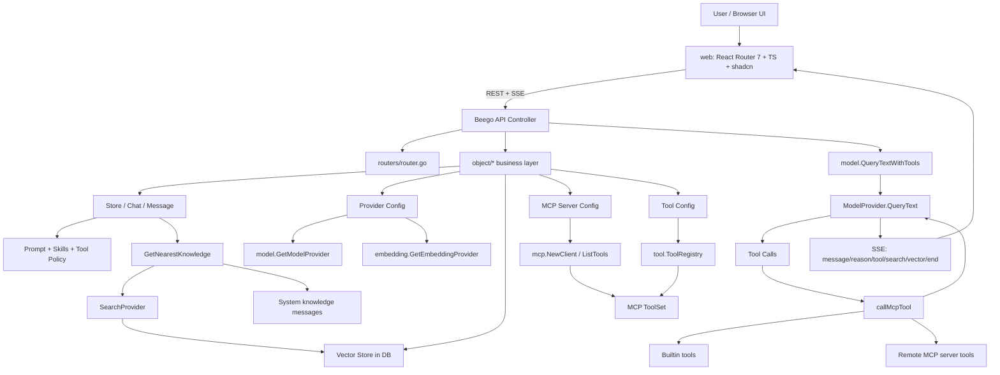

# OpenAgent

> 一句话定位：OpenAgent 是一个 Go + React 的自托管个人 AI 助手平台，把 LLM Provider 管理、RAG 知识库、MCP/内建工具、聊天 UI、审计日志、用量统计、连接器和单二进制/Docker 分发收进一个 Web 管理平台；它适合个人/小团队快速搭一个可控的 agent workbench，但当前仍有“产品叙事很满、核心链路尚未完全一致、前端新旧双栈并存、RAG/工具执行安全与规模化边界待收敛”的现实风险。

## 基本信息

| 项目 | 值 |
|------|----|
| 仓库 | `the-open-agent/openagent` |
| URL | `https://github.com/the-open-agent/openagent` |
| 官网 / Docs | `https://www.openagentai.org/` |
| Star | 4,830（2026-05-20 GitHub API 快照） |
| Fork | 563（2026-05-20 GitHub API 快照） |
| Watchers | 52（2026-05-20 GitHub API 快照） |
| 许可证 | Apache-2.0 |
| 主要语言 | Go |
| GitHub 创建时间 | 2020-05-29 |
| 本地首次提交 | 2022-03-31 / `1bbf9d2c` / `Initial commit` |
| 最近提交 | 2026-05-20 / `836b4c25` / `fix: rename to "API docs"` |
| 最新 Git tag | `v2.12.1`（本地/远端 tag；GitHub Releases API latest 在查询时返回 `v2.11.1`） |
| 贡献者 | GitHub contributors API 当前页 54；本地 shortlog 头部集中：Yang Luo 1618、copilot-swe-agent[bot] 770、jjq0425 259 |
| Issue / PR | open issue 43；open PR 5；repo API `open_issues_count=48` 含 PR |
| 仓库体量 | 782 tracked files；Go 303；web 184；webold 199；GitNexus 索引 16,644 nodes / 37,696 edges / 300 flows |
| 分析日期 | 2026-05-20 |

## 场景一：是否值得采用

### 解决的问题

OpenAgent 解决的是“我不想自己拼 LangChain/LangGraph + 管理后台 + 模型配置 + 知识库 + MCP + 工具调用 + 部署脚本”的问题。它不是纯 SDK，也不是 IDE coding agent，而是一个可自托管的个人/组织 AI 助手控制台：

- 用 Web UI 管理 Stores、Chats、Messages、Providers、Pipes、Skills、Tools、MCP Servers、Files、Vectors、Records、Sessions、Usages、Visitors、System Info。
- 通过 Provider 配置接入 30+ LLM / embedding 后端。
- 用 Store 绑定 prompt、知识库、工具、skills、MCP server 等能力。
- 聊天链路支持 SSE streaming、reasoning、tool calls、web search、vector scores、suggestions/title carrier。
- 文件进入知识库后切分、embedding、向量检索，并在回答前注入相关知识。
- 内建工具覆盖时间、web search/fetch、shell、本地文件、Office、浏览器、Windows UIA、video download、browser-use；外部工具通过 MCP 接入。
- 提供 OpenAI-compatible `/api/chat/completions`，但该接口当前能力明显弱于主聊天链路。

类比法：它更像“开源版自托管 AI 助手后台 + RAG/Tool/MCP workbench”，而不是 LangGraph/CrewAI 那种编程框架，也不是 Claude Code/Codex 那种本地编码代理。

### 核心能力与边界

**能做什么：**

- 自托管 Web 管理台 + 单二进制 / Docker / Helm 分发。
- 多模型 Provider 管理：OpenAI、Azure、Claude、Gemini、DeepSeek、Qwen/Alibaba Cloud、OpenRouter、Ollama、Bedrock、Mistral、Cohere、MiniMax、Moonshot、ChatGLM、Volcano、Tencent、GitHub Models 等。
- RAG 知识库：文件解析、split provider、embedding provider、向量存储、Store 间 vector reuse、检索结果分数回传。
- Agent loop：模型产生 tool call → 执行内建工具或 MCP server tool → tool result 回灌模型 → 直到最终回答。
- MCP：Server 配置、工具同步、allowlist、运行时连接、tool name 命名空间化。
- 管理/审计：records、sessions、usage、system info、Prometheus info/API docs。
- 多渠道连接器：代码中有 Telegram、Discord、Slack、WeChat、WhatsApp、Threads、Facebook Messenger、Snapchat、X DM 等 pipe 实现；官网当前更克制地展示 Telegram/Discord/WeCom 等。

**不能或不应高估的部分：**

- 不是通用 agent 编排 SDK；核心产品形态是 Web app / admin console。
- OpenAI-compatible API 当前只直调模型，不走主聊天链路的 RAG/MCP/tool loop；不能把它当成完整平台能力的等价 API 面。
- README/官网宣称 “Workflow Automation / Visual Workflow Builder”，但新前端 `web/` 未见 BPMN/工作流入口；BPMN 主要残留在 `webold/src/BpmnComponent.js`。当前 `Pipe` 更像消息渠道连接器，`Task` 更像教学设计文档评分任务，不是通用 DAG 编排器。
- RAG 向量当前主要由数据库行承载，`Vector.Data []float32` 标为 `mediumtext`；小规模可用，重知识库场景要关注性能与迁移。
- 工具能力里包含 shell/local file/browser/GUI，生产部署必须认真做权限、隔离、审计和默认禁用策略。
- 前端新旧双栈并存：`web/` 是 React Router 7 + TS + shadcn 新主线，`webold/` 是 CRA/JS/Ant Design 历史实现；迁移未完全收口。

### 集成成本

- **最快 demo**：README 给出一行 installer，默认 14000 端口；Docker Compose 也提供 `openagent + mysql` 组合。
- **部署形态**：单二进制、Docker standard、Docker all-in-one、Helm，CI 里有 GoReleaser 和 Docker multi-arch 发布。
- **运行依赖**：Go 后端 + React 前端 + DB；Docker Compose 使用 MySQL；代码也带 SQLite/多 DB 支持痕迹。
- **源码构建成本**：本机当前无 `go` 命令，`go test ./... -tags skipCi` 无法运行（`go: command not found`），所以本次只验证了代码/CI配置，未完成本地测试执行。
- **学习曲线**：如果只用 UI 配模型和知识库，中等；如果要改核心，需要理解 Beego controller、object 业务层、provider factory、MCP toolset、RAG vector、前端 SSE、Casdoor/authz、CI/release。
- **维护成本**：中高。代码不是小框架，而是一个功能面很宽的单体平台。


### 依赖 / SDK 选型证据

> 全量 direct dependencies 由 `tk catalog build` 从本地源码 manifest 写入 catalog；本表只解释影响 build-vs-buy 的关键库 / SDK。

| Dependency | Type | Used for | Problem solved | Evidence | Reuse signal | Caution |
|------------|------|----------|----------------|----------|--------------|---------|
| _待补关键依赖_ | | | | | | |

### 风险评估

| 风险项 | 评估 | 说明 |
|--------|------|------|
| 许可证合规 | 低 | Apache-2.0，商业二开友好 |
| Bus factor | 中-高 | contributors API 54，但提交高度集中；本地 shortlog 第一作者 1618，bot 770 |
| 供应商锁定 | 中 | 支持多 provider / Ollama / OpenAI-compatible / MCP，但 Casdoor/Casibase/OpenAgent 产品模型和 Store/Provider 数据结构有自身耦合 |
| 维护趋势 | 活跃 | 2026-05-19/20 高频提交与 tag；CI/CD 完整 |
| 安全攻击面 | 高 | shell、本地文件、浏览器、GUI、MCP、webhook、多租户、session/auth、RAG 文件解析，组合面大 |
| 产品叙事一致性 | 中 | 主聊天能力强，但 OpenAI API 面弱；workflow/BPMN 在新前端未收口 |
| 规模化 RAG | 中-高 | DB 行存向量 + 串行 embedding 处理适合起步，重负载需外接/重构检索层 |
| 前端维护 | 中 | 新旧前端并存，webold 仍保留未迁移能力 |
| 文档可信度 | 中 | README/官网友好，但部分能力需要按源码核实边界 |

### 结论

**观望；个人/小团队 PoC 推荐试用，生产底座谨慎。**

更具体地说：

- 如果目标是“快速自托管一个个人 AI 助手后台，接模型、上传文档、试 MCP/tool、看审计和用量”，可以试，Apache-2.0、单二进制/Docker、UI 完整度都不错。
- 如果目标是“作为企业内部 agent 平台基座”，建议先做安全隔离 PoC：禁用高风险工具、检查 MCP allowlist、验证多租户边界、压测知识库规模、统一 Provider/API 面。
- 如果目标是“学习一个完整 AI 助手平台怎么把 RAG、tools、MCP、model providers、web admin 串起来”，值得拆源码。
- 如果目标是“要成熟通用 workflow engine / agent SDK / coding agent”，它不是最合适对象。

## 场景二：技术架构学习

### 核心架构图



### 关键设计决策与 trade-off

| 决策 | 选择 | 获得 | 代价 |
|------|------|------|------|
| 产品形态 | Go 单体后端 + React Web 管理台 | 部署简单、业务闭环完整、单二进制可分发 | 单体变胖，跨域能力耦合加重 |
| 后端框架 | Beego + Xorm + Casdoor/Casbin | CRUD/API 管理台开发快，Swagger/权限/Session 体系成熟 | 较传统，controller/object 层容易堆业务逻辑 |
| 模型扩展 | `ModelProvider` interface + 大型 if-else factory | 新 provider 容易接入，理解门槛低 | 注册中心会膨胀，缺少插件化 registry 的解耦 |
| RAG | 文件解析 → split → embedding → DB vector → search provider | 起步简单，Store 语义清楚 | 向量规模与检索性能受 DB/串行处理制约 |
| 工具执行 | 内建工具与 MCP 工具合并到同一个 `ToolSet` | agent loop 简洁，UI 能统一展示 tool calls | 工具安全边界统一变成高风险核心面 |
| MCP 命名 | `serverName/toolName` 命名空间化 | 避免不同 server 工具重名 | 名字编码规则成为协议耦合点 |
| 前端迁移 | 新 `web/` 重写，保留 `webold/` | 可以逐步迁移，不阻塞发布 | 双栈漂移、功能遗漏、测试压力增加 |
| 发布 | Semantic Release + GoReleaser + Docker + Helm | 工程化成熟，分发面强 | 发版频率高时热修/版本碎片需要治理 |

### 值得学习的模式

1. **Store 作为能力组合根**
   - Store 绑定 prompt、model provider、knowledge count、vector stores、tools、skills、MCP server、memory limit。
   - 对平台型 AI 产品很实用：用户配置的是一个“能力包”，不是单独的一堆 API key。

2. **主聊天链路的显式流水线**
   - `controllers/message_answer.go:139-480` 把 message → chat → store → provider → embedding → MCP/tools → RAG → history → model/tool loop → SSE → transaction/message update 串起来。
   - 可读性强，适合学习完整产品链路。

3. **内建工具与 MCP 工具同构**
   - `object.MergeMcpTools()` 将 Store 中的 builtin tools 和远端 MCP tools 合并。
   - `model.callMcpTool()` 统一分发 server tool 与 builtin tool。
   - 这比“内建工具一套、MCP 一套”更容易做 UI 展示和审计。

4. **SSE 事件分层**
   - 后端输出 `message`、`reason`、`tool-start/tool`、`search`、`vector`、`info`、`end`。
   - 前端 `useMessageStream.ts` 分别更新文本、reasoning、工具调用、搜索结果、向量分数和提示信息。

5. **CI/CD 作为产品能力的一部分**
   - `.github/workflows/build.yml` 覆盖 Go tests、frontend build、backend race build、golangci-lint、semantic-release、GoReleaser、Docker multi-arch、Helm chart。
   - 对开源自托管平台来说，分发链路成熟度直接影响采用成本。

6. **Provider 多样性优先**
   - model/embedding provider 都走统一接口，实际支持面很宽。
   - 虽然 factory 朴素，但产品层“无 vendor lock-in”的叙事有实际代码支撑。

### 反模式 / 踩坑点

- **主能力与兼容 API 不一致**：`/api/chat/completions` 在 `controllers/openai_api.go` 中只抽取最后一个 user message，空 history/knowledge，`toolSession=nil` 直调 `QueryText()`；这和主聊天的 RAG/MCP/tool loop 不是同一能力面。
- **Prompt policy 散落在控制器**：工具使用纪律、web citation、执行偏好直接拼接在 `generateMessageAnswer()`，后续难做单元测试和版本治理。
- **Factory if-else 膨胀**：`model.GetModelProvider()` 和 `embedding.GetEmbeddingProvider()` 都是长 if-else，新增 provider 容易踩冲突。
- **隐式 admin fallback**：Store/Server/Provider 都有 owner/name 解析与 `admin` fallback 语义，易用但多租户边界和同名对象解析需要格外谨慎。
- **新旧前端未完全收口**：`webold/` 中有 BPMN、Form、FileTree、PasswordSignin 等历史功能，新 `web/` 未完全覆盖。
- **RAG 向量存储与刷新粗粒度**：向量存 DB 行，刷新按文件/分片循环；大知识库、并发刷新和外部向量数据库适配需要进一步确认。
- **Docker Compose 小瑕疵**：`Dockerfile` stage 是 `standard`，`docker-compose.yml` 写 `target: STANDARD`；Docker target 大小写是否兼容需实际验证。

### 可借鉴的具体技术点

- `Store` 维度的能力组合模型：适合给 Distill/Agent workbench 做“工作空间配置包”。
- SSE 事件分层与前端增量渲染：reason/tool/vector/search 分开，不把所有东西混成纯文本。
- MCP allowlist：先同步工具列表并保留 `IsAllowed`，运行时只暴露允许的 tool。
- 单二进制 + embed web build + Docker/Helm 多分发：对自托管平台非常实用。
- 工具调用审计结构：tool name、arguments、content 结构化保存与展示。

## 架构解剖

### 目录结构

```text
openagent/
├── main.go                  # 启动入口：DB/authz/proxy/parser/background jobs/Beego filters/session/log/port
├── routers/                 # Beego 路由、CORS/HSTS/Authz/record/prometheus/static/session filters
├── controllers/             # HTTP/API 层：message answer、OpenAI API、store/provider/tool/server/file/task/pipe 等
├── object/                  # 业务对象与编排层：Store/Chat/Message/Provider/Vector/Server/Tool/Task/Record/Usage
├── model/                   # LLM provider 抽象与各厂商实现；agent tool loop 在 model/mcp.go
├── embedding/               # Embedding provider 抽象与实现
├── split/                   # 文本切分策略：default/markdown/QA/basic
├── tool/                    # 内建工具：browser/shell/local_file/office/web_search/web_fetch/GUI 等
├── mcp/                     # MCP client/toolset/util/scan
├── pipe/                    # 外部渠道连接器：telegram/discord/slack/wechat/whatsapp/x_dm 等
├── storage/ txt/ audio/ stt/ tts/ util/ # 文件解析、存储、多媒体和工具函数
├── swagger/                 # API docs 生成物
├── skills/                  # 内置 skills/catalog
├── web/                     # 新前端：React Router 7 + TypeScript + shadcn/Tailwind
└── webold/                  # 旧前端：CRA/JS/Ant Design，保留历史功能如 BPMN
```

### 技术栈

- **后端运行时 / 框架**：Go 1.25.0 / toolchain go1.25.8；Beego 1.12；Xorm；Casdoor SDK；Casbin；Prometheus；go-mcp；chromedp；多 provider SDK。
- **前端**：新 `web/` 使用 React 19、React Router 7.13、TypeScript 5.9、Vite 7、Tailwind 4、shadcn/base-ui/lucide/recharts/marked/DOMPurify；旧 `webold/` 使用 CRA/Craco、JS、Ant Design、bpmn-js。
- **构建 / 打包**：GoReleaser、UPX、Docker multi-stage、Docker buildx multi-arch、Helm chart；`Dockerfile` 前端 `npm ci && npm run build`，后端 `./build.sh`。
- **测试**：Go `_test.go` 24 个左右；旧前端 2 个 `.test.js`；新前端未见测试脚本，仅有 `typecheck`/`build`/`format`。
- **CI/CD**：`.github/workflows/build.yml` 跑 Go tests、frontend build、backend race build、golangci-lint、semantic-release、GoReleaser、Docker/Helm 发布。

### 模块依赖关系

1. `main.go` 初始化数据库、权限、HTTP client、parser、background jobs、Beego filters，监听 14000。
2. `routers/router.go` 将大量 `/api/*` 路由映射到 `controllers.ApiController`。
3. `controllers/message_answer.go` 是主聊天入口，负责拉取 Message/Chat/Store，解析 Provider、Embedding、MCP/Tools、RAG、历史消息，并启动模型调用。
4. `object/*` 是业务对象层，承载 Store/Provider/Server/Vector/Tool 等数据库模型和业务方法。
5. `model/*` 抽象 LLM provider；`model/mcp.go` 处理多轮 tool call。
6. `tool/*` 和 `mcp/*` 提供可执行工具；`object/merge_agent_tools.go` 把它们合并进同一个 `ToolSet`。
7. `web/app/hooks/useMessageStream.ts` 消费后端 SSE 并更新聊天 UI。

### 扩展机制

- **新增模型供应商**：实现 `model.ModelProvider`，并在 `model/provider.go:GetModelProvider()` 注册。
- **新增 Embedding 供应商**：实现 `embedding.EmbeddingProvider`，并在 `embedding/provider.go:GetEmbeddingProvider()` 注册。
- **新增 split 策略**：实现 split provider，并在 `split/provider.go` 注册。
- **新增内建工具**：实现 `tool.Tool` / `BuiltinTool`，并在 `tool/tool.go:New()` 的 switch 中挂载，再由 Store.Tools 注入。
- **接入 MCP server**：创建 Server 配置 URL/token，`SyncMcpTool()` 拉取工具定义，`BuildMcpToolSet()` 按 allowlist 暴露工具。
- **外部渠道**：在 `pipe/` 下有多平台 pipe 实现，并由 `controllers/pipe_webhook.go` 接收 webhook。

## 质量与成熟度

### 代码质量

- **类型系统**：Go 后端和新前端 TS 类型基础较好；旧前端 JS 无类型保护。
- **错误处理**：Go 代码大量显式 error return；RAG embedding 有 retry/backoff；SSE 链路有错误事件与取消机制。
- **代码风格**：整体风格一致，版权头规范；但 controller/object 层文件较多，业务逻辑偏集中。
- **架构清晰度**：主链路可读，但能力面很宽，Store/Provider/Server/Tool/Vector 等对象关系需要读源码才能钉牢。
- **红旗**：隐式 admin fallback、长 factory、prompt 拼接、OpenAI API 能力弱于 UI 主链路。

### 测试

- tracked test-like 文件 33，其中 Go `_test.go` 24 左右，旧前端测试 2 个，新前端没有明显测试文件/测试脚本。
- CI 明确跑 `go test -v ... $(go list ./...) -tags skipCi`。
- 本地验证受环境限制：当前机器无 `go` 命令，`go test ./... -tags skipCi` 退出 127，无法给出本地测试通过结论。
- 测试覆盖更偏后端对象/解析/工具函数；前端行为回归保障偏弱。

### CI/CD

强项。`build.yml` 包含：

- Go tests + MySQL service。
- Frontend build（Node 22）。
- Backend `go build -race`。
- `golangci-lint` v2.11.4。
- Semantic Release 自动打 tag。
- GoReleaser 发布三 OS / 两架构原始二进制。
- Docker Hub standard/all-in-one multi-arch。
- Helm chart 自动 bump/package/push。

这对自托管平台非常加分。

### 文档质量

- README 入口友好：定位、Quick Start、binary/Docker/source build、功能、demo、docs/community/license 都齐。
- 官网信息丰富，强调 self-hosted、MCP、30+ providers、RAG、multi-channel、privacy。
- Swagger/API docs 存在，`routers/router.go` 有 API 注解。
- 不足：部分 marketing claim 需要源码核实，例如 workflow/BPMN 和 OpenAI-compatible API 能力边界；开发者架构文档未见特别系统化。

### Issue / PR 健康度

- 2026-05-20 快照：open issue 43、open PR 5、closed issue 666、closed PR 1495。
- 最近 open issue 包含：AstraNL 协议集成、Ant Design → shadcn 迁移、Notte hosted browser provider、usage dark mode、SECURITY.md。
- 搜 reaction 排序发现 issue 互动量整体不高，更多是维护者/功能推进型 issue，而非大规模用户争议。
- 社区体量可观但核心维护集中；bot 提交占比较高。

## 社区与生态

### 社区评价

**热度与认可度：**

- 4.8k stars / 563 forks，对 self-hosted AI assistant 平台属于有可见度。
- 官网声称 2.8k+ Discord members、50k+ self-hosted、90+ countries；这些是项目方数据，未独立验证。
- GitHub issue/PR 活跃，发版密集。

**正面信号：**

- Awesome list 方向已有收录/PR，例如 `awesome-llm-apps`、`awesome-ai-agents` 等出现 OpenAgent 条目。
- 需求集中在 provider、MCP/browser、UI 迁移、文档、安全治理等真实产品问题。
- 关闭 issue/PR 数量较高，维护者响应和合并节奏活跃。

**真实痛点：**

- 社交平台外部讨论有限：HN Algolia 对 `openagentai`/repo 未检出结果；Dev.to 搜索空；Reddit 搜索结果更多混到其它 OpenAgents 项目，目标项目低信号。
- 安全治理文档缺口已有 issue：`ADD THE SECURITY.md PLZ`。
- 前端迁移仍在进行：open issue `migrate from Ant Design to shadcn/ui` 与源码中 `webold/` 并存相互印证。
- 生态搜索中 `openagent` 名称高度拥挤，有许多同名/近名项目；品牌辨识和搜索噪音是长期问题。

### 衍生项目 / 插件生态

- 直接衍生项目不算多，更多是 awesome list 收录、同名项目、以及渠道/工具需求 issue。
- MCP 生态是它最现实的扩展路径：用户可接外部 MCP server，而不是为 OpenAgent 单独写插件。
- 内建 tools + skills + providers + pipes 构成了内部扩展面，但目前不像 OpenHuman/VS Code/Cline 那样形成外部插件市场。

### 竞品对比

**直接竞品 / 同层对手：**

- **OpenHuman**：更偏桌面本地优先个人 AI 平台，Rust/Tauri + memory/tools/channels/MCP，学习价值更高，但 GPL-3.0 和体量更重。
- **LangChain Open Agent Platform**：no-code agent building platform，但仓库已 archived；作为方向参照，不适合作为新采用底座。
- **Haohao-end/openagent** 等同名 AI Agent 平台：体量较小，更多是竞品/噪音参考。

**邻近替代：**

- **LangGraph / LangChain**：如果你要可编程 agent runtime，而不是 UI 平台，选它们更合适。
- **Dify / Flowise / AnythingLLM / Open WebUI**：如果重点是工作流/RAG/聊天产品而不是工具 agent loop/MCP，可能更成熟。
- **CrewAI / AutoGen / Agno**：如果重点是多 agent 编排 SDK，而不是自托管管理台。

**架构邻居：**

- **OpenHuman**：完整 personal AI workspace 的桌面平台样本。
- **UI-TARS Desktop**：GUI agent / desktop automation runtime，与 OpenAgent 的 browser-use/computer-use 方向相邻。
- **Hermes Agent**：工具协议、gateway、skills、cron、多平台连接器和 agent loop 的可参照对象。

## 关键代码走读

### 1. 启动入口：`main.go`

- 路径：`main.go`
- 职责：初始化 DB、authz、proxy、parser、background jobs、Beego filters、session、log、旧实例停止、端口监听。
- 实现要点：
  - `object.InitAdapter()`、`CreateTables()`、`InitDb()` 建立数据层。
  - `authz.InitEnforcer()`、多层 Beego filters 处理 CORS/HSTS/Authz/Prometheus/record/secure cookie。
  - 默认端口 `14000`，双击运行时自动打开浏览器。

### 2. 主聊天编排：`generateMessageAnswer()`

- 路径：`controllers/message_answer.go`
- 职责：OpenAgent 的核心业务链路。
- 实现要点：
  - 校验 AI placeholder message、replyTo、chat/store。
  - 解析 `modelProvider`、`embeddingProvider`。
  - 拉取 MCP server toolset，合并 Store 内建工具和 web search。
  - 调用 `GetNearestKnowledge()` 注入 RAG knowledge。
  - 取历史消息，调用 `QueryTextWithTools()` 或普通 `QueryText()`。
  - 将 vector scores、tool calls、search results、token/price、transaction、message/chat 更新落库。

### 3. Agent loop：`QueryTextWithTools()`

- 路径：`model/mcp.go`
- 职责：多轮工具调用循环。
- 实现要点：
  - 第 0 轮调用模型。
  - 若模型产生 tool calls，则逐个执行 `callMcpTool()`。
  - 把 tool result 作为 Tool message 回灌模型。
  - 循环直到没有 tool call。
  - 结束时关闭 MCP connections。

### 4. 工具执行：`callMcpTool()`

- 路径：`model/mcp.go`
- 职责：统一执行 builtin tools 和 MCP server tools。
- 实现要点：
  - 解析 JSON arguments。
  - 先发 `tool-start` SSE，让前端即时展示。
  - 如果 `serverName == ""`，走 `mcpToolSet.BuiltinTools.ExecuteTool()`；否则走 MCP client `CallTool()`。
  - 输出结构化 `ToolCallResponse`，再发 `tool` SSE。

### 5. RAG 检索：`GetNearestKnowledge()`

- 路径：`object/vector_embedding.go`
- 职责：给模型调用前取相关知识片段。
- 实现要点：
  - 根据 Store/vectorStores 构造 related stores。
  - 通过 `GetSearchProvider()` 搜索向量。
  - 将命中的 Vector 转为 `model.RawMessage{Author:"System"}`。
  - 同时返回 `VectorScore` 给前端展示。

### 6. 知识库构建：`addVectorsForFile()` / `addVectorsForStore()`

- 路径：`object/vector_embedding.go`
- 职责：文件解析、文本切分、embedding、向量入库。
- 实现要点：
  - 根据文件类型选择 Default/QA/Markdown split provider。
  - 对每个 chunk 调用 embedding provider，失败时 exponential backoff retry。
  - 按文件维护 processing/finished/error 状态。

### 7. MCP server 桥接：`Server.BuildMcpToolSet()`

- 路径：`object/server.go`
- 职责：把一个外部 MCP server 转成 OpenAgent 可调用 `ToolSet`。
- 实现要点：
  - `mcp.NewClient(s.Url, s.Token)` 建连。
  - `ListTools()` 获取工具列表。
  - 如果已同步 tools，则按 `IsAllowed` 过滤。
  - 将工具名改写为 `serverName/toolName`，避免命名冲突。

### 8. Provider 工厂：`model.GetModelProvider()` / `embedding.GetEmbeddingProvider()`

- 路径：`model/provider.go`、`embedding/provider.go`
- 职责：把数据库 Provider 配置转换为运行时 provider 实例。
- 实现要点：
  - 覆盖供应商非常多。
  - 实现直观，但 factory 以长 if-else 承载扩展，未来可考虑 registry 化。

### 9. 前端流式消费：`useMessageStream()`

- 路径：`web/app/hooks/useMessageStream.ts`
- 职责：消费后端 SSE，增量更新聊天 UI。
- 实现要点：
  - 分别处理 message、reason、tool、search、vector、error、done、info、chat update。
  - 使用 `MessageCarrier` 解析 title/suggestions/final answer。
  - 前端能展示 reasoning phase、tool call start/result、vector scores。

### 10. Task 分析：`AnalyzeTask()`

- 路径：`object/task_analyze.go`
- 职责：垂直业务任务：教学设计文档 + 评价量表 → LLM 生成 JSON 分析报告。
- 实现要点：
  - prompt 明确中文教学设计评分 JSON schema。
  - 支持 demo task fake answer。
  - 严格 JSON parse，失败返回原始回复。
  - 这说明 `Task` 不是通用 workflow engine，而是强业务化分析任务。

## 评分

| 维度 | 评分(1-5) | 说明 |
|------|----------|------|
| 功能覆盖度 | 4 | Provider/RAG/MCP/tools/admin/CI 分发覆盖广；workflow/API 边界有落差 |
| 代码质量 | 3.5 | Go/TS 基础扎实，主链路清楚；factory/controller/prompt/admin fallback 有维护压力 |
| 文档质量 | 3.5 | README/官网/Swagger 友好；内部架构与部分能力边界需源码核实 |
| 社区活跃度 | 4 | stars/forks 可观，issue/PR/release 活跃；外部社区讨论和插件生态有限 |
| 架构设计 | 4 | Store 能力组合、MCP/builtin 同构、SSE 分层、分发链路值得学；单体复杂度高 |
| 学习价值 | 4.5 | 非常适合学习自托管 agent platform 如何落地到产品和运维面 |
| 可借鉴度 | 4 | Store 组合根、tool audit、MCP allowlist、SSE event model、release pipeline 可复用 |

## 总结

### 一句话评价

OpenAgent 是一个“产品化完成度不错、工程化分发很强、适合快速试用的自托管 agent workbench”，但它不是成熟通用 agent framework，也不是完全收敛的企业级 agent OS；真正采用前要压住工具安全、RAG 规模、前端双栈、OpenAI API 能力不一致这几条风险线。

### 谁应该用

- 想快速自托管个人 AI 助手平台的人。
- 想试 RAG + MCP + tools + 多 provider 的小团队。
- 想学习“AI 助手平台产品工程”而不仅是 agent SDK 的开发者。
- 需要 Apache-2.0 友好许可证、能自行二开的团队。

### 谁不应该直接用

- 需要成熟 workflow/DAG 编排平台的人。
- 只想要轻量 SDK 或嵌入式 agent runtime 的人。
- 对 shell/file/browser/MCP 安全隔离没有运维能力，却想直接开放给多用户的人。
- 重知识库/高并发 RAG 生产场景，且不打算重构/外接检索层的人。

### 下一步

1. 跑一次 Docker/installer PoC，重点验证：模型配置、上传文档、RAG 检索、MCP server、内建 shell/local file 默认权限。
2. 对 `/api/chat/completions` 做能力矩阵：是否需要补 RAG/tool loop，还是明确标成“模型代理 API”。
3. 做安全 profile：默认禁用 shell/local_file/browser/gui，MCP tools 必须 allowlist，记录所有 tool call。
4. 如果要学架构，优先读：`controllers/message_answer.go`、`model/mcp.go`、`object/vector_embedding.go`、`object/server.go`、`object/merge_agent_tools.go`、`web/app/hooks/useMessageStream.ts`。
