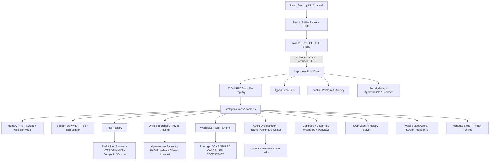

# openhuman

> 一句话定位：OpenHuman 是一个 Rust/Tauri 驱动的本地优先个人 AI / Agent OS：它把桌面宿主、Rust Core、长期记忆、Obsidian vault、模型路由、工具执行、MCP、SKILL workflow runtime、连接器同步、语音/Meet、移动端实验入口和多 Agent 编排收进一个完整产品。它的学习价值很高，也适合做外围维护贡献；但因为 GPL-3.0、攻击面大、managed backend 耦合、模块膨胀和高速 beta 演进，直接作为生产底座仍应观望。

## 基本信息

| 项目 | 值 |
|------|----|
| 仓库 | `tinyhumansai/openhuman` |
| URL | `https://github.com/tinyhumansai/openhuman` |
| Star | 32,199（2026-06-15 GitHub API 快照） |
| Fork | 3,120（2026-06-15 GitHub API 快照） |
| 许可证 | GPL-3.0 |
| 主要语言 | Rust |
| GitHub 创建时间 | 2026-02-18 |
| 本地首次提交 | 2026-01-27，Tauri + React 初始化 |
| 最近提交 | `27739ee5` / 2026-06-15，`fix(embeddings): prevent + handle custom endpoint with no embeddings API ... (#3629)` |
| 当前包版本 | `Cargo.toml` / `app/package.json` / `app/src-tauri/Cargo.toml` 均为 `0.57.41` |
| 最新 GitHub Release | `v0.57.40`（2026-06-12） |
| 最新 tags | `v0.57.40`, `v0.57.39`, `v0.57.34-staging`, `v0.57.32`, `v0.57.30` 等 |
| 贡献者 | GitHub contributors API 当前页 100；头部贡献者集中，`senamakel` 约 1054 次贡献 |
| Issue / PR | open issue 110；open PR 58；repo API `open_issues_count=169` 含 PR 且与搜索快照存在轻微时间差 |
| 仓库体量 | 4,780 tracked files；Rust 2,173；TS 787；TSX 756；test-like tracked files 1,281；GitHub workflows 28 |
| 分析日期 | 2026-06-15 |
| 分析边界 | 只做源码、文档、Git 历史、GitHub API / Release / Issue / PR 静态分析；未运行项目、未启动服务、未跑测试/构建 |

## 版本变化速读（相对 2026-05 旧报告）

OpenHuman 在一个月内已经从“本地优先桌面 AI 平台”继续膨胀成更完整的 **personal AI OS / agent harness**：

- **Stars / forks 大幅增长**：从 2026-05-17 的约 11.2k / 973 增至 2026-06-15 的约 32.2k / 3.1k。
- **版本从 0.53.x 推到 0.57.x**：release / staging tag 高频推进，当前源码包版本为 `0.57.41`。
- **控制面变宽**：`src/core/all.rs` 已注册 dashboard、task sources、MCP registry、agent registry、agent experience、model council、x402、web3、devices、session_db、agent teams、workflow runs 等新域。
- **Skill 口径必须改写**：旧 QuickJS runtime 仍然已移除，`src/openhuman/skills/` 仍偏 metadata；但新的 `workflows/` + `skill_runtime/` 已经负责发现、运行、取消、轮询 installed `SKILL.md` workflow，不应再写成“skills 只是 metadata/catalog”。
- **多 Agent 与后台执行产品化**：`agent_orchestration/`、`session_db/run_ledger`、`command_center`、`agent_teams`、`workflow_runs` 说明后台 agent 工作不再只是一次性 subagent，而是有可查询 ledger 和 UI-facing view。
- **推理层统一**：`src/openhuman/inference/mod.rs` 明确把 local runtime、cloud provider、routing reliability、STT/TTS、OpenAI-compatible HTTP endpoint 收进 `inference.*`，旧 `local_ai_*` 走 legacy alias。
- **工具面显著扩张**：除 shell/file/git/http/browser/MCP/Composio 外，已有 codegraph、workflow、skill registry、session/thread、task source、artifact、learning、screen intelligence、presentation、x402/web3 等 agent tools。
- **安全与 hardening 仍是主线**：近期 merged PR 包括 core RPC auth、inference resilience、secrets、deep-link CSRF、custom embeddings endpoint、memory unrecoverable job failure 等；open issue 仍有 prompt injection、sandbox isolation、context length、backend outage 等风险主题。

---

## 场景一：是否值得采用

### 解决的问题

OpenHuman 要解决的不是“聊天 UI”问题，而是“个人 AI 怎么持续认识我、替我使用工具、接入日常系统，并以桌面产品形态长期运行”的问题。

它的核心组合是：

- **桌面宿主**：Tauri v2 + CEF/WebView + React UI，面向 Windows / macOS / Linux 安装包。
- **Rust Core**：本地 in-process tokio core，仍通过 loopback HTTP / JSON-RPC 暴露统一控制面。
- **长期记忆**：Memory Tree + SQLite + Obsidian-compatible Markdown vault，把连接器数据 canonicalize / chunk / summarize / retrieve。
- **Agent 工具体系**：filesystem、shell、git、grep/glob、patch、browser、http、curl、web_fetch、MCP、Composio、cron、memory、task board、workflow、screen、voice 等。
- **模型与推理**：OpenHuman backend、BYO cloud provider、OpenAI-compatible/Anthropic-style、Ollama/local inference、STT/TTS、role-based routing。
- **连接器与通道**：Gmail、Slack、Notion、GitHub、Linear、Jira、Drive、Calendar、Telegram、WhatsApp、web channel、webhooks、Composio。
- **Workflow / Skill runtime**：发现 installed workflows，执行单个 `SKILL.md` workflow，写 run log，支持取消、等待、失败 footer、preflight gate 和 degenerate-output detection。
- **Agent Orchestration**：后台 agent command center、durable run ledger、agent teams、dependency-aware task claiming、running subagents、workflow runs。

### 核心能力与边界

**能做什么：**

- 作为完整桌面 AI workspace 运行，而不是只提供 CLI 或 SDK。
- 把本地数据、连接器数据和 agent 运行状态写入可查询的本地状态层：Memory Tree、session DB、run ledger、Obsidian vault。
- 通过 controller registry 暴露 `openhuman.<namespace>_<function>` 形式的 JSON-RPC 控制面。
- 通过 tool registry 把系统能力投射给 agent，并用 security policy / approval gate / tool filter 做权限约束。
- 通过 managed Node / Python runtime 降低 MCP、workflow、script-backed skill 对用户本机环境的依赖。
- 通过 MCP client/server、Composio、workflow registry、skill registry、agent profiles 扩展生态入口。
- 通过 iOS experimental transport、devices domain、tunnel crypto 探索“桌面 core + 移动端 client”的未来形态。

**不能或不应高估的部分：**

- 不是轻量库；它是重型桌面产品和 agent runtime 单体。
- “Local-first”不是“完全离线”：README 明确说明默认 managed experience 仍用 OpenHuman-hosted services 做账号登录、模型路由、web search proxy、Composio OAuth / managed integration flows。
- `src/openhuman/skills/` 的旧 QuickJS skill runtime 已移除；当前可执行路径在 `workflows/` + `skill_runtime/`，仍处在快速重建和扩展阶段。
- 直接闭源二开会碰 GPL-3.0 合规问题。
- 默认工具面太宽，企业引入前必须重新做 tool policy、网络 egress、sandbox、credential、MCP allowlist、connector OAuth 的安全 profile。
- 代码和文档都在高速变化，AGENTS.md、README、GitBook、源码之间仍可能出现口径漂移。

### 集成成本

- **依赖链重**：Rust 1.93、Node 24、pnpm 10.10、Tauri v2、CEF、React 19、Vite、SQLite、Tokio/Axum、reqwest、socketioxide、whisper-rs、cargo-llvm-cov、WDIO/Appium/tauri-driver。
- **分发复杂**：macOS x64/ARM、Linux、Windows、Homebrew、apt repo、MSI、CEF cache、installer smoke、release/staging workflow 都要维护。
- **状态面复杂**：workspace、action_dir、session_db、memory tree、Obsidian vault、credentials/keyring、agent profiles、run logs、connector cache、MCP registry、runtime caches。
- **安全配置成本高**：readonly/supervised/full、workspace_only、trusted_roots、approval gate、sandbox backend、HTTP/browser allowlist、MCP allowlist 都需要逐项收敛。
- **从零到 demo**：下载 installer 或 `pnpm dev` 看 UI 不难；完整 desktop + core + CEF + connectors + local/managed provider + e2e 验证明显高于普通 web app。


### 依赖 / SDK 选型证据

> 全量 direct dependencies 由 `tk catalog build` 从本地源码 manifest 写入 catalog；本表只解释影响 build-vs-buy 的关键库 / SDK。

| Dependency | Type | Used for | Problem solved | Evidence | Reuse signal | Caution |
|------------|------|----------|----------------|----------|--------------|---------|
| _待补关键依赖_ | | | | | | |

### 风险评估

| 风险项 | 评估 | 说明 |
|--------|------|------|
| 许可证合规 | 高 | GPL-3.0；闭源产品二开和分发必须先做合规判断 |
| Bus factor | 中-高 | contributor 数多，但头部维护者贡献集中，项目方向高度依赖核心团队 |
| 安全攻击面 | 高 | 桌面宿主、本地 RPC、WebView/CEF、shell/file/browser/http/MCP/Composio/voice/screen/web3/x402 都是边界 |
| Managed backend 耦合 | 中-高 | 可 BYO provider/Composio/Ollama，但默认账号、模型路由、search proxy、managed OAuth 仍依赖 OpenHuman 服务 |
| 维护复杂度 | 高 | 单仓承载桌面、core、agent runtime、memory、workflow、connectors、mobile experiment、release matrix |
| 稳定性 | 中 | CI/测试/发版投入高；但 open issue/PR 多，仍是 early beta 和高速修补状态 |
| 文档一致性 | 中 | README/AGENTS/源码整体清晰，但 GitBook 和旧叙事可能滞后，需要以源码为准 |
| 生产安全默认值 | 中 | approval gate、policy、allowlist、sandbox 都在，但宽工具面和 managed flows 需要组织级重配 |

### 结论

**结论：观望；推荐隔离试用、架构学习和外围维护，不建议直接作为闭源/企业生产底座。**

- 如果你想做 **个人本地 AI workspace / personal AI OS**，OpenHuman 是当前非常值得拆解的样本。
- 如果你想找 **长期记忆 + 工具执行 + 桌面宿主 + workflow runtime** 的完整工程参照，它的学习价值很高。
- 如果你只是想要一个 **轻量 agent SDK / CLI / RAG 后端 / 企业知识库**，OpenHuman 太重。
- 如果你要在团队生产化，第一步不是部署，而是做许可证、安全 profile、tool allowlist、credential boundary、connector/OAuth 和 provider routing 的风险收敛。

---

## 维护 / 接管视角

### 能不能维护

能，但路线应是 **外围可信贡献 → 有测试的安全/状态修复 → 再逐步进入核心控制面**。不建议一开始碰 provider routing、memory tree ingest、core lifecycle、release matrix 或 workflow runtime 主线重构。

### 最适合的首批 PR 切入点

1. **文档口径修正**
   - 把“QuickJS skills runtime removed”与当前 `workflows/skill_runtime` 的真实执行路径区分清楚。
   - 明确 `src/openhuman/skills` metadata-only，而 `src/openhuman/workflows` + `src/openhuman/skill_runtime` 负责 `SKILL.md` workflow 执行、run log 和 cancellation。

2. **安全与隐私 hardening**
   - 近期 merged PR 已在 core RPC auth、secrets、deep-link CSRF、inference resilience 上推进。
   - 适合继续做：token/log redaction、Tauri IPC payload guard、browser allowlist、MCP write audit、prompt-injection gate、sandbox fallback 可观测性。

3. **测试补强**
   - `skill_runtime/run_machinery`：preflight failure、DONE/FAILED/CANCELLED/DEGENERATE footer。
   - `session_db/run_ledger`：agent run / workflow run / team task 状态一致性。
   - `agent_teams`：依赖环、claim token、unknown member、close semantics。
   - `security/policy`：readonly/supervised/full 对 command class 的 gate 决策。

4. **小型 UI / 状态稳定性**
   - command center、workflow recent runs、task board、provider health、core snapshot、approval card、i18n parity。

5. **低风险 read-only agent tool / MCP 能力**
   - 优先只读、可审计、默认开启风险低的能力；写操作和安装类工具必须先走 policy / approval / allowlist。

### 不建议一开始碰的区域

- Provider / inference routing 大改。
- Memory Tree ingest / summarization pipeline 重构。
- Tauri core lifecycle、RPC token、stale listener、embedded server 启停主线。
- CEF / installer / release / signing matrix。
- Composio managed backend、OAuth、webhooks、billing、web3/x402 这类外部状态耦合重的域。
- Skill runtime 的整体架构重写，除非先读清 roadmap、现有 PR 和 run ledger 契约。

### 维护流程建议

- 先读 repo-local `AGENTS.md`；它比部分历史 GitBook 更接近当前工程约束。
- 一 issue 一 PR；不要顺手重构。
- 先定位 domain controller / tool registry / provider factory / run ledger，而不是直接在 JSON-RPC dispatch 或 UI 里加分支。
- 必须补测试；项目要求 changed-line coverage ≥80%。
- PR body 如实说明未运行的命令，不要伪造全量验证。

---

## 场景二：技术架构学习

### 核心架构图



### 架构分层

1. **宿主层：Tauri desktop + in-process core lifecycle**
   - 关键文件：`app/src-tauri/src/core_process.rs`、`AGENTS.md` runtime scope。
   - 设计点：core 不再作为旧 sidecar 泄漏在外，而是在 Tauri host 内作为 tokio task 启动；同时保留 loopback HTTP / JSON-RPC 边界，让 renderer、CLI、测试和 debug external core 共享协议。

2. **控制层：JSON-RPC controller registry**
   - 关键文件：`src/core/all.rs`、`src/core/jsonrpc.rs`、`src/core/auth.rs`。
   - 设计点：所有 domain controller 通过 `RegisteredController` + schema 进入 `openhuman.<namespace>_<function>` 方法空间；internal-only controllers 单独注册，不进入 agent-facing schema catalog。

3. **策略层：Config / SecurityPolicy / Approval / Sandbox**
   - 关键文件：`src/openhuman/config/`、`src/openhuman/security/policy/`、`src/openhuman/approval/`、`src/openhuman/sandbox/`。
   - 设计点：agent access 分为 readonly / supervised / full，配合 `workspace_only`、`trusted_roots`、`allow_tool_install`、command classification、approval gate 和 sandbox backend。

4. **能力层：Tool registry + MCP + connectors**
   - 关键文件：`src/openhuman/tools/ops.rs`。
   - 设计点：工具从 baseline coding tools 扩展到 memory、monitor、browser/http/curl、MCP setup/bridge、workflow、skill registry、threads、task sources、artifacts、learning、screen、presentation、x402/web3 等；浏览器 allowlist 明确不继承 fetch 的 `*` wildcard，是一个值得学习的 fail-safe 收敛。

5. **状态层：Memory Tree + Session DB + Run Ledger**
   - 关键文件：`src/openhuman/memory_tree/mod.rs`、`src/openhuman/session_db/mod.rs`、`src/openhuman/session_db/run_ledger.rs`。
   - 设计点：Memory Tree 负责长期知识；session DB 用 SQLite WAL + FTS5 给 transcript、messages、tool calls、cost、parent/child lineage 做可查询索引；run ledger 给后台 agent/workflow/team 提供 durable 状态。

6. **执行层：Agent harness + workflow runtime + orchestration**
   - 关键文件：`src/openhuman/agent/`、`src/openhuman/skill_runtime/run_machinery.rs`、`src/openhuman/agent_orchestration/mod.rs`。
   - 设计点：一次 agent turn、一个 workflow run、一个 background subagent、一个 team task 都逐步进入“可取消、可查询、可恢复、可展示”的 runtime 状态，而不是只靠 prompt 内部记忆。

7. **生态层：providers / Composio / MCP / mobile experiment**
   - 关键文件：`src/openhuman/inference/`、`src/openhuman/composio/`、`src/openhuman/mcp_registry/`、`src/openhuman/devices/`。
   - 设计点：OpenHuman 同时尝试接模型、连接器、MCP server、移动端 client 和桌面 provider webviews，生态入口多，但也显著增加外部状态与安全边界。

---

## 底层技术架构

### 1. 最小架构内核

> OpenHuman 可复刻的最小内核是：`Desktop Host + Local RPC Control Plane + Capability Registries + Durable Personal Context Store + Agent Tool Settlement + Policy/Approval/Sandbox Gate + Background Run Ledger + Managed Runtime Bridge`。

解释：

- **Desktop Host** 让 agent 拥有真实本机上下文和 OS 能力。
- **Local RPC Control Plane** 让 UI、CLI、测试、agent tools 共享一个协议面。
- **Capability Registries** 把 domain、tool、provider、MCP、workflow、profile 变成可发现、可过滤、可授权的能力单元。
- **Durable Context Store** 让 agent 从“本轮聊天”进化到“长期认识用户”。
- **Tool Settlement** 把模型意图转换成受权限约束、可审计、有结果的外部动作。
- **Policy/Approval/Sandbox Gate** 是本地 agent 安全底线。
- **Background Run Ledger** 让长任务、多 agent、workflow 不再依赖前端连接和 prompt 临时状态。
- **Managed Runtime Bridge** 让 Node/Python/MCP/script-backed workflows 在普通用户机器上可控运行。

### 2. 核心抽象表

| 抽象 | 职责 | 关键对象 / 方法 | 为什么重要 |
|------|------|----------------|------------|
| `CoreProcessHandle` | 管理 embedded core 生命周期、端口、token、shutdown/restart | `ensure_running()`、per-launch bearer、`OPENHUMAN_CORE_TOKEN` | 桌面产品既要生命周期可控，又要保留本地 RPC 边界 |
| `RegisteredController` / `ControllerSchema` | 统一 domain RPC schema 和 handler | `build_registered_controllers()`、`rpc_method_name()` | 把平台能力从 ad-hoc dispatch 变成可枚举控制面 |
| `SecurityPolicy` | 约束 agent 工具读写、网络、安装、破坏性动作 | `CommandClass`、`GateDecision`、trusted roots | 本地 agent 能动系统必须先有 fail-closed policy |
| `Tool` registry | 把外部能力暴露给 agent | `all_tools_with_runtime()`、tool allowlist、permission level | agent OS 的真实能力边界，不是 UI 功能清单 |
| `Config` / `AgentProfile` | 存储用户、agent、runtime、权限、模型、memory source 设置 | TOML config、`agent_profiles.json`、profile allowlists | 同一个系统要支持不同 agent persona 和能力包 |
| `Memory Tree` | 将邮件/聊天/文档等变成 chunk、summary tree、retrieval surface | `ingest`、`retrieval`、`tree_runtime` | 个人 AI 的核心资产是长期上下文，而不是聊天记录 |
| `Session DB` / `Run Ledger` | 持久化 session、messages、tool calls、agent runs、workflow runs、teams | SQLite WAL + FTS5、`run_ledger` | 支持搜索、恢复、命令中心和后台 agent 可观测性 |
| `Inference` / provider routing | 统一 local/cloud/voice/http/model context | `inference.*` controllers、provider factory | 模型调用从单 provider 变成按 workload role 路由 |
| `Workflow` / `SkillRuntime` | 发现、运行、取消、等待 `SKILL.md` workflow | `spawn_workflow_run_background()`、run log footer | 把技能从文档/metadata 推进为可运行工作流 |
| `AgentOrchestration` | 管理 background agents、teams、dependency-aware tasks | `command_center`、`agent_teams`、`workflow_runs` | 多 agent 不是 feature list，而是 durable coordination state |
| `MCP / Composio Registry` | 接入外部工具生态和 OAuth integrations | MCP list/call/install、Composio provider registry | 扩展性主要来自协议和连接器，不是 hardcode 每个工具 |

### 3. 控制面 / 数据面

**Control Plane：**

- Tauri core lifecycle：core 启停、token、端口、stale listener、debug attach。
- JSON-RPC registry：domain method schema、handler、internal-only 分离。
- Config / profiles：模型、权限、tool/MCP/skill allowlist、memory sources、runtime flags。
- Security / approval / sandbox：command classification、path roots、prompt/block/allow、OS/container jail。
- Provider / inference routing：模型 role、local/cloud backend、context window、reliability。
- Workflow / orchestration：preflight gate、iteration cap、cancel token、run status、command center grouping。

**Data Plane：**

- Memory ingest / retrieval：连接器数据、chunks、summary tree、Markdown vault、SQLite。
- Tool execution：shell/file/git/http/browser/curl/screen/MCP/Composio/web3/x402 side effects。
- Provider calls：LLM、STT、TTS、embeddings、vision/local runtime。
- Webview / connectors：Gmail、Slack、WhatsApp、Meet、provider webviews、OAuth flows。
- Session and run writes：messages、tool calls、cost、run logs、agent team tasks。

评价：OpenHuman 的控制面抽象比普通 agent app 强很多，但数据面也过宽。长期风险不是“有没有抽象”，而是这些 registry 是否能持续避免变成中心化大泥球。

### 4. 关键执行链路

#### 链路 A：桌面启动与 RPC

```text
User opens desktop app
  ↓
Tauri host starts / checks CoreProcessHandle
  ↓
Generate per-launch bearer token + choose loopback port
  ↓
Run embedded Rust core tokio task
  ↓
Renderer obtains token via core_rpc_token Tauri command
  ↓
React services call core_rpc_relay
  ↓
JSON-RPC dispatches to RegisteredController
  ↓
Domain handler returns RpcOutcome / frontend updates state
```

#### 链路 B：Agent tool call settlement

```text
User / channel prompt
  ↓
Agent harness builds model turn + available tools
  ↓
Model emits tool call intent
  ↓
Tool registry resolves tool implementation
  ↓
SecurityPolicy classifies command/path/network/install/destructive risk
  ↓
GateDecision = Allow / Prompt / Block
  ↓
Optional ApprovalGate / Sandbox backend
  ↓
Tool executes side effect or read operation
  ↓
Audit / session_db tool_call / message result persisted
  ↓
Result returns to model continuation
```

#### 链路 C：Memory Tree ingest and recall

```text
Connector / channel / document source emits new data
  ↓
Source identity and collection scope resolved
  ↓
Ingest pipeline canonicalizes and chunks payload
  ↓
Transaction claims source ingest for idempotency
  ↓
Chunks written to SQLite + Markdown vault / pending extraction queue
  ↓
Tree scoring / summarization / entity extraction updates summaries
  ↓
Retrieval tools expose tree reads to agent
  ↓
Agent receives compressed, source-attributed context
```

#### 链路 D：SKILL workflow runtime

```text
User / agent calls workflows_run or run_workflow
  ↓
Registry resolves installed SKILL.md workflow + required inputs
  ↓
Optional preflight gate runs synchronously
  ↓
spawn_workflow_run_background creates run_id + log_path
  ↓
Detached orchestrator agent runs with workflow guidelines and inputs
  ↓
Progress events drain to run log
  ↓
Cancel token / max iterations / repeated-line detector guard execution
  ↓
Footer written: DONE / FAILED / CANCELLED / DEGENERATE
  ↓
await_workflow / command center / recent runs read terminal outcome
```

### 5. 状态模型

**持久状态：**

- `Config` TOML：provider、runtime、autonomy、browser/http allowlist、workspace/action dirs。
- `<workspace>/session_db/sessions.db`：SQLite WAL + FTS5 session/message/tool-call/cost/lineage index。
- `session_raw/*.jsonl`：KV-cache resume 的原始 transcript source of truth。
- Memory Tree / memory store：SQLite、chunks、summary trees、entity/context indexes。
- Obsidian-compatible Markdown vault：用户可读写的知识副本。
- `agent_profiles.json`：agent persona、SOUL、model defaults、tool/skill/MCP/connectors/memory allowlists。
- workflow / skill run logs：`DONE / FAILED / CANCELLED / DEGENERATE` footer。
- Credentials / keyring / local encryption store。
- Managed Node/Python runtime cache。

**运行时状态：**

- core port、per-launch bearer、shutdown token、restart lock。
- event bus subscriptions、native request handlers。
- active approval requests、interactive chat turn parking、10-minute TTL。
- in-memory tool bootstrap state：NodeBootstrap / PythonBootstrap。
- active MCP connections、webview scanner sessions、Socket.IO backend state。
- running background agents、cancel tokens、team task claims、workflow progress channels。

**外部状态：**

- OpenHuman managed backend：sign-in、model routing、web search proxy、managed Composio/OAuth。
- LLM providers、Ollama/local inference runtime、STT/TTS providers。
- Composio integrations、Gmail/Slack/Notion/GitHub/Linear/Jira/Drive/Calendar。
- Browser/WebView logged-in sessions、desktop apps、screen/voice devices、Meet call state。
- MCP servers、npm/Python package ecosystems、GitHub Releases/package managers。
- Mobile tunnel / device pairing / cloud transport for experimental iOS client。

### 6. 契约边界

**内部契约：**

- `ControllerSchema` + `RegisteredController`：domain RPC schema and handler。
- `Tool` trait：name、description、schema、permission level、execute result。
- `SecurityPolicy`：command/path/network/install/destructive classification。
- `Config` schema：runtime、provider、autonomy、browser/http、workspace/action roots。
- `Memory Tree` chunk / tree / retrieval request / write outcome types。
- `RunLedger`：agent run、workflow run、team task statuses。

**外部契约：**

- Loopback HTTP / JSON-RPC：`openhuman.<namespace>_<function>`。
- Tauri commands：`core_rpc_relay`、`core_rpc_token`、`start_core_process`、`restart_core_process` 等。
- MCP protocol：stdio / HTTP tool listing and calls。
- OpenAI-compatible `/v1/chat/completions` endpoint and provider adapters。
- Native package install channels：Homebrew、apt、MSI、GitHub Releases。

**Agent-facing 契约：**

- Tool schemas and permission semantics。
- `SKILL.md` workflow contract：definition、inputs、system prompt/guidelines、resources。
- Workflow run log contract：header + progress + terminal footer。
- Agent profiles：SOUL、tool/skill/MCP/memory allowlists。
- Approval card / prompt contract：external-effect action must be user-observable when policy says Prompt。

### 7. 失败与降级模型

| 失败类型 | 检测方式 | 降级 / 恢复 | 可观测信号 |
|----------|----------|-------------|------------|
| Core listener stale / port conflict | `ensure_running()` / health probe / token check | 识别 stale listener、restart lock、debug reuse existing | logs、health endpoint、frontend boot gate |
| RPC token/auth failure | bearer validation / 401 | 重新启动 core、刷新 token、拒绝未授权 caller | 401、auth logs、core snapshot |
| Tool/path 越权 | SecurityPolicy path/root check | fail-closed block 或 approval prompt | `POLICY_BLOCKED` / approval request |
| Browser allowlist 过宽 | `browser_allowed_domains()` stripping `*` | 浏览器不继承 fetch allow-all；需显式 env 开启 | debug log、browser tool denied |
| Provider/backend outage | health/model errors、recent issue #3686 | BYO provider、local/Ollama、retry/fallback；但 managed features 可能不可用 | dashboard model health、provider error |
| Context length / long conversation | model context / token errors | compression、TokenJuice、thread/session strategies | issue #3606、model error |
| Workflow preflight failure | preflight gate before spawn | 不启动 orchestrator，写 FAILED footer | run log with `[preflight:*]` |
| Workflow low-entropy loop | repeated-line detector | 写 DEGENERATE footer，停止伪结果 | run log footer `DEGENERATE` |
| User cancels workflow | cancel token | drop run future, footer `CANCELLED` | recent runs / log footer |
| Memory ingest partial failure | transaction / job status | unrecoverable vs recoverable job status 分离 | memory job status、logs |
| Connector/OAuth failure | managed backend / Composio error | direct mode / reconnect / status surface | connection status、sync errors |
| Sandbox backend unavailable | backend probe | Docker/local jail/noop fallback + Rust path hardening | sandbox status / policy info |

### 8. 可复刻设计不变量

1. **本地 agent 产品必须先有权限模型，再暴露工具面。** 工具越宽，policy / approval / audit 越不能后补。
2. **桌面宿主与 core 可同进程，但协议边界不能消失。** In-process core 解决生命周期，loopback RPC 保留可测性和解耦。
3. **能力必须 registry 化。** Controller、Tool、Provider、MCP、Workflow、Profile 都要可枚举、可验证、可过滤。
4. **Agent long task 必须有 durable run ledger。** 长任务不能只活在前端连接或 prompt history 里。
5. **Workflow run 必须有终态。** DONE、FAILED、CANCELLED、DEGENERATE 都要落盘，不能留下“看起来还在跑”的幽灵状态。
6. **Memory 不是向量库塞数据，而是 source identity + idempotent ingest + chunk lifecycle + retrieval contract。**
7. **浏览器自动化要比 HTTP fetch 更保守。** 真实浏览器带 cookie 和登录态，不能继承 `*` allow-all。
8. **Managed runtime 是产品能力，不只是安装脚本。** Node/Python resolution、download、atomic install、PATH injection、cache 和错误可观测性都要设计。
9. **文档口径必须跟随架构收缩。** QuickJS runtime removed、新 skill_runtime 出现这类变化必须写清，否则贡献者会在错层面工作。
10. **“Local-first”要诚实标注 managed service 边界。** 用户数据可本地，但账号、路由、OAuth、搜索代理、webhook 仍可能是外部状态。

---

## 架构解剖

### 目录结构

- `app/`：`openhuman-app` workspace，Vite + React UI、Tauri desktop host、Vitest/WDIO E2E。
- `app/src-tauri/`：Tauri host，负责 desktop shell、core lifecycle、CEF/WebView、CDP/scanners、dictation、screen capture、Meet/audio/video、native windows。
- `src/`：Rust crate `openhuman` + `openhuman-core` CLI binary。
- `src/core/`：transport/control plane：JSON-RPC、auth、controller registry、event bus、logging、observability、CLI adapter。
- `src/openhuman/`：业务 domains，当前包含 agent、memory、tools、inference、workflow、skill_runtime、session_db、agent_orchestration、security、sandbox、MCP、Composio、channels、devices、web3/x402 等大量模块。
- `docs/` / `gitbooks/`：公开与内部文档；以 repo-local `AGENTS.md` 和源码为当前事实优先级更高。
- `.github/workflows/`：28 个 workflows，覆盖 build、test、coverage、typecheck、E2E、desktop build、mobile compile、release、installer smoke、weekly review。
- `packages/`：deb/homebrew/npm/Tauri plugin 等分发与插件包。
- `scripts/`：debug runners、mock API、release、CEF、agent batch、test planning、fixtures。
- `remotion/`：mascot/runtime assets 渲染资源。

### 技术栈

- **桌面 / 前端**：Tauri v2、CEF、React 19、TypeScript、Redux Toolkit、React Router、Vite、Radix/Tailwind、WDIO、Vitest。
- **Core**：Rust 2021、Tokio、Axum、reqwest、rusqlite、socketioxide、tokio-tungstenite、clap、tracing、Sentry/OpenTelemetry。
- **AI / Inference**：OpenHuman backend、OpenAI-compatible、Anthropic-style、Ollama/local runtime、STT/TTS、Whisper/Piper 方向。
- **Tools / Integrations**：MCP HTTP/stdio、Composio、Gmail/Slack/Notion/GitHub/Linear/Jira/Drive/Calendar、browser/webview、curl/http/web_fetch、screen/voice/Meet。
- **Runtime**：managed Node.js、managed Python。
- **Storage / Security**：SQLite WAL + FTS5、OS keychain、Argon2、AES-GCM/ChaCha20Poly1305、per-launch bearer token、policy/approval/sandbox。
- **CI/CD**：Vitest、cargo test、cargo-llvm-cov、diff-cover ≥80% changed-line coverage、GitHub Actions reusable workflows、desktop/mobile/release smoke。

### 模块依赖关系

- React UI 通过 Tauri commands 获取 core RPC URL/token，再经 `core_rpc_relay` 调用 Rust core。
- Rust core 用 `src/core/all.rs` 聚合 domain controllers，暴露 RPC / CLI / schema discovery。
- Agent harness 从 config/profile 构造可用 tools、MCP、skills、memory sources、provider choices。
- Tool registry 依赖 SecurityPolicy、AuditLogger、RuntimeAdapter、Node/Python bootstrap、action_dir、config allowlists。
- Memory ingest、session DB、run ledger 为 agent 和 UI 提供长期状态与可查询历史。
- Workflow runtime 复用 agent orchestrator，并通过 run logs 与 command center 进入用户可见面。
- Connectors/MCP/Composio/webviews 把外部状态接入 memory 和 tool surface。

### 扩展机制

- **Controller Registry**：新增 domain controller 后统一进入 JSON-RPC / schema。
- **Tool Registry**：新增 agent tool 后进入 agent tool-call pipeline，受 policy/filter 控制。
- **Provider / Inference Factory**：按 workload role 接入 cloud/local/voice/http provider。
- **MCP Registry**：搜索、安装、连接、list tools、call tool。
- **Composio Provider Registry**：管理 OAuth integrations 和 toolkits。
- **Workflow / Skill Registry**：发现、安装、运行 `SKILL.md` workflows。
- **Agent Profiles**：用 persona、SOUL、allowlists 组合不同 agent flavors。
- **Agent Teams / Workflow Runs**：把多 agent 协同变成 durable state。
- **Managed Runtime**：通过 Node/Python bootstrap 接外部 tool/script 生态。

---

## 质量与成熟度

### 代码质量

优点：

- Rust domain 切分明显，`mod.rs` 多数只做 export，业务逻辑放 `ops.rs` / `store.rs` / `schemas.rs` 的约束写进 AGENTS.md。
- controller registry、tool registry、provider routing、workflow runtime、run ledger 等抽象能看出持续平台化意图。
- 安全路径不是纯文档：policy tests、approval gate、browser allowlist stripping、internal-only controllers、e2e reset feature gate 都是实码。
- 新增大功能通常伴随 tests 或 debug runner；仓库 test-like tracked files 已达 1,281。
- 对失败状态有类型化意识：workflow footer、preflight gate、DEGENERATE detector、run cancel、memory unrecoverable failure 分流。

问题：

- 控制面过宽，`src/core/all.rs` 和 `src/openhuman/tools/ops.rs` 已经是事实上的能力地图，也最容易变成上帝注册表。
- 产品面过满：desktop、memory、agent、workflow、MCP、connectors、voice、screen、mobile、payments/web3 同仓推进，长期维护压力大。
- 文档口径仍要经常核实；例如 QuickJS skills removed 与新 workflow/skill_runtime 并存，容易被误读。
- 默认 managed experience 与 local-first 叙事之间需要持续保持透明，否则用户会误判数据/服务边界。
- 部分外部状态（Composio、OpenHuman backend、provider webviews、OAuth、MCP packages）难以通过纯单元测试完全覆盖。

### 测试

- `AGENTS.md` 要求 Vitest、Rust tests、WDIO E2E、mock backend、coverage gate。
- `.github/workflows/coverage.yml` 对 PR changed lines 要求 ≥80%。
- `scripts/debug/` 提供 summary-sized stdout 的 unit/e2e/rust/logs runner，适合 agent 维护时降低输出噪音。
- GitHub workflows 包含 test/typecheck/coverage/e2e/installer smoke/build desktop/iOS/Android compile/release。
- 本次未运行测试或构建，结论只来自源码、文档、Git 历史、CI 配置和 GitHub API 静态阅读。

### CI/CD

- 28 个 workflow 文件，覆盖面比 5 月明显扩大。
- 包含 desktop build、Windows build、Android/iOS compile、coverage、typecheck、E2E、installer smoke、release packages、release staging/production、uptime monitor、weekly code review。
- Release automation 成熟度高，但也说明项目分发面已经非常复杂。
- 对贡献者而言，CI 是优点；对接管者而言，CI matrix 本身也是成本。

### 文档质量

- README 对 install、managed/local 边界、Memory Tree、integrations、TokenJuice、agent harness 对比写得比早期更诚实。
- AGENTS.md 非常关键：它定义 runtime scope、security policy、module shape、testing、debug logging、feature workflow、platform notes。
- GitBook 提供较完整 public docs，但历史架构页可能落后于源码。
- 新贡献者文档足够多；选型者需要具备“源码优先、AGENTS 次之、README/GitBook 再校验”的阅读顺序。

### Issue / PR 健康度

- 2026-06-15 GitHub Search API：open issue 110、open PR 58。
- 近期 open issue / PR 样本：backend outage、vision sub-agent、Tiny Place / OpenClaw / Hermes 集成、weekly code-review、GMI Cloud AgentBox、Telegram voice transcription、Meet in-call agency、prompt-injection protection。
- 近期 merged PR 样本：custom embeddings endpoint hardening、core RPC auth/inference/secrets/deep-link CSRF audit、desktop Appium suite 修复、memory unrecoverable failure routing、Claude Code opt-in provider + OpenHuman memory over MCP。
- 这说明项目维护非常活跃，也说明真实生产边界还在快速补洞。

---

## 社区与生态

### 热度与认可度

- 32k+ stars、3k+ forks，且项目创建时间很短，增长速度异常快。
- Product Hunt / Trendshift / Discord / Reddit / X / GitBook 都已接入传播和社区入口。
- 贡献者页面前 100 已满，PR/issue 量大，说明不是“README 项目”。

### 正面信号

- 方向清晰：local memory、desktop-first、personal AI、connectors、agent tools、managed/local hybrid。
- 工程投入强：CI、coverage、desktop release、installer smoke、debug runner、agent workflow docs。
- 源码持续吸收 coding-agent runtime 模式：todo/task board、workflow runtime、command center、agent teams、run ledger、MCP。
- README 开始明确 managed services 边界，比“纯 local-first”营销更可信。

### 真实痛点

- Open issue / PR 数量都高，且很多指向 backend outage、安全、sandbox、context length、prompt injection、provider edge case、desktop E2E。
- 生态仍以官方产品和官方 registries 为中心，第三方插件市场尚未成熟。
- GitHub topics 仍为空，不利于生态 discoverability。
- Head contributor 集中，项目方向和速度高度依赖核心团队。
- 默认功能面太宽，用户和维护者都容易低估安全/状态/发布复杂度。

### 衍生项目 / 插件生态

- README 提到 `agentmemory` 可作为 optional memory backend，说明它在尝试与其他 coding agents 共享 durable memory。
- Skills/workflows 生态处在重建中：`workflows/`、`skill_registry/`、`skill_runtime/` 已有执行与安装路径，但第三方生态成熟度仍需观察。
- MCP registry / setup tools / generic MCP bridge 是最现实的外部工具生态入口。
- Composio integrations 给“118+ third-party integrations”提供能力来源，但 managed backend / OAuth / webhook 是真实边界。

### 竞品对比

**直接竞品 / 同层参照：**

- `openagent`：自托管 Web agent workbench；更适合轻量 PoC 和团队后台，桌面/本地记忆深度不如 OpenHuman。
- `UI-TARS-desktop`：GUI agent / desktop automation 平台；更偏 computer-use 和远程/浏览器自动化，不是 personal memory OS。
- `OpenInterpreter/open-interpreter`：自然语言操作计算机的开发者工具；更轻，长期记忆和桌面产品闭环弱。

**邻近替代：**

- `Dify` / `Flowise` / `LangGraph`：团队 agentic workflow/app platform，不是个人桌面 OS。
- `Open WebUI` / `LobeChat`：多模型/agent UI 工作台，部署和使用更轻，但 OS/tool/memory/desktop 深度不同。
- `Onyx` / `RAGFlow`：企业知识助手/RAG，不直接替代 OpenHuman 的桌面 agent harness。
- `Claude Code` / `Codex` / `Hermes Agent`：终端/开发者 agent runtime，可替代部分 coding/tool workflow，但不是同一桌面产品层。

**架构邻居：**

- `jcode` / `OpenCode`：durable coding-agent runtime、tool settlement、session/recovery 设计值得与 OpenHuman 的 agent harness 对照。
- `mem0` / `agentmemory`：长期记忆抽象与多 agent memory backend。
- `RAGFlow` / `LightRAG`：ingest/retrieval/graph memory 的架构参照。
- Tauri/Rust desktop stack：OpenHuman 的独特价值在于把 agent runtime 下沉到桌面 core。

---

## 评分

| 维度 | 评分(1-5) | 说明 |
|------|----------|------|
| 功能覆盖度 | 5 | Memory、tools、providers、channels、voice、MCP、workflow、agent teams、screen、connectors、mobile experiment 等面极广 |
| 代码质量 | 4 | Rust 工程化强、测试多、抽象清晰；但胖核心和中心注册表膨胀明显 |
| 文档质量 | 4 | README/AGENTS 完整且越来越诚实；历史 GitBook/旧口径仍需源码校验 |
| 社区活跃度 | 4 | stars/PR/release 活跃；但 issue/PR 堆积、核心贡献集中、深度生态早期 |
| 架构设计 | 5 | in-process core、RPC registry、tool policy、memory tree、workflow runtime、run ledger 都有学习价值 |
| 学习价值 | 5 | 是 personal AI OS / desktop agent harness 的高密度案例 |
| 可借鉴度 | 4 | 单点模式非常可借鉴；整体复制成本高且 GPL/managed backend 约束强 |
| 维护可接入度 | 4 | 文档/CI/issues 足够，适合外围贡献；核心模块门槛高 |
| 生产安全成熟度 | 3 | 安全投入明显，但攻击面太宽，仍处 early beta |

---

## 关键代码走读

### 1. `app/src-tauri/src/core_process.rs`

职责：Tauri host 里的 core lifecycle 管理。

看点：

- in-process core tokio task，而不是旧 sidecar。
- per-launch bearer token，通过 Tauri command 给 renderer。
- 支持 `OPENHUMAN_CORE_REUSE_EXISTING=1` 外部 core debug。
- 生命周期、端口、shutdown/restart lock 是桌面 agent 产品可靠性的关键。

评价：这是 OpenHuman “桌面产品 + 本地服务”架构最值得学习的文件之一。

### 2. `src/core/all.rs`

职责：全系统 controller registry。

看点：

- `build_registered_controllers()` 展示真实产品版图。
- domain 覆盖 about、app_state、audio、composio、cron、task_sources、dashboard、mcp_registry、agent、profiles、agent_registry、agent_experience、health、doctor、security、approval、artifacts、heartbeat、http_host、cost、x402、channels、config、inference、embeddings、screen、sandbox、workflows、skill_runtime、skill_registry、memory、wallet、web3、meet、devices、session_db、agent_orchestration 等。
- internal-only controllers 与 agent-facing schema discovery 分开。

评价：比 README 更能说明 OpenHuman 到底已经长成什么平台。

### 3. `src/openhuman/tools/ops.rs`

职责：agent capability composition root。

看点：

- baseline coding tools：shell/read/write/grep/glob/list/edit/patch/csv。
- 多 agent control flow：spawn_subagent、async subagent、steer/wait/continue、parallel agents、todo、plan_exit。
- workflow/skill surface：run_workflow、await_workflow、workflow list/describe/read resource/recent runs/log/create/install/uninstall。
- memory/search/people/learning/thread/task/artifact/system/credential/screen/MCP/web3/x402 工具大量注册。
- browser allowlist 明确剥离 `*`，避免真实 Chromium 继承 fetch allow-all。

评价：这是 OpenHuman 最接近“agent OS kernel”的文件；也是未来复杂度和安全风险的集中点。

### 4. `src/openhuman/skill_runtime/run_machinery.rs`

职责：后台 workflow / skill run 的生成、取消、轮询和终态记录。

看点：

- `spawn_workflow_run_background()` 同时服务 JSON-RPC 和 `run_skill` / `run_workflow` agent tool。
- preflight gate 在 spawn 前同步失败，并写 FAILED footer。
- detached orchestrator agent 运行单个 skill guidelines + inputs。
- max iterations、cancel token、run log drain、DONE/FAILED/CANCELLED/DEGENERATE footer。
- repeated-line detector 把低熵循环识别为 `DEGENERATE`，避免伪成功。

评价：这是 6 月快照里最重要的新增判断点：OpenHuman 的 skill/workflow 不再只是 metadata，而是进入可运行、可观测、可取消的 runtime。

### 5. `src/openhuman/session_db/mod.rs`

职责：durable agent session database。

看点：

- SQLite WAL + FTS5。
- session、messages、tool calls、cost metadata、parent/child lineage。
- `session_raw/*.jsonl` 仍是 KV-cache resume source of truth，session DB 提供查询、搜索和 recovery index。

评价：这说明 OpenHuman 在把 agent 运行历史从“日志文件”升级成产品查询层。

### 6. `src/openhuman/agent_orchestration/mod.rs`

职责：高层 agent-to-agent coordination domain。

看点：

- `running_subagents`、`workflow_runs`、`worktree`、`agent_teams`、`command_center`。
- `command_center` 是 run ledger 的只读产品投影。
- `agent_teams` 用 run ledger 创建 teams、members、dependency-aware tasks、claim、message、close。

评价：OpenHuman 正在把多 agent 协作从“模型临时分工”变成 durable coordination state。

### 7. `src/openhuman/inference/mod.rs`

职责：统一推理域。

看点：

- local runtime、cloud/local provider trait、routing reliability、STT/TTS、OpenAI-compatible HTTP endpoint 都收进 `inference.*`。
- 旧 `local_ai_*` RPC 走 legacy alias。

评价：这是从“功能堆叠”向“模型能力控制面”收敛的必要重构。

### 8. `src/openhuman/memory_tree/mod.rs`

职责：summary-tree memory engine。

看点：

- bucket-seal cascade、scoring、embedding、entity extraction、retrieval、summarisation。
- flavor-agnostic tree mechanics 与具体 memory policies 分离。

评价：OpenHuman 的核心护城河不在 chat UI，而在长期上下文如何被稳定写入、压缩和读出。

---

## 总结

### 一句话评价

OpenHuman 是一个快速膨胀但工程密度很高的本地优先 personal AI OS：它真正值得学习的不是 UI，而是如何把桌面生命周期、RPC 控制面、权限策略、工具执行、长期记忆、workflow runtime、session/run ledger 和外部连接器整合成一个可长期运行的 agent 产品。

### 谁应该用 / 学

- 想做 desktop AI / personal AI workspace / 本地长期记忆产品的人。
- 想学习 Rust/Tauri + local RPC core 的团队。
- 想拆 agent tool policy、approval gate、MCP bridge、workflow runtime、run ledger 的工程师。
- 想做开源维护练习，尤其是文档、测试、安全 hardening、小型 UI/state 修复的人。

### 谁不应该直接用

- 想要轻量 SDK / CLI / library 的团队。
- 不愿承担 GPL-3.0 合规成本的人。
- 需要稳定、低攻击面、低维护成本生产底座的人。
- 想完全离线、不依赖任何 managed backend 的用户。
- 希望“一装即企业可控”的组织；OpenHuman 需要先做安全 profile 和工具/连接器收敛。

### 下一步深挖 / 维护建议

1. 深读 `skill_runtime/run_machinery.rs` 和 `workflows/run_log.rs`，确认 workflow runtime 的状态契约。
2. 深读 `session_db/run_ledger.rs`，理解 background agent / workflow / team 的 durable state。
3. 深读 `security/policy/*` + approval gate，抽象本地 agent 工具权限模型。
4. 深读 `tools/ops.rs`，拆 tool registry 的安全分层和默认工具策略。
5. 深读 `memory_tree/ingest.rs` / `retrieval.rs`，提炼长期记忆最小可复用模型。
6. 若要首个 PR，优先做“文档口径修正：旧 QuickJS skills removed vs 新 workflow/skill_runtime active”或为 workflow/run_ledger 增加聚焦测试。
