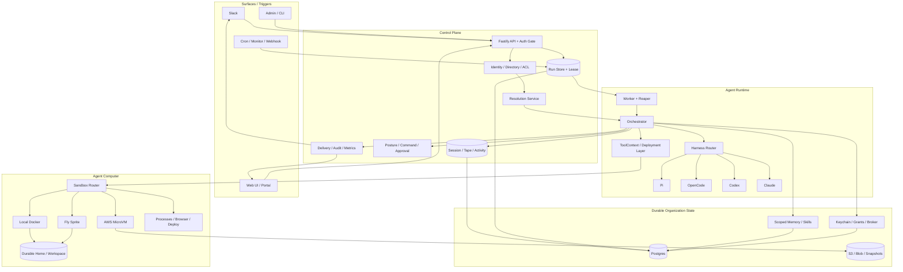

# QM

> 一句话定位：QM 是把 Slack / Web 中的多人组织协作、scope 隔离、持久 sandbox、durable run queue、长期 memory、credential broker 与 Pi / OpenCode / Codex / Claude Code 可替换 harness 压进同一控制面的“共享组织 Agent”；其运行时与恢复合同具有很高学习价值，但 launch-week 热度、默认 Auto 安全姿态和生产部署复杂度决定了它目前更适合固定版本隔离试点，而不是直接进入企业生产主干。

> 项目地址：<https://github.com/yc-software/qm>
>
> 分析日期：2026-08-03
>
> 源码快照：`7f2c916360f1797a8ff2a77ce2ce40c5fabab087`（`main`，tag `v0.1.4`）
> 分析边界：源码、文档、Git 历史、GitHub API / Release 元数据与静态安全分析；**未安装依赖、未启动服务、未运行项目测试、未执行目标代码或安装包**。

## 基本信息

| 项目 | 结论 |
|---|---|
| 项目定位 | Multiplayer agent harness for work：让一个组织中的人通过 DM、channel、project、Slack、Web、cron、monitor 与 webhook 共同使用一个长期在线 Agent |
| 产品形态 | Headless TypeScript core + Slack plugin + Web UI + Admin + Portal/Auth + `qm` deployment CLI + Docker/Fly/AWS deployment stacks |
| 最小内核 | `Conversation + Principal → Scope Resolution → durable Session/Run → Harness → ToolContext → Sandbox/Side Effect → Tape/Audit/Delivery` |
| 主要语言 | TypeScript / TSX，少量 Shell、JavaScript、CSS、Dockerfile / IaC |
| 许可证 | MIT |
| 主要栈 | Node 24、Fastify、Postgres、pg-boss、Slack Bolt、Pi、OpenCode、Codex、Claude Agent SDK、Docker/Sprites/AWS sandbox、React/Vite |
| 公开历史 | 2026-07-29 建仓；当前快照 40 commits、3 个 GitHub contributor accounts；两个主力作者分别 20 / 19 commits，占 97.5% |
| 代码体量 | 约 1,264 tracked files、约 25.7 万行 TS/TSX/JS/CSS/HTML；516 个 `*.test.ts` 文件 |
| 社区快照 | 2026-08-03 GitHub API：约 7.1k stars、760 forks、28 watchers；19 open issues、73 open PR；数据处于 launch-week 快速变化期 |
| 最新发布 | `v0.1.4`，2026-07-31；两天内已有 `v0.1.2`–`v0.1.4` 三个 release，发布链构建并签名六类 GHCR image，并发布 `@yc-software/qm` CLI |
| 采用建议 | **固定版本、隔离环境、小范围内部试点；生产主干暂缓** |
| 架构学习价值 | ⭐⭐⭐⭐⭐ |

QM 不是“给一个 coding agent 套 Slack bot”。它试图把组织 Agent 生产化时最难的几件事放到同一窄腰：

1. **多人上下文**：人、团队、channel、project 和 DM 对应不同 scope，权限与 audience 共同决定可见 workspace、memory、credentials 和 egress；
2. **长期在线执行**：interactive turn、cron、monitor、webhook、background process 共用 durable run、lease、heartbeat、reaper 和 delivery；
3. **可替换 harness**：Pi、OpenCode、Codex、Claude Code 被降成执行 adapter，组织状态不绑定单一 coding-agent runtime；
4. **有状态 agent computer**：每个 scope 有持久 home/workspace，可跑 shell、browser、git、deploy 和长进程；
5. **组织控制面**：policy、approval、admin、audit、budget、identity、connector credentials、skills 和 deployment layer 进入同一套契约。

其真正差异不是“支持四个 Agent CLI”，而是**把 harness 当可更换 compute，把 scope / session / policy / memory / sandbox / delivery 留在平台层**。

## 场景一：是否值得采用

### 解决的问题

普通 Slack bot、Web chat 或单机 coding agent 很难同时解决：

- 不同用户、DM、频道和项目之间的上下文与权限隔离；
- 同一线程内 turn 串行、跨线程并发、崩溃后重试与结果回送；
- shell/browser/connector credential 的审批、审计、撤销与最小授权；
- cron、monitor、webhook 等无人值守任务如何和交互式会话共用记忆与交付；
- 更换模型或 agent harness 后，组织长期状态不丢失；
- 本地 Docker、远端 Sprite、AWS microVM 之间如何迁移和保持持久 workspace。

QM 的回答是：先把 conversation 解析为 scope，再把所有执行放进可租约的 run；每次 run 在 scope 对应的 sandbox 上恢复 session tape、workspace layer、skills、memory 与 credentials，最后通过统一 delivery 投回 Slack/Web。

### 核心能力与边界

- DM / group / channel / team / org / project 的 scope 与 membership；
- org 只读层 + scope 可写层 + team 只读层的 workspace composition；
- session tape、participant window、per-participant visibility、LLM request/usage/gap telemetry；
- Postgres run queue、每 session 单 active run、lease/heartbeat/reaper、claim crash-loop parking；
- per-attempt tool ledger，避免同一 attempt 内重复执行已记录工具调用；
- Pi / OpenCode / Codex / Claude / mock harness router 与 durable runtime selection；
- local Docker、Fly Sprites、AWS microVM sandbox router 与迁移；
- memory recall/capture、cron、monitor、background process、deployment 和 file artifacts；
- Slack、Web UI、Admin、Portal/Auth 插件与 deployment CLI；
- source auth、portal identity、capability token、audience-scoped credential/egress floor；
- strict / auto / dangerous 三档 posture、command policy、approval grants 和 audit；
- deployment layer：用 versioned bundle 注入组织专属 tools、skills、credential paths 和 approval rules。

### 开源层与完整生产层要分开

QM 仓库包含完整的通用 control plane、plugins、CLI 和三种 sandbox backend，但 README 与 `deployment.md` 明确说明：**客户 / 业务专属连接器、凭据路径、tool descriptors、skill bundle、环境变量和 operator deployment layer 不应进公共仓库**。

因此：

- **可直接审计的开源内核**：scope、run、session、sandbox、harness、tool contract、policy、memory、Slack/Web surface、deployment CLI；
- **生产部署仍需自建的层**：组织 identity、OAuth/connectors、business tools、private skills、cloud/IAM/network、secret provisioning 和运维告警；
- README 的“一条命令部署”解决的是 packaging，不等价于企业 production readiness；
- 对选型者而言，它更像一个 opinionated platform substrate，而不是注册账号即可用的 SaaS。

### 依赖 / SDK 选型证据

根仓共 7 个 `package.json`、71 个 dependency entries。依赖量对该体量的平台并不膨胀，但运行面跨 Postgres、Slack、模型 harness、Docker/Fly/AWS 与 Web plugins，部署复杂度来自系统边界，不只是 npm 包数量。

| Dependency | Type | Used for | Problem solved | Evidence | Reuse signal | Caution |
|---|---|---|---|---|---|---|
| Fastify 5 | HTTP framework | Core、portal/admin surface API | 统一 route contract、auth gate、raw body/source signature | `src/api/server.ts` | 适合高密度 TypeScript control plane | 路由很多，授权必须继续集中在 gate 与 typed route auth，不能散落到 handler |
| `pg` + `pg-boss` | durable storage / queue | sessions、runs、grants、audit、cron、metrics | 跨进程持久状态、lease、job queue、leader/advisory lock | `src/wiring.ts`、`src/runs/postgres-run-store.ts` | 组织 Agent 应把运行状态放数据库，不靠进程内 history | schema 目前以内嵌 `CREATE/ALTER` 初始化为主，长期 migration discipline 要持续验证 |
| `@earendil-works/pi-*` | agent harness | 默认 Pi runtime、security screen 与 model helpers | 将模型/工具 loop 接入统一 harness contract | `package.json`、`src/harness/pi-harness.ts` | harness-as-adapter 是 QM 最强模式之一 | `pi-coding-agent` 来自 yc-software GitHub Release tarball，而非 registry/commit；需保留 artifact digest 与 fork 差异审计 |
| OpenCode 1.17.18 | agent harness | OpenCode adapter / SDK / plugin | 替换 Pi 而保留平台 state | `src/harness/opencode-harness.ts` | 证明 control plane 不绑定单一 agent runtime | upstream CLI/session semantics 会漂移；版本升级需要真实 resume/tool-call E2E |
| OpenAI Codex 0.144.5 | agent harness | Codex subprocess adapter | 使用 Codex CLI 能力 | `src/harness/codex-harness.ts` | 对已有 Codex 套餐的组织有价值 | subprocess env、OAuth/token、resume id 与版本兼容是持续维护面 |
| Claude Agent SDK 0.3.211 | agent harness | Claude adapter | 接入 Claude Code/Agent SDK | `src/harness/claude-harness.ts` | 多 harness 选型与迁移 | SDK 权限模型不能自动继承 QM 的全部 policy；边界回归必须以实际 tool call 验证 |
| Slack Bolt / Web API / Socket Mode | collaboration surface | Slack ingestion、delivery、ambient/context | 把 Agent 放进真实团队频道与 DM | `src/slack`、`src/surfaces` | Slack-first 组织 Agent 的完整样本 | external participants、channel membership、token scope 和 replay 是高风险面 |
| Docker / Fly Sprites / AWS AgentCore | agent computer | per-scope sandbox 与 deployed apps | durable home、shell/process/browser、远端隔离与迁移 | `src/sandbox/*`、`deploy/stacks/*` | 把 Agent computer 抽象成 port，可按环境替换 | 三个 backend 的 egress、snapshot、process/session 能力并不对称 |
| `jose` + AWS Secrets Manager/STS | auth / credential broker | capability、portal identity、secret source、temporary role | 把模型工具权限与长期 credential 分离 | `src/auth`、`src/credentials` | capability audience + revocation 值得复用 | secret reuse、key rotation、scope membership 与 broker session policy 都是生产运维责任 |
| Zod + TypeBox | runtime schema | config、tool descriptor、API contract | 动态 JSON 进入持久状态前校验 | `src/deployment`、plugins、API | 高扩展平台必须有 runtime validation | shape validation 不能替代语义授权和 cross-scope invariant |

依赖声明多数使用 caret、没有 upper bound，但 lockfile 固定当前安装；发布侧比普通早期项目更强：GitHub Actions 全部使用 commit SHA，GHCR images 以 digest 固定、keyless cosign 验证，npm publish 开 provenance。

### 风险评估

#### 1. 默认 Auto 是“筛查失败放行”，不是强安全边界

`src/security/security-posture.ts` 定义：

- `dangerous`：不筛查、不要求工具审批；
- `auto`：筛 external content，但工具默认不需要人工审批；
- `strict`：所有有副作用 harness tools 都走人工审批，但 inbound screener 关闭。

默认 posture 是 `auto`。`src/core/orchestrator/security-screen.ts` 在模型/代理 screener 超时或失败后重试一次，仍失败就返回 `decision:auto + unscreened:true`；`src/core/orchestrator.ts:620-659` 对超长输入、不可筛附件、无 screener 与失败 verdict 都记录 `security_posture.input_failed_open` 后继续执行，只在 prompt 中加“未筛查、按不可信数据处理”的 notice。工具结果也有同类 failed-open 路径。

这是一种可运营的 availability-first 设计，但不能宣传为 prompt-injection 防火墙：最需要保护的外部 Slack、网页、附件、monitor 数据在 classifier 不可用时仍进入带执行能力的 Agent。生产环境至少应：

- 对外部 participant / webhook / monitor 提供可配置 fail-closed；
- 将 screener availability 纳入 SLO/告警；
- 高权限 scope 使用 Strict 或更窄的 tool capability；
- 不把“模型分类 + notice”当作 hard isolation。

**运行时待证：** 真实部署的 screener SLO、proxy fail-closed 配置、告警处理和 incident response。

#### 2. `ALLOW_UNAUTHENTICATED_CORE` 可显式关闭整个 Core HTTP 认证

**风险：高｜confirmed（仅在配置触发时）**

- 默认值是安全的 `false`；
- 但 operator 显式设置该开关且不提供 signing secret 时，server 会进入 unsigned ingress；
- 该 bypass 不是只开放 `/health`，而是让正常 Core route table 处在未认证入口后；
- 因而它应被视为本地开发逃生阀，不应出现在可被网络访问的 staging/production 配置。

源码证据：`src/config.ts:685-687`、`src/api/server.ts:475-480`。这不是默认远程漏洞；攻击前提是部署方主动错误配置或泄露了带此设置的 deployment manifest。PoC 必须加入 startup policy：非 loopback/public listener 下检测到此开关直接失败，并在 IaC/CI 中禁止。

#### 3. command policy 很努力，但仍是可绕过 heuristic

默认 org floor 对 recursive `rm`、force push、destructive SQL、fork bomb、`curl | sh` 做 deny/approval。`src/policy/command-policy.ts` 甚至递归展开 `sh -c`、`eval`、command substitution、backticks、`env -S`、pipe-to-shell、here-string、简单变量替换、wrapper command 等大量绕过形态。

但 `SECURITY.md` 明确说明 command matching 是 defense-in-depth，不是 sandbox；任何未枚举的解释器、编码、脚本文件、二进制或语义等价命令都可能越过 regex。默认 denylist 下未匹配命令直接 allow，而 Auto 又不提供全工具审批。

因此生产 policy 应优先：

- 用 allowlist / deployment-layer approval rules 描述允许的业务工具；
- 把 destructive control 放到 portal/admin hard gate，而不是靠 shell regex；
- 用短期 brokered credentials 限制命令即使执行后的 blast radius；
- 将 local/sandbox IAM/network/filesystem 当真正边界。

#### 4. sandbox 隔离与 egress 隔离不是一回事

local backend 不是宿主裸 shell：`src/sandbox/local-sandbox.ts` 为每个 scope 创建独立 Docker container、network 和持久 volume，agent daemon 仅映射到 `127.0.0.1` 随机端口。这比“直接在服务进程 child_process.exec”安全得多。

但该 profile 明确声明 `egressEnforcement: "none"`，并添加 `host.docker.internal:host-gateway`；AWS backend 的公开 profile 同样是 `none`。只有配置 `SPRITES_EGRESS_PROXY_URL` 的 Sprites backend 声明 domain enforcement，未配置时 `loadConfig()` 只 warning 且 fail-open。

风险不是 sandbox 能直接读宿主全部文件，而是：

- 恶意/错误工具可自由访问公网、host gateway 或环境可达的内网；
- `Resolution.egress` 的 host floor 只有在真正接入 egress proxy/connector 的路径上才成为硬约束；
- browser、shell、deployed app 与 connector 的网络面并非天然同一 policy。

生产部署应把“sandbox backend”与“egress enforcement level”作为两个独立验收项。

#### 5. Browser 是显式例外，不能假设继承普通 shell policy

`SECURITY.md` 明确指出 browser navigation 不是普通 command-policy path：浏览器访问由 browser runtime / session 和 provenance 机制处理，不等价于 shell command approval，也不保证复用相同 egress enforcement。网页内容可能回到 Agent，外部页面本身又是 prompt-injection 数据源。

因此选型前必须单独验证：

- 首跳、redirect、子资源和下载是否阻断 loopback/private/link-local/cloud metadata；
- browser credential/session 是否按 principal/scope 隔离并支持撤销；
- Strict 是否能覆盖“浏览器动作”而不只是 harness tool declaration；
- 页面内容 screening 失败时的行为。

在这些 E2E 未验证前，不应把 browser 当成已被 command policy 完整覆盖。

#### 6. Durable queue 保证“可恢复”，不自动保证 side effect exactly-once

Postgres run store 用 idempotency key、`FOR UPDATE SKIP LOCKED`、每 session 单 running index、lease token、heartbeat 与 reaper；tool ledger 以 `(run_id, attempt, call_index)` 缓存输出。这对 crash recovery 很强。

但 ledger key 包含 attempt：run 在 side effect 已成功、结果尚未持久化时崩溃，下一次 attempt 可能重新执行同一外部动作。HTTP/API/Slack/deploy 等模块各自还要提供 idempotency key 或 reconcile。报告不能把 lease + ledger 写成全平台 exactly-once。

采用方应把外部 side effect 分为：

- 天然幂等读；
- 带平台 idempotency key 的写；
- 可查状态后 reconcile 的写；
- 无法去重的危险写——应人工审批或禁止后台重试。

#### 7. wiring.ts 与 orchestrator.ts 已成明显 god-files

`src/wiring.ts` 约 1,427 行，负责数十个 store/backend/service 的实例化与生命周期；`src/core/orchestrator.ts` 约 2,841 行，聚合 scope、screening、session、attachments、memory、skills、approval、harness、delivery、tape 和 failure handling。

composition root 大并非原罪，但当前密度已导致：

- 安全与运行 invariant 跨多个超大函数；
- 单一改动可能触及 scope、run、screening 与 delivery；
- 插件虽在边缘，核心 composition 仍要显式知道大量 subsystem；
- 审计与 onboarding 成本高。

应继续抽出 turn admission、context assembly、tool authorization、harness execution、persistence/finalization 五个显式 stage，并以 contract tests 锁住跨 stage 不变量。

#### 8. 多 harness 统一的是平台接口，不是行为语义

`Harness` contract 把 run/history/tools/tape/screening/approval 统一，但 Pi、OpenCode、Codex、Claude 的：

- resume/session id；
- streaming/tool event；
- built-in tool 权限；
- prompt/system/cache；
- cancel/timeout；
- provider/model credentials

并不完全同构。代码为每个 adapter 做了大量 translation，这证明团队知道问题存在，也意味着版本升级是持续风险。组织不能只看“router 支持四个 harness”，而要针对自己实际选定的 harness 跑恢复、审批、tool screen、timeout 与 transcript parity 测试。

#### 9. 公开历史过短，7k stars 主要是 launch signal

仓库公开仅 5 天，40 commits 中两个主力作者分别 20 / 19 commits。7.1k stars / 760 forks 的增长非常强，但：

- 尚无长期 release cadence；
- 公开 issue/PR 在几天内快速堆积，73 个 open PR 既说明关注高，也说明 review load 高；
- 没有足够时间证明升级稳定性、真实生产 retention、外部 maintainer governance；
- 当前高质量代码更像成熟内部系统一次性开源，不能用公开 Git 年龄推断系统只开发了 5 天，也不能用 stars 推断生产采用。

这是“高潜力、低时间证据”，不是“普通玩具仓”。

#### 10. 供应链做得好，但 Pi fork artifact 是额外信任根

官方 Actions 使用 SHA pin，release images 做 cosign，npm 开 provenance；这是明显优点。与此同时，`@earendil-works/pi-coding-agent` 直接引用 `yc-software/pi` GitHub Release tarball。该 artifact 是 QM 安全模型的一部分，但 package manifest 没有直接展示 tarball digest 或 commit。

采用方应锁定 lockfile integrity、镜像 digest、release tag，并对私有/定制 Pi fork 做差异审计；不要只因为依赖名像 upstream 就按 upstream trust model 处理。

### 结论

**推荐：固定 `v0.1.4` 或更高已审计 release，在隔离 cloud account / VPC / Slack test workspace 中做小范围内部 PoC。**

优先适用：

- 想把 Slack/Web/cron/monitor 接入一个共享组织 Agent；
- 需要 per-user / per-channel / per-project memory 与 workspace；
- 希望 Pi/OpenCode/Codex/Claude 可切换，但状态不绑定 harness；
- 愿意承担 Postgres、container/microVM、IAM、secrets、egress proxy 和 operations；
- 团队能维护 private deployment layer 与 tool policy。

暂不建议：

- 直接接入生产 Slack 全量历史、组织 OAuth 与高权限 cloud roles；
- 把默认 Auto 当成“无需 approval 的安全自动模式”；
- 在 local/AWS `egressEnforcement:none` 下开放任意网页、shell 与 connector；
- 把 GitHub stars 当作成熟度证明；
- 在未验证选定 harness 的 resume/approval parity 前允许长任务自主执行。

### 最小 PoC 路径

1. 固定 release / image digest，独立 Postgres 与 test Slack workspace；
2. 只开一个 harness、一个模型、一个 channel、一个 test project；
3. 使用 Strict，先关闭 browser、deploy、background、cron 和外部 connectors；
4. local Docker 只用于开发；生产 PoC 配真正的 egress proxy 与最小 IAM；
5. 只加入两个无副作用工具和一个带 idempotency key 的写工具；
6. 验证 actor revocation、participant removal、scope migration、lease expiration、crash recovery、approval replay；
7. 再逐个开放 credentials、background process、cron、browser 与 deployment layer。

## 场景二：技术架构学习

### 核心架构图



### 底层技术架构

#### 最小架构内核

QM 最小可复刻内核不是 Slack plugin，也不是四个 harness，而是七个对象：

1. **Principal / Audience**：当前 actor、会话参与者、team membership 与 internal/external classification；
2. **Scope Resolution**：将 conversation 映射为唯一 writable scope，同时生成只读 layers、policy、egress floor 与 granted handles；
3. **Session / Tape**：持久对话、participant visibility、model request、tool event 与 compaction/resume contract；
4. **Run / Lease**：把 turn 从 HTTP 生命周期剥离，支持排队、claim、heartbeat、retry、reap 与 park；
5. **Harness**：只负责消费 history/tools/policy 并产生 message/tool/tape events；
6. **ToolContext**：所有 shell/file/memory/surface/deploy side effect 的平台契约；
7. **SandboxHandle**：scope 对应的持久 agent computer，不让 harness 直接碰基础设施。

删除 Slack、Web UI、Admin、AWS 和三个 harness 后，只要这七个对象仍在，QM 的设计价值就还在。

#### 核心抽象

##### Scope 是真正的租户 / 协作单元

`ResolutionService.scopeFor()`：

- DM → `personal:<actor>`；
- group → `group:<ref>`；
- 其他 channel/thread → `channel:<ref>`。

随后组装：

- org layer：`global/` 只读；
- 当前 scope layer：workspace root 可写；
- DM 中 actor 所属 team layers：`team-<id>/` 只读；
- org soul + lower-scope soul；
- org command floor + scope policy；
- security posture；
- audience 最小 egress / denied host floor；
- audience 可用 granted handles。

这里的关键不变量是：**共享会话的权限取 audience 交集/下界，而不是按最强参与者放大。**

##### Run 与 Session 分开

Session 表示长期线程；Run 表示一次可重试执行。一个 session 可以有多个按序 run，但 Postgres unique partial index 保证同一 session 同时只有一个 `running`。这使：

- HTTP 请求可以快速 enqueue；
- worker 横向扩展；
- 同一线程避免并发写 tape；
- 不同线程并发；
- worker crash 后 lease/reaper 接管。

##### Harness 是 compute adapter

`Harness.run(input)` 接收 resolved model、history、tools、system/cache boundary、tape、screening/approval hooks、abort signal；返回 `TurnResult`。平台自己持有 session、memory、delivery 与 sandbox，因而换 harness 不等于迁移所有组织状态。

##### Deployment Layer 是组织专属能力包

public core 不硬编码客户工具。deployment layer bundle 只允许：

- `tools/<id>/tool.json`；
- `skills/<id>/SKILL.md` 与 assets；
- credential paths / resident auth connector；
- advertised tool / hints；
- command approval rules；
- 可选 AWS credential broker。

store 对 bundle normalization、path collision、duplicate id、skill projection、content hash、version、audit 与 rollback 都有明确合同。这是比“启动时扫描一个 plugins 文件夹”更生产化的组织能力注入方案。

#### 控制面 / 数据面

- **入口面**：Slack、Web、Portal/Auth、Admin、cron、monitor、webhook；
- **控制面**：Fastify route auth、identity/directory/ACL、config、policy、approval、admin grants、budget/rate limit；
- **运行面**：run worker、orchestrator、harness router、tool context；
- **agent computer 面**：sandbox router、process sessions、browser、files、deploy；
- **持久数据面**：Postgres、S3/blob/snapshot、scope memory、skills、tape、audit、delivery；
- **运维面**：leader/advisory locks、reaper、drain controller、instance registry、metrics/error log、signed releases。

#### 关键执行链路

##### 交互式 Slack / Web turn

```text
surface event
→ source signature / portal identity / replay check
→ classify actor + conversation audience
→ resolution(scope, layers, policy, egress, handles)
→ get/create session + participant reconciliation
→ enqueue durable run (idempotency key)
→ worker claim lease + heartbeat
→ orchestrator acquire session lease
→ screen external input / attachments
→ assemble tape + scoped memory + skills + system/cache boundary
→ provision scope sandbox
→ resolve harness + model
→ harness tool loop through ToolContext
→ append tape/activity/LLM usage/tool ledger
→ finalize run + delivery state
→ Slack/Web delivery
```

##### Crash recovery

```text
worker claims pending run
→ marks running + lease token + expiry
→ heartbeat extends lease
→ worker/process crash
→ reaper sees expired lease
→ retryable: pending again
→ new worker claims with new attempt
→ attempt-scoped tool ledger available only for recorded calls in that attempt
→ max error attempts / max claims exceeded: park as failed
→ terminal listeners reconcile approval/session/delivery/orphaned signals
```

##### Scoped tool execution

```text
model emits execute(command)
→ ToolContext validates requested reach/scratch/owner-auth mode
→ compose org + scope + deployment-layer command policy
→ deny / require approval / allow
→ provision SandboxHandle for resolved scope
→ materialize RO layers + writable home + ephemeral credential links
→ run command with timeout/cancel
→ record audit/ledger/output
→ screen external tool result in Auto posture
→ return result to harness
```

##### Deployment layer update

```text
portal/admin submits contract:1 bundle
→ normalize paths/content
→ parse tool descriptors + skill manifests
→ reject duplicate ids/path collisions/foreign skill collisions
→ hash + atomic durable version update
→ persist audit revisions
→ fleet advisory lock
→ project skills + replace live runtime layer
→ apply failure: rollback skill projection / keep previous live layer
→ periodic refresh reconciles durable state across instances
```

#### 状态模型

关键状态不是 UI 装饰：

- run：`pending / running / done / failed`；
- run attempts 与 error attempts 分开；
- session lease holder：turn / compaction / fork / backfill；
- session origin：conversation / cron / webhook / monitor；
- tool ledger：run + attempt + call index；
- process registry：scope 内长进程与 reaper；
- delivery state：run 结果是否进入目标 surface；
- approval：pending record、grant mode、session blocking；
- task/cron/monitor/deploy：独立持久对象；
- deployment layer：content hash、version、pending audits、live projection；
- memory：scope body + revision/CAS/history；
- session tape：message/context event/annotation 与 entry coverage。

#### 契约边界

- Surface 只负责认证、actor/conversation 归一化与 delivery，不直接拥有 harness 或 sandbox；
- Resolution 输出 scope/layers/policy/audience floor，orchestrator 不应绕过它自行放大权限；
- Harness 只能通过 `HarnessInput`、`ToolContext`、tape/emit hooks 与平台交互；
- ToolContext 只拿已解析 scope 和 `SandboxHandle`，不能凭模型参数任意切换租户；
- RunStore 与 SessionStore 的 lease token 是跨进程写入资格，不是普通 metadata；
- deployment layer 只能通过 versioned bundle contract 注入组织能力，不能直接修改 public core。

#### 失败与降级模型

- source/capability/portal secret 不满足生产约束时直接拒绝启动；
- run worker crash 由 lease/reaper 重试，超过 claim/error 上限后 park 为 failed；
- deployment layer 投影失败保留旧 live layer，并尝试回滚 skill projection；
- sandbox backend 缺失或 local Docker/image 不可用时 provision 明确失败，不回退宿主 shell；
- Auto screener timeout/不可筛数据是显式 failed-open，写 audit 并注入 untrusted notice；
- delivery、approval、process、task 与 run 各自持久化状态，避免用一条“turn 成功”掩盖外围失败。

#### 可复刻设计不变量

1. **一个 conversation 必须解析到一个明确 writable scope。**
2. **org policy 是 floor，lower scope 只能加严，不能覆盖组织底线。**
3. **共享 audience 的 egress/credential 权限不得高于最弱成员可用权限。**
4. **同一 session 同时最多一个 running run。**
5. **只有持有正确 lease token 的 worker 才能 heartbeat / complete / fail。**
6. **harness 不拥有持久组织状态；它只是可替换 execution adapter。**
7. **所有 shell/file/surface/deploy side effect 必须经过 ToolContext 或 capability-gated API。**
8. **Strict posture 下，除了无副作用 turn enders，所有 harness tools 都必须批准。**
9. **capability token 必须校验 audience、actor active state 与当前 scope membership。**
10. **deployment layer 更新必须先持久化、审计、校验，再原子投影；失败保留旧 live layer。**
11. **失败不得制造假成功：run、delivery、approval 与 audit 分别保留真实状态。**
12. **公开 core 与私有组织工具层分离，业务 secret/tool 不进入通用仓库。**

### 关键设计决策与 trade-off

| 决策 | 收益 | 代价 |
|---|---|---|
| 一个共享组织 Agent，而非每人一个完全隔离 bot | channel/project 有共同历史、workspace 和身份 | 必须计算 audience 权限下界，participant 变更也会影响既有 session |
| Run 与 Session 分开 | worker 可横向扩展、崩溃重试、HTTP 快速返回 | side effect 去重、lease、delivery reconciliation 与 schema 都更复杂 |
| Harness 可替换 | 平台不被 Pi/Codex/Claude/OpenCode 单点锁定 | 四个 runtime 的 resume/tool/security 语义需要持续适配 |
| per-scope durable agent computer | 长任务、代码、进程和 credentials 有连续性 | cloud 成本、snapshot、迁移、egress 与清理成为平台责任 |
| Auto screener failed-open | 外部 classifier 故障不让所有团队工作停摆 | 安全降级发生在最不可信输入面，必须以 SLO/告警/最小能力补偿 |
| private deployment layer | public core 不吸收业务 secret/tool；组织能力可版本和审计 | 开源 checkout 不是完整生产方案，采用方必须维护私有 operator layer |

### 值得学习的模式

1. Scope Resolution 先于 Agent loop；
2. Postgres lease + per-session serialization；
3. Session tape + participant visibility，而不是普通 message array；
4. Harness-as-adapter，把模型 loop 从组织状态中解耦；
5. ToolContext 收口 shell/file/memory/surface/deploy side effect；
6. Deployment layer 的 hash/version/audit/rollback；
7. capability audience + live actor + scope revocation；
8. sandbox backend 与 egress enforcement 分开建模；
9. run、delivery、approval、process 各有真实 durable terminal state；
10. 安全文档主动声明 heuristic/failed-open/Browser 例外。

### 反模式 / 踩坑点

- 不要把 `auto` 读成“自动安全”：它是 availability-first 的筛查模式；
- 不要把 command regex 当 sandbox，也不要把 Docker 隔离当 egress 隔离；
- 不要只实现多 harness router，却不测 resume、cancel、approval 与 transcript parity；
- 不要把 side-effect ledger 当跨 attempt exactly-once；
- 不要继续向 `orchestrator.ts` / `wiring.ts` 增加更多横切分支；
- 不要把 stars、forks 或 launch-week PR 数直接转译成 production adoption。

### 可借鉴的具体技术点

- `ResolutionService` 返回完整 `Resolution`，避免工具运行期再查散落权限；
- Postgres partial unique index 保证一个 session 只有一个 active run；
- lease token 参与 heartbeat/complete/fail 条件，防止过期 worker 写回；
- attempt-scoped tool ledger 把模型 tool index 与持久执行结果关联；
- deployment layer 先持久化审计 revision，再在 fleet lock 下投影；
- local Docker daemon 只映射 `127.0.0.1` 随机端口，并按 scope 命名 network/volume；
- production secret schema 与 server-level secret distinctness 双层 fail closed。

## 架构解剖

### 目录结构

```text
src/
  api/                 # Fastify server、routes、control service、auth gate
  core/                # orchestrator、turn origin、approval、context assembly
  resolution/          # scope/config/audience floor/membership
  runs/                # durable run store、worker、reaper、activity/signal/state bus
  sessions/            # session/tape/participant visibility/Postgres store
  harness/             # Pi/OpenCode/Codex/Claude/mock adapters + router
  tools/               # ToolContext、execute/files/memory/surface/deploy primitives
  sandbox/             # local Docker/Sprites/AWS + routing/migration/process sessions
  auth/ credentials/   # source/capability/portal identity、keychain、connector/broker
  memory/ skills/      # scoped memory、capture strategy、skill packs/bundles/sync
  cron/ monitors/      # background automation
  delivery/ surfaces/  # Slack/Web delivery、ambient/context/cache
  deployment/          # private layer contract/store/runtime projection
plugins/
  web-ui/ admin/ auth/ portal/ chassis/
cli/                   # @yc-software/qm deployment CLI
local/ fly/ aws/       # sandbox images and agents
deploy/stacks/         # Docker/Fly/AWS deployment contracts
.github/workflows/     # CI、image signing、CLI publish、release
```

### 技术栈

| 层 | 技术 |
|---|---|
| Runtime | Node.js 24、TypeScript ESM |
| Control API | Fastify 5、Zod、TypeBox、JOSE |
| Durable state | PostgreSQL、pg、pg-boss、advisory lock |
| Surfaces | Slack Bolt / Web API / Socket Mode、React/Vite plugins |
| Harness | Pi fork、OpenCode、OpenAI Codex、Claude Agent SDK |
| Agent computer | Docker local sandbox、Fly Sprites、AWS microVM/AgentCore |
| Object/secret/cloud | S3、Secrets Manager、STS、Flux/IaC stack contracts |
| Quality/release | Node test runner、TypeScript、ESLint、oxlint、knip、Prettier、GitHub Actions、Buildx、cosign、npm provenance |

### 模块依赖关系

核心依赖方向总体合理：surface/API 不直接拥有 agent runtime；`buildApp()` 组合 ports/adapters；orchestrator 依赖 interface；run worker 只消费 run store + orchestrator；harness 只消费已解析输入；sandbox 隔离 infra；Postgres/local/S3 adapters 在 wiring 选择。

主要债务不是方向循环，而是 composition 与 orchestration 密度过高。当前大量安全 invariant 仍集中在两个 god-files 中，需要继续抽 stage，而不是再加 condition branch。

### 扩展机制

- Harness adapter：Pi、OpenCode、Codex、Claude；
- Sandbox backend：local Docker、Sprites、AWS；
- Surface plugin：Slack、Web/Admin/Portal/Auth；
- Deployment layer：组织 tools/skills/credentials/approvals；
- Skill pack / bundle / sync；
- Memory strategy；
- Deploy provider：Docker/AWS；
- Secret source：env/AWS Secrets Manager；
- Model/provider/runtime durable selection；
- Connector OAuth、browser session 与 resident auth。

扩展面广，但仍有统一窄腰：scope、capability、ToolContext、Sandbox、SessionTape、RunStore。这是 QM 比一般“plugin-rich bot”更值得学习的原因。

## 关键代码走读

| 文件 / 符号 | 作用 | 判断 |
|---|---|---|
| `src/resolution/resolution-service.ts` | conversation → scope/layers/policy/egress/handles | 全仓最关键的多人与权限收敛入口 |
| `src/core/orchestrator.ts` | turn admission、screening、context、tools、harness、persistence、delivery | 行为完整但过大，风险与价值都最高 |
| `src/core/orchestrator/security-screen.ts` | model/proxy screener、timeout、retry、shadow/audit | 可观测性强；最终 failed-open 是明确可用性取舍 |
| `src/runs/postgres-run-store.ts` | queue、lease、single-run-per-session、retry/reap、tool ledger | durable Agent runtime 的优秀样本；不等于跨 attempt exactly-once |
| `src/runs/worker.ts` | claim、heartbeat、drain、task protection、run execution | 把长 turn 从 HTTP 生命周期剥离 |
| `src/sessions/session-store.ts` | tape、participant visibility、LLM request/gap/usage contract | 远超普通 chat history，已是运行审计 substrate |
| `src/harness/harness.ts` | 多 runtime 统一 contract | 让平台状态独立于 harness |
| `src/harness/harness-router.ts` | durable runtime/model 选择与 adapter routing | 选型能力真实，不是 README 列表 |
| `src/tools/primitives.ts` | execute/background/files/memory/surface/deploy side-effect narrow waist | 最值得复用的工具平台边界；仍依赖 policy/sandbox hardening |
| `src/policy/command-policy.ts` | shell scanner、org floor、scope/layer rules | 对绕过做了少见的深处理，但仍只能是 heuristic |
| `src/sandbox/local-sandbox.ts` | per-scope Docker、durable volume、process/file APIs | local 不是裸 shell；egress none 与 host gateway 必须单列风险 |
| `src/api/server.ts` | source auth、capability、portal identity、strict mutation gate | fail-closed 设计强，admin/content read restrictions细致 |
| `src/wiring.ts` | ports/adapters、lifecycle、backend selection | composition root 真实，但 1.4k 行已需要拆分 |
| `src/deployment/deployment-layer-store.ts` | versioned private capability bundle + projection/rollback/audit | 组织专属能力与开源 core 分离的强实现 |
| `src/memory/memory-service.ts` | scope memory、CAS、history、channel→personal CC | 轻量可控，不是复杂向量 RAG；强调 scope provenance |
| `src/deployment/secret-schema.ts` | production secret gate | production 必须显式强 secret，优于弱默认启动 |

## 质量与成熟度

### 代码质量

**优点：**

- interface/adapter 边界广泛存在，不是“所有东西 import global singleton”；
- durable state、idempotency、lease、advisory lock、rollback、audit 被当一等对象；
- 安全限制在 `SECURITY.md` 中主动披露，没有把 heuristic 包装成绝对安全；
- source auth、capability、portal identity、admin restrictions 与 secret reuse 检查细；
- error message 和 operational state 很重视真实失败，不制造假成功；
- Actions / release provenance 强于大多数早期项目。

**不足：**

- `orchestrator.ts`、`wiring.ts`、`primitives.ts` 体量过大；
- 多个 backend/adapter 的能力并不对称，统一 interface 容易让使用者误以为 parity 已完成；
- default Auto 的安全行为复杂，运维者可能把名称误读成“自动安全执行”；
- schema 初始化大量分散在 adapter 代码中，长期 migration 协作成本高；
- public history 太短，设计意图更多靠当前代码/文档，缺少长期 commit evolution；
- dependency manifest 多数无 upper bound，且存在自定义 Pi release artifact 信任根。

### 测试

静态计数有 516 个 `*.test.ts`：约 372 个 root tests、98 个 plugin tests、43 个 CLI tests，其余为 deployment stack。覆盖面从文件名与 CI 可见：

- scope/membership/auth/capability；
- run/session/lease/reaper/Postgres；
- command scanner/approval/security screen；
- sandbox/router/migration/process；
- memory/skills/credentials/connectors；
- Slack/surface/delivery；
- CLI packaged artifact / E2E；
- production image smoke boot。

这是非常积极的工程信号，但本报告遵守静态边界，**没有运行测试**，因此不能写“当前 commit 全绿”。

### CI/CD

`CI/CD` workflow 包含：

- Core typecheck；
- 5-shard root tests；
- CLI typecheck、unit、packaged-artifact、E2E；
- deployment stack contract；
- formatting、ESLint、knip、oxlint；
- Postgres 16 durability/cross-process suite；
- Admin/Web/Auth/Portal plugin tests；
- 四个 surface production image build-and-boot smoke。

release workflow：

- 所有第三方 Actions pin 到 commit SHA；
- core/web-ui/admin/portal/auth/sandbox-base 六个 image 构建并 push GHCR；
- cosign keyless 签名并按 workflow identity 验证；
- CLI manifest 固定 image digest；
- npm publish 开 provenance；
- release 只从 main 人工触发并创建 tag / generated notes / digest manifest。

扣分点：本轮未执行 CI，本地只读探针也未验证 npm/GHCR 当前可拉取状态；报告只评价仓内发布合同，不把它写成已实测安装成功。

### 文档质量

README、AGENTS、SECURITY、deployment、CLI 与 stacks 文档覆盖架构、安全、部署和扩展。尤其 `SECURITY.md` 对 browser、command policy、Auto/Strict、capability 与 sandbox/egress 的限制有直接说明。

不足：

- README 强调“一条命令”和 capability，容易让非平台团队低估 IAM/network/secret/ops 成本；
- `auto` 命名不够直观，failed-open 语义应在首页更醒目；
- 开源层与 private deployment layer 的职责需要一张明确 threat model / responsibility matrix；
- architecture 图与 ADR 可以帮助外部贡献者理解 25 万行系统，而不只靠 AGENTS 规则。

### Issue / PR 健康度

- 19 个 open issues、0 个 closed issues：公开 issue 处理还没有时间形成统计基线；
- 73 个 open PR、49 个 closed PR，其中 37 merged：外部输入和合并都很活跃，但 backlog 已高于当前 maintainer 数量；
- 3 个 contributor accounts，两个主力作者分别贡献 20 / 19 commits，合计 39/40（97.5%），bus factor 与 review capacity 仍高度集中；
- 已 merged PR 中外部作者占比约 2.7%，说明外部兴趣很强，但当前已吸收代码仍主要来自核心团队；
- 匿名 GitHub API 在补采响应时间时触发 403 rate limit，因此不报告 PR merge 中位时长，不用缺失数据补推响应速度。

## 社区与生态

### 社区评价

- 仓库创建于 2026-07-29，观测日仅 5 天；
- 40 commits，两个主力作者分别 20 / 19 commits，贡献高度集中；
- API contributor accounts 为 3，尚无长期外部 maintainer 证据；
- 约 7.1k stars / 760 forks / 28 watchers，launch 动能非常强；
- 19 个 open issues、0 个 closed issues，73 个 open PR、49 个 closed PR（其中 37 merged），几天内快速堆积，既是兴趣信号，也是 review backlog 风险；
- 两天内发布 `v0.1.2`、`v0.1.3`、`v0.1.4` 三个 release，但仍无法推断稳定的长期 release cadence；
- `CONTRIBUTING.md` 简洁，要求 fork、branch、tests、focused PR 与 DCO sign-off，但 governance/bus factor/security response SLA 尚未形成长期证据。

#### 热度与真实采用要分开

当前能确认的是：

- GitHub launch 非常成功；
- fork/star 比高，说明大量开发者愿意保存或尝试；
- npm Download API 在 7 月 29 日至 8 月 1 日记录 1,152 次 `@yc-software/qm` 下载，证明存在真实安装/CI 尝试；
- 代码和 CI 显示项目公开前已有显著内部积累；
- 大量 open PR 表明外部贡献兴趣真实存在。

当前不能确认的是：

- 有多少组织已经在 production Slack / cloud account 使用；
- 30/90 天留存、长期任务成功率与 token/cloud 成本；
- 多 harness 在升级后的长期 parity；
- 企业安全/合规认证；
- 独立用户的长期复盘。

npm downloads 包含重复安装、CI、机器人和失败重试，不能解释成 1,152 个组织部署；8 月 2–3 日为 0 也可能是统计入账延迟，不用于推断留存归零。

因此最准确描述是：**launch traction 极强，production adoption 证据尚早。**

### 衍生项目 / 插件生态

当前生态中心仍是单一 monorepo：core、plugins、CLI、images 与 deployment stacks 同仓；deployment layer contract 为未来私有/第三方 tool pack 提供了清晰扩展点，但公开独立 pack / connector / operator 生态尚未经过时间验证。

Pi security fork、GHCR service images、npm CLI 与 Slack/Web plugins 已构成初步分发面；这比“只有源码”成熟，但不等于已有稳定 marketplace。

### 竞品对比

QM 应放在 **Agent Platforms**，更具体地说是“组织共享 Agent control plane”，不是通用 workflow builder，也不是单人 desktop AI OS。

#### 对比矩阵

| 项目 | 层级 | 与 QM 的重叠 | QM 更强 | 对方更强 |
|---|---|---|---|---|
| Dust | 直接产品竞品 | 企业团队 Agent、Slack、知识与工具 | 自托管 runtime、durable sandbox、多 harness、源码透明 | SaaS 产品成熟度、企业连接器、运营与支持 |
| OpenAI Frontier / ChatGPT Enterprise Agent | 直接产品竞品 | 企业 Agent、权限、工作上下文、任务执行 | 可自托管、runtime 可替换、scope/sandbox 代码可审计 | vendor-managed model/runtime、enterprise distribution 与 support |
| Anthropic Claude for Enterprise / Cowork | 直接产品竞品 | 组织知识、Claude Agent、协作与工具 | harness-neutral、Slack/Web/cron/monitor、durable run state | Claude 原生体验、模型能力与企业服务 |
| Lindy / Glean Agents 等 | 邻近产品替代 | 团队 workflow / connector / automation | agent computer、任意 shell、scope workspace、多 runtime | no-code workflow、连接器数量、SaaS onboarding |
| Buzz | 直接开源邻居 | 人与 Agent 共用组织协作空间、Git/workflow、长期 runtime | Postgres control plane、scope workspace、Slack-first、microVM、多 harness | 签名事件窄腰、Nostr identity、desktop/mobile/relay 一体化 |
| OpenHuman | 架构邻居 | 长期 memory、tools/skills、channels、run ledger | 组织 audience/scope、durable cloud queue、Slack/portal/admin | local-first personal AI OS、desktop、Memory Tree 与个人连接器广度 |
| OpenHands / OpenCode server | 执行层邻居 | sandboxed coding agent、session、工具执行 | 组织 control plane、多人 scope、delivery/credentials/policy | coding task 专注度、开发者生态、单 Agent runtime 深度 |
| LangGraph Platform / Temporal + Agent SDK | 自建替代 | durable execution、state、retry、human-in-loop | 成品化 scope/sandbox/Slack/harness contract | 通用 workflow 编排、可组合性、成熟 durable orchestration 基础设施 |

#### 选型结论

- 要最快上线企业 SaaS Agent：先评估 Dust/Glean/Lindy/模型厂企业产品；
- 要自托管、Slack-first、多人 scope、durable agent computer：QM 是当前非常值得 PoC 的开源候选；
- 要人/Agent/Git 共用签名协作协议：看 Buzz；
- 要个人本地 AI OS / memory-rich desktop：看 OpenHuman；
- 只要 coding agent runtime，不要组织平台：优先 OpenHands/OpenCode/Codex/Claude Code；
- 已有强平台团队，想自己组合 durable state：Temporal/LangGraph + sandbox/identity 可能更可控，但开发量显著更高。

## 评分

| 维度 | 评分 | 说明 |
|---|---:|---|
| 功能覆盖度 | 4.8 / 5 | scope、runs、sessions、harness、sandbox、surfaces、credentials、automation 已形成完整平台面 |
| 架构设计 | 4.8 / 5 | 窄腰与持久状态模型优秀；两个 god-files 拉低可维护性 |
| 工程质量 | 4.7 / 5 | 516 个测试文件、Postgres/packaged E2E、强 CI/release contract；本轮未动态执行 |
| 安全边界 | 3.5 / 5 | fail-closed auth/secret 很强；Auto failed-open、egress none 与 browser 例外是关键扣分 |
| 文档质量 | 4.6 / 5 | README/SECURITY/AGENTS/deployment 透明；production responsibility matrix 仍可增强 |
| 社区成熟度 | 2.8 / 5 | launch traction 极强，但公开时间、maintainer 数与 release 历史都太短 |
| **综合** | **4.2 / 5** | **高价值平台 substrate；采用成熟度明显低于架构成熟度** |

## 总结

### 一句话评价

> QM 是当前开源组织 Agent control plane 中少见的“已经把长期运行、多人 scope、agent computer、harness 替换和组织治理同时做到代码层”的项目；它不是成熟度已被时间证明的企业产品，但也绝不是 5 天写出的 launch toy。

### 谁应该用

- 需要 Slack/Web-first 共享组织 Agent 的平台团队；
- 需要 per-user/channel/project workspace、memory 与 durable background work 的团队；
- 希望在 Pi/OpenCode/Codex/Claude 之间保留 runtime 选择权的团队；
- 能维护 Postgres、sandbox、IAM、egress proxy、secrets 和 private deployment layer 的组织。

### 谁不应该直接用

- 只想要开箱 SaaS、无平台运维能力的普通业务团队；
- 准备直接接生产 Slack 全量历史和高权限 cloud role 的团队；
- 把 Auto screener、command policy 或 Docker 当作完整零信任边界的团队；
- 无法为外部 side effect 提供 idempotency/reconciliation 的无人值守任务。

### 下一步

1. 固定 release/image digest，在 test Slack + 隔离 cloud account 运行 Strict PoC；
2. 对一个选定 harness 跑 resume、cancel、approval、tool-screen 与 transcript parity；
3. 对 actor revocation、participant removal、scope migration、lease expiry、worker crash 做 E2E；
4. 验证 browser redirect/private-network、sandbox egress 与 connector credential 撤销；
5. 只在上述证据通过后逐步开放 Auto、cron、monitor、background 与 deploy。

### 证据与边界

- 源码快照：`yc-software/qm@7f2c916360f1797a8ff2a77ce2ce40c5fabab087`；
- GitHub repository / releases / contributors / issues / pulls API，采集于 2026-08-03；
- `README.md`、`AGENTS.md`、`SECURITY.md`、`CONTRIBUTING.md`、`deployment.md`；
- `src/core/orchestrator.ts`、`src/resolution/resolution-service.ts`、`src/runs/postgres-run-store.ts`、`src/harness/*`、`src/tools/primitives.ts`、`src/sandbox/*`、`src/api/server.ts`、`src/deployment/*`、`src/wiring.ts`；
- `.github/workflows/cicd.yml`、`release.yml`、`release-package.yml`、`publish-cli.yml`；
- 外部通用 web search 后端在本轮环境未配置；社区结论以 GitHub/API/仓库公开资料为主，不把缺少独立评价写成“评价不存在”；
- npm/GHCR 的额外只读 registry 探针被本机审批策略拦截，未绕过；报告只评价仓内发布合同与 GitHub Release，不声称已实测安装或镜像拉取；
- 本轮是静态审计，未安装依赖、未运行目标代码、未执行测试、未启动服务、未扫描运行时网络流量。
