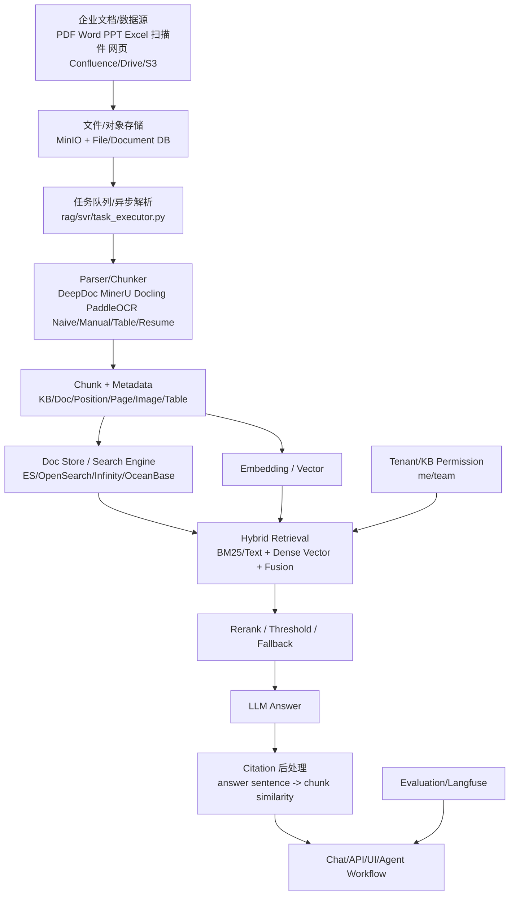

# RAGFlow

> 一句话定位：面向企业级知识库的全栈 RAG / context engine 平台，用 DeepDoc/多解析器、模板化 chunking、混合检索、引用溯源、Agent / MCP / 多聊天渠道和多租户数据集，把复杂企业文档变成可问答、可管理、可二开的知识库产品。它的强项不是某个孤立检索算法，而是把 ingestion、retrieval、citation、agent 和部署运维收成一个完整产...[truncated]

## 基本信息

| 项目 | 值 |
|------|----|
| 仓库 | `infiniflow/ragflow` |
| URL | `https://github.com/infiniflow/ragflow` |
| Star | 84,586（2026-07-08 GitHub API 快照） |
| Fork | 9,867（2026-07-08 GitHub API 快照） |
| Watchers | 345（2026-07-08 GitHub API 快照） |
| GitHub 许可证元数据 | Apache-2.0 |
| 主要语言 | Python + Go + TypeScript/TSX |
| 默认分支 | `main` |
| 仓库创建时间 | 2023-12-12 |
| 首次提交 | 2023-12-12（GitHub commits API：`93f90bad6`，`Initial commit`） |
| 最近提交 | 2026-07-08（`330033d7c`，`Fix(go): adapt to new db columns (#16745)`） |
| 最新 Release / Tag | GitHub latest release `v0.26.4`（2026-07-07）；远端 `nightly` 仍在移动，`dev-20260708` 已出现；自 2026-06-10 以来新增 20 个 tags |
| 贡献者数 | 668（GitHub contributors API `anon=1` 分页口径） |
| Issue / PR | open issues 1,993；open PR 335（2026-07-08 GitHub search API） |
| 代码规模 | 4,441 tracked files；Python 999 / 290,711 行，Go 1,316 / 449,912 行，TS 407 / 80,770 行，TSX 736 / 110,334 行 |
| 测试 / CI | test-like 文件 446；GitHub workflows 3 |
| 分析方式 | 本轮使用本地旧 clone + 远端 `origin/main` fetch + GitHub API + README / manifest / 关键源码直读 |
| 分析日期 | 2026-07-08 |

---

## 版本变化速读（相对 2026-06 旧报告）

- **热度继续上行**：stars 从 82.4k 增到 84.6k，forks 从 9.5k 增到 9.87k。
- **版本已从 `v0.25.6` 推进到 `v0.26.4`，且 release/tag 面继续活跃**：2026-06-10 以来新增 20 个 tags；GitHub latest release 仍是 `v0.26.4`，同时远端已出现 `dev-20260708`。
- **`nightly` 是可漂移 tag，不是固定锚点**：本地旧 clone 在 `fetch --tags` 时直接报 `would clobber existing tag`，说明 `nightly` 指向会前移，运维和自动化不能把它当 immutable release artifact。
- **README 叙事更明确地把项目写成 `context engine + Agent capabilities`**：当前首页直接强调 converged context engine、pre-built agent templates、MCP、memory、chat channels、orchestrable ingestion pipeline，而不再只是“文档问答”。
- **Go 迁移继续加速**：当前文件数里 Go 已明显超过 Python（1,316 vs 999），远端最新提交也已变成 `Fix(go): adapt to new db columns`，说明 API / service 面仍在持续 Go 化。
- **平台边界继续变宽**：README 最新更新包含多聊天渠道（Feishu / Discord / Telegram / Line 等）、agent memory、Docling / MinerU、agentic workflow、sandbox code executor，仓库已不是狭义“知识库检索器”。
- **部署前置依然重**：README 仍要求 Docker 24+、16GB RAM、50GB 磁盘，code executor 还要求 gVisor，且官方预构建镜像仍只提供 x86。
---

## 场景一：是否值得采用

### 解决的问题

RAGFlow 解决的是企业把复杂非结构化资料变成可问答知识库的问题。它不是一个轻量 RAG SDK，而是完整平台：文件接入、解析、切块、索引、检索、重排、对话、引用、Agent 工作流、API、前端 UI、Docker 部署和多存储后端都在仓库里。

README 对项目的定位是“open-source RAG engine”，强调适配任意规模企业，并把复杂数据转换为 high-fidelity、production-ready AI systems。其关键特性集中在四点：

1. Deep document understanding。
2. Template-based chunking。
3. Grounded citations with reduced hallucinations。
4. Multiple recall paired with fused re-ranking。

这些特性直接击中企业 SOP、制度、合同、质量手册、设备维护手册、客服知识库等场景。

### 核心能力与边界

**能做什么：**

- 解析复杂企业文档：Word、PPT、Excel、PDF、图片、扫描件、网页、结构化数据。
- 用 DeepDoc / MinerU / Docling / PaddleOCR / 其他 parser 做文档理解。
- 支持模板化、可解释 chunking，并允许在 UI 中可视化 chunk，人工干预。
- 支持全文 + 向量混合检索；`rag/nlp/search.py` 里 `FusionExpr("weighted_sum", topk, {"weights": "0.05,0.95"})` 表明默认融合关键词和向量信号。
- 支持答案后处理引用插入，便于追溯来源。
- 支持 dataset / knowledgebase / document / chunk / dialog / tenant / evaluation 等平台级模型。
- 支持 Elasticsearch、OpenSearch、Infinity、OceanBase 等检索/存储后端部署选项。
- 支持 Agent、workflow、MCP、sandbox code executor、Langfuse、memory、多聊天渠道（Feishu / Discord / Telegram / Line 等）和更宽的数据同步/上下文引擎能力。

**不能稳定保证什么：**

- 不能把“引用”视为严格形式化证明。RAGFlow 的 citation 逻辑主要是在答案生成后按句子 embedding / token 相似度与 chunk 对齐插入，属于 grounded citation 的工程近似，不是生成过程中的硬约束。
- 不能天然覆盖严格企业 ACL。源码可见 KB 级 `permission=me|team`、tenant/team 访问控制，但 chunk 级、字段级、组织架构继承式权限需要二开和专项验证。
- 不能低成本替代轻量 FAQ 系统。它是重平台，Docker/数据库/对象存储/搜索引擎/模型服务/前端后端都要维护。
- 不能替代流程执行系统。SOP 问答适合；自动执行 SOP、创建工单、审批、回写 ERP/OA/CRM 还需要 BPM/工作流/Agent 编排系统。
- 不能完全消除删除一致性风险。源码在搜索层有 `_prune_deleted_chunks` 临时兜底，注释承认部分删除路径可能留下 stale chunks。

**与竞品差异：**

- 相比 **LightRAG**：RAGFlow 更偏完整企业 RAG 产品，文档管理、UI、部署、API、数据源和多租户更完整；LightRAG 更偏 GraphRAG/可插拔检索内核。
- 相比 **Dify**：Dify 更像企业 AI 应用/工作流平台，知识库只是其中一层；RAGFlow 的主语就是 RAG/知识库。
- 相比 **FastGPT/MaxKB**：RAGFlow 工程体量更大，文档解析和 RAG 底座更重；FastGPT/MaxKB 更贴近国内企业快速落地和低门槛 UI。
- 相比 **Docling/MinerU**：Docling/MinerU 是文档解析基础设施；RAGFlow 把解析、索引、问答、引用和产品界面整合成平台。

### 集成成本

- **个人/小团队 PoC**：中。Docker Compose 可以启动，但组件多、镜像大、资源占用高。
- **企业私有化**：中到高。需要数据库、对象存储、检索引擎、模型网关、embedding/rerank 服务、网络安全、备份、监控、权限同步。
- **依赖链**：重。`pyproject.toml` 现要求 Python `>=3.13,<3.14`；依赖覆盖 OCR、PDF、Office、云数据源、LLM provider、数据库、Langfuse、MCP、agent sandbox、browser-use、crawl4ai、多渠道 connector 等，Python 依赖面非常宽。
- **部署复杂度**：高于 LightRAG 单服务。`docker/` 目录提供 Elasticsearch、OpenSearch、Infinity、OceanBase、MySQL、MinIO、Redis/Valkey 等服务形态；README 还要求 Docker 24+、16GB RAM、50GB 磁盘。
- **运行前置限制**：code executor 需要 gVisor；官方预构建 Docker images 仍只提供 x86，ARM64 需自行构建镜像。
- **从零到 demo**：如果只跑官方 Docker，顺利时可在小时级跑通；如果企业内网、国产化环境、私有模型、复杂 PDF 解析都要配置，通常是数天到数周的集成项目。

### 依赖 / SDK 选型证据

> 全量 direct dependencies 由 `tk catalog build` 从本地源码 manifest 写入 catalog；本表只解释影响 build-vs-buy 的关键库 / SDK。

| Dependency | Type | Used for | Problem solved | Evidence | Reuse signal | Caution |
|------------|------|----------|----------------|----------|--------------|---------|
| `onnxruntime(-gpu)` + `opencv-python` + `pypdf` + `pdfplumber` + `python-docx` / `python-pptx` | 文档解析 / OCR / layout stack | DeepDoc、多 parser、复杂 PDF/Office/图片理解 | 避免自研企业文档解析底座 | `pyproject.toml` 直接依赖 + README 的 Deep document understanding / heterogeneous sources 叙事 | 复杂 SOP / 合同 / 扫描件场景很值得复用 | 安装面重，GPU/CPU、OCR、系统库兼容都要单独验证 |
| `elasticsearch-dsl` + `opensearch-py` + `infinity-sdk` + `go-elasticsearch` | search / hybrid retrieval backend | 全文 + 向量 + fusion 检索、多 doc engine 适配 | 避免从零造生产级 inverted index / vector engine | `pyproject.toml`、`go.mod`、`rag/nlp/search.py`、`docker/` 多后端配置 | 适合已有搜索基础设施的企业私有化 | 运维、容量、索引一致性和权限过滤复杂度都高 |
| `peewee` + `mysql-connector-python` + `psycopg2-binary` + `pyobvector` | metadata persistence / platform state | tenant / KB / document / task / dialog / evaluation 等平台模型 | 避免手写全套 CRUD / migration / relation plumbing | `pyproject.toml` + `api/db/db_models.py` / services | 多租户知识库产品层很有参考价值 | 当前 Python/Go 双后端并行，数据契约治理更难 |
| `minio` + `boto3` + AWS S3 / Azure / Google storage clients | object storage / connectors | 文件、解析产物、外部云数据源同步 | 避免自研对象存储与多云接入层 | `pyproject.toml` 里 S3 / Azure / GCS / Dropbox / Box / Office365 / Google Drive 等依赖 | 适合企业“资料源很杂”的场景 | 凭证治理、同步频率、删除一致性和租户隔离是长期成本 |
| `valkey` + `redis` + `nats.go` | queue / lock / runtime coordination | 分布式锁、缓存、worker 协调、runtime 选择 | 避免用数据库硬扛所有异步任务状态 | `pyproject.toml` + `go.mod` + `docker/` | 对 ingestion-first 平台非常关键 | 失败恢复和可观测性要自己补齐，不能把 Redis/NATS 当持久真相源 |
| `mcp` + `agentrun-sdk` + `browser-use` + `crawl4ai` + `langfuse` | agent / MCP / web / observability | agentic workflow、外部工具协议、网页/浏览器能力、评测/追踪 | 把 RAG 从“只会答题”扩成“可行动的 context engine” | `pyproject.toml` 直接依赖 + README latest updates | 对需要 agent+KB 一体化的团队很有吸引力 | 平台边界迅速变宽，安全面和稳定性责任同步上升 |

### 风险评估

| 风险项 | 评估 | 说明 |
|--------|------|------|
| 许可证合规 | ✅ 低 | Apache-2.0，企业二开友好；但集成的第三方模型/解析器/数据源仍需单独核。 |
| Bus factor | ✅ 中低 | GitHub contributors API 口径约 668，社区面广；但核心架构和发版节奏仍明显由 InfiniFlow 驱动。 |
| 供应商锁定 | ⚠️ 中 | 开源可自托管，但平台体量大、对象模型深，二开后迁移成本高；默认会把你带进其 KB / task / document / agent 体系。 |
| 维护趋势 | ✅ 活跃且高频 | 2026-07-07 仍有提交，latest release 同日发出；2026-06-10 以来新增 18 个 tags。 |
| 安全历史 / 攻击面 | ⚠️ 高 | 平台含 sandbox/code executor、文件解析、数据源连接器、认证、多租户、MCP、聊天渠道；生产前必须做专项安全审计。 |
| 权限治理 | ⚠️ 中高 | `permission=me|team` 仍是核心口径；复杂企业 ACL/字段级过滤/组织继承权限需要二开和强验证。 |
| 删除一致性 | ⚠️ 中 | `rag/nlp/search.py` 仍保留 `_prune_deleted_chunks` retrieval-side safety net，说明 stale chunk 风险仍未从根上消失。 |
| 引用可信度 | ⚠️ 中 | citation 仍是生成后对齐插入，适合作为溯源辅助，不宜作为强审计证明。 |
| 部署门槛 | ⚠️ 中高 | Docker / 搜索 / 对象存储 / DB / 缓存 / 模型服务齐全时价值最大，但这也意味着企业自运维成本不低。 |

### 结论

**推荐采用（企业知识库 / SOP 问答 / 复杂文档 RAG），但建议“以平台试点 + 关键链路二开审计”的方式采用。**

理由：RAGFlow 是当前开源企业 RAG 产品化里最完整的样本之一。它适合把企业 SOP、制度、合同、产品手册、客服知识库、设备维护文档变成可问答知识库。它不适合被当成轻量库嵌入，也不适合在没有专门工程团队的情况下直接变成核心知识中台。

---

## 场景二：技术架构学习

### 核心架构图



### 关键设计决策与 trade-off

| 决策 | 选择 | 放弃了什么 | 为什么 |
|------|------|-----------|--------|
| 产品形态 | 全栈 RAG 平台 | 轻量 SDK 的简洁性 | 企业要的是上传、管理、问答、引用、UI、API、部署一体化。 |
| 文档处理 | Deep document understanding + 多 parser | 纯文本切块的低成本 | SOP/合同/手册大量包含表格、版面、图片、扫描件。 |
| 检索 | 关键词 + 向量 weighted fusion | 单一向量库的简单性 | 企业问答常有编号、条款、术语、流程名，需要全文和语义并用。 |
| 引用 | 答案后处理相似度插入 citation | 强 grounding / constrained decoding | 工程实现更通用，但引用可信度是近似。 |
| 权限 | tenant + KB permission me/team | 细粒度 ACL | 先满足团队级知识库，复杂企业权限需二开。 |
| 部署 | Docker + 多后端选择 | 运维简单性 | 适配不同企业搜索/数据库基础设施。 |
| 代码演进 | Python + Go + TS 混合 | 单语言一致性 | 后端 API 正在 Go 化，前端产品化重，Python 承担 RAG/解析主逻辑。 |

### 值得学习的模式

1. **RAG 产品化不是检索算法，而是 ingestion-first**：RAGFlow 的价值集中在文档解析、chunk 可视化、知识库管理、引用和 API，而不是某个新颖算法。
2. **Document parser factory**：`rag/svr/task_executor.py` 中 parser factory 把不同 parser/chunker 接到同一个任务执行链路。
3. **Hybrid search baseline**：`rag/nlp/search.py` 把文本 match、dense vector 和 fusion 放在同一检索表达式里，这是企业知识库更稳的基线。
4. **Citation as UX**：引用不是只给开发者 debug，而是作为产品主功能降低用户对幻觉的恐惧。
5. **Parser config 下沉到 KB/Document**：`Knowledgebase` 和 `Document` 都有 `parser_config`，使不同知识库/文档可定制解析策略。
6. **产品功能表驱动的多后端适配**：ES/OpenSearch/Infinity/OceanBase 的支持让企业可按已有基础设施选择。

### 反模式 / 踩坑点

- **重依赖导致安装面复杂**：`pyproject.toml` 依赖极宽，企业内网离线部署成本高。
- **引用后处理不等于强事实约束**：适合“查看来源”，不适合“法律级证明”。
- **stale chunks 兜底暴露一致性问题**：删除/权限变更后检索侧兜底过滤是安全网，但不应是主路径。
- **权限模型需要企业化补强**：`me/team` 对很多大企业不够，尤其 SOP 里部门、岗位、区域、版本、生效日期都可能影响可见性。
- **测试/CI 依赖自托管和重环境**：fork 用户不一定能复现官方 CI。

### 可借鉴的具体技术点

- SOP 文档切块应保留：制度名、章节路径、步骤编号、页码、表格上下文、版本号、生效日期。
- 答案输出应强制：引用 chunk、原文片段、文档版本、章节号。
- 企业知识库需要同步 pipeline：文件新增、更新、删除、重建、失败重试、解析日志、进度状态。
- 删除和权限变更要做 retrieval-time filter + index cleanup 双保险。
- RAG 评测要产品化：test case、run、result、metric summary，而不是脚本里临时跑。

---

## 架构解剖

### 目录结构

```text
ragflow/
├── api/                 # Flask/Quart API、DB models、services、REST routes
├── rag/                 # RAG 核心：检索、LLM、parser/chunker app、task executor、GraphRAG/RAPTOR
├── deepdoc/             # DeepDoc 文档理解：PDF/OCR/layout/table 等 parser
├── common/              # doc store、数据源 connector、通用工具
├── web/                 # React/TypeScript 前端
├── internal/ cmd/       # Go API/内部服务迁移中的后端模块
├── agent/               # Agent、canvas、sandbox/code executor 等
├── memory/              # Agent memory 能力
├── sdk/                 # Python SDK 等
├── docker/              # Docker Compose、nginx、service config、init SQL
├── helm/                # K8s/Helm 部署
├── test/                # unit/API/playwright 等测试
└── docs/                # 文档与指南
```

### 技术栈

- **运行时 / 框架**：Python `>=3.13,<3.14`、Go 1.26.4、React/TypeScript、Flask/Quart、Peewee、Gin/GORM、MinIO、Elasticsearch/OpenSearch/Infinity/OceanBase。
- **文档解析**：DeepDoc、MinerU、Docling、PaddleOCR、pdfplumber、python-docx、python-pptx、mammoth、OpenCV、ONNX Runtime。
- **RAG/模型**：多 LLM provider、embedding、rerank、Langfuse、MCP、Agent sandbox、memory、多聊天渠道。
- **构建 / 打包**：Docker、Docker Compose、Helm、uv/pyproject、Go modules、前端构建。
- **测试**：pytest、unit/API/E2E、Go tests、Playwright。
- **CI/CD**：当前 `.github/workflows/` 共 3 个 workflow；核心覆盖 tests / release / extra build paths，且大量能力仍依赖重 Docker 环境。

### 模块依赖关系

```text
api routes/services
    ↓
api/db/db_models.py: Tenant / Knowledgebase / Document / Task / Chunk / Dialog / Evaluation
    ↓
rag/svr/task_executor.py: 异步任务执行与 parser factory
    ↓
rag/app/naive.py + deepdoc/parser/*: 文档解析、切块、图文表处理
    ↓
common/doc_store + rag/nlp/search.py: 文本/向量索引、混合检索、引用插入
    ↓
rag/llm + dialog/agent: 生成、对话、Agent workflow
    ↓
web / sdk / openapi: 用户界面与外部集成
```

### 扩展机制

- Parser 扩展：`rag/app/naive.py` 聚合多 parser；`task_executor.py` 通过 parser id 分发。
- 检索后端扩展：ES/OpenSearch/Infinity/OceanBase 等 doc engine。
- LLM Provider 扩展：多厂商模型配置。
- 数据源扩展：Confluence、Google Drive、GitHub、Jira、S3、Notion 等连接器。
- Agent/Workflow 扩展：Agent canvas、sandbox executor、MCP。
- 评测/观测扩展：Evaluation model + Langfuse 配置。

---

## 质量与成熟度

### 代码质量

- **类型系统**：Python 部分类型标注不均，Peewee model 和服务层偏动态；Go/TS 部分更强类型。
- **错误处理**：任务执行和检索有大量兜底逻辑；`_prune_deleted_chunks` 仍说明删除一致性链路在工程上靠 safety net 托底。
- **代码风格一致性**：大仓库快速演进，Python/Go/TS 混合，且当前 Go API 迁移还在进行中；工程纪律整体较强但复杂度显著上升。

### 测试

- **测试框架**：pytest、Playwright、Go tests。
- **测试类型**：unit、REST API、SDK/API、playwright E2E、部分 Go API 测试。
- **覆盖可信度**：测试面较广，但企业部署矩阵太大，不能假定所有 parser/backend/provider 组合都有 CI 覆盖。

### CI/CD

- `.github/workflows/tests.yml` 包含 Ruff、Go build、Docker image build、unit tests、HTTP API tests 等。
- `release.yml` 支撑发布流程。
- 最近 12 条 Actions runs 里，`sep-tests` 在 `main` push 上保持 success；PR 侧能看到大量 skipped/cancelled/in_progress，说明仓库在高频迭代下仍有较重的条件执行与 CI 噪音。
- 风险：CI 使用自托管 runner 和重 Docker 环境，外部 fork/企业二开复现成本较高。

### 文档质量

- README 质量高，产品定位、安装、关键特性清晰。
- Docker 文档和多语言 README 完整。
- DeepDoc 有独立 README，说明 OCR/layout/table 等能力。
- 对企业安全、权限模型、删除一致性、评测成熟度的深文档仍需补强。

### Issue / PR 健康度

- GitHub search API 口径：open issues 1,993，open PR 335（2026-07-08）。这是高采用 + 高维护压力并存的典型形态。
- 远端最新提交已经推进到 2026-07-08，latest release 仍是 2026-07-07 的 `v0.26.4`；自 2026-06-10 以来 tags 已增至 20 个。
- 需要特别注意：`nightly` 为 mutable tag，本地旧 clone `fetch --tags` 会因 `would clobber existing tag` 失败。这是“高频发布”之外的额外运维噪音信号。
- backlog 仍非常大：这意味着企业采用时不能假设上游会快速消化所有 parser/backend/provider 组合问题，最好按自己的场景做回归和补丁策略。

---

## 社区与生态

### 社区评价

从 84.6k stars、9.87k forks、668 位 contributors 和 2026-07-08 仍在推主线 / 漂移 `nightly` tag 的节奏看，RAGFlow 仍是开源企业 RAG 产品化第一梯队。它的社区吸引力来自“直接可用的企业知识库产品 + 不断扩宽的 context engine / agent 能力”，而不是单一算法创新。

### 衍生项目 / 插件生态

- 官方 cloud service。
- Python/SDK/API 集成。
- OpenClaw Skill。
- MCP / Agent workflow / memory / sandbox code executor。
- 多数据源连接器。
- 多聊天渠道（Feishu / Discord / Telegram / Line 等）。
- 与 Docling/MinerU 等解析器生态协同。

### 竞品对比

- **Dify**：AI 应用平台更强，知识库内核不是唯一重点。
- **FastGPT / MaxKB**：中文企业部署和低门槛产品更直接，但底层解析/RAG 体系学习价值低于 RAGFlow。
- **LightRAG**：GraphRAG 内核更前沿、存储更可插拔；产品化弱于 RAGFlow。
- **Haystack / LlamaIndex**：框架层更适合自研，不是完整产品。
- **Docling / MinerU**：文档解析层，不构成完整知识库平台。

---

## 关键代码走读

### 1. Knowledgebase / Document 数据模型

- 路径：`api/db/db_models.py`
- 关键位置：`Knowledgebase` 约 line 867，`Document` 约 line 905。
- 职责：定义企业知识库和文档的核心元数据。
- 实现要点：
  - `Knowledgebase` 包含 `tenant_id`、`permission`、`embd_id`、`parser_id`、`parser_config`、`similarity_threshold`、`vector_similarity_weight`。
  - `Document` 包含 `kb_id`、`parser_id`、`parser_config`、`source_type`、`content_hash`、`progress`、`run/status`。
  - 说明 RAGFlow 把 parser config、embedding、检索参数前置成知识库配置，而不是写死在 pipeline。

### 2. 异步解析与 chunk 构建

- 路径：`rag/svr/task_executor.py`
- 关键位置：parser factory 约 line 114，`build_chunks` 约 line 270。
- 职责：从任务队列/对象存储取文档，合并 KB/文档 parser config，调用对应 parser 生成 chunks。
- 实现要点：
  - parser factory 支持多 parser/chunker。
  - 任务状态、进度、失败信息可回写。
  - 这是 RAGFlow 产品化程度高于普通 RAG demo 的核心。

### 3. DeepDoc / Naive parser 聚合

- 路径：`rag/app/naive.py`、`deepdoc/parser/pdf_parser.py`
- 职责：复杂文档解析、OCR、版面结构、表格、图像上下文、Office 文档等处理。
- 实现要点：
  - `rag/app/naive.py` 聚合 DeepDoc、MinerU、Docling、OpenDataLoader、PaddleOCR 等。
  - SOP 场景里，这层决定答案质量上限。

### 4. 混合检索与 fallback

- 路径：`rag/nlp/search.py`
- 关键位置：`search()` 约 line 132；fusion 约 line 192；空结果 fallback 约 line 200。
- 职责：把文本检索、向量检索、融合排序、highlight、aggregation、filters 聚合。
- 实现要点：
  - 同时构造 `matchText` 和 dense vector。
  - `FusionExpr("weighted_sum", topk, {"weights": "0.05,0.95"})` 说明默认偏向向量，但保留关键词召回。
  - 空结果会降低 min_match 或在 doc_id 条件下退回无 query 搜索。

### 5. Citation 插入

- 路径：`rag/nlp/search.py`
- 关键位置：`insert_citations()` 约 line 242。
- 职责：把答案按句切分，与检索 chunk 做 hybrid similarity，插入引用。
- 实现要点：
  - 对答案片段重新 embedding。
  - 与 chunk vector/token similarity 对齐。
  - 阈值从 0.63 递减到 0.3，说明更偏可用性而非严格性。

### 6. KB 访问控制

- 路径：`api/db/services/knowledgebase_service.py`
- 关键位置：`accessible()` 约 line 485。
- 职责：判断用户是否可访问某知识库。
- 实现要点：
  - owner 可访问。
  - `permission != team` 则非 owner 不可访问。
  - team 权限通过 joined tenants 判断。
  - 这对中小团队够用，但大企业复杂权限需补。

### 7. Evaluation 初版能力

- 路径：`api/db/services/evaluation_service.py`
- 关键位置：`start_evaluation()` 约 line 265。
- 职责：创建 evaluation run、执行 test cases、生成 metrics summary。
- 实现要点：
  - 数据模型和服务已成型。
  - 注释明确“production use task queue；currently synchronous”，说明评测还在初版阶段。

---

## SOP / 标准操作手册问答专项评估

### 适合度：4.0/5

RAGFlow 很适合 SOP 问答，尤其是“文档型 SOP 问答”，原因：

- SOP 的答案必须贴近原文，而 RAGFlow 强调 grounded citation。
- SOP 常含表格、截图、流程图、编号步骤，RAGFlow 的 DeepDoc/多 parser 更有优势。
- SOP 需要业务人员调 chunk，RAGFlow 的可视化 chunk 和模板化 chunking 是关键功能。
- SOP 更新后需要进度、状态、重建、失败重试，RAGFlow 有任务执行和文档状态模型。

### 最推荐场景

- 员工制度问答。
- 运维/客服/质检手册问答。
- 设备操作规程查询。
- 合同/法务/合规条款问答。
- 大量 PDF/Word/扫描件组成的内部知识库。

### 不建议单独承担的场景

- 自动执行 SOP 流程。
- 强审批流/BPM。
- 极细粒度权限问答。
- 法律级严格 citation 审计。
- 低资源个人部署。

---

## 评分

| 维度 | 评分(1-5) | 说明 |
|------|----------|------|
| 功能覆盖度 | 4.5 | 企业 RAG 产品链路完整，文档、检索、引用、UI、API、Agent 都覆盖。 |
| 代码质量 | 4.0 | 工程体量大、模块完整；但多语言混合和快速演进带来复杂度。 |
| 文档质量 | 4.0 | README/Docker/DeepDoc 文档较好；权限/评测/安全深文档还需补。 |
| 社区活跃度 | 4.5 | stars/forks/贡献者/提交都很活跃，维护压力也大。 |
| 架构设计 | 4.0 | ingestion-first 企业 RAG 平台架构清晰，但引用和权限仍有工程妥协。 |
| 学习价值 | 5.0 | 学企业 RAG 产品化非常值得，尤其 ingestion/chunk/citation/多后端。 |
| 可借鉴度 | 4.5 | 文档解析、任务管线、混合检索、引用 UX 都可迁移到自研系统。 |

---

## 总结

### 一句话评价

RAGFlow 是目前开源企业知识库 / RAG / context engine 产品化最值得研究的样本之一：它的强项不在“最前沿 GraphRAG 算法”，而在把复杂企业文档处理、知识库管理、混合检索、引用溯源、agent 能力和平台化部署做成一个可落地产品。

### 谁应该用

- 要快速建设企业内部知识库 / SOP 问答系统的团队。
- 文档复杂、格式多、扫描件/表格/图片多的企业。
- 有工程团队能承担私有化部署和二开的组织。
- 希望学习企业 RAG 产品架构的人。

### 谁不应该直接用

- 只需要轻量 FAQ / 小型文档问答的人。
- 只想嵌入一个 Python RAG library 的开发者。
- 没有运维资源的小团队。
- 对细粒度权限、强审计、强流程执行有硬要求但不准备二开的企业。

### 下一步

建议与 LightRAG 形成互补验证：

1. 用 RAGFlow 跑一组真实 SOP PDF/Word，重点评估解析、chunk、引用、删除、权限。
2. 用 LightRAG 对同一批 SOP 做 GraphRAG / mix 查询，测试跨章节关系、异常流程、术语关联。
3. 最终架构可以考虑：RAGFlow 做企业知识库产品层，LightRAG 做特定复杂知识域的图谱增强检索内核。
