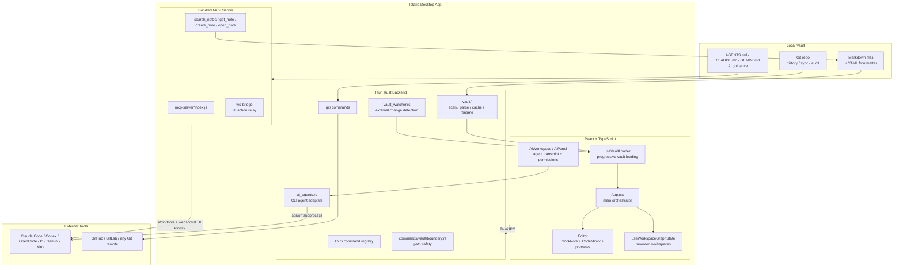

# Tolaria

> 一句话定位：Tolaria 是一个 **local-first / Git-first / AI-agent-friendly** 的 Markdown 知识库桌面应用，用 Tauri + React + Rust 把“文件系统知识库、Git 版本历史、语义约定、MCP/外部 AI Agent 工作流”收敛到一个独立 PKM 产品里。

## 基本信息

| 项目 | 值 |
|------|----|
| 仓库 | `refactoringhq/tolaria` |
| URL | `https://github.com/refactoringhq/tolaria` |
| Star | 15,878（观测：2026-06-13） |
| Fork | 1,083（观测：2026-06-13） |
| 许可证 | AGPL-3.0-or-later |
| 主要语言 | TypeScript（Tauri/React 前端 + Rust 后端 + Node MCP server） |
| 首次提交 | 2026-02-14 |
| 最近提交 | 2026-06-13 `b92d0c7d` |
| 最新 stable release | `v2026-06-10`（2026-06-10） |
| 最新 alpha tag | `alpha-v2026.6.13-alpha.0001` |
| 贡献者数 | 27（`git shortlog -sn --all`） |
| 当前健康信号 | open pure issues 20 / open PRs 31；HEAD check-runs 11 项，frontend/rust/release 成功 |
| 分析日期 | 2026-06-13 |

---

## 场景一：是否值得采用

### 解决的问题

Tolaria 解决的是一类很明确的问题：**把个人/团队知识库放回本地文件系统，用 Markdown + YAML frontmatter + Git + 语义约定，让人和 AI Agent 都能稳定读取、修改、追踪和协作。**

它不是“另一个笔记编辑器”这么简单，真实边界更接近：

- 一个针对 Markdown vault 的桌面工作台；
- 一个 Git-first 的知识版本控制界面；
- 一个面向 AI Agent 的本地知识上下文容器；
- 一个把“知识组织方法论”产品化的 PKM 系统。

README 和 `docs/VISION.md` 的核心主张很一致：数据属于用户、文件系统是事实源、Git 是同步/历史/协作底座、AI 直接读写本地 vault，而不是把用户锁进 SaaS 数据库。

### 核心能力与边界

**能做什么：**

- 管理本地 Markdown knowledge base：笔记、类型、属性、关系、wikilink、frontmatter、文件夹、非 Markdown 文件预览。
- 以 Git 作为一等能力：history、changes、commit、sync、conflict handling、AutoGit、Git remote 连接。
- 提供桌面级编辑体验：BlockNote rich editor、CodeMirror raw editor、Mermaid、KaTeX、tldraw、media/PDF preview、多窗口、deep links。
- 以 convention-over-configuration 提供知识 ontology：`type:`、`status:`、`belongs_to:`、`related_to:`、`has:`、`_system_field` 等约定直接驱动 UI 行为。
- 多 vault / mounted workspace：多个 vault 可合并成统一 graph，条目带 workspace provenance。
- AI 集成：支持 Claude Code、Codex、OpenCode、Pi、Gemini、Kiro 等外部 CLI agent；内置 MCP server 暴露 `search_notes`、`get_note`、`create_note`、`open_note`、`refresh_vault` 等工具。
- 本地优先 + 离线优先：不要求 Tolaria 服务器；stable release 已有 macOS/Windows/Linux 发行资产。

**不能做什么 / 当前边界：**

- 不是 Obsidian 那种成熟插件生态平台；目前更偏 opinionated product，而不是无限扩展画布。
- 不是 Notion 式云协作 SaaS：团队实时协作、权限模型、云数据库、多人评论等不是当前核心。
- 搜索仍以 keyword / filesystem scan 为主，不是内置向量库、GraphRAG 或 semantic retrieval。
- 企业落地会遇到 AGPL 合规、桌面分发、Git 权限治理、团队 vault 规范化等问题。
- 项目仍处于快速演进期：4 个月内 3,000+ commits、140+ ADR，说明活跃，也说明接口/UX 仍可能频繁变化。

**与竞品差异：**

- 对 Obsidian：Tolaria 更 opinionated，Git 是一等能力，AI Agent/MCP 是内建方向；Obsidian 插件生态和成熟度更强。
- 对 Logseq / Siyuan：Tolaria 更文件系统/Git/开发者工作流导向；Logseq/Siyuan 更偏 block/outliner/PKM 完整产品心智。
- 对 Notion / Anytype：Tolaria 放弃云数据库和完整团队协作，换取 Markdown exit door、Git audit trail、AI 直接读写。
- 对 Foam / Dendron：Tolaria 是独立桌面应用；Foam/Dendron 更依赖 VS Code/workspace 范式。

### 集成成本

- **依赖链：中高。** 开发需要 Node、pnpm、Rust、Tauri Linux WebKitGTK/GTK 依赖；运行 release 用户只需下载安装包，但 Linux 桌面兼容面更复杂。
- **部署复杂度：个人低，二次开发中高。** 用户通过 Homebrew / release assets 即可试用；开发者构建要准备 Tauri/Rust/Node 工具链。
- **学习曲线：中。** 如果用户理解 Markdown + Git + frontmatter，会很顺；非技术用户要跨过 Git、vault、type、relationship、AI CLI setup 的门槛。
- **从零到 demo：** 普通用户 10-20 分钟可安装并 clone getting-started vault；开发环境在依赖齐全时按 `pnpm install && pnpm tauri dev`，Linux 需额外系统包。
- **本次本地验证限制：** 当前分析环境没有 `pnpm` / `cargo` 可用，未本地跑完整测试；但 GitHub HEAD check-runs 显示 frontend tests、Rust tests、release artifact build 均成功。

### 风险评估

| 风险项 | 评估 | 说明 |
|--------|------|------|
| 许可证合规 | ⚠️ 中高 | AGPL-3.0-or-later；个人/内部使用问题不大，商业闭源二次开发需谨慎。 |
| Bus factor | ⚠️ 中 | 27 contributors，但提交高度集中在 Luca / Refactoring 主线；好处是产品意志强，坏处是关键方向依赖单一核心。 |
| 供应商锁定 | ✅ 低 | 数据是本地 Markdown + Git；即使不用 Tolaria，vault 可继续用任意编辑器处理。 |
| AI/CLI 锁定 | ✅ 低-中 | AI 运行时通过外部 CLI adapters 和 MCP；不是绑定单一模型厂商，但依赖本机 CLI 安装质量。 |
| 维护趋势 | ✅ 活跃 | 近 30 天 472 commits；2026-06-13 HEAD release/check-runs 成功；issues 关闭速度快。 |
| 安全历史 | ⚠️ 中 | 有 `SECURITY.md`、CSP、路径 boundary、Sentry/PostHog scrub；但未看到 Dependabot/CodeQL/Snyk 等公开自动安全扫描配置。 |
| 桌面兼容 | ⚠️ 中 | Windows/macOS/Linux 全平台发布，且有签名/updater；但 Tauri/WebKitGTK/Linux AppImage/IME/PDF 等 issue 面会持续存在。 |
| 数据安全 | ✅ 较好 | Rust boundary 校验 vault 内路径；MCP 工具只对 active vault 工作；PostHog 禁用 autocapture/session recording。 |

### 结论

**推荐采用（个人/开发者/内容创作者/小团队 PoC）/ 企业团队生产化前观望。**

理由：Tolaria 的产品边界非常贴近“AI 时代的本地知识系统”：Markdown、Git、语义约定、AI agent tooling 这几条线组合得很清楚。对已经重视 vault、Agent、知识蒸馏和本地可控工作流的个人或团队，它值得直接试用，而且架构学习价值很高。

但它不是“低风险企业知识库”。AGPL、快速变动、协作权限模型、跨平台桌面兼容和 AI CLI 外部依赖都意味着：个人/小团队可以上手，企业标准化应先 PoC，最好只把它当 local-first PKM/workbench，而不是替代成熟协作 SaaS。

---

## 场景二：技术架构学习

### 核心架构图



### 关键设计决策与 trade-off

| 决策 | 选择 | 放弃了什么 | 为什么 |
|------|------|-----------|--------|
| 数据事实源 | Filesystem as source of truth | 内建数据库的一致查询与事务能力 | 换来 exit-friendly、AI 可读、Git 可追踪。 |
| 同步与历史 | Git-first | SaaS 一键多人协作体验 | 用标准工具获得版本、diff、audit、remote independence。 |
| 领域模型 | Markdown + YAML frontmatter + conventions | 强 schema / 强验证 | 让 vault 对人和 AI 都低成本可读，允许用户渐进组织。 |
| UI 架构 | React hooks + Tauri IPC | 单一后端 MVC 或数据库驱动 UI | 桌面交互复杂，前端可快速组织多 pane、多窗口、编辑器状态。 |
| 本地后端 | Rust Tauri commands | 全 JS/Electron 的低门槛 | 换取路径安全、文件/Git/系统集成、发行体积与性能。 |
| AI 集成 | 外部 CLI agent + MCP server | 自研 agent runtime / 内置模型账号体系 | 复用 Claude Code/Codex/Gemini 等生态，降低模型供应商锁定。 |
| 多 vault | mounted workspace graph | 单 vault 简单模型 | 支撑个人/团队/多上下文知识图谱，但状态复杂度显著上升。 |
| 搜索 | keyword / file scan | 内置 semantic/vector search | 保持本地简单可靠；但 AI 检索能力上限暂时低于 RAG/GraphRAG 产品。 |

### 值得学习的模式

1. **Filesystem-first product architecture**
   - `docs/ARCHITECTURE.md` 明确“三种表示，一个权威”：filesystem、cache、React state。
   - 关键规则是 disk-first writes、cache disposable、reload recovery。
   - 这对任何本地优先知识系统都值得学：不要让缓存/状态反客为主。

2. **Convention-over-configuration for AI legibility**
   - `docs/ABSTRACTIONS.md` 把 `type:`、`status:`、`belongs_to:`、`related_to:`、`_system_property` 变成稳定语义约定。
   - 这不是单纯 UX 选择，而是 AI-readable schema：让 Agent 不需要每个用户单独写大量说明。

3. **AI runtime split**
   - Tolaria 不把“模型调用”塞进核心 app；它把 AI workspace、CLI adapters、MCP server、vault instructions 分层。
   - `src-tauri/src/ai_agents.rs` 统一多 CLI agent stream event；`mcp-server/index.js` 暴露 vault 工具；`mcp-server/tool-service.js` 处理 active vault 约束。
   - 这是一种很适合 desktop knowledge app 的 agent-native 结构。

4. **Path boundary as desktop app security primitive**
   - `src-tauri/src/commands/vault/boundary.rs` 对 active/registered vault root、absolute/relative path、write candidate、child path 做统一验证。
   - 对本地文件型应用来说，这是比“组件层权限”更底层的安全边界。

5. **ADR-heavy engineering memory**
   - `docs/adr/` 有 140+ ADR，覆盖 editor correctness、release signing、Git model、AI workspace、MCP、Linux packaging 等。
   - 这对快速演进项目尤其关键：变更快但不失忆。

6. **Quality gates integrated into local push + CI**
   - `.husky/pre-push` 直接跑 lint/build/frontend coverage/Rust checks/Playwright smoke/CodeScene gate。
   - CI 也跑 frontend/rust coverage、clippy/fmt、docs build、release artifacts。
   - 它把“个人快速迭代”和“发布可靠性”同时压住。

### 反模式 / 踩坑点

- **复杂度快速膨胀。** `src/` 1,015 files，`src/hooks` 255 files，`src/components` 431 files；功能面很丰富，但新贡献者学习成本高。
- **核心 orchestrator 仍偏重。** `App.tsx` 是大编排中心，虽然大量逻辑拆到 hooks，但理解完整数据流仍要跨很多 hook 和 command wrapper。
- **AI/desktop/release 三条复杂链路叠加。** Tauri、WebKitGTK、Windows signing、MCP、CLI agent、Git，都是真实故障源；issue 里已出现 Windows path、Linux media/PDF、IME、Git identity、MCP path 等问题。
- **插件生态弱于 Obsidian。** Tolaria 的扩展边界更偏内置工作流/MCP/外部 CLI，不是 Obsidian 那种海量插件市场。
- **搜索能力暂不够“AI 知识库”。** 目前关键词搜索和 convention graph 已足够个人 PKM，但如果要做企业 RAG/semantic retrieval，需要外接或二次开发。

### 可借鉴的具体技术点

- Markdown/frontmatter 到统一 `VaultEntry` 的解析模型。
- 用 `_field` 约定把系统级 UI 配置存在 vault 文本中，既隐藏于常规 UI，又保留可编辑性。
- 多 vault provenance：entry 携带 workspace identity，而不是把多个 vault 混成无法追踪的全局状态。
- MCP tools 的 active vault guard：多 vault 时强制 `vaultPath` 消歧义，避免 agent 写错目标。
- PostHog/Sentry telemetry 的本地优先处理：`autocapture: false`、`disable_session_recording: true`、路径 redaction。
- Release channels：stable + alpha 双轨，calendar semver alpha sequence，cross-platform artifact build。

---

## 架构解剖

### 目录结构

```text
tolaria/
├── src/                  # React frontend：UI、hooks、utils、AI workspace、mock-tauri
│   ├── components/       # Sidebar / NoteList / Editor / AiWorkspace / Settings / command UI
│   ├── hooks/            # vault loading、git、editor save、AI agent、MCP bridge、shortcuts
│   ├── lib/              # AI registry、telemetry、i18n、release channel、shared helpers
│   ├── utils/            # wikilinks、frontmatter、search/filter、PDF export、vault stores
│   └── mock-tauri.ts     # browser mock mode for dev/test
├── src-tauri/            # Rust/Tauri backend：filesystem、Git、watcher、settings、AI adapters
│   ├── src/vault/        # scan/parse/cache/rename/view/migration/trash/file-kind 核心领域层
│   ├── src/commands/     # Tauri IPC command handlers + path boundary
│   ├── capabilities/     # Tauri v2 permission surface
│   └── tauri.conf.json   # CSP、bundle、updater、deep-link、resources
├── mcp-server/           # Node MCP server：vault tools + websocket UI bridge
├── tests/smoke/          # Playwright smoke/regression specs
├── docs/                 # architecture/abstractions/getting-started/vision/ADR
├── site/                 # VitePress public docs
├── .github/workflows/    # CI、release、docs deploy、auto-update PRs
└── release-notes/        # stable release notes
```

### 技术栈

- **桌面壳：** Tauri v2.10，Rust 1.77.2，Tauri updater/deep-link/single-instance/process/opener/dialog。
- **前端：** React 19、TypeScript 5.9、Vite 7、Tailwind CSS v4、Radix/shadcn 风格 primitives。
- **编辑器：** BlockNote 0.46、CodeMirror 6、Mermaid、KaTeX、tldraw、Shiki grammars。
- **本地数据：** Markdown、YAML frontmatter、filesystem scan/cache、Git CLI。
- **AI：** 外部 CLI adapters（Claude Code、Codex、OpenCode、Pi、Gemini、Kiro），MCP server（Node + `@modelcontextprotocol/sdk`）。
- **测试：** Vitest、Playwright、cargo test、cargo llvm-cov、CodeScene、Codecov。
- **发布：** GitHub Actions，alpha/stable release workflows，macOS/Windows/Linux artifacts，Tauri updater signatures，Windows Authenticode 相关流程。

### 模块依赖关系

核心数据流：

1. 用户打开 vault。
2. `useVaultLoader` 调 `vaultLoaderCommands.ts`。
3. `vaultLoaderCommands.ts` 通过 Tauri `invoke()` 调 Rust commands：`list_vault`、`reload_vault`、`list_views`、`list_vault_folders`。
4. Rust `vault/` 扫描文件系统，解析 Markdown/frontmatter，生成 `VaultEntry[]`。
5. React state 接收 entries/folders/views，驱动 Sidebar、NoteList、Editor、Inspector。
6. 文件写入必须经 Tauri command 回到 disk；React state 是派生层。
7. `vault_watcher.rs` 监听外部变更，前端 `useVaultWatcher` debounce 后触发 refresh/reload。
8. Git surfaces 通过 Rust Git commands 调系统 `git`。
9. AI workspace 通过 Rust `ai_agents.rs` spawn 外部 CLI agent；MCP server 暴露 vault tools 并通过 websocket 通知 UI 打开/刷新笔记。

### 扩展机制

- **Vault conventions：** 通过 frontmatter 字段扩展 note/type behavior。
- **Type documents：** `type: Type` 的 Markdown 文件定义 icon/color/order/template/sort 等元数据。
- **Saved Views：** `views/*.yml` 定义过滤、排序、列表列显示。
- **MCP server：** AI agent 可通过 MCP tools 读写 active vault，并驱动 UI open/highlight/refresh。
- **External CLI adapters：** 新 agent 可接入到统一 stream event model。
- **Release channel / feature flags：** alpha 直接开启 flags，stable 走 PostHog feature flag fallback。
- **Tauri command registry：** Rust commands 是 native capability 的主扩展口。

---

## 质量与成熟度

### 代码质量

- **类型系统：强。** TS 类型覆盖大，Rust 领域模型清晰；`VaultEntry` 在 Rust 和 TypeScript 双端定义并有 normalization 层。
- **错误处理：较强。** Rust command 层大多返回 `Result<T, String>`；路径边界统一；前端 loader 对 unavailable vault、empty workspace、reload race 做了处理。
- **代码风格：高一致性。** ESLint、TypeScript、Rust fmt/clippy、CodeScene ratchet；`docs/adr` 显示大量设计决策被记录。
- **复杂度：中高。** 209k LOC（选定 TS/TSX/RS/JS 跟踪文件统计），前端 hooks/components 数量大，认知负担不低。

### 测试

本地文件统计（不含 `node_modules`）：

- `src/**/*.{test.ts,test.tsx}`：407 个前端单测文件。
- `tests/smoke/*.spec.ts`：133 个 Playwright smoke/E2E 文件。
- `tests/integration/*.spec.ts`：1 个 integration spec。
- `src-tauri/tests/*.rs`：1 个 Rust integration test 文件；Rust 单测也分布在模块内。
- `mcp-server` 自带 Node test：`node --test test.js tool-service.test.js`。

质量门槛：

- Frontend coverage：CI 标注 `≥70% lines/functions/branches/statements`。
- Rust coverage：CI / pre-push `cargo llvm-cov --fail-under-lines 85`。
- Playwright smoke lane：pre-push 强制跑 curated smoke tests。

本次没有本地跑完整测试，因为分析环境缺少 `pnpm` 和 `cargo`。不过 GitHub HEAD check-runs 显示：`Frontend Tests & Quality Checks`、`Rust Tests & Quality Checks`、release artifact builds 均已成功完成。

### CI/CD

- `.github/workflows/ci.yml`：frontend tests/build/docs/coverage/lint/CodeScene，Rust coverage/clippy/fmt，Linux build verification（PR/manual）。
- `.github/workflows/release.yml`：main push 自动 alpha release，构建 macOS/Windows/Linux artifacts。
- `.github/workflows/release-stable.yml`：stable tags 触发 stable release，生成 `stable-latest.json` 和 updater metadata。
- `.github/workflows/deploy-docs.yml`：docs 和 release/download 页面发布。
- `.husky/pre-push`：本地 push 前跑 lint、build、coverage、Rust checks、Playwright smoke、CodeScene gate；push 限定 main -> main。

HEAD（`b92d0c7d`）GitHub check-runs：11 项，包含 frontend/rust/release artifact/docs 更新，均 success 或预期 skipped。

### 文档质量

文档质量很强：

- `README.md`：定位、原则、安装、quick start、技术文档入口。
- `docs/ARCHITECTURE.md`：系统设计、数据流、layout、tech stack、AI/MCP、多窗口、多 vault 等。
- `docs/ABSTRACTIONS.md`：frontmatter conventions、VaultEntry、WorkspaceIdentity、file kinds、relationship/type model。
- `docs/GETTING-STARTED.md`：开发环境、运行、测试、目录导航。
- `docs/VISION.md`：产品战略、方法论、为什么 Git/AI/local-first。
- `docs/adr/`：142 个 ADR 文件，覆盖大量真实工程决策。
- `site/`：公开用户文档，并自动发布。

### Issue/PR 健康度

- open pure issues：20；open PRs：31（GitHub API，2026-06-13）。
- 最近 closed issues 体现响应速度很快：例如 PDF、Windows MCP、Chinese language support、UI language setting 等多数在 1-3 天内关闭。
- open PR 多于 open issue，说明外部贡献/自动更新/分支维护活跃，但 review 吞吐有压力。
- Issue 类型很真实：Windows path/MCP、Linux media/PDF、IME、中国语言、Git identity、wikilink 等，符合跨平台桌面 + Git + AI 工具链产品的真实故障面。

---

## 社区与生态

### 社区评价

没有看到像 Obsidian 那样的大规模插件社区，但增长和讨论信号很强：

- 创建 4 个月已到 15k+ stars，说明传播能力强；`docs/VISION.md` 也明确 Refactoring newsletter 是分发渠道。
- release assets 下载量真实：`v2026-06-10` Windows setup 1,527、macOS Silicon DMG 2,182、Linux AppImage 408（观测：2026-06-13）。
- Issue 大多是实际使用问题，不是空泛 feature wish；这说明项目已经进入真实用户试用阶段。
- 维护者响应快、commit/release 频繁，但社区治理还在早期，PR 积压说明 contributor flow 还没完全稳定。

### 衍生项目 / 插件生态

- **Getting started vault：** `refactoringhq/tolaria-getting-started` 是官方 onboarding 内容。
- **MCP server：** 随 app 打包，给外部 AI tools 使用。
- **AI guidance files：** Tolaria 会维护 `AGENTS.md`、`CLAUDE.md`、`GEMINI.md` 等 agent instructions。
- **插件生态：** 暂未形成 Obsidian 级别的 marketplace。当前扩展更偏“vault conventions + MCP + external CLI agent adapters”。

### 竞品分层

**直接竞品：**

- **Obsidian**：最强直接竞品。本地 Markdown、离线、插件生态极强；Tolaria 需要用 Git-first + AI-agent-friendly + opinionated method 做差异化。
- **Logseq**：privacy-first/open-source knowledge management，block/outliner 心智更强。
- **Siyuan 思源笔记**：中文市场强竞品，隐私优先、本地/自托管、块级引用/双链；Tolaria 在 Git/AI/dev workflow 上区分。
- **Dendron**：local-first markdown-based、developer-centric，但 active development 已停止，更像历史参照和迁移对象。

**相邻替代：**

- **Anytype**：local/offline/encrypted personal OS，替代一部分 PKM 需求，但不是 Git-first Markdown vault。
- **Notion**：AI workspace / cloud collaboration 标杆；预算和用户心智会被拿来比较，但产品边界不同。

**架构邻居：**

- **Foam**：VS Code 中的 Markdown + wikilink + Git workflow，适合作为“编辑器宿主型知识库”参照。
- **Dendron**：层级化 developer PKM 和 plaintext/Git 参照。
- **Obsidian**：生态/插件/本地 vault UX 的参照对象。

---

## 关键代码走读

### 1. `parse_md_file()`

- 路径：`src-tauri/src/vault/mod.rs:100`
- 职责：把单个 Markdown 文件解析成 `VaultEntry`。
- 实现要点：
  - 读取文件内容；用 `gray_matter` 解析 YAML frontmatter。
  - 提取 title、H1、snippet、word count、outgoing wikilinks。
  - 从 frontmatter 解析 `type/status/aliases/icon/color/order/view/_width` 等语义字段。
  - 对 `type:` 自动增加 `Type` relationship，使类型文档也成为图节点。
  - 文件 metadata + Git dates 决定 created/modified 时间。
- 学习点：这是“文件系统文档 -> 知识图谱节点”的核心转换边界。

### 2. `useVaultLoader` / `loadInitialVaultState()`

- 路径：`src/hooks/useVaultLoader.ts:121`
- 职责：前端打开 vault 时的渐进式加载主链路。
- 实现要点：
  - chrome（folders/views）和 entries 分开加载，允许 app shell 更早可用。
  - `isCurrentVaultPath` ref 防止旧请求覆盖新 vault 状态。
  - unavailable vault 会走可用性检查和恢复状态。
  - entries 使用 `replaceLoadedWorkspaceEntries` 保持多 workspace provenance。
- 学习点：桌面大 vault 体验不能全靠一次性 skeleton，渐进加载和 race guard 是关键。

### 3. `vaultLoaderCommands.ts`

- 路径：`src/hooks/vaultLoaderCommands.ts`
- 职责：React 与 Tauri command / mock-tauri 的数据装载门面。
- 实现要点：
  - `tauriCall()` 根据环境切换真实 Tauri `invoke()` 或 browser mock。
  - `loadMountedVaultEntries()` 对多个 mounted vault 并行加载并 flatten。
  - `workspaceIdentityFromVault()` 给每个 entry/view/folder 加来源信息。
- 学习点：好的 adapter 层可以让核心 hook 不直接散落 IPC 细节，也方便 browser mock mode。

### 4. `VaultBoundary`

- 路径：`src-tauri/src/commands/vault/boundary.rs`
- 职责：所有 vault 文件读写的路径安全边界。
- 实现要点：
  - active vault 与 requested vault canonical root 必须匹配，或是已注册 vault。
  - absolute path 会 canonicalize，并要求 `strip_prefix(canonical_root)` 成功。
  - writable missing leaf 用 existing ancestor canonicalization，避免新文件路径逃逸。
  - child path 拒绝 absolute、`.`、`..`、root、Windows prefix。
- 学习点：本地文件 app 必须把 path boundary 做成可复用内核，而不是每个 command 自己判断。

### 5. `sync_ws_bridge_for_vault()`

- 路径：`src-tauri/src/lib.rs:147`
- 职责：根据当前 active vault 启停 MCP/UI websocket bridge。
- 实现要点：
  - 验证 vault path 后停止旧 bridge，再按当前 vault paths 启动新 bridge。
  - startup 时在后台线程同步，避免首屏被 MCP process 阻塞。
  - Linux AppImage 会把 MCP server 解压到 stable path，以支持外部工具引用。
- 学习点：desktop app 接外部 agent 工具时，process lifecycle 和稳定路径是产品级问题。

### 6. MCP tool service

- 路径：`mcp-server/tool-service.js`
- 职责：给 AI Agent 暴露 vault tools，同时向 UI 发送 open/highlight/refresh action。
- 实现要点：
  - `requestedVaultPath()` 要求指定 vault 必须在 active vault paths 里。
  - 多 vault 匹配时，如果 note path 歧义，会要求传 `vaultPath`。
  - `create_note` 不覆盖已有文件，创建后发 `vault_changed` 和 `open_tab`。
- 学习点：Agent 写入工具必须保守、可审计、能驱动 UI 同步，否则很容易“写了但用户看不到”。

### 7. `ai_agents.rs`

- 路径：`src-tauri/src/ai_agents.rs`
- 职责：统一多种 CLI agent 的安装探测、权限模式、stream event。
- 实现要点：
  - 支持 Claude Code、Codex、OpenCode、Pi、Gemini、Kiro。
  - CLI 探测并行跑在 Tokio blocking pool，并有 5 秒 timeout。
  - 各 agent 的流式输出被映射成统一 `Init/TextDelta/ThinkingDelta/ToolStart/ToolDone/Error/Done`。
- 学习点：不要让 UI 绑定具体 agent 的事件协议；先建立统一 stream envelope。

---

## 评分

| 维度 | 评分(1-5) | 说明 |
|------|----------|------|
| 功能覆盖度 | 4.5 | 对 local-first Markdown PKM、Git、AI agent、桌面编辑覆盖很全；团队协作/插件生态/semantic search 仍不足。 |
| 代码质量 | 4.5 | 类型、Rust boundary、测试门槛、ADR 很强；但前端复杂度和核心编排认知成本偏高。 |
| 文档质量 | 5.0 | README、Architecture、Abstractions、Getting Started、Vision、142 ADR、site 文档都非常完整。 |
| 社区活跃度 | 4.2 | 增长快、真实 issue、维护响应快；但项目年轻，PR 积压和核心贡献集中明显。 |
| 架构设计 | 4.8 | filesystem-first、Git-first、AI runtime split、MCP bridge、boundary safety 都很值得学。 |
| 学习价值 | 5.0 | 是“AI-native 本地知识系统 + 桌面 app + Git workflow”的高价值案例。 |
| 可借鉴度 | 4.8 | vault conventions、MCP active-vault guard、ADR/CI gates、多 workspace provenance 都可直接迁移。 |

---

## 总结

### 一句话评价

Tolaria 是目前很值得关注的 **AI-native Markdown PKM 桌面应用**：它真正把 local-first、Git-first、AI agent 可读写、知识组织方法论放在同一个产品架构里，而不是在旧笔记工具上贴一个 AI 面板。

### 谁应该用

- 已经用 Markdown/Git 管理知识的人。
- 技术型内容创作者、独立开发者、顾问、小团队知识工作者。
- 想让 Claude Code / Codex / Gemini 这类 Agent 直接读写本地知识库的人。
- 想研究“Agent-friendly vault / local-first knowledge OS”架构的人。

### 谁不应该用

- 需要 Notion 式多人实时协作、权限、评论、数据库视图和云端工作区的人。
- 不想接触 Git/文件系统/frontmatter 的非技术用户。
- 需要成熟插件生态、海量社区模板和稳定多年 API 的用户。
- 要做闭源商业二次开发但不能接受 AGPL 约束的团队。

### 下一步

1. **个人试用：推荐。** 用 getting-started vault 跑一遍，重点验证 Git sync、AI workspace、MCP 工具和中文输入/路径场景。
2. **架构学习：强烈推荐。** 优先读 `docs/ARCHITECTURE.md`、`docs/ABSTRACTIONS.md`、`src-tauri/src/vault/mod.rs`、`boundary.rs`、`mcp-server/tool-service.js`。
3. **对本地知识系统 / Distill-like workflow 的启发：** Tolaria 的 convention-over-configuration、AGENTS.md vault guidance、MCP active-vault guard、多 workspace provenance，和本地知识系统 / Agent 工具链高度同构，值得单独拆一轮“本地知识系统如何变成 Agent-native runtime”。
4. **企业采用：先 PoC。** 重点验证 AGPL、Git 权限治理、跨平台发行、团队 vault 规范和 AI agent 权限边界。
