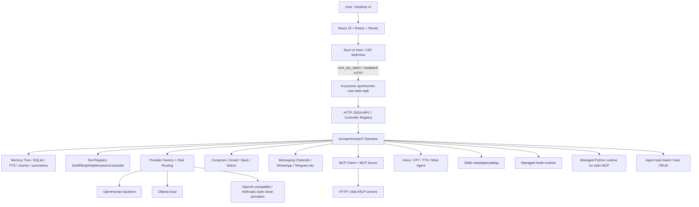

# openhuman

> 一句话定位：OpenHuman 是一个 Rust/Tauri 驱动的本地优先个人 AI 桌面平台，把桌面 UI、Rust Core、长期记忆、工具执行、模型路由、连接器同步、MCP、语音/Meet agent、多通道入口和自动化任务收进一个完整产品；它很适合学习和参与维护，但因为 GPL-3.0、攻击面大、模块体量重、状态仍在高速变化，直接拿来做生产底座要谨慎。

## 基本信息

| 项目 | 值 |
|------|----|
| 仓库 | `tinyhumansai/openhuman` |
| URL | `https://github.com/tinyhumansai/openhuman` |
| Star | 11,181（2026-05-17 API 快照） |
| Fork | 973（2026-05-17 API 快照） |
| 许可证 | GPL-3.0 |
| 主要语言 | Rust |
| GitHub 创建时间 | 2026-02-18 |
| 本地首次提交 | 2026-01-27 |
| 最近提交 | `780510f6` / 2026-05-16 PDT，`feat(todos): add CRUD tool + RPC for the agent task board (#1983)` |
| 当前 checkout | `v0.53.49-staging-33-g780510f6` |
| 当前包版本 | `Cargo.toml` / `app/package.json` / `app/src-tauri/Cargo.toml` 均为 `0.53.49` |
| 最新正式 Release | `v0.53.43`（2026-05-13） |
| 最近 staging tags | `v0.53.49-staging` 到 `v0.53.44-staging` 高频推进 |
| 贡献者 | GitHub contributors API 当前页 48；本地 `git shortlog` 约 48 个作者 |
| Issue / PR | 107 个 open issue，13 个 open PR；repo API `open_issues_count=120` 含 PR |
| 仓库体量 | 2,731 tracked files；Rust 1,271；TS 421；TSX 382；test-like tracked files 632；GitHub workflows 19 |
| 分析日期 | 2026-05-17 |

## 场景一：是否值得采用

### 解决的问题

OpenHuman 想做的不是“再做一个聊天框”，而是一个可安装、可常驻、能认识用户上下文的个人 AI 桌面操作环境：

- 用户通过桌面 UI 完成 onboarding、账号连接、模型配置、通道配置、技能目录管理和 agent 使用。
- Tauri host 负责桌面宿主、CEF/WebView、窗口/通知/系统权限、core lifecycle。
- Rust Core 负责 JSON-RPC 控制面、记忆、工具、模型路由、连接器、后台任务、语音、MCP、webhook、wallet、channels 等真实业务能力。
- Memory Tree 把邮件、聊天、文档等内容 canonicalize/chunk/score/summarize，进入本地可检索长期记忆。
- Agent 工具面覆盖 shell/file/grep/glob/edit/patch/git/http/curl/web_fetch/browser/cron/memory/subagent/parallel agents/audio 等。

### 核心能力与边界

**能做什么：**

- Rust/Tauri + React 桌面应用，目标平台是 Windows / macOS / Linux。
- 内嵌 `openhuman-core`，通过本地 HTTP/JSON-RPC 控制 memory、tools、providers、channels、voice、webhooks、MCP 等 domain。
- 支持 OpenHuman backend、Ollama、本地/云端 OpenAI-compatible / Anthropic-style provider，通过 role-based provider routing 做模型选择。
- 支持 Composio 后端/Direct 模式，Gmail/Slack/Notion 等 provider 有独立同步路径。
- 支持 MCP client/server：HTTP + stdio client registry，server 暴露 memory/search/recall/tree/subagent 等工具。
- 最近新增 agent task board 的 todo CRUD RPC/tool，说明它在吸收 coding-agent 的任务控制流。
- 最近新增 managed Python runtime 模块，服务于 Python-backed stdio MCP server，说明外部工具生态接入面还在扩大。
- Release、coverage、desktop build、staging/production workflow 都有比较完整的 CI/CD 管线。

**不能或不应高估的部分：**

- 不是轻量 SDK，也不是“拿来嵌进自己产品”的小组件；它是完整桌面平台。
- `skills` 当前不应被当成成熟可执行插件 runtime。`AGENTS.md` 明确说明 QuickJS runtime 已移除，`src/openhuman/skills/` 现在偏 metadata/catalog；canonical skill packages 在外部仓库 `tinyhumansai/openhuman-skills`。
- 文档中仍有历史口径残留：`gitbooks/developing/architecture.md` 仍多处描述 QuickJS/sidecar/skills runtime，和当前 AGENTS.md / 源码不完全一致。
- 直接做闭源商业二开要先处理 GPL-3.0 合规。
- 当前安全、状态管理、本地传输、OAuth/backend 可用性相关 issue 仍多，生产采用要等稳定度继续收敛。
- 它的体量和复杂度已接近“AI OS 单体平台”，学习成本和维护成本都高。

### 集成成本

- **依赖链重**：Rust 1.93、Node 24、pnpm 10.10、Tauri v2、CEF runtime、React 19、Vite 8、SQLite、reqwest/tokio/axum/socketioxide/whisper-rs 等。
- **构建成本高**：desktop build 覆盖 macOS x64/ARM64、Linux、Windows；CEF 下载和缓存是专门处理项。
- **模块面巨大**：`src/openhuman/*` 包含 agent、memory、tools、providers、routing、composio、mcp、channels、local_ai、voice、wallet、notifications、webhooks、http_host、runtime_node、runtime_python 等。
- **从零到 demo**：只跑前端 UI 可用 `pnpm dev`；完整 desktop + core + CEF 则要完整环境和子模块，成本明显高于一般 web app。
- **代码索引成本**：本次 `gitnexus analyze --skills --drop-embeddings` 触发 worker pool timeout 后 fallback sequential，600 秒仍未完成；仓库已大到需要后台索引或局部读源码。

### 风险评估

| 风险项 | 评估 | 说明 |
|--------|------|------|
| 许可证合规 | 高 | GPL-3.0；闭源分发/二开必须谨慎 |
| Bus factor | 中-高 | contributors 多，但 `senamakel` 本地 shortlog 863 次提交，头部集中明显 |
| 安全攻击面 | 高 | 本地 agent + Tauri IPC + WebView/CEF + shell/file/browser/network/tool/MCP/Composio/voice，近期 security issue 密集 |
| 维护复杂度 | 高 | 单仓承载大量 domain，中心注册表和工具组合根持续膨胀 |
| 供应商锁定 | 中 | 支持 BYO provider/Ollama/Composio direct，但 OpenHuman backend、登录态、skill registry、云连接器仍有产品层耦合 |
| 稳定性 | 中 | 发版极快、测试/coverage 体系强；但 open issue 多，很多是状态/安全/桌面边界问题 |
| 文档一致性 | 中 | README/AGENTS/架构文档中存在 QuickJS/sidecar/skills runtime 等历史口径漂移 |
| 维护接管难度 | 高 | 要同时懂 Rust async、Tauri/CEF、React state、RPC、agent tool security、CI/release |

### 采用结论

**观望；学习价值高，直接生产采用谨慎。**

理由：

- 对“本地优先桌面 AI 平台 / personal AI workspace”方向，它是非常值得拆解的样本。
- 工程密度高，尤其是 in-process core、controller registry、tool registry、provider routing、memory ingest、MCP client/server、desktop release matrix 很有参考价值。
- 如果想参与开源维护，它的 issue/PR 活跃、测试体系强、文档多，适合切入；但不适合从最核心架构一上来硬改。
- 如果想直接作为内部生产底座，GPL-3.0、仓库体量、安全面、状态复杂度、skills runtime 回撤/重建都会构成现实成本。

---

## 维护 / 接管视角

### 我能维护它吗？

能，但要按“先外围稳定贡献，再进入核心控制面”的路线，而不是直接重写核心。

**最适合的切入点：**

1. **安全与隐私 hardening**
   - 近期 issue 里安全主题很多：JWT decode、localStorage session token、Tauri IPC payload、prompt injection detector、SSRF/DNS rebinding、symlink bypass、websocket dictation auth、bearer token logging。
   - 这类问题边界清楚，适合用“复现测试 → 最小修复 → 增加回归测试”的方式维护。

2. **文档口径修正**
   - 当前 `AGENTS.md` 比 GitBook 架构页更接近事实：core 已 in-process，旧 QuickJS skill runtime 已移除，skills 现在偏 metadata/catalog。
   - 可以先提文档 PR，把历史 sidecar/QuickJS 表述更新为 runtime_node / metadata catalog / in-process core 的当前口径。

3. **测试补强**
   - 项目强制 changed-line coverage ≥80%，维护贡献必须伴随测试。
   - 适合从相邻 test 文件多的新模块入手：`prompt_injection`、`runtime_python`、`todos`、`config/schema`、`security/policy`、`socketService`、`openUrl`。

4. **小型 bugfix / UI 状态稳定性**
   - React/Tauri 启动态、OAuth 状态、progress indicator、skills catalog、Composio modal、runtime picker 等最近变化密集。
   - 这类 PR 容易被 review 和 merge，但要跑 focused Vitest + typecheck。

5. **Agent tool / MCP 接入的小能力**
   - `src/openhuman/tools/ops.rs` 的能力注册清晰，最近已有 SearXNG、todo CRUD、memory navigation 方向 PR。
   - 适合新增低风险 read-only 工具，或强化工具安全策略。

**不建议一开始碰的区域：**

- Provider routing 大改。
- Memory Tree ingest 架构重构。
- Core lifecycle / stale listener / RPC token 逻辑大改。
- Tauri/CEF release matrix 大改。
- Skills runtime 重建主线，除非先读完整 roadmap 和现有 PR。

### 维护流程建议

- 先同步 main，读 `AGENTS.md` 和 `docs/agent-workflows/codex-pr-checklist.md`。
- 每个 PR 只解决一个 issue，避免“顺手重构”。
- 修改前先定位对应 domain controller/tool/provider registry。
- 必须补测试；至少跑 focused test、typecheck 或 `cargo check`。
- PR body 里明确写无法运行的命令和原因，不要声称全量验证通过。
- 对安全问题优先写回归测试和最小修复，不扩大行为面。

---

## 场景二：技术架构学习

### 核心架构图

### 架构分层

1. **宿主层：Tauri in-process core lifecycle**
   - `app/src-tauri/src/core_process.rs`
   - `CoreProcessHandle` 生成 per-launch bearer token，设置 `OPENHUMAN_CORE_TOKEN`，拉起 embedded RPC server。
   - `ensure_running()` 识别 stale listener，避免对自身进程误杀，支持 `OPENHUMAN_CORE_REUSE_EXISTING=1` debug attach。
   - 关键设计：**进程内嵌 + 保留 loopback HTTP RPC 边界**。

2. **交互层：React boot/state/navigation**
   - `app/src/App.tsx`
   - `app/src/components/BootCheckGate/BootCheckGate.tsx`
   - `app/src/providers/CoreStateProvider.tsx`
   - 前端承担 core mode、cloud/local token、bootstrap retry、identity rehydration、snapshot/polling 等启动一致性职责。

3. **控制层：JSON-RPC + schema-first controller registry**
   - `src/core/jsonrpc.rs`
   - `src/core/all.rs`
   - `build_registered_controllers()` 把 auth、config、skills、threads、channels、wallet、voice、meet、composio、providers、local_ai、MCP、webhooks、notifications、todos 等统一注册。
   - `internal_only` controllers 与 agent/外部可见面做了区分。

4. **领域执行层：`src/openhuman/*` 胖核心**
   - `agent`、`memory`、`tools`、`providers`、`routing`、`composio`、`mcp_client`、`mcp_server`、`local_ai`、`voice`、`wallet`、`webhooks`、`channels`、`runtime_node`、`runtime_python`、`todos` 等。
   - 真实业务逻辑主要在 Rust core，不在 React。

5. **后台任务层：event bus / scheduler / ingest jobs**
   - `src/openhuman/channels/runtime/startup.rs`
   - `src/openhuman/memory/tree/ingest.rs`
   - 通过 event bus、periodic sync、memory extraction queue、Composio sync、learning rebuild 等形成常驻 agent runtime。

### 关键设计决策与 trade-off

| 决策 | 选择 | 获得 | 代价 |
|------|------|------|------|
| 桌面宿主 | Tauri v2 + Rust core + CEF | 原生分发、低资源占用、强本地能力 | 跨平台构建、CEF、OS 权限复杂 |
| Core 生命周期 | in-process tokio task | 退出不泄漏 sidecar，生命周期更可控 | 与宿主耦合更强，调试要保留 attach/reuse 模式 |
| 前后端边界 | loopback HTTP/JSON-RPC | renderer、CLI、测试可共享控制面 | 本地端口/token/401/冲突处理复杂 |
| 能力注册 | controller registry + tool registry | 可发现、可校验、跨 RPC/CLI/agent 复用 | 中心文件容易膨胀成上帝注册表 |
| 模型层 | role-based provider routing | reasoning/agentic/coding/memory 等 workload 可分配不同 provider | 配置和凭证路径复杂 |
| 记忆层 | Memory Tree + chunk/extract queue | 可长期积累、去重、恢复、异步抽取 | ingest pipeline 和幂等语义复杂 |
| Skills | 移除旧 QuickJS runtime，保留 metadata/catalog + runtime bridge 方向 | 收缩不稳定执行面，降低 runtime 风险 | “平台可扩展”叙事暂时打折 |
| Tool runtime | Managed Node + managed Python | 降低用户本机环境门槛，服务外部 tool/MCP 生态 | 运行时下载、校验、跨平台解析、缓存都要维护 |
| CI/CD | reusable test/build/coverage workflows | 工程门槛高，release automation 强 | CI 复杂、构建耗时、缓存依赖重 |

### 值得学习的模式

1. **In-process service + loopback HTTP boundary**
   - 文件：`app/src-tauri/src/core_process.rs`
   - 桌面端既避免 sidecar 泄漏，又保留 HTTP/RPC 解耦和测试入口。

2. **Schema-first controller registry**
   - 文件：`src/core/all.rs`、`src/core/jsonrpc.rs`
   - 每个 domain 通过 registered controller 进入系统，参数校验和 CLI/RPC 共享。

3. **Capability composition root**
   - 文件：`src/openhuman/tools/ops.rs`
   - `all_tools_with_runtime()` 集中拼装 agent 能力，根据 config/node/browser/http/MCP/Composio 条件化注册。

4. **Role-based provider routing**
   - 文件：`src/openhuman/providers/factory.rs`、`src/openhuman/routing/factory.rs`
   - `reasoning` / `agentic` / `coding` / `memory` / `embeddings` / `heartbeat` 等 role 与 provider string 解耦。

5. **Append-only memory ingest + transactional idempotency**
   - 文件：`src/openhuman/memory/tree/ingest.rs`
   - chat/email/document 使用不同幂等策略，通过 transaction claim source ingest，避免重复 chunk/extract。

6. **Agent task board 工具化**
   - 文件：`src/openhuman/todos/*`、`src/openhuman/tools/impl/agent/todo.rs`
   - 把 todo/task board 做成 RPC + agent tool，说明它在把“计划/执行状态”产品化，而不是只靠 prompt 内部记忆。

7. **多注册表平台化**
   - controller registry 扩 RPC 面，tool registry 扩 agent 面，provider factory 扩模型面，MCP registry 扩远程工具面，Composio provider registry 扩连接器面，AgentDefinition 扩角色面。

8. **架构收缩也是设计能力**
   - QuickJS skills runtime 被移除，skills 降级为 metadata/catalog，说明团队在平台能力过宽时会主动收缩不稳定执行面，再重建执行路径。

### 反模式 / 踩坑点

- **胖核心风险**：`src/openhuman/mod.rs` 暴露的 domain 太多，Rust core 已经是重型单体平台。
- **中心注册表膨胀**：`src/core/all.rs` 与 `src/openhuman/tools/ops.rs` 是能力地图，也是未来冲突/膨胀点。
- **前端状态协调重**：BootCheckGate/CoreStateProvider 承担 runtime 启动、连接、身份、重启、polling 等复杂职责，UI 层不是纯 presentation。
- **文档/代码口径漂移**：架构文档仍有 QuickJS/sidecar 等历史叙述，AGENTS.md 和当前源码更可靠。
- **安全面巨大**：Tauri IPC、本地 RPC、shell/file/browser/http/MCP/Composio/voice 都是边界，issue 里安全硬化密集。
- **产品叙事过满**：README 的 “Personal AI super intelligence” 与实际代码中的重构/回撤状态之间存在落差，需要按源码判断成熟度。

### 核心文件走读

#### 1. `app/src-tauri/src/core_process.rs`

职责：Tauri 宿主中的 core 生命周期管理。

看点：

- `generate_rpc_token()` 生成 256-bit bearer token。
- `CoreProcessHandle` 保存 task、shutdown token、restart lock、port、rpc token。
- `ensure_running()` 支持 idempotent fast path、stale listener identification、`OPENHUMAN_CORE_REUSE_EXISTING` debug override。
- 启动时设置 `OPENHUMAN_CORE_TOKEN`，再调用 `openhuman_core::core::jsonrpc::run_server_embedded()`。
- debug build 会把 token 写入 temp 文件供 e2e harness 使用，并设置 0600 权限。

评价：这是 OpenHuman 桌面架构最工程化的关键文件，体现了从“dev sidecar 能跑”到“产品态生命周期可靠”的演进。

#### 2. `src/core/all.rs`

职责：全系统 controller 注册表。

看点：

- `build_registered_controllers()` 展示真实产品版图。
- about/app_state/audio/composio/cron/webview/agent/health/doctor/security/config/providers/local_ai/socket/javascript/skills/tools/memory/retrieval/billing/team/wallet/voice/subconscious/webhooks/threads/todos/meet/whatsapp 等都在这里进入 JSON-RPC 控制面。
- internal-only controllers 单独注册，避免写路径直接暴露给 agent。
- destructive test reset 通过 `e2e-test-support` cargo feature gated，shipped binaries 不注册。

评价：看这个文件比看首页更能理解 OpenHuman 到底有什么一等能力。

#### 3. `src/openhuman/tools/ops.rs`

职责：Agent 工具能力装配。

看点：

- baseline coding tools：shell/read/write/grep/glob/list/edit/patch/csv。
- subagent / spawn_parallel_agents / todo / plan_exit 说明其吸收了 coding-agent 的控制流设计。
- memory、cron、browser、http、curl、web_fetch、MCP、audio、Composio、GitBooks 等按 config 装配。
- NodeBootstrap 共享 resolution 状态，避免多个 Node/npm tool 重复探测。

评价：这是 agent 能力编排地图，也是 OpenHuman 最接近“AI OS 内核”的部分。

#### 4. `src/openhuman/runtime_python/*`

职责：为 Python-backed integrations，尤其 stdio MCP servers，提供 interpreter discovery、download、extract、launch primitives。

看点：

- `resolver.rs` 解析系统 Python 版本。
- `downloader.rs` 选择 distribution 并校验 release metadata。
- `extractor.rs` 做 atomic install。
- `process.rs` 封装 Python launch spec。

评价：这是最近新增的生态接入层，说明项目不只依赖 Node runtime，也在向 Python MCP 生态扩展。

#### 5. `src/openhuman/todos/*` + `tools/impl/agent/todo.rs`

职责：agent task board CRUD 与 tool surface。

看点：

- `ops.rs` 提供 todo CRUD / list / write path。
- `schemas.rs` 定义 todo 数据结构。
- `store.rs` 做持久化存储。
- `tools/impl/agent/todo.rs` 把 task board 暴露为 agent tool。

评价：这是“agent 执行状态产品化”的小切口。对维护者来说，它比 memory/provider 更适合做第一批 PR。

#### 6. `src/openhuman/memory/tree/ingest.rs`

职责：Memory Tree ingest pipeline。

看点：

- `ingest_chat()` / `ingest_email()` / `ingest_document()` 三类入口。
- `already_ingested()` 和 `persist()` 处理幂等。
- transaction 里 claim source ingest，chunk lifecycle、pending extraction、buffer/seal 队列都明确。

评价：它说明 OpenHuman 不是“向量库随手塞数据”，而是在做长期运行、可恢复、可去重的个人记忆系统。

---

## 架构解剖

### 目录结构

- `app/`：`openhuman-app` workspace，Vite + React UI、Tauri shell、Vitest / WDIO E2E。
- `app/src-tauri/`：Tauri host，负责 desktop shell、core lifecycle、IPC/RPC bridge、CEF/WebView 相关能力。
- `src/`：Rust library crate `openhuman_core` + `openhuman-core` CLI binary。
- `src/core/`：HTTP/JSON-RPC、controller registry、auth、event bus、observability 等底层控制面。
- `src/openhuman/`：业务 domains：agent、memory、tools、providers、routing、composio、mcp、local_ai、voice、wallet、webhooks、channels、runtime_node、runtime_python、todos 等。
- `gitbooks/developing/`：公开开发文档，架构、Tauri shell、testing、release、agent harness、observability。
- `docs/`：agent workflows、coverage/security/release 相关内部参考。
- `.github/workflows/`：test、coverage、release-staging、release-production、build-desktop、e2e reusable、installer-smoke 等 CI/CD。
- `scripts/`：mock API、debug runner、release/e2e/build/agent-batch/deep-work 等辅助脚本。
- `remotion/`：mascot / runtime assets 相关渲染资源。

### 技术栈

- **桌面 / 前端**：Tauri v2、CEF、React 19、TypeScript 5.8、Redux Toolkit、React Router、Vite 8、Tailwind/Radix、Remotion/Three。
- **Core**：Rust 2021、Tokio、Axum、reqwest、rusqlite、socketioxide、tokio-tungstenite、clap、tracing、Sentry/OpenTelemetry。
- **AI / 模型**：OpenHuman backend provider、OpenAI-compatible、Anthropic-style、Ollama、本地 AI service、whisper-rs。
- **连接器 / 工具**：Composio、Gmail/Slack/Notion providers、MCP HTTP/stdio client/server、browser/native automation、curl/web_fetch/http_request。
- **运行时**：managed Node.js runtime，managed Python runtime。
- **存储 / 安全**：SQLite、FTS、Argon2、AES-GCM/ChaCha20Poly1305、OS keychain、per-launch bearer token、security policy。
- **测试 / CI**：Vitest、WDIO、cargo test、cargo-llvm-cov、diff-cover ≥80% changed-line coverage、GitHub Actions reusable workflows。

### 模块依赖关系

- React UI 通过 Tauri command 获取 core RPC token 和 RPC URL。
- Tauri host 内嵌 Rust core，core 对 renderer 暴露 loopback JSON-RPC。
- `src/core/all.rs` 聚合所有 domain controllers。
- Agent runtime 通过 tools registry 获得可执行能力；tools 依赖 security policy、workspace、memory、browser/http/MCP config。
- Provider factory 按 workload role 解析 provider 与 model。
- Memory ingest 和 channel/composio sync 通过后台任务与 event bus 持续写入/更新 context。
- Skills 目前偏 metadata/catalog；执行路径不应被视为本仓成熟主能力。

### 扩展机制

- **Controller Registry**：新增 domain controller 后统一暴露 RPC/CLI。
- **Tool Registry**：新增 agent tool 后进入 orchestrator 可调用能力。
- **Provider Factory**：通过 config slug/provider string 接入新模型后端。
- **MCP Registry**：通过 config 注册 HTTP / stdio MCP server，暴露远程工具。
- **Composio Provider Registry**：Gmail/Slack/Notion 等 provider 通过 registry 接入同步与工具面。
- **AgentDefinition / Subagent**：支持注册子代理和并行代理任务。
- **Runtime Node / Python**：通过 managed runtime 降低用户本机依赖门槛。
- **Skills Catalog**：可发现/安装/展示技能元数据和资源；当前不是强执行插件层。

---

## 质量与成熟度

### 代码质量

优点：

- Rust domain 切分细，很多模块有明确职责注释。
- 核心边界有大量防御式处理：token、stale listener、workspace 路径、auth profile、runtime proxy、direct/backend mode 等。
- controller/tool/provider/mcp/composio 都采用 registry/factory 思路，平台骨架清晰。
- 测试文件数量多，很多新模块直接有相邻 `*_test.rs` / `*.test.tsx`。
- 最近 PR 对安全、a11y、runtime、todo CRUD、URL fallback、prompt injection cache 都有聚焦修复，说明维护节奏实在。

问题：

- 代码体量过大，中心注册表和工具组合根压力明显。
- 大量注释在解释历史 bug 和兼容分支，说明跨版本/跨状态债务不小。
- 文档中存在历史架构口径残留，需要对照源码判断。
- 前端状态层已经带有 runtime coordination 复杂度，长期可能变成第二个核心。
- 搜索 `TODO/FIXME/panic!/unwrap/expect` 在 `src/` 内未命中不代表无风险；Rust 代码里大量错误路径更偏 `Result<String>` 和显式错误文案，仍需按模块测试确认。

### 测试

- `app` 使用 Vitest：`pnpm test:unit` / `pnpm test:coverage`。
- Rust core 和 Tauri shell 使用 cargo test / `scripts/test-rust-with-mock.sh`。
- E2E 使用 WDIO；Linux tauri-driver，macOS Appium Mac2。
- Coverage gate 用 Vitest lcov + cargo-llvm-cov + diff-cover，对 PR changed lines 要求 ≥80%。
- 仓库有 632 个 test-like tracked files，覆盖态度积极。

限制：

- 由于 desktop/CEF/OS integration 很重，完整 E2E 和 release smoke 成本高。
- 很多 desktop/multiplatform 路径依赖 manual smoke 或专门 runner。
- 本次未运行完整测试，分析基于源码、脚本、CI 配置和 GitHub API；如果要实际接 PR，应按 `AGENTS.md` 跑 focused checks。

### CI/CD

- `.github/workflows/test.yml` 调用 `test-reusable.yml`，覆盖 frontend Vitest、Rust core、Rust Tauri shell。
- `.github/workflows/coverage.yml` 明确 changed-line coverage gate ≥80%。
- `typecheck.yml` 覆盖 cargo、pnpm、clippy。
- `build-desktop.yml` 是 reusable workflow，覆盖 macOS ARM/x64、Linux、Windows，带 CEF cache、Rust/Node/pnpm setup、Sentry DIF、release/staging 参数。
- `release-staging.yml` / `release-production.yml` / `installer-smoke.yml` 说明发版与安装烟测链路较完整。
- staging tags 和正式 release 节奏都非常密，自动化发布体系成熟。

### 文档质量

- README 对产品愿景、安装、能力、竞品比较写得完整。
- AGENTS.md 对贡献者/AI coding agent 的实际开发边界更准确，尤其说明 core in-process、sidecar removed、skills runtime removed。
- GitBook 架构文档细，但存在历史残留：部分 QuickJS/sidecar 描述与当前 AGENTS.md/源码不完全一致。
- 对新贡献者而言，文档足够多；对选型者而言，需要有能力分辨“当前事实”和“历史/愿景叙述”。

### Issue / PR 健康度

- 2026-05-17 API：107 个 open issue、13 个 open PR。
- 最近 open PR 包括 bearer token logging、SearXNG search tool、i18n、model pins、security truncation、Ollama routing 等。
- 最近 merged PR 包括 todo CRUD/RPC、prompt injection cache、memory navigation、openUrl fallback、a11y progress indicator。
- Security/open query 命中约 47 个结果，主题集中在 OAuth/backend timeout、token/auth、prompt injection、SSRF/DNS rebinding、本地存储、Tauri IPC 等。
- 这既说明维护者认真暴露和修复问题，也说明产品 surface 很大，攻击面复杂。

---

## 社区与生态

### 热度与认可度

- 约 11.2k stars / 973 forks，项目创建时间很短，增长速度非常快。
- 2026-05-17 同日 API 快照仍在增长。
- Discussions 已开启，官网存在，release cadence 高。
- Product Hunt / Trendshift badge 出现在 README 中，说明增长传播意识强。

### 正面信号

- 有清晰的产品愿景：Personal AI / private / desktop-first / memory-rich。
- 发版非常积极，staging 与 production release 流水线明确。
- 自动化工程投入高：coverage、desktop matrix、mock API、debug runner、agent workflow docs。
- 对本地优先、长期记忆、工具执行、多通道入口这些方向的整合度比普通 chat UI 强。
- 有明确贡献者文档和 AI agent 开发规范，适合外部维护者接入。

### 真实痛点

- issue 数量不低，且很多不是“想要新功能”，而是安全/状态/稳定性/边界问题。
- 贡献集中度高，头部维护者驱动明显。
- 深度生态仍早期；stars 增长快不等于第三方插件/生产部署成熟。
- GitHub topics 为空，不利于生态 discoverability。
- Skills 叙事容易被高估：外部用户看到 skills 会期待插件执行，但当前本仓是 metadata/catalog + runtime bridge 重建阶段。

### 衍生项目 / 插件生态

- canonical skills registry 在 `tinyhumansai/openhuman-skills`，不 vendored 在本仓。
- 当前生态更像“产品内扩展面 + 官方技能仓库”，而不是第三方插件市场已经成熟。
- MCP、Composio、provider factory、runtime Node/Python 提供了潜在生态入口，但外部 adoption 仍需继续观察。

### 竞品分层

**直接竞品：**

- `OpenInterpreter/open-interpreter`：自然语言操作计算机，开发者心智强；更偏通用 computer agent。
- `All-Hands-AI/OpenHands`：AI software engineering agent，偏开发任务，但在“可执行 agent”心智上竞争。
- `cline/cline`：IDE/coding agent，本地可控 agent 入口，对技术用户有替代关系。

**邻近替代：**

- `lobehub/lobe-chat`：多模型/多 agent UI 工作台，偏 chat/agent front-end。
- `langgenius/dify`：agentic workflow/application platform，偏团队/应用构建。
- `onyx-dot-app/onyx`：企业知识助手/搜索/RAG，偏知识检索与企业上下文。

**架构邻居：**

- `mem0ai/mem0`：AI agent memory layer，适合对比长期记忆抽象。
- `infiniflow/ragflow`：RAG + context pipeline，适合参考 ingestion/retrieval 层。
- Tauri/Rust desktop agent 栈：OpenHuman 的独特性之一是把 agent runtime 下沉到本地桌面 core。

---

## 评分

| 维度 | 评分(1-5) | 说明 |
|------|----------|------|
| 功能覆盖度 | 5 | Memory、tools、providers、channels、voice、MCP、Composio、webhooks、runtime、todos 等面非常广 |
| 代码质量 | 4 | Rust 工程化强、测试多；但胖核心和中心注册表膨胀明显 |
| 文档质量 | 4 | 文档丰富，但部分历史口径与当前源码/AGENTS.md 需核对 |
| 社区活跃度 | 4 | stars/release/PR 活跃；issue 多且维护集中，深度生态仍早期 |
| 架构设计 | 4 | in-process core、RPC registry、tool composition、provider routing、memory ingest 都值得学；整体复杂度高 |
| 学习价值 | 5 | 很适合拆解桌面 AI platform / personal AI OS 架构 |
| 可借鉴度 | 4 | 单点模式很可借鉴，整体复用成本高且 GPL 约束强 |
| 维护可接入度 | 4 | issue/测试/文档/CI 齐全，适合贡献；但核心模块门槛高 |

---

## 总结

### 一句话评价

OpenHuman 是一个很有野心、工程密度很高的本地优先桌面 AI 平台样本；它最值得学习的是“如何把 agent 能力、长期记忆、工具执行、模型路由和桌面生命周期收敛到一个产品内核里”，但它当前也暴露出胖核心、安全面大、skills 执行面重建、稳定性仍在高速修补的问题。

### 谁应该用 / 学

- 想做本地优先 desktop AI / personal AI workspace 的团队。
- 想研究 Rust/Tauri + React + local RPC core 架构的人。
- 想学习 agent tool registry、provider routing、MCP bridge、memory ingest pipeline 的工程师。
- 想找“AI OS / personal agent platform”原型参照的人。
- 想练习开源维护、PR 流程、测试补强、安全 hardening 的 Agent/开发者。

### 谁不应该直接用

- 想要轻量 SDK / CLI / library 的团队。
- 不愿承担 GPL-3.0 合规成本的人。
- 需要稳定、低攻击面、低维护成本生产底座的人。
- 把 `skills` 误以为成熟插件执行 runtime、希望立刻开发第三方可执行插件的人。

### 下一步深挖 / 维护建议

1. **首个维护 PR**：优先选文档口径修正或小型安全 hardening，避免直接碰 memory/provider/core lifecycle。
2. 深读 `app/src-tauri/src/core_process.rs`：这是桌面 AI 应用里 in-process core 的优秀案例。
3. 深读 `src/openhuman/tools/ops.rs`：提炼 agent tool registry / permission / workspace security 的可迁移设计。
4. 深读 `src/openhuman/todos/*`：它是新近引入、边界相对清楚的 agent 状态产品化模块。
5. 深读 `src/openhuman/runtime_python/*`：判断 OpenHuman 如何接 Python stdio MCP 生态。
6. 深读 `src/openhuman/memory/tree/ingest.rs` 和相关 tests，抽象“长期记忆 ingest 的最小可复用模型”。
7. 继续观察 skills runtime 重建路线；这是判断 OpenHuman 能否从“重型产品”走向“可扩展平台”的关键。
