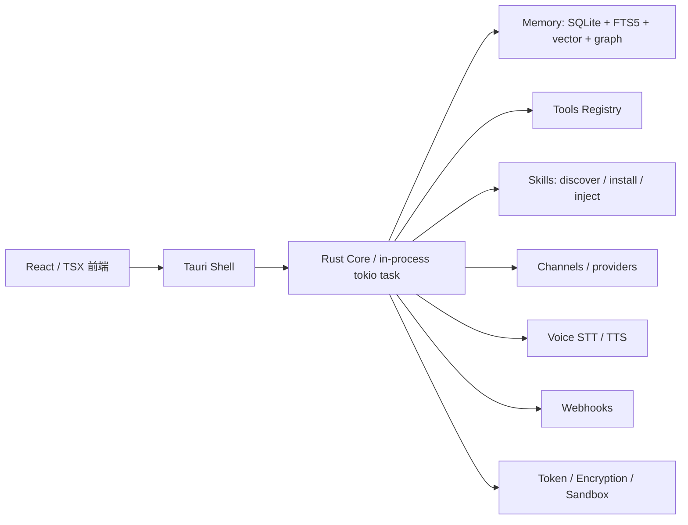

# openhuman

> 一句话定位：Rust/Tauri 驱动的本地优先个人 AI 桌面平台，把 memory、skills、tools、channels、voice、webhooks 串成一套完整产品。

## 基本信息

| 项目 | 值 |
|------|----|
| 仓库 | `tinyhumansai/openhuman` |
| URL | `https://github.com/tinyhumansai/openhuman` |
| Star | 7,781 |
| Fork | 629 |
| 许可证 | GPL-3.0 |
| 语言 | Rust |
| 首次提交 | 2026-01-27 |
| 最近提交 | 2026-05-15 |
| 最新 Release | `v0.53.43` |
| 贡献者数 | 33 |
| 分析日期 | 2026-05-15 |

---

## 场景一：是否值得采用

### 解决的问题
- 把本地 AI 助手做成完整桌面产品，而不是零散 CLI / SDK。
- 统一账户、记忆、工具调用、语音、通道、webhook、技能注入与本地 AI 能力。
- 适合做“个人 AI 工作台”或“本地优先 agent 平台”的底座。

### 核心能力与边界
- **能做什么：**
  - Rust/Tauri 桌面壳 + React 前端 + 内置 core。
  - 本地记忆、检索、工具执行、技能管理、语音、消息通道、webhook。
  - 明确的安全边界：token、加密、sandbox、权限控制。
- **不能做什么：**
  - 不是轻量 SDK，也不是小而美的单页应用。
  - 直接拿来做闭源商业二开要先处理 GPL-3.0 约束。
  - 想“短平快”集成会被复杂度拖住。
- **与竞品差异：**
  - 比纯聊天应用更系统化。
  - 比单点 agent 框架更产品化。
  - 比云端方案更偏本地优先和可控性。

### 集成成本
- 体量大：tracked files 约 2510 个，Rust 1175、TS/TSX 727、测试文件约 448。
- 栈重：Rust + Tauri + React + 多个 domain 子系统。
- 学习曲线陡：memory / tools / channels / skills / voice / webhooks 各自成体系。
- 从零到跑通 demo 需要认真读文档，不适合“快速拼接式”引入。

### 风险评估
| 风险项 | 评估 | 说明 |
|--------|------|------|
| 许可证合规 | ⚠️ | GPL-3.0，分发/闭源复用要谨慎 |
| Bus factor | 中 | 33 位贡献者，活跃但头部贡献集中 |
| 供应商锁定 | 低-中 | 底层栈标准，但产品层耦合深 |
| 维护趋势 | 活跃 | 最近提交和 Release 都很新 |
| 安全历史 | 中 | 文档里安全边界清晰，但 surface 很大 |

### 结论
**观望**

理由：工程能力强、功能完整、学习价值高；但体量大、GPL 约束重、维护成本高，不适合直接轻量接入生产。

---

## 场景二：技术架构学习

### 核心架构图

### 关键设计决策与 trade-off
| 决策 | 选择 | 放弃了什么 | 为什么 |
|------|------|-----------|--------|
| core 内嵌到 Tauri host | 进程内 tokio task | 松耦合 sidecar | 生命周期更稳，避免残留进程 |
| 记忆层 legacy + tree 并存 | 平滑迁移 | 代码/概念双轨复杂度 | 降低迁移风险，保留旧 RPC |
| skills 只负责发现/安装/注入 | 不把执行逻辑塞进去 | skills 层的绝对能力 | 更安全、更易扩展 |
| 测试矩阵 + 手工 smoke | 多层测试覆盖 | OS 级面完全自动化 | 把不可自动化部分显式化 |

### 值得学习的模式
- 文档即契约：每个子系统都有 README 说明职责边界。
- 兼容层迁移：`src/rpc/dispatch.rs` 已退居 shim，主路由迁到新 registry。
- 安全边界明确：bearer token、memory encryption、skill sandbox、single-use login token。
- 以测试矩阵管理功能叶子，覆盖层次清晰。
- stale listener takeover 这种“启动自愈”处理很实用。

### 反模式 / 踩坑点
- 体系太大，边界漂移风险高。
- legacy / new pipeline 共存会增加认知负担。
- React 侧仍有 presentation debt（文档里提到 warnings）。
- OS 级流程仍需要 manual smoke，不能全自动依赖。

### 可借鉴的具体技术点
- in-process core + restart lock + stale listener 识别。
- memory at-rest 加密（AES-GCM + Argon2id）。
- debug-only token file 给 e2e 用，且限制权限。
- 通过 coverage matrix 把“哪些特性被测到”显式化。

---

## 架构解剖

### 目录结构
- `src/openhuman/`：核心 domain，含 memory / tools / channels / skills / voice / webhooks 等。
- `app/`：Tauri 壳 + React 前端。
- `src/core/`：底层事件总线等基础设施。
- `tests/`：Rust integration / e2e。
- `gitbooks/`：架构、测试、发布、开发文档。
- `docs/`：覆盖矩阵、安全、发布 smoke、portfolio readiness 等。

### 技术栈
- 运行时 / 框架：Rust、Tokio、Tauri、React、TypeScript
- 存储 / 检索：SQLite、FTS5、向量表、关系图
- 通信：HTTP、JSON-RPC、WebSocket
- 安全：OS keychain、AES-GCM、Argon2id、单次 token
- 测试：Rust unit/integration、Vitest、WDIO E2E、manual smoke
- CI/CD：GitHub Actions（test / coverage / build / pr-quality）

### 模块依赖关系
- 前端通过 Tauri 进入 core。
- core 再调度 memory / tools / channels / skills / voice / webhooks。
- memory tree 与 legacy store 并存迁移。
- tools 通过 registry 聚合；旧 RPC dispatch 主要承担兼容。

### 扩展机制
- skills：发现、解析、安装、卸载、资源读取、turn 注入。
- tools registry：工具注册与分发。
- channels：多平台消息通道与 provider。
- webhooks / event bus：跨域事件接入。

---

## 质量与成熟度

### 代码质量
- Rust 侧边界清晰，模块化强。
- 文档驱动明显，多个子系统都有职责说明。
- 但体量太大，维护噪音不可忽视。

### 测试
- 约 448 个测试文件，覆盖 Rust unit / integration、Vitest、WDIO E2E、manual smoke。
- 测试策略文档完整，覆盖矩阵是很强的工程化资产。
- OS 级路径仍有不可自动化部分。

### CI/CD
- test / coverage / build / pr-quality 多工作流。
- 发布和 smoke 也有独立文档。
- 质量门槛不低，工程成熟度不错。

### 文档质量
- 架构文档、测试策略、覆盖矩阵都很完整。
- 对新成员上手非常友好。

### Issue / PR 健康度
- 135 个 open issues，说明还在高频迭代。
- 最近提交和 Release 都很新，项目没进入停滞。

---

## 社区与生态

### 社区评价
- 7.8k stars、629 forks，热度不低。
- 最近还在持续发版，说明项目仍在快速演进。

### 衍生项目 / 插件生态
- 重点不是生态外溢，而是自身平台化能力。
- skills / tools / channels 已经具备较强扩展面。

### 竞品对比
- 比纯 agent CLI 更完整。
- 比单点桌面 AI 工具更重，但也更像“平台”。

---

## 关键代码走读

### 1. `app/src-tauri/src/core_process.rs`
- 职责：Tauri 进程内 core 生命周期管理。
- 要点：bearer token 生成与传播、stale listener takeover、启动幂等、防止自我终止。

### 2. `src/openhuman/memory/README.md`
- 职责：统一记忆层的架构说明。
- 要点：legacy store + tree pipeline 并存、SQLite/FTS5/vector/graph、检索与 ingestion 分层。

### 3. `src/openhuman/channels/README.md`
- 职责：多平台消息通道运行时与 provider 边界。
- 要点：消息通道、主管理、RPC surface、测试布局。

### 4. `src/rpc/dispatch.rs`
- 职责：旧 RPC 兼容 shim。
- 要点：主路由已迁移，新体系接管，旧入口仅保兼容。

---

## 评分

| 维度 | 评分(1-5) | 说明 |
|------|----------|------|
| 功能覆盖度 | 5 | 桌面 AI 平台能力很全 |
| 代码质量 | 4 | Rust 工程化强，但体量大 |
| 文档质量 | 5 | 架构/测试文档非常完整 |
| 社区活跃度 | 4 | 活跃，但 backlog 仍在 |
| 架构设计 | 4 | 分层清晰，迁移思路成熟 |
| 学习价值 | 5 | 很适合拆模块研究 |
| 可借鉴度 | 4 | 可借鉴点多，但整体过重 |

---

## 总结

### 一句话评价
一个工程化很强的本地优先 AI 桌面平台，适合拆模块学习，不适合直接轻量引入。

### 谁应该用
- 想做本地优先桌面 AI 产品的人。
- 想学习 Rust/Tauri 端到端架构的人。
- 想研究 memory / tools / skills / channels 一体化设计的人。

### 谁不应该用
- 想要轻量 SDK / CLI 的人。
- 不想接受 GPL-3.0 约束的人。
- 不愿意承担大规模维护成本的人。

### 下一步
- 先读 `architecture.md`、`testing-strategy.md`、`memory/tree/README.md`。
- 再挑一个子系统做深挖，比如 `core_process` 或 `memory tree`。
